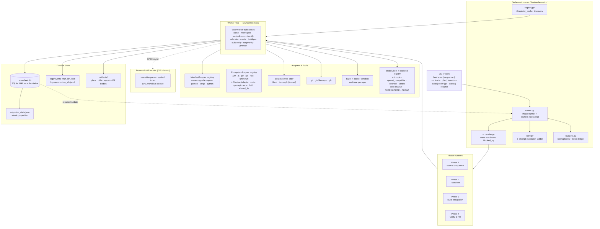

# SPEC.md — Fleet Engine Migration Harness

**Status:** implementation-ready. **Authority:** every statement here is subordinate to
`docs/DECISIONS.md` (ADR-0001 … ADR-0066). Where this document names a concrete field,
table, flag, or module, that name is normative for implementation — with one carve-out, added
because it was earned: a section that **reproduces** an in-tree artifact rather than naming one is
descriptive, and the artifact governs. §7.5 is such a section and says so (ADR-0066). A section
marked **NOT YET IMPLEMENTED** names a target, not a fact about this tree.

**Version:** `schema_version = 4` (1 → 2 ADR-0019, 2 → 3 ADR-0021, 3 → 4 ADR-0022; §6).
**Python:** `>=3.12` (ADR-0001). **Package root:** `src/fleet/`.

---

## 1. Overview & Design Philosophy

The Fleet Engine consolidates ~250 polyglot repositories — Java, TypeScript/JavaScript,
Python, Go, Rust; monoliths and microservices alike — into one Bazel monorepo. Its thesis is
that per-file syntax transformation is a **commodity**: `ast-grep` rules and a model handle it,
and nobody should build a product around it. The scarce capability is *knowing what depends on
what across 250 repositories*, and therefore knowing the only order in which they can safely
move. So the harness spends its complexity budget on cross-repo interrogation: normalizing six
ecosystems' coordinates into one address space, inferring edges from declared dependencies,
published artifacts, internal imports, API contracts and shared infrastructure names, condensing
the result into a DAG, and emitting migration waves in topological order. That DAG's nodes are
**not only repos**: a declared shared contract — a proto package, an OpenAPI document, an
Avro/Thrift namespace — is a node in its own right, because at fleet scale it is the single
most common cause of a cross-repo cycle and the cheapest one to cut (§3.1 step 5b, ADR-0019).

**The invariant: the orchestrator never learns a language.** Language knowledge is confined to
two adapter packages — `ManifestAdapter` implementations in `src/fleet/manifests/` (ADR-0005,
the *input* side: what does this repo depend on) and `EcosystemAdapter` implementations in
`src/fleet/ecosystems/` (ADR-0020, the *output* side: where does it land in the monorepo and what
Bazel targets describe it) — plus declarative `RewriteRule` files (ADR-0006). Every layer above
them sees only `Coordinate`, `DependencyEdge`, `SymbolRef`, `ContractNode`, `BuildTarget`, and
`WorkspaceDep`.

**The honest cost of a new language.** Adding Ruby is exactly four touchpoints — three required
and one optional — and none of them is in the pipeline:

1. `src/fleet/manifests/ruby.py` — one `ManifestAdapter` (`Gemfile`/`*.gemspec` → `Coordinate`).
2. `src/fleet/ecosystems/ruby.py` — one `EcosystemAdapter` (`monorepo_dir`, `rules_ruby`
   `WorkspaceDep`s, `BuildTarget` emission, `contract_bindings`).
3. One `Ecosystem` member in `src/fleet/models/enums.py` (§5.1).
4. Optionally, `config/rules/ruby-*.yml` — needed only if Ruby files require import rewriting.

Step 3 is a declaration, not a branch, and it is deliberately hand-written rather than synthesized
from adapter registration: `Ecosystem` is a `StrEnum` persisted in SQLite `CHECK` constraints (§6),
embedded in `Coordinate.key` (ADR-0017), and referenced statically by name (`Ecosystem.UNKNOWN`),
so a dynamically-built enum would defeat `mypy --strict` and make the DDL unverifiable. What
*is* removed is the chance to get it wrong silently: `fleet.ecosystems.discover()` asserts a
**total bijection** between `Ecosystem` members and registered adapters at startup, so a member
without an adapter (or an adapter claiming an unknown member) is an immediate startup error rather
than a Phase 3 crash (§13 row 30).

Any `if ecosystem == ...` or `if contract_kind == ...` branch, any `match` on `Ecosystem` or
`ContractKind`, and any comparison against an `Ecosystem` or `ContractKind` member outside
`src/fleet/manifests/` and `src/fleet/ecosystems/` (which is *specified* to contain
`ecosystems/contracts/`, the `ContractAdapter` registry of ADR-0019 + ADR-0020 — **NOT YET
IMPLEMENTED**, ADR-0065: that subpackage does not exist, and the per-`ContractKind` knowledge it
would hold currently lives as three `Mapping[ContractKind, …]` tables in `workers/contracts.py`,
which honour this rule but are not a registry) is a defect, enforced by §12.6. Contract kinds
are dispatched exactly as ecosystems are — through a total registry, never a branch — so ADR-0019's
contract nodes and ADR-0022's stub machinery add no third knowledge site: `orchestrator/stubs.py`
runs a state machine over `stubs` rows and delegates every language-shaped question (the stub's
Bazel label, its published-artifact form) to the same two packages.
There is no third exempt module: `src/fleet/bazel/` is a pure driver-and-renderer layer that walks
units and calls adapters. ADR-0020 retired the per-ecosystem `if`-ladder that `bazel/generators.py`
was originally specified to become; **it did not retire the file** (ADR-0065). `generators.py`
keeps its name and holds the pure text rendering and MVS reconciliation, the unit-walking driver is
`workers/buildgen.py` (plus `cli._run_gazelle` for ADR-0056's run-level Gazelle pass), and
`bazel/emit.py`, `bazel/module.py` and `bazel/render.py` were never created. What ADR-0020 decided
is the invariant, not the layout: no module under `src/fleet/bazel/` may contain an `Ecosystem`
comparison, `generators.py` included and un-exempted.

Contract discovery (§3.1 step 5b) obeys the same rule: it reads the already-built
`symbols` index plus declarative globs and marker strings from `config/fleet.yaml`, so
`src/fleet/graph/contracts.py` contains no IDL parser and no per-language branch either.

Corollaries, inherited from the ADRs and binding on every module below:

- **Models judge nothing** (ADR-0008). A model may classify, extract, propose a patch, diagnose
  a build error, and write prose. Code moves files, runs git, builds the graph, applies patches,
  and renders every verdict. "Verified" is an exit code (ADR-0013).
- **Which model answers is configuration, not architecture** (ADR-0023). Every call goes through
  one `ModelClient` protocol over a backend registry (`anthropic`, `openai_compatible`, `bedrock`,
  `vertex`); roles map to capability **tiers** (`HEAVY`/`WORKHORSE`/`CHEAP`), tiers map to ordered
  backend targets in `config/models.yaml`, and **no model id or endpoint appears in Python**
  (§12.40). Swapping the whole fleet to models served locally on this host is a `--profile` flag
  (§12.41). Validation is always Pydantic on our side, whatever the backend (ADR-0002).
- **SQLite is the truth; `migration_state.json` is a projection** (ADR-0004, ADR-0012).
- **Three escalating attempts, then `REQUIRES_HUMAN_INTERVENTION`, then move on** (ADR-0014) —
  and a backend failover is not an attempt (ADR-0023, §11.8).
- **No `pickle`, ever** (ADR-0002, Constraint 2). Durable state is Pydantic JSON, validated on load.

---

## 2. System Architecture



**Reading the diagram.** The CLI is a thin argument parser; it constructs a `RunContext` and
hands control to a `PhaseRunner`. The runner owns one `asyncio.TaskGroup` per phase and pulls
work items from the scheduler, which will not admit a repo whose dependencies are not yet green.
Workers are the only things that touch the outside world; they acquire semaphores from
`budgets.py`, do their I/O on the event loop, push anything CPU-bound into the process pool
(ADR-0003), and return a `WorkerResult`. **The runner — and only the runner — writes it to
SQLite**, in one `BEGIN IMMEDIATE` transaction, under the single-writer rule of §11.5; the
`POOL --> DB` arrow above is that hand-off, not a second connection. The JSON projection and the
JSONL event stream are strictly downstream of that transaction, and everything leaving the
process passes through `obs/redact.py` first (§11.4).

---

## 3. The Four Phases

Common contract for all four:

- **Unit of work** is `(run_id, repo_id, phase)` — the key of the `phases` table and of every
  checkpoint (Constraint 1).
- **Idempotency:** a phase runner first reads the `phases` row. `SUCCEEDED` → skip.
  `REQUIRES_HUMAN_INTERVENTION` → skip permanently. `RUNNING` with a stale `heartbeat_at`
  (> `stale_after_s`, default 900) → treated as crashed, reset to `PENDING`, `attempts` retained.
- **Resume validates evidence, never blind-replays** (Constraint 7): before re-entering a phase,
  `fleet resume` re-checks each phase's durable evidence against SQLite + Git and demotes the
  repo to the earliest phase whose evidence still holds (§11.5 step 5). **Two distinct
  predicates, not one** (ADR-0077 §6): the durable, payload-free `evidence_holds` is what step 5
  searches over, while `BaseWorker.preconditions_hold` stays at its single call site inside
  `PhaseRunner._re_entry`, where a typed payload and a `WorkerContext` exist — and where neither
  of its verdicts ever means "skip the work". The demotion write itself goes through
  **`models.enums.demote()`** (`RESUME_DEMOTE`, §5.1), which returns the new status together with
  the `PhaseDemotion` the caller writes as a `PhaseDemoted` finding in the same `StateWriter` unit
  as the status change — never `transition(..., resume=True)` directly, which opens the same door
  but returns the status ALONE and would demote silently (ADR-0077 §4).
- **Attempts:** `attempts` increments once per *substantive* attempt, never for transient
  infrastructure errors (ADR-0014), and never for a **backend failover** (ADR-0023). Ladder:
  attempt 1 deterministic, attempt 2 the `transform_repair` role (`WORKHORSE` tier) on a fresh
  slate (`EVIDENCE_ONLY`), attempt 3 the `escalation` role (`HEAVY` tier) with evidence plus
  *rejected-approach summaries* — never the raw prior diffs (ADR-0021). Which model answers a role
  is `config/models.yaml`'s active profile, never a fact about this ladder (ADR-0023).

### 3.1 Phase 1 — Fleet Scanner & Topological Sequencer

**Purpose.** Turn 250 URLs into a verified DAG and an ordered list of migration waves. This is
the differentiator; everything after it is execution.

**Inputs.** `config/repos.yaml` (fleet manifest: name, url, ref, optional `owns` coordinate
hints, optional `dest` path override), `config/fleet.yaml` (ignore globs, concurrency, cache
paths).

**Outputs.** Rows in `repos`, `manifests`, `coordinates`, `contracts`, `edges`, `symbols`,
`waves`, `wave_members`, `collisions`, `findings`; `artifacts/graph/<run_id>/dag.json`,
`cycles.json`, `contracts.json`, and `collisions.json`; the initial `migration_state.json`.

**Deterministic steps.**

1. **Clone + git preflight** (`workers/clone.py`). `git clone --mirror` into
   `cache/git/<repo>.git`, then a detached worktree into `work/<run_id>/<repo>`. Existing mirrors
   are `git remote update`d, so a re-scan is incremental. Record `default_branch`, `head_sha`,
   `size_bytes`, `commit_count`, `last_commit_at`. Bounded by the `git_net` semaphore.

   **Preflight runs before anything else touches the repo** and writes its results to the `repos`
   columns named in §6. Every check below is a hard gate: a failing check emits a `findings` row
   of kind `PreflightFailed` with `severity='error'`, sets Phase 1 to
   `REQUIRES_HUMAN_INTERVENTION` for that repo, and the fleet continues (never a crash, never a
   silent drop). `fleet scan --preflight-only` runs exactly these checks and exits.

   | Check | Probe | Recorded | Gate |
   |---|---|---|---|
   | Default branch | `git symbolic-ref --short HEAD` on the mirror; fall back to the first of `main`, `master`, `trunk`, `develop` that resolves; else the lexicographically first `refs/heads/*` | `repos.default_branch`, `repos.default_branch_source` (`symbolic-ref\|fallback\|config`) | No ref at all → `EmptyRepo` finding, `SKIPPED` |
   | Empty repo | `git rev-list --count --all == 0` | `commit_count = 0` | `SKIPPED`, not an error |
   | Shallow clone | `cache/git/<repo>.git/shallow` exists | `repos.is_shallow` | Auto-remediate with `git fetch --unshallow`; if that fails, gate (filter-repo refuses shallow history) |
   | Submodules | `.gitmodules` at `head_sha` | `repos.submodule_count` | > 0 → `SubmodulePresent` finding; submodule paths are added to `ignore_globs` for this repo and each submodule URL is checked against `config/repos.yaml` (in-fleet → a `DECLARED_DEP` edge; out-of-fleet → gate) |
   | LFS | `.gitattributes` contains `filter=lfs` | `repos.has_lfs`, `repos.lfs_object_bytes` | Requires `git-lfs` on PATH and `lfs.fetchinclude` reachable; missing binary → gate. LFS pointers are **never** rewritten by `ast-grep` (excluded from the rewrite target set) |
   | Oversize blobs | `git cat-file --batch-all-objects --batch-check='%(objectsize) %(rest)'` streamed, max retained | `repos.largest_blob_bytes` | > `preflight.max_blob_bytes` (100 MB) → `OversizeBlob` finding; the blob is stripped by `--strip-blobs-bigger-than` in Phase 2 and the strip is recorded, never implicit |
   | Repo size | mirror `du` | `repos.size_bytes` | > `preflight.max_repo_bytes` (5 GB) → gate; huge repos are migrated by an operator, not by the fleet |
   | Credential leakage | `git remote -v` and `.git/config` are read **only** through `obs/redact.py` (§11.4) | nothing | A URL carrying userinfo is rewritten in the mirror to its credential-free form before any other step; the raw value is never written to any table, log, or artifact |
2. **Manifest discovery** (`workers/interrogate.py`). One walk of the worktree, honoring
   `ignore_globs`. Each candidate path is offered to the `ManifestAdapter` registry; the first
   adapter whose `matches(path)` is true owns it (ADR-0005). One `manifests` row per manifest
   file with `sha256` and `adapter` recorded, so a re-scan can skip unchanged files.

   **The unknown-ecosystem path is a first-class path, not an error.** If the walk finishes with
   zero `manifests` rows for a repo, `manifests/unknown.py` — a real registered adapter with
   `ecosystem = Ecosystem.UNKNOWN` and `priority = 10_000`, so it can only ever win last —
   synthesizes one `ManifestRef` with `path = "."`, `low_confidence = True`,
   `publishes = Coordinate(ecosystem=UNKNOWN, group="", name=repo_id)`. The repo then:
   emits a `no-manifest` `findings` row (this is what satisfies success criterion `(a)`);
   gets `kind = "unknown"`; gets `dest = f"{scan.unknown_ecosystem_dest}/{repo_id}"`
   (default `misc/`); contributes **no outbound edges** and therefore lands in wave 0; and in
   Phase 3 receives a generated `filegroup`/`pkg_files` BUILD target whose only verification is
   that `bazel build` resolves the filegroup. It is carried through all four phases and appears
   in `migration_state.json` like any other repo. A repo is **never** silently dropped: the
   Phase 1 exit condition is success criterion `(c)` below, which is authoritative and makes
   dropping one a failure.
   The same fallback covers "manifest exists but no adapter matched" — the file is recorded with
   `adapter = 'unknown'` and `low_confidence = True`, which routes it to the LLM `extract` slot.
3. **Coordinate normalization.** `adapter.parse()` yields `RawDependency`; `adapter.coordinate()`
   normalizes to `Coordinate(ecosystem, group, name, version_spec)`. Every `Coordinate` also
   carries a derived `key` — `"{ecosystem}:{group}:{name}"`, lowercased, `group=""` when the
   ecosystem has no group concept, version deliberately excluded — which is the *only* join key
   used downstream (ADR-0017). Coordinates a
   repo **publishes** (its own `groupId:artifactId`, `package.json#name`, `go.mod` module path,
   `[package].name`, `project.name`) are written to `coordinates` with `owner_repo_id` set; that
   table is the internal-vs-external oracle.

   **Two repos publishing the same coordinate** is not a tie to be broken silently.
   `coordinates.coord_key` is the primary key, so the second writer would clobber the first;
   instead the insert is `ON CONFLICT DO NOTHING` and a `collisions` row of
   `kind = 'COORDINATE'` is written naming both `repo_id`s. Resolution policy, in order:
   (i) an explicit `owns:` hint in `config/repos.yaml` wins outright; (ii) otherwise the repo
   whose manifest declares the coordinate at the **shallowest** path wins, tie-broken by higher
   `commit_count`, tie-broken by lexicographic `repo_id`; (iii) the loser keeps its own
   coordinate but with a `#<repo_id>` disambiguating suffix appended to `coordinates.coord_key`,
   and every edge that resolved to the ambiguous key is marked `ambiguous = 1` with
   `dst_candidate_repo_ids` listing both. Ambiguous edges are recorded, reported, and — per the
   confidence rules in step 5 — **kept in the DAG under the union of both candidates**, because
   over-ordering is safe and under-ordering is not. A `COORDINATE` collision is `severity='error'`
   whenever the two repos are in different ecosystems (that is a normalization bug, not a fleet
   fact).
4. **Symbol indexing** (`workers/symbolindex.py`). tree-sitter, in the process pool: exported
   types/functions/interfaces, import statements, protobuf `service`/`message` names, OpenAPI
   `operationId`s and paths, gRPC service FQNs, SQL table names in migration files, and
   queue/topic string literals matching `config/fleet.yaml#resource_patterns`. Written to
   `symbols`. The same pass, while it already has each file open, also records the two facts step
   5b needs — a YAML/JSON file's root mapping keys, and whether the file's first
   `scan.contracts.marker_scan_bytes` bytes contain a `scan.contracts.generated_markers` string —
   as `SymbolKind.MODULE` rows, so contract extraction never re-opens a file.

   **Bounded by construction** (§11.3). The unit of work handed to the process pool is **one
   file path, never a repo tree and never file bytes**: the parent sends `(path, language)`, the
   child opens, parses, and returns `list[SymbolRef]` for that file only, and the parent
   `executemany`-inserts every `scan.symbol_batch_rows` (default 5 000) rows and drops the batch.
   No `list[SymbolRef]` for a whole repo, and certainly not for a fleet, is ever materialized.
   Files over `scan.max_file_bytes` are skipped with a `FileTooLarge` finding. A repo exceeding
   `scan.max_symbols_per_repo` (default 500 000) stops indexing, records
   `SymbolBudgetExceeded`, and continues with a partial index whose edges are capped at
   confidence 0.6 — a truncated index may miss edges, so it may not claim high confidence.
5. **Edge inference** (`graph/build.py`). Five `EdgeKind`s, each with a fixed base confidence and
   a mandatory `evidence_path`:
   - `DECLARED_DEP` (1.0) — a dependency `Coordinate.key` from `manifests` that resolves to a row
     in `coordinates` with a non-null `owner_repo_id`. Pure indexed join.
   - `PUBLISHED_ARTIFACT` (0.95) — the same join where the version spec pins a *published*
     artifact of an internal repo (distinguishes "depends on the built jar" from "depends on the
     source module"); drives whether Phase 3 rewrites the dep to a `//` target or leaves it external.
   - `INTERNAL_IMPORT` (0.8) — an import/`require`/`use` symbol in repo A whose module prefix
     matches a `coordinates.key` owned by repo B, with no corresponding manifest entry. This is
     the undeclared-dependency detector; it is exactly the class of edge a single-repo scan
     cannot see (Constraint 4).
   - `API_CONTRACT` (0.7) — a gRPC/protobuf service FQN, OpenAPI `operationId`, or `.proto`
     package that appears as a *definition* symbol in B and a *reference* symbol in A.
   - `SHARED_RESOURCE` (0.5) — the same DB table, Kafka topic, or queue name appearing in both
     repos. Advisory: recorded and reported, but **excluded from the DAG** by default
     (`fleet.yaml#graph.dag_edge_kinds`, ADR-0018) because shared infrastructure is not a build
     ordering constraint.
   - `DYNAMIC_REF` (0.3) — a reference the compiler cannot see: `Class.forName`, `importlib`,
     `require(<expr>)`, dynamic `import()`, Spring `@ComponentScan` base packages, DI-container
     string keys, and string literals that match a known `coordinates.key` or a definition
     `symbols.fqn`. Detected by `graph/infer.py` from `SymbolKind.DYNAMIC_REF` symbols. Advisory
     and **excluded from the DAG** by default, but always reported — an unbroken build that
     `NoClassDefFoundError`s at runtime is the failure this row exists to predict.

   **Edge orientation is fixed and global.** Every `edges` row is directed **dependent →
   dependency**: `src` requires `dst`. `graph/build.py` constructs `G` with exactly this
   orientation and builds `G_rev = G.reverse()` once per run; wave layering (step 7) and every
   `descendants()` call in step 6 operate on `G_rev`, never on `G`. An implementation that orients
   `edges` the other way is wrong, not merely different.

   **`graph.dag_edge_kinds`** defaults to `[DECLARED_DEP, PUBLISHED_ARTIFACT, INTERNAL_IMPORT,
   API_CONTRACT, CONTRACT_IMPL, CONTRACT_CONSUME]`. `CONTRACT_IMPL` and `CONTRACT_CONSUME` are
   **mandatory** members of that list: startup fails with a config error if `graph.hoist_contracts`
   is true and either is absent, because dropping them deletes every ordering constraint hoisting
   created.

   **Edge confidence is computed, not assumed.** `confidence = clamp(base × Π modifiers, 0, 1)`,
   with every applied modifier stored verbatim in `edges.confidence_factors` (a JSON object) so
   any score is reconstructible from the row. `edges.base_confidence` keeps the pre-modifier
   value.

   | Signal | Modifier | Detection |
   |---|---|---|
   | Version spec is an open range (`^`, `~`, `+`, `latest`, `*`, unpinned) | ×0.9 | `Coordinate.version_spec` parse |
   | Coordinate resolves to >1 owner (`ambiguous = 1`) | ×0.8 | `collisions` kind `COORDINATE` |
   | Evidence file is a **vendored copy** | ×0.4 | Evidence path matches `scan.vendor_globs`, **or** its git blob SHA is byte-identical to a blob in another repo (`ls-tree -r` blob-SHA join, one pass, no content reads) |
   | Evidence file is generated (`**/generated/**`, `*_pb2.py`, `*.pb.go`, `*.d.ts` beside a `.ts`) | ×0.6 | Path rules in `scan.generated_globs` |
   | Dependency `scope` is `test`/`dev`/`optional` | ×0.7 | `RawDependency.scope` |
   | Coordinate matched by fuzzy rule, not exact key | ×0.6 | Set by the `disambiguate` LLM slot |
   | Only a **transitive** path exists (no direct evidence) | not an edge | Transitive deps are never materialized as edges; the DAG's own reachability is the transitive closure |
   | Manifest was LLM-extracted (`low_confidence = 1`) | ×0.8 | `manifests.low_confidence` |
   | Symbol index for the src repo was truncated | cap at 0.6 | `SymbolBudgetExceeded` finding |

   **What low confidence changes about sequencing** — and this is the whole point of scoring:
   - `confidence >= graph.min_confidence` (0.5) **and** `kind ∈ dag_edge_kinds` → the edge orders
     migration. Nothing else does.
   - `confidence < min_confidence` → the edge is persisted, counted, and rendered in
     `fleet status --format dot` as a dashed line, but it does **not** order migration. It is
     re-surfaced as a `WeakEdge` finding on the *dependent* repo's PR body, so a human reviewer
     sees exactly what the harness declined to order on.
   - A low-confidence edge is the **preferred cycle-break candidate** (step 6) — weak evidence is
     precisely what should yield when the graph must be made acyclic.
   - An `ambiguous` edge is expanded to one ordering constraint per candidate owner. Ordering is
     monotone in edges: adding a false edge costs latency, dropping a true one costs a red build.
   - The `disambiguate` LLM slot may move `confidence` within `[0.3, 0.95]` and may **never** set
     it to 1.0, change `kind`, or delete an edge (ADR-0008).

   **5b. Contract extraction & hoist candidacy** (`graph/contracts.py`). Runs after edge
   inference and **strictly before** SCC detection, because the SCC ladder in step 6 needs the
   contract nodes to already exist. It is a pure function of rows already persisted — `symbols`,
   `manifests`, `edges`, and the `ls-tree` path/blob-SHA listing captured at preflight — plus two
   bounded facts recorded per file during step 4's existing single walk, so **5b opens no file of
   its own**: the document-root keys of any YAML/JSON file (for `openapi:`/`swagger:` detection)
   and whether the file's first `scan.contracts.marker_scan_bytes` bytes contain a generated-code
   marker, both written as `symbols` rows of `SymbolKind.MODULE` while the parser already has the
   file open. It makes no network call and invokes no model. Skipped entirely by
   `fleet scan --skip-contracts` or `scan.contracts.enabled: false`, in which case every node in
   the graph is a repo and §3.1 behaves exactly as it did before ADR-0019.

   A **contract** is an independently-migratable unit of shared interface, and the set of them is
   **bounded by declared artifacts** — there is deliberately no per-symbol node, because the
   symbol index has ~10⁵ entries per repo and a per-symbol graph is unbounded.

   **(i) Discovery.** Five `ContractKind`s, four of them auto-discovered from paths and symbols:

   | `kind` | Discovered from | `identifier` |
   |---|---|---|
   | `PROTO` | any path matching `scan.contracts.idl_globs` with suffix `.proto` | the file's `package` declaration, case-folded (already a `SymbolKind.MODULE` symbol from step 4); a `.proto` with no `package` gets `_unpackaged.<repo_id>.<dir>` and is forced `extractable = 0` |
   | `AVRO` | `.avsc` / `.avdl` | the `namespace` field |
   | `THRIFT` | `.thrift` | the `namespace` directive — the `*` slot if present, else the lexicographically first language slot |
   | `OPENAPI` | a YAML/JSON document whose **root mapping** has an `openapi:` or `swagger:` key (`scan.contracts.openapi_roots`) | `slug(info.title) + ":" + info.version`; if either is absent, the repo-relative path, which costs a confidence modifier |
   | `SHARED_LIB` | **never auto-discovered.** Only an explicit entry under `scan.contracts.shared_libs` naming `{repo, path, identifier}` | the declared identifier |

   `SHARED_LIB` is opt-in on purpose: "this commons module is really a contract" is a judgement
   about an organization's code, not a fact derivable from it, and guessing it would make the
   node set unbounded again.

   **(ii) Generated code is evidence of consumption, never of ownership.** A file matching
   `scan.generated_globs`, or whose first `scan.contracts.marker_scan_bytes` (default 4096) contain
   any string in `scan.contracts.generated_markers` (`Code generated by protoc`,
   `Generated by the protocol buffer compiler`, `@generated`, `DO NOT EDIT`), is **excluded from
   the contract's source set** and instead marks its repo as a consumer. This is what stops the
   twelve repos carrying checked-in `*_pb2.py` from each being proposed as the owner.

   **(iii) Identity and the collapse of vendored copies.** A contract's identity is
   `(kind, identifier)` and its node id is `contract_id = f"{kind.lower()}:{identifier}"`,
   case-folded — a `proto:acme.identity.v1` seen in nine repos is **one** row, never nine. All
   source files with that identity across all repos are unioned into `contracts.source_paths`
   (`[{repo_id, path, blob_sha}]`), and `contracts.content_sha256` is the sha256 of the sorted
   list of *distinct* blob SHAs. One distinct SHA ⇒ every copy is byte-identical ⇒ the vendored
   copies collapse with no penalty. More than one distinct SHA ⇒ the copies have **diverged**,
   `divergent` is recorded in `confidence_factors` as ×0.5, and the FILE_PATH dedupe of step 8 is
   not available for them.

   **(iv) Ownership — the step-3 ladder, extended, not a parallel mechanism.** When several repos
   carry the same contract, ownership is decided by, in order: (i) an explicit `owns:` entry in
   `config/repos.yaml` naming the `contract_id` — the *same* `owns:` list that already overrides
   coordinate ownership, which is why no new override mechanism is introduced; (ii) a repo whose
   copy is **not** under `scan.vendor_globs` and carries no generated-code marker, preferring a
   repo that also publishes a coordinate; (iii) shallowest source path; (iv) higher
   `commit_count`; (v) lexicographic `repo_id`. Every multi-repo contract writes a `collisions`
   row of the **new kind `CONTRACT`** with `key = contract_id`, `repo_ids` = every carrier sorted,
   `blob_shas` = the distinct SHAs, and `resolution` = the applied rule — `severity='warn'` when
   the copies are byte-identical, `severity='error'` when they are divergent *and* at least two
   carriers are outside `scan.vendor_globs`, because two repos independently editing the same
   published interface is a fleet fact an operator must see before anything is merged.

   **(v) Consumers.** `contracts.consumer_repo_ids` is the union of every repo ≠ owner satisfying
   any of: it holds a generated file whose provenance marker or emitted package resolves to the
   contract's `identifier`; it holds a `symbols` row with `kind ∈ {GRPC_SERVICE, PROTO_MESSAGE,
   HTTP_OPERATION}`, `is_definition = 0`, and `fqn` prefixed by `identifier`; it is the `src` of an
   existing `API_CONTRACT` edge whose `evidence_path` is in the contract's source or generated set;
   or it carries a vendored copy of the contract source. This column is a **denormalized
   convenience copy** — the indexed truth is the `edges` table (see (vii)), which is what every
   consumer lookup actually scans.

   **(vi) `extractable`.** True iff **all** hold, and the first failing predicate is written to
   `contracts.status` as `REJECTED:<predicate>`:
   - `len(consumer_repo_ids) >= scan.contracts.min_consumers` (default 2) — a contract with one
     consumer is not shared and hoisting it only adds a node;
   - `identifier` is non-empty and not an `_unpackaged.*` fallback;
   - **clean subtree**: the directories containing the contract's source files hold *only* contract
     sources and generated output — no hand-written implementation file. Computed from the
     preflight path listing alone; a `.proto` sitting beside `Service.java` is not extractable
     because the hoist would have to split a directory;
   - the contract's own imports (proto `import`, OpenAPI `$ref`, Thrift `include`) resolve to other
     contracts or to nothing — never to implementation code;
   - `extraction_confidence >= graph.min_extraction_confidence` (default 0.6).

   `extraction_confidence = clamp(0.9 × Π modifiers, 0, 1)`, every modifier stored verbatim in
   `contracts.confidence_factors` so the score is reconstructible from the row exactly as
   `edges.confidence_factors` is: divergent copies ×0.5; owner chosen by fallback rather than an
   `owns:` hint ×0.9; OPENAPI identified only by path ×0.8; exactly `min_consumers` consumers
   ×0.95; contract sources spread over more than `scan.contracts.max_source_dirs` (default 4)
   directories ×0.8.

   **(vii) Edges.** Two new `EdgeKind`s are emitted, with the same `evidence_path` discipline as
   every other edge:
   - `CONTRACT_IMPL` (base 1.0) — `(REPO, owning_repo) → (CONTRACT, contract_id)`. The owner
     compiles against its own contract once that contract is hoisted, so it is ordered *after* it.
   - `CONTRACT_CONSUME` (base 0.85) — `(REPO, consumer) → (CONTRACT, contract_id)`, one row per
     distinct evidence path. `src_kind` may also be `CONTRACT`: a proto package importing another
     proto package is a contract-to-contract edge, and it orders exactly like any other.

   A contract node has **no inbound dependency on any repo**: no `edges` row has
   `src_kind='CONTRACT'` and `dst_kind='REPO'`. Under the orientation fixed in step 5 a contract is
   therefore a **sink in `G`** and a **source in `G_rev`**. That is the whole mechanism: it can
   always be scheduled first, and any cycle whose only path through the owner ran via the contract
   is severed the moment the contract becomes its own node.

   **(viii) Retargeting is proposed here and applied in 6c-H, never here.** For each existing
   repo→repo edge row whose `evidence_path` is in the contract's source-or-generated set, step 5b
   records a *candidate retarget* to `(CONTRACT, contract_id)`. Because the `edges` idempotency key
   already includes `evidence_path`, this is decided per row and needs no heuristics: a consumer
   whose dependency on the owner is *entirely* contract evidence has all of its rows retargeted and
   is genuinely freed; a consumer that also calls the owner's implementation keeps those rows
   pointing at the owner and stays ordered behind it. Over-ordering is safe, under-ordering is not.
   Candidates are applied — `dst_kind='CONTRACT'`, `dst_id=contract_id`, `kind='CONTRACT_CONSUME'`,
   original owner preserved in `edges.retargeted_from_repo_id` — **only** when the contract is
   actually hoisted in 6c-H, so a detected-but-unhoisted contract changes ordering by exactly
   nothing.

   `contracts.status` walks `DETECTED → EXTRACTABLE → HOISTED → MIGRATED`, with the terminal
   off-ramps `REJECTED:<predicate>` (not a candidate), `FORBIDDEN` (operator veto), and `FAILED`
   (hoist attempted and rolled back, §3.1 6c-H).

6. **DAG build & SCC detection** (`graph/cycles.py`). `networkx.DiGraph` built from `edges` on
   demand, never persisted (ADR-0004). `strongly_connected_components` → any component of size > 1
   becomes a `CycleFinding` with a proposed break edge chosen deterministically: lowest
   `confidence`, tie-broken by fewest transitive dependents, tie-broken by `edge_id`. The
   condensation graph is what gets sorted.

   The rest of this step is the **breaking** algorithm — the spec does not merely detect SCCs.
   It is fully deterministic; no model participates (ADR-0008). The `cycle_break_proposal` role
   may write the human-readable `CycleFinding.rationale` and nothing else.

   **6a. Condense.** `nx.strongly_connected_components(G)` → `nx.condensation(G, sccs)`. Every
   SCC gets a stable `scc_id` by **the one recipe in §5.3's `SccId`** — content-derived over the
   sorted member set; that docstring is the authority and this step restates nothing — so the id
   is the same string in every run and every process regardless of `networkx` iteration order or
   `PYTHONHASHSEED`, and a membership change yields a **new** id that supersedes the old finding
   (`CycleFinding.superseded_by`) rather than renumbering an SCC an in-flight `ATOMIC_WAVE` PR
   already names. Trivial SCCs are done — the condensation is a DAG by construction and step 7
   sorts it.

   **6b. Classify the intra-SCC edges.** For each non-trivial SCC, run a DFS from the
   lexicographically smallest member with children visited in sorted order, and classify every
   intra-SCC edge as `TREE`, `FORWARD`, `CROSS`, or `BACK`. Only `BACK` edges close cycles; the
   **feedback edge set** is the `BACK` set, persisted in `CycleFinding.feedback_edge_ids`.
   Deterministic DFS order is what makes this reproducible — an unordered DFS yields a different
   (still valid) feedback set every run, which would make wave assignment non-reproducible.

   **6c. Rank break candidates.** Every feedback edge gets a `break_cost` tuple, sorted
   ascending; the cheapest becomes `proposed_break_edge_id`:

   ```
   break_cost(e) = (
       e.confidence,                        # weakest evidence yields first
       KIND_RANK[e.kind],                   # DYNAMIC_REF 0 < API_CONTRACT 1 < INTERNAL_IMPORT 2
                                            #   < PUBLISHED_ARTIFACT 3 < DECLARED_DEP 4
                                            #   < CONTRACT_CONSUME 5 < CONTRACT_IMPL 6
       len(descendants(G_rev, (e.dst_kind, e.dst_id))),  # fewest transitive dependents disturbed
       0 if e.ambiguous else 1,             # an ambiguous edge is a cheap thing to be wrong about
       e.edge_id,                           # total order; never a tie
   )
   ```

   A `DECLARED_DEP` at confidence 1.0 is the most expensive edge in the fleet to break, which is
   correct: it is a real compile-time dependency, and breaking it means a human must refactor.
   `CONTRACT_IMPL` (rank 6) and `CONTRACT_CONSUME` (rank 5) are ranked *above* `DECLARED_DEP` and
   are therefore never chosen: breaking one would undo the hoist that produced it.

   **6c-H. Hoist contracts.** Runs after 6c and **strictly before 6d** — no whole-repo edge is
   broken, and no atomic wave is considered, until contract hoisting has been tried and has
   stopped helping. Disabled by `--no-hoist-contracts` / `graph.hoist_contracts: false`, which
   recovers the pre-ADR-0019 ladder exactly. Fully deterministic; no model participates.

   For each non-trivial SCC `S` in ascending `scc_id`:

   ```
   hoists = 0
   C = [k for k in contracts
        if k.owning_repo_id in S.members and k.status == EXTRACTABLE]
   G_all = G with every k in C materialized         # saturating trial, in memory only
   if S is non-trivial in G_all: fall through to 6d # no set of contracts dissolves S
   while S is non-trivial:                          # commit greedily; terminates by construction
       for k in C not yet committed:                # marginal trial against the committed graph
           G_k = G with k materialized: candidate retargets applied (§3.1 5b viii),
                 CONTRACT_IMPL/CONTRACT_CONSUME added, k a sink in G
           S_k = the non-trivial component of G_k containing k.owning_repo_id,
                 or the singleton {k.owning_repo_id} when G_k has no such component
           repos_freed(k)  = len(S.members) - len(S_k)     # 0 if S is unchanged
           blast_radius(k) = len(k.consumer_repo_ids) + len(descendants(G_rev, k.owning_repo_id))
       rank the uncommitted contracts
            by (-repos_freed, -extraction_confidence, blast_radius, k.contract_id)
       commit C[0]: status = HOISTED, retargets applied, node added to the graph
       hoists += 1
       recompute SCCs for S only
       if hoists == graph.max_hoists_per_scc (default 4): fall through to 6d
   ```

   The **saturating trial is what makes multi-chord cycles dissolvable**: an SCC closed by several
   contracts published from one owner to one consumer is never freed by any single hoist, so a loop
   that stops at `repos_freed(best) == 0` would abandon exactly the shape 6c-H exists to fix.
   Materializing all of `C` at once decides *whether* hoisting can work; the greedy commit loop then
   decides *which* hoists to spend, and it is bounded at `len(C)` because every iteration commits a
   distinct contract. `max_hoists_per_scc` is a safety valve, not the terminating condition; if it
   fires before `S` is trivial, control falls through to 6d with the hoists committed so far.

   `repos_freed` first is the point of the ranking — the objective is *dissolving the SCC*, not
   extracting the prettiest contract. `extraction_confidence` breaks ties toward the extraction we
   are most sure of, `blast_radius` ascending breaks the remaining ties toward the hoist that
   disturbs the fewest downstream repos, and `contract_id` guarantees a total order so the choice
   is reproducible.

   **When hoisting is not enough.** If the SCC is still non-trivial after the loop — because no
   contract was extractable, because the saturating trial showed that materializing every
   extractable contract still leaves `S` non-trivial, because the remaining cycles run through
   implementation code rather than interfaces, or because `max_hoists_per_scc` was reached — control **falls through to 6d
   unchanged**, and from 6d to 6e exactly as before. Nothing in the edge-breaking or atomic-wave
   machinery is removed or weakened: hoisting is a rung added below them, not a replacement for
   them. `graph.scc_atomic_threshold` and `graph.scc_hard_max` remain the final fallback and are
   still enforced verbatim; they are simply reached far less often, because the shared-contract
   cycles that used to produce 20- and 40-repo atomic waves now dissolve at 6c-H.

   **Recording.** Every committed hoist appends to `CycleFinding.hoisted_contract_ids`. If the SCC
   dissolved with hoisting alone and `broken_edge_ids` is empty, `break_strategy = CONTRACT_HOIST`;
   if hoisting helped but 6d still had to suppress edges, `break_strategy = EDGE_BREAK` with a
   non-empty `hoisted_contract_ids`; 6e's `ATOMIC_WAVE` and `MANUAL` are unchanged.

   **When the extraction was wrong.** Step 5b infers from evidence, so it can be wrong in exactly
   two ways, and both are detected mechanically rather than reviewed:

   - *The contract was not actually shared.* Signal: after retargeting, the contract node's
     inbound `CONTRACT_CONSUME` edges resolve to fewer than `scan.contracts.min_consumers` distinct
     repos — the "consumers" were vendored copies of one repo's own interface, or generated files
     that all trace to the owner. Detected at the end of 6c-H by counting `edges`, and again in
     Phase 4 when `bazel query rdeps` of the contract's target returns targets from one `dest_path`
     only. Raised as a `ContractNotShared` finding, `severity='warn'`.
   - *The hoist broke the owner.* Signal: the owner's Phase 3 `bazel build` fails with an
     unresolved reference under `hoist_target_path`, or the owner's relocation plan wants to write
     a path the hoist already claimed with a **different** blob SHA (a `FILE_PATH` collision at
     `severity='error'`). Raised as a `HoistBrokeOwner` finding, `FailureClass.BUILD_ERROR`. The
     contract's own wave failing `bazel build` is the same case and takes the same path.

   **Rollback is one procedure for both, and it is cheap because 5b never mutated anything
   destructively.** Set `contracts.status = 'FAILED'` (or `'REJECTED'` for the not-shared case);
   restore every affected edge from `edges.retargeted_from_repo_id` — that column exists for
   exactly this and makes the un-hoist exact rather than a re-inference; drop the contract node
   from `wave_members`; if the contract had already been merged, revert its merge commit on the
   integration branch with `git revert -m 1`, carrying the standard `Fleet-*` commit trailers like
   any other mutation (§3.2 step 6) — the revert *is* the record, so there is nothing to unwind on
   a crash beyond re-asking Git whether it landed; then re-run steps 6–8 for the affected SCC only, which now falls through to 6d and, if
   needed, 6e. **The attempt is recorded in `attempts` but does not increment `phases.attempts`**,
   on the same principle as `TRANSIENT_INFRA` (ADR-0014): the harness's own bad hypothesis must not
   consume a repo's three chances. `fleet sequence --forbid-hoist <contract_id>` makes the veto
   sticky so the next run does not re-propose it.

   **Un-hoisting must reach the repos the hoist already changed.** Restoring the edges is not
   enough: a consumer whose imports were rewritten to `hoist_target_path` and whose phases are
   already `SUCCEEDED` would, under the idempotency rule of §3, never re-enter and would leave the
   integration branch importing a deleted path. Rollback therefore computes the **unhoist blast
   set** — every repo holding a `CONTRACT_CONSUME` or `CONTRACT_IMPL` edge to the contract, taken
   before the edges are restored. For each blast-set member whose `phases` row is `SUCCEEDED` beyond
   `PHASE_SCAN`, the runner demotes it to `PENDING` at `PHASE_TRANSFORM` with `attempts` retained,
   records a `HoistRollbackDemotion` finding, and — if that repo's PR was already merged — reverts
   that merge in the **same** revert series as the contract's own merge, so the integration branch
   is never left in an intermediate state. Rollback of a merged contract is **refused** when the
   blast set contains a repo whose PR is merged and has downstream merges depending on it: that case
   is `REQUIRES_HUMAN_INTERVENTION` with `FailureClass.CYCLE`, because unwinding it means rewriting
   merged history the fleet does not own.

   **6d. Break, then re-check.** Remove the cheapest candidate, recompute SCCs *for that
   component only*, and repeat while the component is still non-trivial, up to
   `graph.max_breaks_per_scc` (default 8). Each removal is appended to
   `CycleFinding.broken_edge_ids`. Broken edges are **never deleted** from `edges`; they are
   marked `ordering_suppressed = 1`, so the evidence survives, `fleet status --format dot`
   renders them red, and each affected PR body lists them under "dependencies this migration
   deliberately did not order on".

   **6e. The atomic-wave fallback — what happens when an SCC has 40 repos.** Still the final
   fallback, still enforced exactly as written, but since 6c-H it is **rarely reached**: the
   large SCCs that used to land here were overwhelmingly shared-contract cycles, and those now
   dissolve one hoist at a time. Reaching 6e with a 40-repo SCC after hoisting means the cycle is
   genuinely implementation-level, which is precisely the case an atomic wave exists for.
   Edge-breaking is abandoned and the SCC migrates as **one unit** when any of: `len(members) >
   graph.scc_atomic_threshold` (default 8); or `max_breaks_per_scc` was reached and the component
   is still cyclic; or every feedback edge is a `DECLARED_DEP` at `confidence >= 0.95` (there is
   no weak edge to yield — the cycle is real code, and pretending otherwise produces a build that
   cannot link). Then `CycleFinding.break_strategy = ATOMIC_WAVE`, every member is assigned the
   **same** `wave_index`, and the scheduler treats the SCC as one admission unit:
   - Phase 2 transforms all 40 in parallel, but **no member advances to Phase 3 until every
     member's Phase 2 is `SUCCEEDED`** — all relocation maps must exist before any cross-member
     import can be rewritten correctly.
   - Phase 3 ingests all 40 onto the integration branch, generates their BUILD files, and issues
     **one** `bazel build //<dest_1>/... … //<dest_40>/...`. A cyclic Bazel target graph is itself
     an error, and 6e is reached precisely because the members are mutually dependent, so
     per-member targets cannot be acyclic: BUILD generation for an `ATOMIC_WAVE` SCC emits **one**
     library target per `(ecosystem, scc_id)` whose `srcs` is the union of every member's sources
     in that ecosystem, at the label §3.3's `scc_dest` defines — `scc_id` is **not** usable
     verbatim in a Bazel label and §3.3 owns the one transformation that makes it legal. A
     per-member target is emitted **only** for a member with no intra-SCC inbound edge; every
     other member is merged into the SCC target and
     records one `CoarseTarget` finding.
   - Phase 4 emits **one PR for the whole SCC**, with `PullRequestDraft.scc_id` set and every
     member listed in the body. A 40-repo PR is ugly; a 40-repo deadlock is worse.
   - Any member failing terminally fails the **whole SCC**: `blocked_by` for every member is the
     set of failed members. Atomicity cuts both ways and the spec says so out loud.
   - Beyond `graph.scc_hard_max` (default 40) the harness **refuses**:
     `break_strategy = MANUAL`, every member goes `REQUIRES_HUMAN_INTERVENTION` with
     `FailureClass.CYCLE`, and the run continues on the rest of the fleet. A 40-repo atomic wave
     is at the edge of reviewability; past it, refusing beats emitting an unmergeable artifact.

   **6f. `--break-cycles manual`** stops after 6c: `CycleFinding`s are written to
   `artifacts/graph/<run_id>/cycles.json` with their proposed breaks and the run exits non-zero
   without assigning waves. `fleet sequence --accept-breaks <edge_id,...>` re-runs 6d with an
   operator-supplied feedback set, recorded in `findings` as the authority for the ordering.
7. **Wave assignment** (`graph/sequence.py`). Longest-path layering on the condensation:
   `wave_index(n) = 0` if `n` has no internal dependencies, else `1 + max(wave_index(deps))`.
   Nodes in the same wave are mutually independent and migrate in parallel; an `ATOMIC_WAVE` SCC
   occupies one condensation node and therefore one wave index for all its members. Waves and
   membership are persisted; the order is stable across runs given the same edge set, because
   every tie in 6a–6d is broken by a total order on `edge_id`/`repo_id`/`contract_id`.

   **Hoisted contract nodes need no special case here.** A contract node has no inbound dependency
   on any repo (§3.1 5b vii), so longest-path layering on `G_rev` puts it at wave 0 — or at `1 + max(...)` over
   the contract packages it imports, which is still ahead of every repo that consumes it. A
   contract migrates *first*, as its own early wave, and its owner and consumers follow in the
   waves the layering already gives them. `wave_members` therefore carries `(node_kind, node_id)`
   rather than a bare `repo_id`, and a wave may legitimately contain only contract nodes.
8. **Collision audit** (`graph/collisions.py`). Runs after waves are assigned and **before** any
   transformation, because a collision discovered in Phase 3 has already been merged into
   history. One pass, five detectors, all writing to the `collisions` table:

   | `kind` | Detector | Resolution policy |
   |---|---|---|
   | `COORDINATE` | Two repos publish the same `coord_key` | Step 3's ownership rules; `severity='error'` when the two are in different ecosystems (that is a normalization bug, not a fleet fact) |
   | `CONTRACT` | Two or more repos carry the same `(kind, identifier)` contract | Step 5b (iv)'s ownership ladder — the *same* `owns:` hint mechanism as `COORDINATE`; losers become consumers. `warn` when every copy is byte-identical (they collapse to one node and one file), `error` when the copies are divergent and ≥2 carriers sit outside `scan.vendor_globs` |
   | `DEST_PATH` | Two nodes compute the same `layout()` — repo/repo, repo/contract, or contract/contract | Deterministic: a **hoisted contract always keeps the path** (it is the shared artifact and was migrated first), otherwise the repo with more inbound edges keeps it; the loser gets `<dest>-<repo_id>` plus a `DestPathRewritten` finding. `severity='error'` if either path came from an explicit `dest:` override — the operator asked for something impossible and must say what they meant |
   | `FILE_PATH` | After relocation, two nodes' files land on the same monorepo path | A path already claimed by a `HOISTED` contract is resolved in the contract's favour with `resolution = 'hoisted:<contract_id>'`, and the carrier's relocation plan drops that path — this is how the owner's and every vendorer's copy of the contract stop being copied at all (§3.3 step 1). Otherwise: if the git blob SHAs are **identical**, the file is written once and both repos' BUILD targets reference it — byte-identical duplicates are the common case at fleet scale, and the blob-SHA join from step 5 makes detecting them free. If they differ, the later wave's copy is suffixed and a `DuplicateDivergent` finding is raised: `severity='error'` under any `src/` root, `warn` for licences, CI config, and `.gitignore` |
   | `DEP_VERSION` | Two migrated repos require incompatible versions of the same **external** coordinate | Phase 3 records **every** requirement as a `bazel_dep` version in `MODULE.bazel` and lets Bazel's MVS select the minimum version satisfying **all** of them; a plurality vote is never taken, because it ships a build violating a declared upper bound. A spec set whose intersection is empty is unsatisfiable: raise `VersionConflict` at `severity='error'`, and only then invoke the `conflict_resolution` LLM role, whose output is a *proposed* `single_version_override`/`bazel_dep` pin that code validates against every contributing spec before writing |

   Neither `FILE_PATH` nor `DEST_PATH` detection reads a file: both join the `RelocationPlan`
   path maps against the `ls-tree` blob SHAs already captured at preflight. `fleet sequence`
   exits non-zero if any `collisions` row has `severity='error'` and a `NULL` `resolution`.

   The reserved-`_scc` check runs inside the `DEST_PATH` detector but writes **no** `collisions`
   row — a reserved namespace has one participant and every `collisions` kind is a contest
   between two or more repos. It raises a `ReservedDestPath` finding instead; §3.3 is the
   authority for both the reservation and why it is a finding rather than a row.

**Where the LLM is invoked.** Three narrow slots, all ADR-0008 class (1) or (2):
- `classify` (haiku; no effort declared — ADR-0075) — `service | library | monolith | tool`, framework family, and an
  ownership guess per repo. Advisory metadata on `repos`; **never** an input to edge inference.
- `extract` (sonnet) — only for manifests an adapter flagged `low_confidence` (Groovy
  `build.gradle` with conditional logic, hand-rolled shell build scripts, README-only
  dependency prose). Output is validated into `list[RawDependency]`; anything that fails
  validation is dropped and logged, never coerced.
- `disambiguate` (haiku) — internal-vs-external for a coordinate that matched a repo name by
  fuzzy rule rather than exact key. Its answer sets `confidence`, never `EdgeKind`.

Cycle breaking, ordering, SCC detection, **contract extraction, ownership, and hoist ranking**
are **forbidden** to the model. Step 5b and 6c-H run on persisted rows and declarative config
only; the `cycle_break_proposal` role may mention a hoist in `CycleFinding.rationale` prose and
nothing more.

**Idempotency / resume.** Keyed on `(run_id, repo_id, PHASE_SCAN)`. Manifest parsing is skipped
when `manifests.sha256` is unchanged and the adapter version is unchanged. Re-scanning a single
repo deletes only that repo's `edges`/`symbols`/`manifests` rows in one transaction and
re-inserts — the graph is a projection, so the next `sequence` is automatically correct.
`fleet scan --only <glob>` is therefore always safe.

**Contract extraction is re-runnable by construction.** The idempotency key is
`(run_id, kind, identifier)` — the `contracts` primary key — so a re-derived contract UPSERTs onto
the same row and nine vendored copies can never become nine rows. Because a contract spans repos,
per-repo scoping would be wrong: step 5b is instead re-derived for the **whole run** in one
transaction (`DELETE FROM contracts WHERE run_id = ?`, then re-insert), which is cheap because its
only inputs are `symbols`, `manifests`, `edges`, and the preflight path listing, all already
persisted. Three things survive that rebuild and are re-applied afterwards: operator hoist
overrides, which live in `findings` as kind `ContractHoistOverride` — the same "findings row is
the authority" mechanism `--accept-breaks` already uses; `status='HOISTED'` together with its
`hoist_target_path`, re-applied by `contract_id` after the rebuild, so that 6c-H treats an
already-`HOISTED` contract as **pre-committed** and never re-ranks or re-proposes it; and
`status='MIGRATED'`, which is re-read from the integration branch rather than recomputed.
Retargeted edges are restored from `edges.retargeted_from_repo_id` before the rebuild and
re-applied after it, so `fleet scan && fleet sequence && fleet sequence` leaves `contracts` and
`edges` row counts unchanged.

Re-sequencing is nevertheless refused while the fleet is in flight: `fleet sequence` exits **11**
when any `phases` row for this `run_id` is `RUNNING` or `SUCCEEDED` beyond `PHASE_SCAN`, unless
`--force-resequence` is passed. Rebuilding the graph under executing repos shifts wave indices
beneath work that has already succeeded, and a succeeded repo never re-enters a phase to learn
about it.

**Success criterion (machine-checkable, ADR-0013).**
`(a)` every repo in `config/repos.yaml` has ≥1 `manifests` row **or** a `no-manifest` row in
`findings`; `(b)` the ordering subgraph (edges with `kind ∈ dag_edge_kinds`,
`confidence >= min_confidence`, `ordering_suppressed = 0`), **after condensing every
`ATOMIC_WAVE` and `MANUAL` SCC into a single node**, is **acyclic** — an atomic wave deliberately
breaks no edge, so requiring the raw subgraph to be acyclic would fail any fleet containing one
genuine implementation cycle — **and** every non-trivial SCC of the raw graph carries a
`CycleFinding` whose `break_strategy` is `CONTRACT_HOIST` with a non-empty
`hoisted_contract_ids`, or `EDGE_BREAK` with a non-empty `broken_edge_ids`, or `ATOMIC_WAVE` with
all members sharing one `wave_index`, or `MANUAL` with all members
`REQUIRES_HUMAN_INTERVENTION`. Members of a `MANUAL` SCC are excluded from the ordering subgraph
entirely, since they are `REQUIRES_HUMAN_INTERVENTION` and are never migrated by the fleet;
`(c)` the topological order covers 100% of nodes — `SELECT COUNT(*) FROM repos WHERE status NOT
IN ('SKIPPED','REQUIRES_HUMAN_INTERVENTION')` equals `SELECT COUNT(*) FROM wave_members WHERE
node_kind = 'REPO'`, **and** every repo absent from `wave_members` matches **exactly one** of the
five exemptions below, each named with the status or finding that justifies it. THE exemption set
is here and it is closed — anything else absent is a failure, so "the fleet quietly dropped one"
is a test failure rather than a smaller number:

- **Config-skipped** — `skip: true` in `config/repos.yaml` → `RepoStatus.SKIPPED`. The config
  entry *is* the record; no `findings` row is raised for it and none should be.
- **Baseline red** — `RepoStatus.SKIPPED` with a `BaselineRed` finding and `repos.baseline_ok = 0`
  (`preflight.baseline_build`, §9). Excluded from the DAG by the same rule as `skip: true`.
- **Operator-quarantined** — `RepoStatus.SKIPPED` with an `OperatorQuarantine` finding carrying
  the required reason (`fleet quarantine`, §10).
- **Preflight-gated** — a `PreflightFailed` finding at `severity='error'` →
  `REQUIRES_HUMAN_INTERVENTION`, or an `EmptyRepo` finding → `SKIPPED` (step 1's gate table).
- **`MANUAL`-SCC member** — `RepoStatus.REQUIRES_HUMAN_INTERVENTION` with `FailureClass.CYCLE`,
  listed in the `members` of a `CycleDetected` finding whose `CycleFinding.break_strategy` is
  `MANUAL` (6e). These are the repos `(b)` excludes from the ordering subgraph entirely, so a
  criterion that demanded a `PreflightFailed` of them would contradict `(b)`.

**and**
`SELECT COUNT(*) FROM contracts WHERE status IN ('HOISTED','MIGRATED')` equals
`SELECT COUNT(*) FROM wave_members WHERE node_kind = 'CONTRACT'`. A repo gated into
`REQUIRES_HUMAN_INTERVENTION` by preflight is **never** assigned a wave; `(g)` every `contracts` row
with `extractable = 1` has a non-null `hoist_target_path`, and every `HOISTED` row has at least
`scan.contracts.min_consumers` `CONTRACT_CONSUME` edges; `(d)` no edge exists whose
`evidence_path` does not resolve to a real file at `head_sha`; `(e)` every `collisions` row with
`severity='error'` has a non-null `resolution`; `(f)` every repo has a non-null
`default_branch` and a preflight verdict recorded.

### 3.2 Phase 2 — Hybrid Transformation Engine

**Purpose.** Rewrite one repo's tree so it is correct *at its monorepo path*, before any build
system is involved.

**Preconditions.** Phase 1 `SUCCEEDED` for this repo; every `DECLARED_DEP`/`PUBLISHED_ARTIFACT`
predecessor is `SUCCEEDED` through Phase 4 or explicitly `--allow-unmerged-deps`.

**Inputs.** The repo worktree, its `edges` and `symbols` rows, `config/rules/*.yml`, and the
monorepo layout function (§3.3).

**Outputs.** `artifacts/plans/<run_id>/<repo>.plan.json` (a `RelocationPlan`),
`artifacts/diffs/<run_id>/<repo>/*.patch`, rows in `tasks` and `attempts`, and a rewritten
worktree on branch `migrate/<repo>`.

**Deterministic steps.**

1. **Path relocation plan** (`workers/relocate.py`). Compute `dest = layout(repo)` (§3.3) and
   emit an explicit `old_path → new_path` mapping for every tracked file. Rendered as
   `git-filter-repo --path-rename ':<dest>/'` plus `--strip-blobs-bigger-than 10M` and the
   secret-scrub replacement list (ADR-0011). The plan is written and diffed **before** it is
   executed; `--dry-run` stops here.
2. **Rewrite target selection.** For each in-repo file, join `symbols` against the relocation
   map of *this* repo and of every already-migrated repo to find references that will break:
   import paths, package declarations, `tsconfig` path aliases, Go module paths, Python module
   paths, `.proto` import paths, resource paths.
3. **Deterministic rewrite** (`rewrite/astgrep.py`). Apply matching `RewriteRule`s via
   `ast-grep-py` (CLI subprocess fallback). Rules are declarative YAML in `config/rules/`,
   selected by `languages` ∩ repo ecosystems and `applies_to` globs. Two fenced escapes
   (ADR-0006): `libcst` when a Python rewrite must be comment/format-lossless, `ts-morph` (Node
   subprocess) when a TypeScript rewrite needs the type checker.
4. **Parse probe.** Every touched file is re-parsed by `ast-grep`. A non-zero probe is a
   **failure of the attempt**, not a warning.
5. **Escalation ladder** (ADR-0014, amended by ADR-0021), per unresolved file, not per repo.
   The rung is *scoped* to one unresolved file; the proposal it returns may legitimately touch
   several files inside the repo's subtree (`TransformResult.patches` is a list), and a diff
   touching a path outside that subtree is rejected outright.

   **Every rung declares its context composition explicitly**, because what a repair loop is
   *shown* determines whether it can abandon a dead approach. Two kinds of prior-attempt
   information exist and they are not interchangeable:

   - **Evidence** — *always* carried forward on every rung, without exception: the
     `FailureClass`, which probe failed (`ast-grep` parse, `git apply --check`, compiler,
     linter, test), the verbatim stdout/stderr excerpt from that probe, the unresolved
     symbols/imports it named, the target file's **current** content (post-relocation,
     pre-patch), the relocation map, the relevant `SymbolRef`s, and the repo's coordinate and
     dependency context.
   - **Priors** — the previously *proposed diffs* and the previous model's rationale. These are
     the anchoring hazard: re-showing a model its own rejected diff biases it toward tweaking
     an approach that is wrong at the approach level, not at the detail level. **The raw prior
     patch is never placed in a prompt by default.**

   The composition is named by `ContextPolicy` (§5.1) and configured per rung in
   `transform.ladder` (§9), so re-composing a rung is a config edit, never a code edit:

   | Policy | Evidence | Rejected-approach summaries | Raw prior diffs / rationale |
   |---|---|---|---|
   | `EVIDENCE_ONLY` | yes | no | **no** |
   | `EVIDENCE_PLUS_REJECTED_APPROACHES` | yes | yes | **no** |
   | `EVIDENCE_PLUS_PRIORS` | yes | yes | yes — opt-in only, never a default |

   A *rejected-approach summary* is one `RejectedApproach` record (§5.4): the
   `approach_signature`, a one-line human-readable `reason` (approach level, e.g. *"rewrote the
   import to `acme.common.money`; failed because that module is not on the Bazel `deps` path"*),
   and the `FailureClass`. It carries **no diff text** — the schema has no field for one, so
   leaking a diff through it is a validation error rather than a review miss.

   **The default ladder:**

   | Rung | Tier | Role → model tier (ADR-0023) | Context policy |
   |---|---|---|---|
   | Attempt 1 | `DETERMINISTIC` | — (rules + adapters) | n/a |
   | Attempt 2 | `LLM_REPAIR` | `transform_repair` → `WORKHORSE` | `EVIDENCE_ONLY` |
   | Attempt 3 | `LLM_ESCALATION` | `escalation` → `HEAVY` | `EVIDENCE_PLUS_REJECTED_APPROACHES` |

   The **role** is what this ladder fixes; the model behind it is whatever the active
   `config/models.yaml` profile routes that tier to, and may be a frontier API model, a Bedrock or
   Vertex transport of the same model, or a locally-served model over `openai_compatible`
   (ADR-0023). A backend failover inside a rung is not a new attempt (§11.8).

   - *Attempt 1* — rules only. Files with no matching rule, or with a failing parse probe, become
     `unresolved` and carry their **evidence** forward.
   - *Attempt 2* — the `WORKHORSE` tier gets a **fresh slate**: evidence only, no attempt-1 output
     beyond its failure evidence. It returns a **unified diff** validated against
     `LlmPatchProposal`. Code applies it with `git apply --check` then `git apply`, and re-probes.
   - *Attempt 3* — the `HEAVY` tier gets the same evidence plus the `RejectedApproach` records
     accumulated so far, so the strongest model gets the **search-space pruning** ("this class of
     fix has already been tried and why it failed") without the raw dead diffs that would anchor
     it to them.
   - After attempt 3: `REQUIRES_HUMAN_INTERVENTION`, dependents marked `blocked_by`, fleet
     continues. Unchanged.

   **Approach fingerprinting and anchoring detection.** A rejected-approach summary is only
   useful if "the same approach" is a mechanical fact, so every proposal is fingerprinted by
   deterministic code in `rewrite/approach.py` — never by a model:

   1. Parse the unified diff into hunks. Discard hunks whose change is whitespace-only.
   2. For each surviving hunk emit one `ApproachElement` tuple `(path, change_kind, target_symbol)`:
      - `path` — the hunk's post-image path, repo-relative, POSIX separators.
      - `change_kind` — a closed vocabulary assigned by matching the hunk's pre/post images with
        `ast-grep`: `IMPORT_REWRITE`, `PACKAGE_DECL`, `PATH_ALIAS`, `SYMBOL_RENAME`, `DEP_ADD`,
        `DEP_REMOVE`, `FILE_ADD`, `FILE_DELETE`, `OTHER`.
      - `target_symbol` — the `symbols.fqn` of the nearest enclosing definition containing the
        hunk's first changed post-image line, or `""` when the hunk is not inside one.
   3. `approach_signature = sha256("\n".join(sorted(f"{path}\x1f{change_kind}\x1f{target_symbol}")))`,
      lowercase hex. Hunk line offsets, context lines, ordering, and formatting are excluded by
      construction, so two patches that differ only in those details fingerprint **identically**
      — which is exactly the "same idea, retyped" case this is meant to catch.

   The signature is computed **before** `git apply --check`. If it equals a signature already in
   this task's `rejected_approaches` set, that is a **detected anchoring loop**:

   - The patch is rejected **without spending a build or parse probe** — no worktree mutation, no
     commit on `migrate/<repo>`, no container.
   - An `attempts` row is written with `failure_class = ANCHORED_REPEAT`, `exit_code = NULL`, the
     rung's `context_policy`, and the colliding `approach_signature`; an `approach_anchored` event
     is emitted. Tokens already spent are still charged to the ledgers (§11.2) — detection is free,
     the call was not.
   - The rung is re-asked **at most `transform.anchoring.max_reasks_per_rung` times** (default 1)
     with the colliding signature added to the rejected set it is shown. A re-ask does **not**
     increment `phases.attempts`: no substantive verification was consumed.
   - If the re-ask budget is exhausted and the proposal still anchors, the rung is abandoned,
     `phases.attempts` increments once, and the ladder **advances to the next rung**. If there is
     no next rung, the task terminates in `REQUIRES_HUMAN_INTERVENTION` exactly as a probe failure
     would — `MAX_ATTEMPTS` is still 3 and the terminal contract is unchanged.

   Every proposal's signature is persisted on its `attempts` row whether it anchors or not, and a
   failed proposal's signature plus reason plus failure class are inserted into
   `rejected_approaches` (§6). That table is the ladder's memory; the transcripts are not.
6. **Per-file diff application, committed atomically (ADR-0024).** All edits land as patches
   applied to the worktree and **committed immediately** on the repo's `migrate/<repo>` branch,
   one commit per `TransformTask` kind. **The commit *is* the durable record of the mutation.**
   SQLite holds no tree SHA, no diff blob, and no rollback log: **Git manages code state, SQLite
   manages orchestration state**, and the two never mirror each other. This still answers the
   question the old write-ahead journal existed to answer — a `SIGKILL` between "patch applied"
   and "row written" is otherwise indistinguishable from "patch never applied" — but it answers
   it by asking **Git**, because `git commit` is already the atomic point and any second durable
   copy of the same fact can only drift away from it across a crash.

   **The mutation branch is run-reconciled, not run-scoped.** `migrate/<repo>` is deliberately the
   one Git resource without a `run_id` in its name — the refs under `refs/fleet/<run_id>/…` and the
   `fleet-<run_id>-<repo>-<attempt>` worktrees and containers carry it, this does not — so that a
   PR's branch keeps one stable name across resumes and stub revalidations. Cross-run behaviour is
   therefore stated explicitly rather than left to whichever run got there first: **before a run's
   first Phase 2 mutation on a repo, if `migrate/<repo>` exists and its tip's `Fleet-Run-Id`
   trailer is not this `run_id`, and no `fleet resume` of that earlier run is in progress, the
   branch is reset to the mirror's origin default branch** (`git update-ref` with a `branch_reset`
   finding recording the discarded SHA, which the reflog keeps recoverable) *before* the phase
   anchor is created. Without this, run 2's anchor would be cut at run 1's rejected tip and run 1's
   discarded edits would be rewritten into monorepo history by Phase 3. **Two concurrent runs over
   the same mirror are illegal**: `fleet` takes the mirror's `flock` for the duration and a second
   run that cannot acquire it exits 2 rather than sharing the branch.

   **The trailer.** Every commit the harness creates carries machine-readable trailers naming the
   orchestration unit that produced it. These are what turn "did my work land?" into a Git query:

   ```
   Fleet-Run-Id: 0f2c9e1a-…        # runs.run_id (UUID4)
   Fleet-Repo-Id: acme/billing     # repos.repo_id
   Fleet-Phase: 2                  # Phase
   Fleet-Task-Id: 6b1e7c04-…       # tasks.task_id (UUID4)
   Fleet-Attempt: 2                # ladder rung, 1..3 (ADR-0014)
   Fleet-Patch-Id: <64-hex>        # the idempotency key; defined below
   ```

   **`Fleet-Patch-Id` is the idempotency key**, and it is a pure function of *content*, never of
   attempt number, wall clock, or row id:

   ```
   Fleet-Patch-Id = sha256("\n".join(sorted(f"{patch.path}\x1f{sha256(patch.diff.encode()).hexdigest()}"
                                            for patch in result.patches)))
   ```

   Two rungs that propose byte-identical edits therefore produce the same id; the same rung
   re-executed after a crash produces the same id. It is carried in the commit, not in a SQLite
   unique index, so it survives a lost database and is checkable from a bare clone.

   The sequence for one `TransformTask`, in full:

   1. **Guard (two Git reads, no SQL).** Before touching the worktree:
      ```sh
      # (a) has this exact patch already been committed IN THIS PHASE, on this branch?
      git -C <wt> log --format='%H %(trailers:key=Fleet-Patch-Id,valueonly,separator=%x2C)' \
          <phases.pre_commit_sha>..migrate/<repo> | grep -F ' <patch_id>'
      # (b) is the change already present at the CURRENT worktree tip?
      git -C <wt> apply --check --reverse <patch>
      ```
      Guard (a) is scoped to `<phases.pre_commit_sha>..migrate/<repo>`, never to the branch's full
      history, and it is **authoritative only together with (b)**: a trailer proves the patch was
      once committed, not that its effect survived a later rebase or revert, so both must succeed
      before the work is skipped. (b) alone also suffices — the change is present by some other
      route. Skipping means: emit an `already_applied` event, record the found commit SHA on the
      `attempts` row, and skip. `--grep='^Fleet-Patch-Id: <id>$'` on
      `git log`/`git rev-list` is the fast pre-filter; the `%(trailers:key=…)` form above is the
      **authoritative** check, because it parses trailers rather than matching message text.
   2. **Apply.** `git apply --check` then `git apply --index`, then the `ast-grep` parse probe.
      Nothing else runs against this worktree concurrently — a worktree has exactly one owning
      task (§11.5).
   3. **Commit, atomically.**
      ```sh
      git -C <wt> commit --no-verify -m "<subject>" \
          --trailer "Fleet-Run-Id=<run_id>"   --trailer "Fleet-Repo-Id=<repo_id>" \
          --trailer "Fleet-Phase=<phase>"     --trailer "Fleet-Task-Id=<task_id>" \
          --trailer "Fleet-Attempt=<attempt>" --trailer "Fleet-Patch-Id=<patch_id>"
      ```
      `git commit` writes one tree object covering **every** changed file and then moves
      `refs/heads/migrate/<repo>` by `flock` + `rename(2)` on `.git/refs`, so the branch tip
      either names the new commit or names the old one — **never something in between, and never
      a subset of a multi-file patch.** This is the whole benefit of the redesign: partial
      application is not a state that can be reached on the branch, so there is no partial state
      to detect, journal, or unwind. Only the *worktree* can be left dirty by a crash, and a
      worktree is disposable (step 5).
      The resulting SHA is written to `attempts.commit_sha` and to `phases.post_commit_sha` as a
      **pointer**, in the same SQLite transaction as the rest of the attempt row. Recording a
      commit SHA as a reference into Git is fine and is not what ADR-0024 removed; recording tree
      SHAs, diffs, or patch blobs so that SQLite could reconstruct or reverse a change is.
   4. **Crash recovery is a Git query, not a comparison.** If the process dies anywhere in steps
      2–3, `fleet resume` asks exactly one question — *does a commit bearing this task's
      `Fleet-Task-Id` (and `Fleet-Patch-Id`) exist on `migrate/<repo>`?*
      ```sh
      git -C <wt> rev-list --format='%H %(trailers:key=Fleet-Task-Id,valueonly)' \
          <phases.pre_commit_sha>..migrate/<repo>
      ```
      **Yes** → the work landed; reconcile the *task row* to `DONE` with that SHA. No re-run, no
      duplication, and no attempt consumed. **No** → nothing landed; the worktree may be dirty,
      so discard it (step 5) and re-run the rung. There is no third branch, because there is no
      third state Git can be in. That collapse from three cases to two is the drift class this
      redesign eliminates.
   5. **Rollback is Git-native.** Every phase records a **known-good anchor** *in Git* before its
      first mutation — a real ref, `refs/fleet/<run_id>/<repo_id>/phase-<n>/base`, created with
      `git update-ref` and mirrored into `phases.base_ref` / `phases.pre_commit_sha` as a
      pointer. **Every task additionally records `tasks.pre_commit_sha`**, the tip of
      `migrate/<repo>` read at task start and written in the same transaction that moves the task
      row to `RUNNING`. The two anchors are **not** interchangeable: the phase anchor precedes the
      phase's *first* mutation, the task anchor precedes *this* task's, and the commits of earlier
      tasks in the same phase sit between them. Discarding work is then:
      ```sh
      # crash-discard of ONE task (step 4's "No" branch) — never rewinds past this task's start:
      git -C <wt> reset --hard <tasks.pre_commit_sha>
      git -C <wt> clean -fdx                       # untracked/ignored debris from a killed apply
      # explicit WHOLE-PHASE rollback, and only that, uses the phase anchor:
      git -C <wt> update-ref -m 'fleet rollback' refs/heads/migrate/<repo> \
          refs/fleet/<run>/<repo>/phase-<n>/base
      # or, when the worktree itself is suspect:
      git worktree remove --force <wt> && git worktree add <wt> migrate/<repo>
      ```
      Resetting a crashed *task* to the *phase* anchor is forbidden: it would delete the commits of
      earlier tasks whose rows are already `DONE` and will therefore never re-run, leaving the
      phase's success criterion to pass on a tree missing most of its rewrites. Conversely, a
      whole-phase rollback **MUST** reset every `tasks` row of that phase from `DONE` to `PENDING`
      and clear their `pre_commit_sha`, **in the same SQLite transaction** as the `update-ref`, so
      no row claims work that is no longer on the branch. The anchor's reflog keeps the discarded
      tip recoverable in both cases.
      A rollback increments nothing: it is `FailureClass.TRANSIENT_INFRA`, not a substantive
      failure (ADR-0014). Nothing is "reversed" or reconstructed from a stored diff — the anchor
      is a ref, and `reset --hard` is exact by construction.
   6. **Never mutate outside a Git-managed worktree.** `git apply` is the only writer; no worker
      writes source files with `open(...,'w')`. `transform.allow_paths_outside_dest` stays
      `false`, and the diff validator rejects any hunk whose path escapes the repo subtree
      *before* step 2, so an out-of-tree write never reaches a commit.

   `artifacts/diffs/` remains a human-readable replay log, but it is now an **export, not state**:
   it is regenerated on demand by `git format-patch --stdout <base_ref>..migrate/<repo>` and no
   decision anywhere in the harness reads it back. Deleting it loses nothing recoverable.

   The same protocol covers Phase 3's `git-filter-repo` + merge: the merge commit carries the same
   trailers and is itself the record, and a crashed merge is recovered by `git merge --abort` when
   `MERGE_HEAD` exists — a Git-local condition, checked without consulting SQLite at all.

**Success criterion.** `ast-grep` parse probe exits 0 for every touched file; `git diff --stat`
against the pre-transform tree is non-empty; every changed path is under `<dest>/`; the
`TransformResult.unresolved_files` list is empty.

### 3.3 Phase 3 — Monorepo Build System Integration

**Purpose.** Make the relocated tree a first-class Bazel package set inside the monorepo.

**Preconditions.** Phase 2 `SUCCEEDED`; the monorepo integration branch exists and all
predecessors' merges are present.

**Target monorepo layout** (`bazel/layout.py`), deterministic and total. The fixed skeleton is
pipeline-owned; every language directory under it is **not a constant in this document** — it is
`adapter.monorepo_dir` of the registered `EcosystemAdapter` (ADR-0020), and the tree below is the
rendering of the six adapters that ship today, not a list `layout.py` knows:

```
<monorepo>/
  MODULE.bazel               # bzlmod; one block per external registry (ADR-0007)
  MODULE.bazel.lock          # Bazel's own resolution record, a PUBLISHED artifact (ADR-0064):
                             #   `registryFileHashes` is what lets a --network=none container
                             #   resolve the module graph at all, so a tree without it exits 32 at
                             #   `Error computing the main repository mapping` however warm the
                             #   repository cache is. Deliberately NOT one of the fleet-wide root
                             #   files below: it is read back from the build worktree as planned
                             #   bytes and committed under the integration mutex, never staged into
                             #   a dispatch commit — two ecosystems' locks differ in
                             #   `moduleExtensions` and would collide as `CONFLICT (add/add)`.
  .bazelrc  .bazelversion
  tools/                     # shared macros, toolchain pins
  third_party/               # vendored non-registry deps
  third_party/stubs/<coord>/ # generated stubs for abandoned deps (§3.5); DEGRADED consumers only
  <adapter.monorepo_dir>/…   # one root per EcosystemAdapter; see the shipped-adapters table below
  <contract_adapter.root>/…  # one root per ContractAdapter; see the ContractKind table below
```

**Shipped `EcosystemAdapter` implementations** — this table is *data about the six adapters in
`src/fleet/ecosystems/`*, not pipeline logic. Phase 3 reads none of it; it reads the registry.

| Adapter module | `ecosystems` claimed | `monorepo_dir` | path tail | Bazel ruleset (`workspace_deps`) | `uses_gazelle` |
|---|---|---|---|---|---|
| `ecosystems/jvm.py` | `MAVEN`, `GRADLE` | `java` | `<group_path>/<artifact>` | `rules_jvm_external` → `maven.install` | no |
| `ecosystems/js.py` | `NPM` | `ts` | `<scope>/<name>` | `aspect_rules_js` / `aspect_rules_ts` → `npm_translate_lock` | no |
| `ecosystems/py.py` | `PYPI` | `py` | `<distribution>` | `rules_python` → `pip.parse` | no |
| `ecosystems/go.py` | `GO` | `go` | `<module-tail>` | `rules_go` → `go_deps.from_file` | **yes** |
| `ecosystems/rust.py` | `CARGO` | `rust` | `<crate>` | `rules_rust` → `crate.from_cargo` | no |
| `ecosystems/unknown.py` | `UNKNOWN` | `misc` | `<repo_id>` | none | no |

`ecosystems/unknown.py` is the exact counterpart of `manifests/unknown.py` (§3.1 step 2): it emits
a single `filegroup` and declares no external deps, which is what makes `layout()` total without a
null check anywhere above it.

`layout(repo)` is `dest_override` from `config/repos.yaml` if present, else
`Path(adapter.monorepo_dir) / adapter.path_tail(coordinate)` where `adapter` is
`ecosystems.for_ecosystem(coordinate.ecosystem)` and `coordinate` is the repo's **primary
published coordinate** (the coordinate with `owner_repo_id == repo.id` and the most inbound
edges). A repo with no primary published coordinate — the unknown-ecosystem path of §3.1 step 2 —
resolves to the `UNKNOWN` adapter and gets `misc/<repo_id>`, so `layout` is total *because the
registry is total* (§1), not because `layout.py` carries a fallback branch.

**`scc_dest` — where an `ATOMIC_WAVE` SCC's coarsened target lives.** §3.1 6e emits one library
target per `(ecosystem, scc_id)`; the label must therefore be unique per *pair*, not per SCC, so
`scc_dest` is keyed by both. **THE label recipe is here** — §3.1 6e cites it and restates nothing.
The target name is **not** the `scc_id` verbatim: `SccId` is `'scc:<16-hex>'` (§5.3) and `:` is
Bazel's package/target separator, so it cannot appear in a package path or a target name, and the
one transformation is a fold of `:` to `_`:

```
scc_target_name(scc_id)     = scc_id.replace(":", "_")          # 'scc:0f3a1b2c3d4e5f60' → 'scc_0f3a1b2c3d4e5f60'
scc_dest(ecosystem, scc_id) = Path(ecosystems.for_ecosystem(ecosystem).monorepo_dir) / "_scc" / scc_target_name(scc_id)
label(ecosystem, scc_id)    = "//" + scc_dest(ecosystem, scc_id) + ":" + scc_target_name(scc_id)
```

— e.g. `//java/_scc/scc_0f3a1b2c3d4e5f60:scc_0f3a1b2c3d4e5f60` and its `ts/` sibling for the same
SCC. The members' own `layout(repo)` destinations are still where
their sources land (history is merged per repo, unchanged); `scc_dest` names only the package that
declares the union target, whose `srcs` reach into those destinations.

`_scc` is reserved, and the Phase 1 step-8 collision audit enforces the reservation: a repo `dest`
under any `<monorepo_dir>/_scc/` is rewritten to `<dest>-<repo_id>` and raises a
`ReservedDestPath` finding at `severity='error'`, so a real repo can never occupy the coarsening
namespace. This is **not** a `collisions` row of any kind. Every `collisions` kind records a
*contest between two or more repos* — which is what `CollisionFinding.repo_ids`' `min_length=2`
(§5.3) states — and a reserved namespace is not a participant: nothing else claims `_scc/`, so
there is no second `repo_id` to record and no ownership ladder to run to pick a winner. A
unilateral rejection is a `findings` row. Relaxing `repo_ids` to one element would weaken the
pairwise invariant that the other detectors' resolution policies all depend on, in order to
accommodate the one case that is not pairwise; the narrower model and the extra finding kind are
the cleaner pair (Rule 7).

`layout()` is **total over graph nodes, not just repos** (ADR-0019). For a `CONTRACT` node it
delegates to `contracts.for_kind(node.kind).layout(contract)` and returns
`contracts.hoist_target_path`, computed once in §3.1 step 5b and persisted, so Phase 2
and Phase 3 never recompute it. The five shipped `ContractAdapter`s produce:

| `ContractKind` | `hoist_target_path` |
|---|---|
| `PROTO` | `proto/<identifier with '.' → '/'>/` — this is the pre-existing `proto/<proto-package>/` line above, now with an algorithm behind it instead of a naming convention |
| `OPENAPI` | `contracts/openapi/<slug(identifier)>/` |
| `AVRO` | `contracts/avro/<namespace with '.' → '/'>/` |
| `THRIFT` | `contracts/thrift/<namespace with '.' → '/'>/` |
| `SHARED_LIB` | the `dest:` declared in `scan.contracts.shared_libs`, else `layout()` of its owning repo's primary published coordinate — a shared library is an ordinary buildable module that happens to be a contract, so it goes where its ecosystem puts it |

Collisions — repo/repo, repo/contract, and contract/contract alike — are detected by the Phase 1
step-8 audit and resolved by the policy table there, never silently and never first discovered in
Phase 3.

**Deterministic steps.**

1. **Ingest** (`vcs/filter_repo.py`): apply the Phase 2 relocation plan to *history* via
   `git-filter-repo`, then `git merge --allow-unrelated-histories` into the integration branch,
   with `Source-Repo:` and `Source-Sha:` trailers on the merge commit (ADR-0011).

   **The integration branch is single-writer, and builds never read it directly.** Unlike a
   worktree — which has exactly one owning task by construction (§11.5) — the integration branch is
   one mutable resource that every repo in a wave wants to write, so per-worktree exclusion buys
   nothing here. Two rules, both mandatory:
   - **A named integration mutex** (`integration:<run_id>`, a `flock` on the bare repo, drained as
     a single-writer merge queue) is held across the whole `git-filter-repo` → `merge` →
     `update-ref` sequence, and merges are applied **one node at a time** even when twenty Phase 3
     tasks are in flight. Concurrent `--allow-unrelated-histories` merges racing one ref update
     orphan all but one merge commit, leaving an `attempts.commit_sha` unreachable from
     `integration` — a corruption no later phase can detect.
   - **Every build reads an immutable snapshot, never the branch.** On acquiring the mutex the
     writer creates `refs/fleet/<run_id>/integration/<seq>` at the post-merge tip (`seq` a
     monotonic integer per run) and releases the mutex; the ref is recorded on the `attempts` row
     as `attempts.integration_ref`. A 20-minute
     `bazel build` therefore cannot see merges landing mid-build, so a `BUILD_ERROR` is a property
     of a named tree rather than of scheduling luck, and no real attempt is consumed by a race.
     Phase 4 step 1's "current integration branch tip" means a **fresh** snapshot ref taken at that
     task's start, by the same mechanism — current, and still immutable for the build's duration.

   **Ingest is a run-level pass, and the snapshot a build reads is cut once per run, not once per
   repo** (ADR-0055; ADR-0053 had already moved it from per-repo to per-wave). `_build_impl`
   (`cli.py`) runs three passes before the first dispatch — INGEST every eligible repo in
   `(wave_index, repo_id)` order, each merge still alone under the mutex above; PLAN every one of
   them from **one** snapshot cut after the last of those ingests; RESOLVE the fleet-wide
   monorepo-root files once over that whole set — and the wave loop afterwards does **dispatch
   only**. Every build worktree therefore contains every `dest` in the fleet. A per-repo cut made a
   worktree hold only the merges that landed before its own, while the root files were computed
   over every plan prepared so far: the first Rust repo of a wave got a root `Cargo.toml` whose
   `members` named a sibling directory that did not exist yet, and cargo fails the whole workspace
   on a member it cannot read. The one thing still cut per wave is the snapshot the wave's members
   *build* from — after a wave publishes, the next wave's members are re-planned from a fresh
   snapshot, because a dependency's generated `BUILD.bazel` must be on the branch before its
   dependents' worktrees are cut. Every one of these cuts is still taken inside the writer mutex and
   still names an immutable ref; what moved is the cut *point*, which was never a recorded decision.

   **The eligible set is a SQLite query, and `--repo`/`--wave` are dispatch filters only**
   (ADR-0055). The domain the root files must cover is derived by joining `wave_members` against
   `TRANSFORM`-`SUCCEEDED` `phases` rows across **all** waves — never from a process-local
   accumulator — so the root files a run publishes are identical whether it dispatches one repo, one
   wave, or the fleet. `--repo` and `--wave` select *what is built*, never *what the monorepo is*; a
   root file whose content depended on an operator's argv is the defect this rule exists to prevent.
   The consequence is stated rather than hidden: after a narrowed run the root files **correctly**
   name units whose packages were never generated, so `bazel build //...` over that partial branch
   fails by design.

   **Ingesting a hoisted contract node** (ADR-0011 as amended by ADR-0019). A contract has no repo
   of its own, so its history comes from its **owning repo's mirror** via a second, *path-filtered*
   `git-filter-repo` invocation against a throwaway clone of that mirror:
   `git-filter-repo --path <src_1> [--path <src_n> …] --path-rename '<common-prefix>:<hoist_target_path>/'`,
   keeping only the commits that touched the contract's source paths, then the same
   `--allow-unrelated-histories` merge. The merge commit carries `Source-Repo:` and `Source-Sha:`
   of the **owner** plus a third trailer, `Hoisted-Contract: <contract_id>`, so the provenance of a
   file that no longer lives in the repo that wrote it is recorded in git rather than only in
   SQLite. `git log --follow` works across the boundary for the hoisted subtree exactly as it does
   for a whole repo, because the paths were rewritten in history by the same tool.

   The owner is ingested normally in its own (later) wave, with one subtraction: its relocation
   plan **excludes** every path already claimed by a `HOISTED` contract, resolved as the
   `FILE_PATH` collision `resolution = 'hoisted:<contract_id>'` in §3.1 step 8. Every vendorer's
   copy is dropped by the same rule. The contract's commits therefore appear once, on the contract
   merge, and are not duplicated onto the owner's merge.
2. **BUILD generation** (`workers/buildgen.py`, the adapter driver; text rendering in
   `bazel/generators.py` — ADR-0065, which retires ADR-0020's unbuilt `bazel/emit.py`/`render.py`
   names). The driver's whole algorithm is ecosystem-free and contains **zero `if ecosystem ==`
   branches**:

   ```
   adapter = ecosystems.for_ecosystem(unit.ecosystem)      # total; never None (§1)
   if adapter.uses_gazelle:                                # Go delegates; it does not pretend
       write(adapter.gazelle_config(unit))                 #   to generate targets itself
       targets = []                                        # the generator's output is captured,
                                                           #   not re-derived (see below)
   else:
       targets = adapter.generate_targets(unit) + adapter.test_targets(unit)
       write(render_build_bazel(targets))
   workspace_deps += adapter.workspace_deps(unit)          # the WHOLE unit (ADR-0046): a ruleset
                                                           #   that links first-party packages needs
                                                           #   the siblings, and a coordinate list
                                                           #   excludes them by construction
   toolchains  += adapter.toolchain_requirements()
   ```

   `uses_gazelle` exists because delegation is a real, shipped case, not a hypothetical: `rules_go`
   ships a generator that is strictly better than anything we would write, and an ABC that assumed
   every ecosystem emits targets the same way would have forced `ecosystems/go.py` to lie about
   what it does. It is the one flag on the ABC whose two branches both have implementations.

   **How a delegating adapter's BUILD files are actually produced** (ADR-0056). Not once per unit,
   not in the unit's own worktree, and not read back with `bazel query`. The driver runs the
   generator **once per delegating ecosystem, over every one of that ecosystem's roots in a single
   invocation**, in a run-level pass (`cli._run_gazelle`) that sits after the root files are
   resolved and before the wave loop:
   - **One invocation over all roots**, because that is what resolves a cross-repo import to a real
     in-repo label. With one root on the command line the same import is silently dropped and the
     generator still exits 0 — a fleet of packages that build individually and express none of the
     dependencies the migration exists to express.
   - **Over a scratch tree, never a worktree**: each unit's `<dest>` subtree copied out, the
     directives-only `BUILD.bazel` rendered from the same `GazelleConfig` the worker uses, the
     resolved root files written verbatim, and a comment-only `MODULE.bazel` as the repo-root
     marker. The scratch is not a Bazel workspace and needs no root package, which is why
     `build.gazelle_binary` is a **host binary on `PATH`** and not the Bazel label `//:gazelle` (§9).
   - **Its output is captured as planned bytes**, by reading the scratch's `BUILD.bazel` set before
     and after and taking every file that is new or whose bytes changed. Those `SupportFile`s reach
     the branch through the same `materialize` → publish path every other generated file uses, so
     nothing re-derives the target list from the build graph. A file written outside every unit's
     `dest` is a loud refusal — there is no repo to attribute it to.
   - **Its absence is a loud `BuildFileGenerationError`**, never a silent skip: a delegating adapter
     emits no targets of its own, so continuing would publish Go packages containing nothing at all.
     A failure drops that ecosystem from both the plans and the domain.
   - The generator's flags come from `GazelleConfig.args` and are never spelled by the driver
     (§12.6). Nothing here runs `gazelle update-repos`: external resolution is `go_deps` in
     `MODULE.bazel` (step 3), which is Bzlmod's replacement for it.

   **Every internal `DECLARED_DEP` edge becomes a `//` label; every external one becomes a
   registry label** — the mapping is `BuildTarget.deps` (internal, `//<layout(dep)>:<name>`) vs.
   `WorkspaceDep` (external), and the driver, not the adapter, resolves which of the two an edge
   is, because `DependencyEdge.is_internal` is already ecosystem-free. `BUILD.bazel` files are
   always generated, never hand-edited.

   **Contract nodes: generated code is regenerated, never copied.** This is the consequence that
   makes hoisting sound rather than cosmetic. The `BUILD.bazel` at a contract's
   `hoist_target_path` declares the IDL once and every binding as a Bazel target, so the
   monorepo has exactly one generator invocation per contract per language. Emission is owned by
   `ContractAdapter`, keyed by `ContractKind` (§7.6) — **NOT YET IMPLEMENTED** (ADR-0065): no
   `ecosystems/contracts/` package exists, so the pseudocode below is the design and not a
   description of this tree:

   ```
   cadapter = contracts.for_kind(contract.kind)
   targets  = cadapter.neutral_targets(contract)           # the language-independent rule
   for eco in {repos[r].ecosystems for r in contract.consumer_repo_ids}:
       rule = ecosystems.for_ecosystem(eco).contract_bindings.get(contract.kind)
       if rule is None:                                    # §13 row 31 — a finding, not a crash
           finding("ContractBindingUnavailable", contract, eco); continue
       targets.append(cadapter.binding_target(contract, eco, rule))
   ```

   The consuming ecosystem set is derived from the `ecosystems` of `contracts.consumer_repo_ids` —
   a fact already in `repos` — and the rule *name* comes from the ecosystem adapter's declarative
   `contract_bindings` table, so no per-language branch exists in either adapter. What the five
   shipped `ContractAdapter`s emit:

   | `ContractKind` | `neutral_targets` | `binding_target` shape |
   |---|---|---|
   | `PROTO` | one `proto_library` over the package's `.proto` set | `<lang>_proto_library` / `<lang>_grpc_library` |
   | `OPENAPI` | one `filegroup` over the document set | a `genrule` wrapping the configured generator, one per consumer ecosystem |
   | `AVRO` | one `avro_library` | `<lang>_avro_library` |
   | `THRIFT` | one `thrift_library` | `<lang>_thrift_library` |
   | `SHARED_LIB` | none — it is an ordinary buildable module | delegated wholesale to `EcosystemAdapter.generate_targets` of its owning coordinate's ecosystem |

   Correspondingly, **every consumer's checked-in generated file is deleted, not migrated**: the
   files identified as generated in §3.1 step 5b (ii) are removed by that consumer's Phase 2
   relocation plan, and its `BUILD.bazel` gains a dep on `//<hoist_target_path>:<lang>_proto`
   instead. A hoist that copied the twelve stale `*_pb2.py` forward would have bought a graph
   improvement and paid for it with twelve divergent copies of the same interface; regenerating is
   the only version of this that is worth doing.
3. **MODULE.bazel reconciliation** (`bazel/generators.py` — `mvs_select`, `reconcile_versions`,
   `validate_override`, `render_module_bazel`; ADR-0020's `bazel/module.py` was never created,
   ADR-0065): union the `WorkspaceDep`s returned by
   `adapter.workspace_deps(unit)` into the existing lock inputs, grouped by
   `WorkspaceDep.extension` (`maven.install`, `npm_translate_lock`, `pip.parse`,
   `crate.from_cargo`, `go_deps.from_file` — the one place each ecosystem's external-dep dialect
   is specialized, and it is inside the adapter). The version for each ruleset comes from
   `build.ruleset_versions` (§9 — the table lives in `src/fleet/settings.py`), so the adapter names
   its ruleset and the operator pins it. That is a **pin, not a floor**: the generator emits
   `single_version_override` beside each ruleset's `bazel_dep`, because `bazel_dep(version)` alone
   is only an MVS lower bound that a transitive BCR module can raise (ADR-0041). A *validated*
   `conflict_resolution` override for the same module replaces the configured pin rather than
   joining it — Bazel rejects two `single_version_override`s for one module.
   MVS reconciliation and conflict detection run over `WorkspaceDep`s and
   are therefore ecosystem-free; a version conflict with an already-migrated repo is a
   `VersionConflict` finding, and *that* is a legitimate LLM slot.
4. **Sandboxed build verification** (`sandbox/`): `git worktree` cut from the integration branch,
   bind-mounted read-write into a Docker container run `--network=none`,
   `--user $(id -u):$(id -g)`, memory/CPU capped, hard wall-clock timeout, torn down after every
   attempt (ADR-0010). The shared Bazel caches are mounted **read-write** and named on the argv by
   the same object that mounts them (§3.4 bounds table); ADR-0010's read-only mount is the
   *toolchain* cache, not these — a cache bazel cannot write to is a cache that never fills. Runs
   `bazel build //<dest>/...` then `bazel test //<dest>/...`.

   **The image is in-tree, glibc, and locally tagged** (ADR-0062). `verify.container_image` names
   `fleet-build:9.2.0-bookworm`, built from `docker/fleet-build.Dockerfile`: a **local** tag,
   because this fleet has no container registry and a registry-qualified name could only ever fail
   to pull. It is `debian:bookworm-slim` and **not Alpine** — the official Bazel release binary is
   glibc-dynamic, as are the `rules_go` / `rules_rust` / `rules_js` prebuilt toolchains a migrated
   repo pulls through the repository cache, and musl would need a from-source build or a patched
   loader for each. Bazel itself is the official release binary at the version this project pins
   everywhere else, fetched in a throwaway stage and verified against a **pinned SHA-256**, so a
   truncated or substituted download fails the image build rather than the fleet; bazelisk is
   deliberately not used, because it resolves `.bazelversion` by downloading and `--network=none`
   cannot download. Two `ENV`s (`HOME`, `USER`) and a system `.bazelrc` setting `output_user_root`
   are load-bearing, not cosmetic: under `--user <uid>:<gid>` the uid has no passwd entry, and the
   Bazel client dies with `LOCAL_ENVIRONMENTAL_ERROR` — exit 36, an infra exit that consumes no
   attempt, so the fleet would re-queue the repo forever against an image defect no retry can fix.

   **A discoverable C compiler is a precondition of every Bazel verdict, not a cgo concern**
   (ADR-0060). Bazel cannot *analyse* a target of any language without one: `rules_cc`'s
   `cc_configure_extension` generates `local_config_cc` by resolving the literal name `gcc` on
   `PATH` (or the image's `ENV CC`), and `@@rules_go+//:stdlib` depends on
   `local_config_cc//:cc-compiler-k8` whether or not a single file imports `"C"`. Measured, not
   reasoned about: a pure-Go tree with no `import "C"` anywhere fails to analyse, at loading time,
   with `Auto-Configuration Error: Cannot find gcc or CC`. So `buildverify` probes for one
   **before the first `bazel`**, in **sandboxed runs only** (an unsandboxed run already resolved
   `bazel` off the same `PATH`), with a probe that mirrors that upstream lookup clause for clause,
   and refuses **non-retryably** — for the same mechanical reason a missing `bazel` does: re-running
   an identical rung cannot install a compiler, and classifying it as a retryable `BUILD_ERROR`
   spends all three ADR-0014 rungs prompting a model to repair a `BUILD.bazel` that is fine. A
   `docker run` exit 125 is reported separately: the container never started, so the image's
   contents were never tested, and the operator is sent to a different file. The image supplies
   `gcc` + `libc6-dev` for exactly this lookup. A compiler is the **floor, not sufficiency**: cgo
   targets additionally need the headers and system libraries their `#cgo` directives name, and
   those still arrive as ordinary per-repo `BUILD_ERROR`s.

   **The published `MODULE.bazel.lock` is what makes the offline build possible at all** (ADR-0064,
   the root-tree listing above). With a fully warmed repository cache and no lockfile, a
   `--network=none` container still exits **32** at `Error computing the main repository mapping`,
   because Bazel re-derives the module graph by fetching registry URLs before analysis; neither
   artifact is sufficient alone. The lock Bazel writes beside `MODULE.bazel` in the build worktree
   is read back as planned bytes and committed to the integration branch under the mutex. On a
   first run there is none — nothing has resolved anything yet — and that absence is **logged and
   recorded, never synthesized**: an invented or empty lock leaves a tree that *looks*
   offline-ready and still exits 32.

**LLM slots.** Authoring a non-trivial `BUILD.bazel` target that no generator template covers
(opus); build-failure diagnosis on attempts 2–3 (sonnet, then opus) — the model reads the Bazel
error and proposes an edit, code applies it and re-runs the build. The **exit code is the
verdict**; the model is never asked whether the build passed.

**Idempotency / resume.** Each attempt is one `attempts` row with `command`, `exit_code`,
`duration_ms`, and truncated output. Containers and worktrees are named
`fleet-<run_id>-<repo>-<attempt>` and reaped on startup, so a crashed run leaves no orphans.

**Success criterion.** `bazel build //<dest>/...` exit 0 **and** `bazel test //<dest>/...`
exit 0, both inside the sandbox, both recorded as `attempts` rows. For a **contract node**,
`<dest>` is `contracts.hoist_target_path` and only the `build` is required — an IDL package has no
tests of its own, and its real test is that the consumers in later waves compile against the
regenerated bindings. On success `contracts.status` moves to `MIGRATED`.

**Where a contract node's execution state lives.** Contract nodes deliberately get **no `phases`
rows**: `phases` is keyed `(run_id, repo_id, phase)` with a foreign key to `repos`, and a contract
is not a repo. Its state is the `contracts.status` column, and the scheduler treats a contract node
in a wave as admitted when `status = 'HOISTED'` and as complete when `status = 'MIGRATED'`. Its
work is nevertheless attributable: the `tasks` and `attempts` rows for a hoist carry
`repo_id = owning_repo_id` (the mirror the work runs against) and `tasks.contract_id`, so the FK
and the cost ledger stay intact without a second execution-state table.

### 3.4 Phase 4 — Verification & PR Generator

**Purpose.** Prove the migration did not break anything *else*, then open a reviewable PR in an
order that can actually go green.

**Preconditions.** Phase 3 `SUCCEEDED`; every dependency's PR is `MERGED` **as observed by step 5's
PR state ingestion** — never assumed, and never waited on past `pr.merge_wait_timeout_s`.

**Deterministic steps.**

1. **Own tests**: re-run `bazel test //<dest>/...` on the current integration branch tip (not the
   Phase 3 snapshot) — dependencies merged since then may have moved.
2. **Reverse-dependency closure** (`bazel/query.py`):
   `bazel query 'rdeps(//..., //<dest>/...)'` → the affected target set →
   `bazel test <targets>`. This is the blast-radius check, and it is a `bazel query` precisely
   because ADR-0007 chose a build system with a real artifact graph. `--rdeps-limit` caps the
   target count; exceeding it is a finding, not a silent truncation.

   **Verification is affected-targets-only, never a fleet rebuild.** 250 repos × 4 phases × 3
   attempts is ~3 000 build invocations; a full `//...` build at each is the cost explosion that
   ends the run. Five bounds, all enforced in `sandbox/container.py`, `workers/buildverify.py`
   (`CacheMount`) and `bazel/query.py`:

   | Bound | Mechanism | Default |
   |---|---|---|
   | Affected targets only | `rdeps` is intersected with the targets actually changed by this repo's commits: `bazel query 'rdeps(//..., set($(bazel query "kind(rule, //<dest>/...)")))'`, written to a `--target_pattern_file` rather than an argv explosion. `verify.affected_only=false` restores the full closure for a final gate run | `true` |
   | Persistent build cache | `--disk_cache=cache/bazel/disk` and `--repository_cache=cache/bazel/repo`, both **mounted read-write and shared across containers and attempts** (the ADR-0010 read-only mount applies to the *toolchain* cache, not these). Cache keys are content-addressed, so a re-run after a crash re-executes almost nothing. **The mount and the flag are one object** (`CacheMount`, ADR-0061): both the bind-mount target and the `--*_cache=` value derive from the same path, and the flag names the **container-side** path on a sandboxed run and the **host** path on an unsandboxed one — the two used to be independent, so the mounts existed and the argv named neither, and under `verify.network = "none"` that is not a lost cache hit but a build that cannot resolve a single module. Phase 4 is not containerised, so it emits the **flags only**, unsandboxed and unconditionally; its `bazel test` over the blast radius previously ran with neither and re-fetched every module from cold. The rdeps `bazel query` carries **`--repository_cache` and only it** (ADR-0063): both flags parse for `query` on the vendored 9.2.0, but a measured `query` writes megabytes into the repository cache and **not one file** into the disk cache — `query` executes no actions, so there is nothing for it to read or write there, and a flag on the line would imply a cache that is doing work | on |
   | Retry does not re-verify from scratch | Attempts 2 and 3 re-run only the targets that failed in attempt 1 (`--build_tag_filters` + the failed target list captured from the BEP), then the full affected set once green | on |
   | Closure sampling | When `rdeps_target_count > rdeps_limit` (2 000), test a deterministic sample: all direct rdeps, plus `verify.rdeps_sample_n` (500) of the remainder chosen by stable hash of the target label. `VerificationReport.rdeps_truncated = true` and `rdeps_sample_seed` records the choice, so the sample is reproducible and auditable — this is a *disclosed* reduction, never a silent one | 2 000 / 500 |
   | Per-wave wall clock | `budgets.wave_max_wallclock_s` (default 14 400), measured from the persisted `waves.wave_started_at` and **cumulative across resumes** — a resume continues the wave's clock, it never restarts it, or a crash-loop buys unbounded time. On breach the runner stops admitting new repos, drains in-flight work under `budgets.wave_drain_timeout_s`, checkpoints, and exits with code 4 — the same fail-closed path as a budget breach (§11.2) | 4 h |

   **Exit 4 is a resumable state, not a dead end.** On a 250-repo run this path is ordinary
   operations, so its semantics are normative rather than left to the implementation. The breached
   wave is left `PARTIAL`: members never admitted stay `PENDING` (no attempt consumed, no
   `blocked_by`), and in-flight members are reconciled by the Git-native rule of §3.2 step 4 — the
   commit landed or it did not. Draining is itself bounded: after `budgets.wave_drain_timeout_s`
   (default 900) the remaining tasks are killed, their containers and worktrees reaped, and they
   are reconciled as `FailureClass.TRANSIENT_INFRA`, which by ADR-0014 **consumes no attempt** —
   the fleet's own clock may not spend a repo's three chances. `fleet resume` re-opens the same
   `PARTIAL` wave and re-admits its `PENDING` members in descending blast-radius order, exactly as
   a first admission would.

   The Bazel invocation always carries `--keep_going` (one broken target must not hide the other
   nineteen), `--build_event_json_file` (machine-readable failures, so `FailureClass` comes from
   the BEP rather than from regexing stderr), and `--jobs` bounded by the container CPU cap.
3. **VerificationReport** assembled from `attempts` rows only — no prose, no model input.
4. **PR emission** (`workers/prwriter.py`, `vcs/github.py`): `gh pr create` via
   `asyncio.create_subprocess_exec`, one PR per repo against the integration branch, **stacked in
   topological order** — the scheduler will not admit a repo's PR task until every dependency PR
   is `MERGED` (ADR-0011). Body contains: source repo URL and origin SHA, wave index, the
   dependency list, the `VerificationReport` summary, the relocation map summary, and any
   `REQUIRES_HUMAN_INTERVENTION` notes for its dependents.

   **A stub-limited PR says so, in the body, rendered from data.** When
   `VerificationReport.equivalence == 'STUB_LIMITED'` the body leads with that banner, lists every
   `verified_against_stubs` coordinate with its `stub_fidelity` tier under "**Migrated against
   stubs — do not merge until these land**", and names what the green build therefore does *not*
   prove (§3.5.1). The PR is a draft, and `fleet pr --ready` refuses it while any `stubs` row for
   the repo is `ACTIVE` or `SUPERSEDED`. Resolution re-uses this same PR: the branch is rebased
   and `--force-with-lease` pushed and the body regenerated via `gh pr edit`, so the number, URL,
   and review history survive (§3.5.1).

   **A hoisted contract node gets its own PR**, and by the same stacking rule it lands first — it
   is a graph source, so nothing precedes it. Its body names the `contract_id`, its owning repo and
   the `Hoisted-Contract:` trailer, every carrier whose copy was collapsed or deleted, every
   consumer whose checked-in generated code this PR replaces with a `//` label, and the
   `CycleFinding` whose SCC the hoist dissolved — which is the one thing a reviewer of a
   contract-only PR actually needs to know. `PullRequestDraft.contract_id` is set and
   `PullRequestDraft.repo_id` carries the **owning** repo, so the PR is attributable to a
   code-owner without a contract needing a `phases` row (§3.3).

5. **PR state ingestion** (`vcs/github.py`, `fleet pr --sync`). `MERGED` is a fact about GitHub,
   and until something reads it back nothing in this spec ever writes it — which would deadlock the
   fleet at the first wave boundary, because the Phase 4 precondition above and the §3.5.1 T1
   trigger both consume it. So it is a step, not an assumption. For every `PullRequestDraft` whose
   `PrState` is non-terminal (`DRAFTED`, `READY`, `HELD`), the ingester runs
   `gh pr view <url> --json state,mergedAt,mergeCommit` and writes the result through the single
   writer (§11.5): `state='MERGED'` with `merged_at` and the merge commit SHA, or `CLOSED`, or
   unchanged. Each transition to `MERGED` emits a **`pr_merged` event**, and that event — not a
   worker's guess — is what unblocks the dependent's Phase 4 precondition and fires T1.
   - **Interval.** `pr.poll_interval_s` (default 300). Polling is per open PR and bounded by the
     `git_net` semaphore, so a 250-PR fleet costs one `gh` call per PR per five minutes.
   - **Who runs it unattended.** The `PhaseRunner` owns a background `pr_sync` task for the life of
     the run, so a multi-day run needs no operator at the keyboard; `fleet pr --sync` is the same
     code path invoked once, for CI and for a run whose runner has exited. `fleet resume` runs one
     synchronous sync before re-validating preconditions.
   - **Bounded waiting.** `pr.merge_wait_timeout_s` (default 172 800, 48 h) is measured from the
     dependency PR's `opened_at`. On breach the *dependents* are marked `BLOCKED` with the
     unmerged dependency appended to `phases.blocked_by` and an `UnmergedDependency` finding — the
     §3.5 propagation rule, reached by a clock instead of by a terminal status. Blocking is
     reversible by the same rule: a later `pr_merged` event clears it and re-admits the dependents
     through the wave re-entry clause (§3.5). The fleet never waits on a human indefinitely while
     holding a wave open.

**LLM slot.** PR title, PR body prose, and migration notes (sonnet/haiku, ADR-0008 class 5).
The verdict fields inside the body are rendered from `VerificationReport`, not written by the
model.

**Success criterion.** Phase 3 green on current tip **and** `bazel test` green over the **verified
target set** **and** a `PullRequestDraft` with a resolvable non-null `url`. The verified target set
is the *full* rdeps closure when `VerificationReport.rdeps_truncated = false`, and the seeded
sample of step 2's closure-sampling bound when it is `true` — the two readings are one criterion,
not a contradiction, because a repo whose closure exceeds `rdeps_limit` must neither stall forever
nor report 40 000 untested targets as green. What keeps the second reading honest is disclosure:
`VerificationReport.equivalence = 'CLOSURE_SAMPLED'` whenever `rdeps_truncated` is true, exactly
parallel to `STUB_LIMITED`, which **forces the PR to a draft** and renders a banner naming
`rdeps_target_count`, the sample size, and `rdeps_sample_seed`. A sampled verification is a
disclosed reduction that a human clears, never a silent pass.

### 3.5 Blast Radius, `blocked_by` Propagation, and the Stub Escape Hatch

One repo abandoned at wave 1 can, unmitigated, strand 200 dependents. That is the single most
expensive failure in a 250-repo run, so the rules are explicit and mechanical
(`orchestrator/scheduler.py`).

**Blast-radius accounting is computed before the run, not discovered during it.** After Phase 1,
`graph/query.py` computes `blast_radius(r) = |descendants(G_order, r)|` for every repo and
persists it to `repos.blast_radius`. `G_order` is **the ordering subgraph of `G_rev`, not of `G`**
(§3.1): `edges` rows are directed dependent → dependency, `G_rev = G.reverse()` therefore runs
dependency → dependent, and `descendants(G_order, r)` is consequently the set of repos that
transitively *depend on* `r` — which is what "blast radius" has to mean. Computing it on `G` would
silently rank every repo by the count of things it consumes. Three consequences:
- `fleet status` and `fleet sequence --emit` rank repos by blast radius, so the operator knows
  before spending a dollar that `acme-commons` gates 187 repos and `legacy-batch` gates none.
- The scheduler admits **high-blast-radius repos first within a wave**, so failures surface
  early, when the run has budget left to react.
- `budgets.repo_max_cost_usd` is scaled by `1 + log2(1 + blast_radius)` up to
  `budgets.repo_max_cost_ceiling_usd` (default 30.0). Spending 5× on the repo that gates 187
  others is straightforwardly correct; the ceiling stops it becoming unbounded.

**`blocked_by` propagation rule**, stated once and implemented once:

> When `(repo r, any phase)` reaches `REQUIRES_HUMAN_INTERVENTION`, the scheduler computes
> `D = descendants(G_order, r)` over the **ordering subgraph of `G_rev` only** (`kind ∈ dag_edge_kinds`,
> `confidence >= min_confidence`, `ordering_suppressed = 0`). For each `d ∈ D` **not already
> terminal**, append `r` to `phases.blocked_by` for every phase of `d` that is not yet
> `SUCCEEDED`, and set `status = 'BLOCKED'`. `blocked_by` is a **set union**, never a
> replacement — a repo blocked by three abandoned ancestors lists all three. Repos outside `D`
> are untouched: exactly the transitive dependents, no more, no less (§12.14).

Propagation is idempotent (set union with a UNIQUE-keyed JSON array, re-derivable from
`phases` + `edges` at any time) and **reversible**: if `r` is later fixed and re-run to
`SUCCEEDED`, `fleet resume` removes `r` from every `blocked_by`, and any `d` whose `blocked_by`
becomes empty returns to `PENDING` at its earliest incomplete phase. Nothing is permanently lost
because a dependency once failed.

**Wave re-entry — un-blocking never re-opens a closed wave.** "Returns to `PENDING`" is only
meaningful once it is said *where in the schedule* the repo returns, because by the time `r` is
fixed, `d`'s original wave has closed and "wave 2 cannot open before wave 1 closes" gives no rule
for reviving it. The rule: **closed waves are never re-opened.** Instead the un-blocked set is
appended as a **synthetic wave** at `wave_index = max(waves) + 1`, its internal order recomputed by
topological layering over the un-blocked set alone (so an un-blocked chain of four still migrates
in dependency order, across four synthetic waves if needed). Rows are written to `waves` /
`wave_members` like any other wave and carry `waves.synthetic = 1` so the projection can say why a
repo migrated late. Their Phase 4 runs against the **current** integration tip — a fresh snapshot
ref per §3.3 step 1, not the tip their original wave saw — and any Phase 3 merge is rebased onto
it, because everything that closed in between has already landed.

**The stub/shim escape hatch — how the fleet keeps moving.** `--stub-blocked` (default off; on
under `fleet transform|build --stub-blocked`) lets a dependent migrate against a generated
placeholder instead of waiting for a human:

1. For each abandoned repo `r`, `workers/buildgen.py` emits a stub package at
   `third_party/stubs/<coord_key_path>/` from `r`'s **published `Coordinate` alone** — no source
   from `r` is needed, which is the point. The stub is an external-registry dependency pinned to
   `r`'s last published version, produced by
   `ecosystems.for_ecosystem(coord.ecosystem).workspace_deps(stub_unit)`, where `stub_unit` is a
   `BuildUnit` whose `external_coordinates` is `[coord]` and whose `internal_deps` is empty
   (`workspace_deps` takes the whole unit — ADR-0046, ADR-0066) — the same method that
   emits every other external dep, so a stub is spelled in each ecosystem's own dialect
   (`maven.install` / `npm_translate_lock` / `pip.parse` / `go_deps` entry) with no branch in the
   driver. Dependents keep consuming the *pre-migration artifact* they consume today.
2. If no published artifact exists (`r` was never released), the stub is an empty target that
   **fails at build time with an explicit message**, never at runtime silently, and dependents of
   `r` stay `BLOCKED`. A shim that pretends to work is worse than a block.
3. Each stubbed dependent goes to `RepoStatus.DEGRADED`, not `SUCCEEDED`: it migrates, builds,
   and tests, but its `stubs` rows are listed in its PR body under "**Migrated against stubs —
   do not merge until these land**", and `fleet pr` refuses to open a `DEGRADED` repo's PR as
   non-draft. `DEGRADED` is not in `TERMINAL_STATUSES` because a stub is *resolvable*, not
   because resolution is free: re-verifying a stubbed dependent costs real build minutes and
   real tokens, it is bounded and budgeted by §3.5.1, and a `DEGRADED` repo that is never
   resolved ships nothing — its PR is held as draft and the run exits 7.
4. **Stubbing unblocks transitively, and the subtree ships as one stack.** A stub that unblocked
   only `r`'s *direct* dependents would buy nothing: those dependents go `DEGRADED`, a `DEGRADED`
   repo's PR is draft-held, a draft PR never reaches `MERGED`, and the §3.4 precondition would
   therefore block *their* dependents exactly as `r`'s abandonment did — one blocked subtree
   traded for one `DEGRADED` layer plus the same blocked subtree, at the price of real build
   minutes and revalidation budget, shipping nothing. So the gate is stated to admit them: **a
   `DEGRADED` provider satisfies the dependent-admission gate**, the one case besides `SUCCEEDED`
   with a `MERGED` PR that does. The dependent **inherits the stub set**: every `stubs` row of the
   provider is re-emitted as a row of the dependent with the *same* `provider_repo_id` and
   `stub_fidelity` — provenance stays on `r`, never on the intermediate — and appears in the
   dependent's `verified_against_stubs`, so its `VerificationReport.equivalence` is `STUB_LIMITED`
   too. The whole of `D` therefore migrates as one `STUB_LIMITED` **stack** of draft PRs that
   lands together: fixing `r` supersedes every inherited row in the same transaction (§3.5.1 T1)
   and revalidates the stack in topological order. `fleet status --filter status=DEGRADED` is the
   second triage list, and it lists the whole stack, not only its first layer. An `EMPTY_FAILING`
   stub is the exception and unblocks nothing at all, so item 2's `BLOCKED` stands for it.

**Contract nodes are never stubbed** (ADR-0019). A hoisted contract has no `phases` row (§3.3),
so it can never reach `REQUIRES_HUMAN_INTERVENTION` and can never become a `stubs.provider`. A
hoist that fails is handled by the ADR-0019 rollback — `contracts.status='FAILED'`, edges restored
from `retargeted_from_repo_id`, the SCC re-sequenced through 6d/6e — which *restores the true
graph* instead of leaving consumers building against a placeholder, and is strictly better.
`stubs.provider_repo_id` therefore carries a `REFERENCES repos(repo_id)` FK and no
`provider_kind` discriminator exists.

**A failed contract propagates like a failed repo.** Having no `phases` row would otherwise let a
contract escape *both* mechanisms — it cannot reach `REQUIRES_HUMAN_INTERVENTION`, so the
propagation rule above never fires for it, and it cannot be stubbed — leaving consumers neither
blocked nor stubbed while their Phase 2 plans have already deleted the checked-in generated code
they used to build against. So the rule is stated for contracts explicitly: **on
`contracts.status='FAILED'` the scheduler applies the same propagation rule with
`D = descendants(G_order, contract_node)`**, setting every non-terminal `d ∈ D` to `BLOCKED` with
the `contract_id` appended to `phases.blocked_by`, in the same transaction as the status write. The
rollback then restores the edges and re-sequences the SCC, and there are exactly two outcomes:
either the restored component is acyclic or a 6d edge break makes it so, in which case propagation
is reversed by the ordinary `blocked_by` rule and the members proceed through synthetic waves; or
**the restored SCC is still cyclic, and every member is marked `REQUIRES_HUMAN_INTERVENTION`**
with `FailureClass.CYCLE` and a `HoistBrokeOwner` finding. "Re-sequenced through 6d/6e" is not a
terminal outcome — 6e's `ATOMIC_WAVE` is unavailable to a component whose acyclicity depended on
the hoist that just failed, so refusing is the only honest end state.

#### 3.5.1 The stub lifecycle — resolution, fidelity, and the rework budget

A stub is a **lie with a known shape and a known expiry**. Emitting one without a mechanism that
retires it is how a fleet silently ships work verified against nothing. The lifecycle is a
four-state machine on `stubs.state`, driven entirely by deterministic code
(`orchestrator/stubs.py`); no model participates.

| State | Meaning |
|---|---|
| `ACTIVE` | The stub is emitted, the consumer built and tested against it, and the provider is still `REQUIRES_HUMAN_INTERVENTION`. |
| `SUPERSEDED` | The provider was fixed and merged; the consumer's dependency has been rewritten from `//third_party/stubs/<coord>` to the provider's real `//` label, and a revalidation round is enqueued or in flight. **Not yet proven.** |
| `RESOLVED` | A revalidation round passed against the real dependency, with no stub in the report. Terminal. |
| `ABANDONED` | The stub will not resolve in this run. Terminal. |

**Allowed transitions — exactly four, each with one trigger.**

| # | Transition | Trigger |
|---|---|---|
| T1 | `ACTIVE → SUPERSEDED` | `provider_repo_id` reaches `RepoStatus.SUCCEEDED` **and** its `PullRequestDraft.state = 'MERGED'` (the real label must exist on the integration branch before a consumer may point at it — the ADR-0011 stacking rule, unchanged). Under `stubs.revalidation: manual`, the trigger is instead the operator's `fleet stubs resolve`. |
| T2 | `SUPERSEDED → RESOLVED` | The consumer's revalidation `VerificationReport` has `verdict='PASS'` and `verified_against_stubs == []`. |
| T3 | `SUPERSEDED → ABANDONED` | Revalidation failed with `FailureClass.STUB_DIVERGED` (stub rot, below), or `revalidation_rounds` reached `stubs.max_revalidation_rounds`, or the revalidation budget was exhausted. |
| T4 | `ACTIVE → ABANDONED` | End-of-run reconciliation with the provider still unresolved, or the operator's `fleet stubs abandon`. |

`RESOLVED` and `ABANDONED` are terminal; there is no path out of either and no path back to
`ACTIVE`. A re-run that would re-emit an `ABANDONED` stub inserts a **new row at the next
`revalidation_round`** rather than resurrecting the old one, so the audit trail is append-only.

**The resolution trigger, mechanically.** The moment the single writer (§11.5) commits a
provider's transition to `SUCCEEDED` with a `MERGED` PR, in the *same* `IMMEDIATE` transaction it
runs:

```sql
-- 1. find the stub rows this fix retires
SELECT repo_id AS consumer_repo_id, stub_coord_key, bazel_label
  FROM stubs
 WHERE run_id = :run_id AND provider_repo_id = :fixed_repo_id AND state = 'ACTIVE';

-- 2. supersede them
UPDATE stubs SET state = 'SUPERSEDED', resolved_at = :now, resolved_by_run_id = :run_id
 WHERE run_id = :run_id AND provider_repo_id = :fixed_repo_id AND state = 'ACTIVE';
```

For each distinct `consumer_repo_id` returned, the scheduler then:

1. **Rewrites the label, and only the label.** `workers/buildgen.py` re-emits the consumer's
   `BUILD.bazel`/`MODULE.bazel` dependency entry from `//third_party/stubs/<coord_key_path>` to
   the provider's real `//<dest>` label, committed with the standard `Fleet-*` trailers like any
   other mutation (§3.2 step 6). This is a **Phase 3 emission artifact**, not a Phase 2 source
   rewrite.
2. **Does not re-run Phase 2** when the transform output is unchanged — and proves it rather
   than assuming it. The check is a content hash, and **both sides of it now come from Git**
   (ADR-0024): resolve the consumer's last phase-2 commit by trailer, then compare its tree to
   the branch's current tree.
   ```sh
   # authoritative: the newest commit on the branch whose Fleet-Phase trailer is 2
   last2=$(git rev-list --format='%H %(trailers:key=Fleet-Phase,valueonly)' migrate/<consumer> \
           | awk '$2 == 2 {print $1; exit}')
   test "$(git rev-parse migrate/<consumer>^{tree})" = "$(git rev-parse ${last2}^{tree})"
   ```
   `phases.post_commit_sha` is a cached pointer to that same commit and may be used to skip the
   walk, but it is only a pointer: if it disagrees with the trailer walk, **Git wins and the row
   is corrected** (§11.5). Equal trees ⇒ the relocation and rewrite output is byte-identical,
   Phase 2 is skipped, zero rules run, zero LLM calls are made, and an `already_applied` event is
   emitted (§11.7 rule 3). Unequal ⇒ the consumer's branch moved since the stubbed build and
   Phase 2 re-runs normally. Nothing infers "probably unchanged" from a timestamp, and nothing
   compares Git against a tree SHA that SQLite remembered.
3. **Re-runs Phase 3 and Phase 4 incrementally, on the existing machinery.** `BUILDGEN` re-emits,
   then `BUILD_VERIFY` and `RDEP_VERIFY` run with `verify.affected_only` and the shared
   read-write `--disk_cache`/`--repository_cache` (§3.4 step 2) exactly as a first-pass
   verification does. The label swap is the only cache-key change, so Bazel re-executes only the
   actions downstream of it — this is the same affected-targets-only bound that makes the first
   pass affordable, reused verbatim rather than re-invented.
4. **Enqueues one `TaskKind.REVALIDATE` task**, whose **idempotency key** is
   `tasks.revalidation_key = 'r' || <round> || ':' || sha256(<sorted provider_repo_ids>)`, unique
   with `(run_id, repo_id, phase, kind)` via `ux_tasks_ident`. Replaying the trigger — a crash
   between the `UPDATE` and the enqueue, a `fleet resume`, a second `fleet stubs resolve` —
   upserts the same row and dispatches nothing new. `stubs.revalidation_task_id` is set to it.

**PR handling: the draft is force-updated in place, never closed and never re-opened.** The
consumer's PR keeps its number, its URL, and its review history. Concretely: the label-swap
commit lands on the existing `migrate/<consumer>` branch, which is rebased onto the current
integration tip and pushed with `git push --force-with-lease` (a plain `--force` would clobber a
reviewer's fixup; `--force-with-lease` fails loudly instead); the body is regenerated from the
fresh `VerificationReport` and applied with `gh pr edit <url> --body-file <path>`. The PR
**stays a draft** through all of this — `PrState` remains `DRAFTED`, and the *only* thing that
marks it ready is `fleet pr --ready`, which runs `gh pr ready <url>` and **refuses, exit 2, while
any `stubs` row for that repo is `ACTIVE` or `SUPERSEDED`** (§12.37). Because DEGRADED PRs are
draft-only, no merged work is ever invalidated by a resolution: the blast radius of a late fix is
bounded to re-verifying the `STUB_LIMITED` stack (§3.5 item 4), every member of which is by
construction still an unmerged draft.

**Stub fidelity — what the lie actually is.** `stubs.stub_fidelity` is recorded per row, and the
two tiers correspond to the two branches already in §3.5:

| Tier | What it is | Signature honest? | Behaviour honest? |
|---|---|---|---|
| `PUBLISHED_ARTIFACT` | `r`'s last **released** artifact at `pinned_version`, consumed from the external registry | Yes, for that version | Yes, for that version — and therefore **not** for the migrated `r`, which may have moved |
| `EMPTY_FAILING` | `r` was never released; a target that fails at build time with an explicit message | No | No |

There is no third, richer tier: the harness does not synthesize types or generate a shim body,
because a hand-generated signature-only façade would compile against code the real artifact would
reject, which is the one failure mode a stub must not have (`EMPTY_FAILING` deliberately fails
loudly instead). An `EMPTY_FAILING` stub never produces a `DEGRADED` consumer — its dependents
stay `BLOCKED` — so its row exists purely as a triage record.

**What revalidation will and will not catch.** Stated so a green revalidation is not over-read:

- **Will catch:** compile/link breakage from API drift between `pinned_version` and the migrated
  `r` (removed, renamed, or re-signatured symbols; changed transitive deps); `MODULE.bazel` MVS
  version conflicts introduced by the real target; and any failure the consumer's own tests plus
  its affected rdeps closure exercise.
- **Will not catch:** behavioural divergence at an unchanged signature (same call, different
  semantics) that no test in the closure exercises; runtime-only wiring — `DYNAMIC_REF` edges, DI
  string keys, reflection — which §14.7 already declares out of scope; and anything outside the
  affected-target set, or beyond the seeded sample when `rdeps_truncated` is true.

Therefore **a green build against a stub is never reported as equivalent to a green build against
the real dependency.** `VerificationReport.equivalence` is `STUB_LIMITED` whenever
`verified_against_stubs` is non-empty, else `CLOSURE_SAMPLED` whenever `rdeps_truncated` is true
(§3.4), else `FULL` — that precedence is fixed, because a stub-limited report over a sampled
closure is limited in the more serious way. The field is set by a model validator, not by a caller,
and the PR body renders the corresponding banner from it verbatim.

**Budgeting the rework.** Revalidation is a named cost class, not an unpriced afterthought:

- `repo_ledger.revalidation_usd` accumulates it separately from `spent_usd`, against
  `repo_ledger.revalidation_max_usd` (`stubs.revalidation_max_cost_usd`, default 2.0). It is a
  **sub-ceiling inside** `repo_max_cost_usd`, so revalidation can never raise a repo's total.
- `stubs.max_revalidation_rounds` (default 2) caps rounds per consumer;
  `repo_ledger.revalidation_rounds` is the counter. Revalidation **does not consume
  `phases.attempts`** — the harness's own escape hatch may not spend a repo's three ADR-0014
  chances, exactly as an ADR-0019 rollback may not (§13 row 28).
- `stubs.revalidation` selects the storm policy. `eager`: one revalidation per provider
  resolution — simplest, worst at fleet scale, where twelve late fixes against one consumer mean
  twelve rebuilds. `batched` (**default**): superseded rows accumulate and **one** revalidation
  task per consumer is enqueued at the end of the wave in which the last provider's PR merged,
  coalescing every newly-superseded stub for that consumer into a single round — the
  `revalidation_key`'s provider-set hash is what makes the coalescing identity explicit. `manual`:
  nothing is enqueued; `fleet stubs resolve` is the only trigger.
- **Fail-closed on exhaustion.** When rounds or `revalidation_max_usd` are exhausted, the stub
  goes `ABANDONED` (T3), the consumer **stays `DEGRADED`**, its PR stays a held draft, and a
  `RevalidationBudgetExhausted` finding names the consumer, the providers, the rounds spent, and
  the dollars spent. There is no path from an exhausted budget to `SUCCEEDED` — the run reports
  unfinished work rather than promoting unverified work.

**Stub rot — the provider was fixed but its API moved.** Detection is a differential, not a
guess: revalidation round *N* fails `bazel build`/`bazel test` while the immediately preceding
stub-limited verification for the same consumer passed, **and** the round's commit set — the
commits carrying this round's `Fleet-Task-Id`, i.e. `git rev-list <round base ref>..migrate/<consumer>`
— contains only the dependency-label rewrite. That conjunction means the real target's surface is
incompatible with `pinned_version`, and it is classified `FailureClass.STUB_DIVERGED` rather than
`BUILD_ERROR`. Consequence: the stub → `ABANDONED` (T3), the consumer →
`REQUIRES_HUMAN_INTERVENTION` (a genuine source incompatibility is not a retry candidate; three
more ladder rungs would burn Opus on a version skew), which propagates `blocked_by` to *its*
dependents through the ordinary rule above, and a `StubRot` finding records `pinned_version`, the
migrated coordinate, and the unresolved symbols from the BEP.

**End-of-run reconciliation — the fleet never silently ships `DEGRADED` work.** Before the runner
writes its final checkpoint it executes a `stub_reconcile` step (also part of `fleet resume`'s
reconciliation, §11.5):

1. Every `stubs` row still `ACTIVE` or `SUPERSEDED` goes `ABANDONED` (T4/T3) with an
   `UnresolvedStub` finding.
2. Their consumers stay `DEGRADED` — never promoted, never quietly re-labelled `SUCCEEDED`.
3. **Their PRs are held**: every one stays a draft, `fleet pr --ready` refuses them, and the body
   retains the `STUB_LIMITED` banner and the "do not merge until these land" list.
4. The final report — `fleet status`, `fleet stubs list`, and the `migration_state.json`
   projection — carries a **Degraded and unresolved** section: one row per consumer with the
   provider, the coordinate, the fidelity tier, rounds spent, and revalidation dollars spent.
5. The run **exits 7** if any repo ended `DEGRADED`, on the same footing as
   `REQUIRES_HUMAN_INTERVENTION`: the run completed, and humans are needed.

---

## 4. Data Flow

```mermaid
sequenceDiagram
    autonumber
    actor U as Operator
    participant CLI
    participant R as PhaseRunner
    participant S as Scheduler
    participant W as Worker
    participant T as Tools (git/ast-grep/bazel/gh)
    participant L as ModelClient (routed backend)
    participant DB as SQLite (fleet.db)
    participant J as migration_state.json + JSONL

    U->>CLI: fleet scan --repos config/repos.yaml
    CLI->>R: RunContext(run_id)
    R->>W: CloneWorker (git_net sem)
    W->>T: git clone --mirror / worktree
    W->>DB: INSERT repos
    R->>W: InterrogateWorker
    W->>T: walk + ManifestAdapter.parse
    W->>L: extract (only low-confidence manifests)
    W->>DB: INSERT manifests, coordinates
    R->>W: SymbolIndexWorker (process pool)
    W->>DB: INSERT symbols
    R->>DB: edge inference (indexed joins) → INSERT edges
    R->>DB: contract extraction (step 5b) → INSERT contracts, CONTRACT_* edges
    R->>DB: SCC + hoist + topo → INSERT waves, wave_members (repo AND contract nodes)
    R->>J: project MigrationState (atomic) + scan_complete event

    U->>CLI: fleet transform --wave 0
    CLI->>S: admit(wave=0)
    S-->>R: repos with all deps SUCCEEDED
    R->>W: RelocateWorker → RewriteWorker
    W->>T: ast-grep apply + parse probe
    W->>T: git log --grep Fleet-Patch-Id (already applied?) / git apply --check --reverse
    alt probe fails (attempt 2)
        W->>L: sonnet repair, EVIDENCE_ONLY → unified diff
        W->>T: fingerprint approach; git apply --check && git apply && re-probe
    else still failing (attempt 3)
        W->>L: opus escalation w/ evidence + rejected approaches (no raw diffs)
    end
    W->>T: git commit --trailer Fleet-Task-Id/Fleet-Patch-Id (ATOMIC; the record)
    W->>DB: INSERT tasks, attempts(commit_sha), TransformResult checkpoint
    R->>J: state transition (atomic) + JSONL event

    U->>CLI: fleet build --wave 0
    R->>W: BuildGenWorker → BuildVerifyWorker
    W->>T: filter-repo + merge; generate BUILD; docker bazel build/test
    W->>DB: INSERT attempts(exit_code)

    U->>CLI: fleet verify --wave 0 && fleet pr --wave 0
    R->>W: RdepVerifyWorker
    W->>T: bazel query rdeps → bazel test
    W->>DB: VerificationReport
    R->>W: PrWriterWorker
    W->>L: PR title/body prose
    W->>T: gh pr create
    W->>DB: UPDATE phases SET status='SUCCEEDED', pr_url=...
    loop every pr.poll_interval_s, until every PR is terminal
        R->>T: gh pr view --json state,mergedAt (pr_sync; §3.4 step 5)
        R->>DB: UPDATE pull_requests SET state='MERGED' → pr_merged event
    end
    R->>J: final projection
```

**One repo's journey.** `payments-api` (Java, Maven) enters as a URL in `config/repos.yaml`.
Phase 1 mirrors it, finds three `pom.xml` files, normalizes them into
`maven:com.acme:payments-api` (published) plus 41 dependency coordinates. Two of those resolve to
`coordinates` rows owned by `acme-commons` and `acme-auth` → two `DECLARED_DEP` edges. The symbol
index finds a gRPC stub referencing `acme.identity.v1.IdentityService`, defined in
`identity-proto` and never declared in the POM → one `INTERNAL_IMPORT`/`API_CONTRACT` edge that a
single-repo scan would never surface. Step 5b then recognizes `acme.identity.v1` as a `PROTO`
contract owned by `identity-proto` and consumed by `payments-api` and five others (three of which
vendor a byte-identical copy — all six carriers collapse to one node); because
`identity-proto` sits in an SCC with two of its own consumers, 6c-H hoists it to
`proto/acme/identity/v1/`, the SCC dissolves without a single edge being broken, and
`payments-api`'s stub edge is retargeted onto the contract node. Its longest remaining dependency
path is 2, so it lands in wave 2 — behind the contract, which migrated in wave 0.
Phase 2 plans `→ java/com/acme/payments-api/`, rewrites Java package declarations and Maven
module paths with `ast-grep` rules; one hand-rolled Groovy build script fails its parse probe and
is repaired by sonnet on attempt 2. Phase 3 rewrites history with `git-filter-repo`, merges into
`integration`, generates `BUILD.bazel` with `//java/com/acme/commons` as a label instead of a
Maven coordinate, and builds green in the container on attempt 1. Phase 4 finds 12 rdeps targets,
tests them green, and opens PR #147 — after `acme-commons` PR #131 and `acme-auth` PR #138 merged,
because wave 2 cannot open before wave 1 closes.

---

## 5. Pydantic v2 State Schemas

All models live under `src/fleet/models/`. Shared base:

```python
# src/fleet/models/base.py
from __future__ import annotations

from datetime import UTC, datetime
from typing import Annotated, Any

from pydantic import BaseModel, BeforeValidator, ConfigDict, field_validator, model_validator

LOG_TAIL_BYTES = 32_768  # what a durable row keeps; see TruncatedStr


def utcnow() -> datetime:
    """Single source of 'now'. Always tz-aware UTC; never naive. Every timestamp in the system
    is stamped by this function ON THE ORCHESTRATOR HOST — never by a worker container, never by
    SQLite's `CURRENT_TIMESTAMP` — so heartbeat and lease arithmetic compares one clock (§11.5)."""
    return datetime.now(UTC)


def _truncate_tail(v: object) -> object:
    """Keep the LAST 32 KiB and say so. Deliberately truncating rather than rejecting: a 400 KB
    Gradle stderr that fails validation is an attempt that is never persisted, an `attempts`
    counter that never increments, and a repair loop that re-runs the identical failing build
    forever — Rule 11 inverted into a silent infinite loop. The FULL stream is written to
    `artifacts/logs/<run_id>/<attempt_id>.log`; only that path is persisted beside the tail."""
    if not isinstance(v, str):
        return v
    raw = v.encode("utf-8")
    if len(raw) <= LOG_TAIL_BYTES:
        return v
    kept = raw[-LOG_TAIL_BYTES:].decode("utf-8", errors="replace")
    return f"{kept}\n[truncated {len(raw) - LOG_TAIL_BYTES} bytes]"


TruncatedStr = Annotated[str, BeforeValidator(_truncate_tail)]
"""The ONLY type any captured tool/probe/build output may be persisted under. `max_length` is
forbidden on such a field: a length bound on evidence rejects the very failures worth recording."""


class FleetModel(BaseModel):
    """Base for every durable model (ADR-0002). JSON is the only serialization path."""

    model_config = ConfigDict(
        extra="forbid",
        frozen=False,
        validate_assignment=True,
        validate_default=True,
        str_strip_whitespace=True,
        use_enum_values=False,
        ser_json_timedelta="float",
    )

    @model_validator(mode="before")
    @classmethod
    def _drop_computed_fields(cls, data: Any) -> Any:
        """`model_dump_json()` emits every `@computed_field`, and `extra="forbid"` would then
        reject the model's own output on the way back in — which is exactly what resume does
        (§11.5) for `migration_state.json` and for every `BuildPlan` checkpoint. Computed keys
        are DERIVED, never inputs: they are dropped here rather than stored."""
        if isinstance(data, dict) and cls.model_computed_fields:
            return {k: v for k, v in data.items() if k not in cls.model_computed_fields}
        return data

    @field_validator("*", mode="after")
    @classmethod
    def _require_aware_datetimes(cls, v: object) -> object:
        if isinstance(v, datetime) and v.tzinfo is None:
            raise ValueError("naive datetime rejected: all timestamps must be tz-aware UTC")
        return v

    def touch(self) -> None:
        """Re-stamp `updated_at`. `default_factory=utcnow` fires ONCE, at construction, so an
        un-touched `updated_at` is really `created_at`. Every durable mutation goes through
        `state/repository.py`, and every such write calls this before it persists."""
        if "updated_at" in type(self).model_fields:
            setattr(self, "updated_at", utcnow())
```

**§5 invariants — enforced, not asserted in prose.**

1. **Import completeness.** Every enum named in an annotation appears in that module's import
   list. `from __future__ import annotations` makes the omission invisible until Pydantic
   resolves the string at class-build time, where it becomes an import-time
   `PydanticUndefinedAnnotation` — the harness does not start. `mypy --strict` in CI catches it
   statically and is the gate; there is no runtime fallback.
2. **Round-trip.** For every persisted model `M`,
   `M.model_validate(json.loads(m.model_dump_json())) == m` — asserted per model in
   `tests/models/test_roundtrip.py` over the whole `FleetModel` subclass registry, so a new
   `@computed_field` cannot be added without the guard covering it.
3. **Evidence fields.** Any field carrying captured output is `TruncatedStr`; none carries
   `max_length`. The full stream lives in `artifacts/logs/<run_id>/<attempt_id>.log`.
4. **Clock.** All timestamps come from `utcnow()` on the orchestrator host (see above).

### 5.1 Enums

```python
# src/fleet/models/enums.py
from enum import IntEnum, StrEnum


class Phase(IntEnum):
    SCAN = 1        # Fleet Scanner & Topological Sequencer
    TRANSFORM = 2   # Hybrid Transformation Engine
    BUILD = 3       # Monorepo Build System Integration
    VERIFY = 4      # Verification & PR Generator


class RepoStatus(StrEnum):
    PENDING = "PENDING"
    RUNNING = "RUNNING"
    SUCCEEDED = "SUCCEEDED"
    BLOCKED = "BLOCKED"                                    # a dependency was abandoned
    DEGRADED = "DEGRADED"                                  # migrated against a stub (§3.5)
    REQUIRES_HUMAN_INTERVENTION = "REQUIRES_HUMAN_INTERVENTION"  # terminal (ADR-0014)
    SKIPPED = "SKIPPED"                                    # excluded by config


TERMINAL_STATUSES = frozenset(
    {RepoStatus.SUCCEEDED, RepoStatus.REQUIRES_HUMAN_INTERVENTION, RepoStatus.SKIPPED}
)  # BLOCKED and DEGRADED are deliberately NOT terminal: both are RESOLVABLE (§3.5.1) — which is
# not the same as free. DEGRADED leaves the machine only via a budgeted revalidation round; a
# DEGRADED repo at end of run is reconciled, held as a draft PR, and exits 7 (§3.5.1).


ALLOWED_TRANSITIONS: dict[RepoStatus, frozenset[RepoStatus]] = {
    RepoStatus.PENDING: frozenset(
        {RepoStatus.RUNNING, RepoStatus.BLOCKED, RepoStatus.SKIPPED}
    ),
    RepoStatus.RUNNING: frozenset(
        {RepoStatus.PENDING,        # crash sweep only: stale lease, `attempts` retained (§11.5)
         RepoStatus.SUCCEEDED, RepoStatus.DEGRADED, RepoStatus.BLOCKED,
         RepoStatus.REQUIRES_HUMAN_INTERVENTION}
    ),
    RepoStatus.BLOCKED: frozenset({RepoStatus.PENDING, RepoStatus.SKIPPED}),
    RepoStatus.DEGRADED: frozenset(
        {RepoStatus.RUNNING,                      # a budgeted revalidation round (§3.5.1)
         RepoStatus.SUCCEEDED,                    # every `stubs` row reached RESOLVED
         RepoStatus.REQUIRES_HUMAN_INTERVENTION}  # stub rot (§13 row 33)
    ),
    RepoStatus.SUCCEEDED: frozenset(),
    RepoStatus.REQUIRES_HUMAN_INTERVENTION: frozenset(),
    RepoStatus.SKIPPED: frozenset(),
}  # Terminal statuses map to the EMPTY set, which is what makes them terminal mechanically
# rather than by prose: no crash sweep can resurrect an abandoned repo into RUNNING.


OPERATOR_REOPEN: dict[RepoStatus, frozenset[RepoStatus]] = {
    RepoStatus.REQUIRES_HUMAN_INTERVENTION: frozenset({RepoStatus.PENDING}),
}  # The one documented exception (§12.14): a human re-runs an abandoned repo via `fleet retry`.
# Explicit, audited to `findings`, and unreachable from any automatic path — which is precisely
# the difference between "the operator un-abandoned it" and "the reaper lost track of it".


RESUME_DEMOTE: dict[RepoStatus, frozenset[RepoStatus]] = {
    RepoStatus.SUCCEEDED: frozenset({RepoStatus.PENDING}),
}  # The second audited door (ADR-0077): §11.5 step 5's demotion, which is by definition a write
# of PENDING over a SUCCEEDED phase row. Reachable only via `resume=True`, so the crash sweep,
# the reaper and `_on_breach` still cannot resurrect settled work. SUCCEEDED is the only key —
# RHI stays operator-only (§12 item 46 (ii)), SKIPPED is a config exclusion, and DEGRADED leaves
# the machine only through a budgeted revalidation round (§3.5.1).


PHASE_DEMOTED_KIND: Final[str] = "PhaseDemoted"   # `findings.kind`; free text by schema design


@dataclass(frozen=True, slots=True)
class PhaseDemotion:                              # the audit record one demoted row owes
    repo_id: str
    phase: Phase
    from_status: RepoStatus
    reason: str
    to_status: RepoStatus = RepoStatus.PENDING

    def payload(self) -> dict[str, object]: ...   # shaped for `cli._note_finding`


def transition(
    old: RepoStatus, new: RepoStatus, *, operator: bool = False, resume: bool = False
) -> RepoStatus:
    """THE single gate for every status write (§6, §11.5). A no-op re-write of the same status
    is allowed, so an idempotent replay (§11.7) is not an error; anything unlisted raises.

    `operator=True` opens `OPERATOR_REOPEN` (a human at `fleet retry`); `resume=True` opens
    `RESUME_DEMOTE` (§11.5 step 5). Both default to False, so no existing caller — and no
    automatic sweep — gains a single new edge.

    DO NOT pass `resume=True` here. Call `demote()` instead: this function returns the status
    alone, so a demotion made through it emits NO `PhaseDemoted` finding and is invisible to
    whoever reads the run. Nothing enforces that — it is a convention (ADR-0077 §4)."""
    if new is old:
        return new
    if new in ALLOWED_TRANSITIONS[old]:
        return new
    if operator and new in OPERATOR_REOPEN.get(old, frozenset()):
        return new
    if resume and new in RESUME_DEMOTE.get(old, frozenset()):
        return new
    raise ValueError(f"illegal status transition {old.value} -> {new.value}")


def demote(
    old: RepoStatus, *, repo_id: str, phase: Phase, reason: str
) -> tuple[RepoStatus, PhaseDemotion]:
    """§11.5 step 5's demotion path: the status AND its audit record, as one value. Accepts a
    RESUME_DEMOTE key only — STRICTER than transition(), which already routes RUNNING -> PENDING
    (crash sweep) and BLOCKED -> PENDING (unblocked dep) and would let both mint a finding
    claiming green work was discarded when none ran. Calling transition(..., resume=True)
    directly demotes SILENTLY; nothing enforces that it is not done (ADR-0077 §4)."""


class StubState(StrEnum):
    """Lifecycle of one `stubs` row (§3.5.1). Four states, four transitions, no state without
    an inbound transition. RESOLVED and ABANDONED are terminal."""

    ACTIVE = "ACTIVE"            # emitted; consumer verified against it; provider still abandoned
    SUPERSEDED = "SUPERSEDED"    # provider fixed + PR MERGED; label swapped; revalidation pending
    RESOLVED = "RESOLVED"        # a revalidation round PASSed against the real dependency
    ABANDONED = "ABANDONED"      # rot, rounds/budget exhausted, end-of-run, or operator abandon


class StubFidelity(StrEnum):
    """How big the lie is (§3.5.1). Exactly two tiers, because the harness emits exactly two."""

    PUBLISHED_ARTIFACT = "PUBLISHED_ARTIFACT"  # r's last release: signature- AND behaviour-honest
                                               #   for `pinned_version`, and only for it
    EMPTY_FAILING = "EMPTY_FAILING"            # r never released: fails at build time, loudly.
                                               #   Never yields a DEGRADED consumer (§3.5 item 2)


class Equivalence(StrEnum):
    """Whether a green verdict may be read as equivalent to a green build against the real
    dependency graph. Set by a validator on `VerificationReport`, never by a caller (§3.5.1)."""

    FULL = "FULL"
    CLOSURE_SAMPLED = "CLOSURE_SAMPLED"  # real deps, but the rdeps closure was capped (§3.4)
    STUB_LIMITED = "STUB_LIMITED"        # at least one dep was a stub — the more serious limit


EQUIVALENCE_RANK: dict[Equivalence, int] = {   # fixed precedence, worst first (§3.5.1)
    Equivalence.STUB_LIMITED: 2,
    Equivalence.CLOSURE_SAMPLED: 1,
    Equivalence.FULL: 0,
}  # A stub-limited report over a sampled closure is limited in the more serious way, so
# STUB_LIMITED wins; `rdeps_truncated` can only ever pull FULL down to CLOSURE_SAMPLED.


class Ecosystem(StrEnum):
    """Hand-maintained, deliberately (§1): the values are persisted in `CHECK` constraints (§6)
    and embedded in `Coordinate.key` (ADR-0017), so a synthesized enum would defeat `mypy
    --strict` and make the DDL unverifiable. Adding a member without adding the matching
    `EcosystemAdapter` (§7.5) is a startup error, not a Phase 3 crash — `ecosystems.discover()`
    asserts a total bijection between this enum and the adapter registry (ADR-0020, §13 row 30).
    """

    MAVEN = "maven"
    GRADLE = "gradle"
    NPM = "npm"
    PYPI = "pypi"
    GO = "go"
    CARGO = "cargo"
    UNKNOWN = "unknown"   # no manifest / no adapter matched; §3.1 step 2 fallback path


class NodeKind(StrEnum):
    """A DAG node is `(kind, id)` — not always a repo (ADR-0019, §3.1 step 5b)."""

    REPO = "REPO"          # id is a repos.repo_id
    CONTRACT = "CONTRACT"  # id is a contracts.contract_id, '{kind}:{identifier}' case-folded


class ContractKind(StrEnum):
    """Declared shared-interface artifacts. Bounded on purpose: no per-symbol node exists."""

    PROTO = "PROTO"            # a protobuf `package`
    OPENAPI = "OPENAPI"        # one document with an `openapi:`/`swagger:` root
    AVRO = "AVRO"              # an .avsc/.avdl `namespace`
    THRIFT = "THRIFT"          # a .thrift `namespace`
    SHARED_LIB = "SHARED_LIB"  # explicitly declared only; never auto-discovered


class ContractStatus(StrEnum):
    """Lifecycle of a contract node; a contract has no `phases` row (§3.3)."""

    DETECTED = "DETECTED"        # discovered, candidacy not yet decided
    EXTRACTABLE = "EXTRACTABLE"  # passed every §3.1 5b (vi) predicate
    REJECTED = "REJECTED"        # failed one; the predicate is appended as 'REJECTED:<name>'
    FORBIDDEN = "FORBIDDEN"      # operator veto: --forbid-hoist
    HOISTED = "HOISTED"          # committed in 6c-H; retargets applied, node in the DAG
    MIGRATED = "MIGRATED"        # its wave built green in the monorepo
    FAILED = "FAILED"            # hoist attempted and rolled back (§3.1 6c-H failure path)


class EdgeKind(StrEnum):
    DECLARED_DEP = "DECLARED_DEP"              # manifest-declared, resolves to an internal repo
    PUBLISHED_ARTIFACT = "PUBLISHED_ARTIFACT"  # pinned published artifact of an internal repo
    INTERNAL_IMPORT = "INTERNAL_IMPORT"        # import/require/use with no manifest entry
    API_CONTRACT = "API_CONTRACT"              # OpenAPI operationId / protobuf / gRPC service FQN
    CONTRACT_IMPL = "CONTRACT_IMPL"            # owning repo -> its own hoisted contract node
    CONTRACT_CONSUME = "CONTRACT_CONSUME"      # consumer repo (or contract) -> a contract node
    SHARED_RESOURCE = "SHARED_RESOURCE"        # shared DB table / topic / queue (advisory)
    DYNAMIC_REF = "DYNAMIC_REF"                # reflection / dynamic import / string-built name


CONTRACT_EDGE_KINDS: frozenset[EdgeKind] = frozenset(
    {EdgeKind.CONTRACT_IMPL, EdgeKind.CONTRACT_CONSUME}
)  # dst_kind is always NodeKind.CONTRACT for these two, and only for these two.


KIND_RANK: dict[EdgeKind, int] = {         # cycle-break cost ordering, §3.1 step 6c
    EdgeKind.DYNAMIC_REF: 0,
    EdgeKind.SHARED_RESOURCE: 0,
    EdgeKind.API_CONTRACT: 1,
    EdgeKind.INTERNAL_IMPORT: 2,
    EdgeKind.PUBLISHED_ARTIFACT: 3,
    EdgeKind.DECLARED_DEP: 4,
    EdgeKind.CONTRACT_CONSUME: 5,          # ranked ABOVE DECLARED_DEP: breaking one would
    EdgeKind.CONTRACT_IMPL: 6,             #   undo the hoist that produced it (§3.1 6c-H)
}


class BreakStrategy(StrEnum):
    """How a non-trivial SCC was resolved (§3.1 step 6)."""

    CONTRACT_HOIST = "CONTRACT_HOIST"  # dissolved by hoisting contracts alone; no edge broken
    EDGE_BREAK = "EDGE_BREAK"    # feedback edges suppressed; members sequenced normally
    ATOMIC_WAVE = "ATOMIC_WAVE"  # SCC migrates as one indivisible unit, one PR
    MANUAL = "MANUAL"            # over scc_hard_max, or --break-cycles manual


class SymbolKind(StrEnum):
    CLASS = "class"
    FUNCTION = "function"
    INTERFACE = "interface"
    MODULE = "module"
    GRPC_SERVICE = "grpc_service"
    PROTO_MESSAGE = "proto_message"
    HTTP_OPERATION = "http_operation"
    DB_TABLE = "db_table"
    QUEUE_TOPIC = "queue_topic"
    IMPORT = "import"
    DYNAMIC_REF = "dynamic_ref"   # Class.forName / importlib / require(expr) / DI string key


class TaskKind(StrEnum):
    HOIST = "HOIST"          # relocate + ingest one contract node (§3.3 step 1); carries contract_id
    RELOCATE = "RELOCATE"
    REWRITE = "REWRITE"
    BUILDGEN = "BUILDGEN"
    BUILD_VERIFY = "BUILD_VERIFY"
    RDEP_VERIFY = "RDEP_VERIFY"
    PR_EMIT = "PR_EMIT"
    REVALIDATE = "REVALIDATE"  # §3.5.1: re-verify a DEGRADED consumer after its stub is superseded
                               #   carries `tasks.revalidation_key`; never a HOIST/contract task


class ModelTier(StrEnum):
    """Capability tier a role is routed to (ADR-0023). Deliberately carries NO vendor string:
    a profile is free to point every tier at one locally-served model."""

    HEAVY = "HEAVY"          # cross-repo semantics; runs a few dozen times and must be right
    WORKHORSE = "WORKHORSE"  # per-file repair, build diagnosis, prose; the bulk of the spend
    CHEAP = "CHEAP"          # classification/labelling; runs ~250 × N times and must be cheap


class StructuredOutputMode(StrEnum):
    """Rungs of the §7.7 capability-negotiation ladder, best first. Recorded on every
    `LlmCallRecord` so a schema failure is attributable to the rung that produced it."""

    JSON_SCHEMA = "JSON_SCHEMA"      # backend accepts our JSON Schema and enforces it natively
    TOOL_CALL = "TOOL_CALL"          # schema smuggled as a single mandatory tool's parameters
    CONSTRAINED = "CONSTRAINED"      # server-side constrained decoding (e.g. vLLM guided JSON)
    PROMPTED = "PROMPTED"            # schema in the prompt; parse-and-repair is the only guard


class TransformTier(StrEnum):
    """Which rung of the ADR-0014 ladder actually produced the result."""

    DETERMINISTIC = "DETERMINISTIC"
    LLM_REPAIR = "LLM_REPAIR"        # attempt 2, role `transform_repair` → WORKHORSE tier
    LLM_ESCALATION = "LLM_ESCALATION"  # attempt 3, role `escalation` → HEAVY tier


class ContextPolicy(StrEnum):
    """What a ladder rung's prompt is allowed to contain (ADR-0021, §3.2 step 5).

    Evidence — failure class, failing probe, verbatim stderr, unresolved symbols, the target
    file's current content, relocation map, dependency context — is carried by EVERY policy.
    What varies is how much of the PRIOR PROPOSAL travels with it.
    """

    EVIDENCE_ONLY = "EVIDENCE_ONLY"                        # fresh slate; no prior proposal at all
    EVIDENCE_PLUS_REJECTED_APPROACHES = "EVIDENCE_PLUS_REJECTED_APPROACHES"  # + summaries, no diffs
    EVIDENCE_PLUS_PRIORS = "EVIDENCE_PLUS_PRIORS"          # + raw prior diffs; opt-in, never default


class ApproachChangeKind(StrEnum):
    """Closed vocabulary for one hunk's change, assigned by ast-grep in `rewrite/approach.py`.
    An input to `approach_signature` — never model-assigned (§3.2 step 5)."""

    IMPORT_REWRITE = "IMPORT_REWRITE"
    PACKAGE_DECL = "PACKAGE_DECL"
    PATH_ALIAS = "PATH_ALIAS"
    SYMBOL_RENAME = "SYMBOL_RENAME"
    DEP_ADD = "DEP_ADD"
    DEP_REMOVE = "DEP_REMOVE"
    FILE_ADD = "FILE_ADD"
    FILE_DELETE = "FILE_DELETE"
    OTHER = "OTHER"


class FailureClass(StrEnum):
    PARSE_ERROR = "PARSE_ERROR"
    RULE_MISS = "RULE_MISS"
    PATCH_REJECTED = "PATCH_REJECTED"
    ANCHORED_REPEAT = "ANCHORED_REPEAT"  # proposal re-fingerprints a rejected approach (ADR-0021)
    BUILD_ERROR = "BUILD_ERROR"
    TEST_FAILURE = "TEST_FAILURE"
    DEP_CONFLICT = "DEP_CONFLICT"
    CYCLE = "CYCLE"
    TIMEOUT = "TIMEOUT"
    STUB_DIVERGED = "STUB_DIVERGED"      # stub rot: the real target's surface is incompatible with
                                         #   `pinned_version`. Differential-detected, never guessed
                                         #   (§3.5.1); goes straight to human, not to the ladder
    COLLISION = "COLLISION"              # unresolved `collisions` row (§3.1 step 8)
    PREFLIGHT = "PREFLIGHT"              # git preflight gate (§3.1 step 1)
    BUDGET_EXHAUSTED = "BUDGET_EXHAUSTED"  # token/cost/wall-clock ceiling; fail-closed (§11.2)
    TRANSIENT_INFRA = "TRANSIENT_INFRA"  # never increments `attempts` (ADR-0014)
    BACKEND_UNAVAILABLE = "BACKEND_UNAVAILABLE"  # every target for a tier is DOWN (ADR-0023).
                                         #   Like TRANSIENT_INFRA it never increments `attempts` —
                                         #   the infrastructure failed, not the repo — but unlike
                                         #   it, it is terminal for the RUN: fail closed, exit 8
                                         #   (§11.8). Repos stay PENDING for `fleet resume`.
    DISK_EXHAUSTED = "DISK_EXHAUSTED"    # `budgets.max_disk_gb` / `preflight.min_free_bytes`
                                         #   breached after cache eviction (§11.3, §13 row 42).
                                         #   Detected BEFORE the write that would fail, so the
                                         #   checkpoint is still writable; terminal, exit 9
    UNKNOWN = "UNKNOWN"                  # unclassified worker exception (§11.1); never silent —
                                         #   `last_error` carries the verbatim text


class PrState(StrEnum):
    DRAFTED = "DRAFTED"
    OPEN = "OPEN"
    MERGED = "MERGED"
    CLOSED = "CLOSED"
    HELD = "HELD"      # §3.5.1 end-of-run reconciliation: still a draft on the forge, and the
                       #   harness has finished without resolving its stubs, so it will never be
                       #   promoted by this run. Entered ONLY from DRAFTED, by `stub_reconcile`.
                       #   Distinct from DRAFTED, which merely awaits the ADR-0011 stacking gate.
```

### 5.2 Inventory, coordinates, manifests

```python
# src/fleet/models/repo.py
from __future__ import annotations

from datetime import datetime
from typing import Annotated, Literal, Self

from pydantic import Field, HttpUrl, computed_field, model_validator

from fleet.models.base import FleetModel, utcnow
from fleet.models.enums import Ecosystem

RepoId = Annotated[str, Field(pattern=r"^[a-z0-9][a-z0-9._-]{0,99}$")]
Sha1 = Annotated[str, Field(pattern=r"^[0-9a-f]{40}$")]


class Coordinate(FleetModel):
    """The single normalized dependency address (ADR-0005). Nothing downstream of an
    adapter ever sees an ecosystem-specific identifier again. `key` format is ADR-0017."""

    model_config = FleetModel.model_config | {"frozen": True}

    ecosystem: Ecosystem
    group: str = Field(default="", description="Maven groupId / npm @scope / go host+org; '' if N/A")
    name: str = Field(min_length=1)
    version_spec: str | None = Field(default=None, description="Raw, un-resolved range as written")

    @computed_field  # type: ignore[prop-decorator]
    @property
    def key(self) -> str:
        """Canonical, case-folded join key. THE index key for all cross-repo queries."""
        return f"{self.ecosystem.value}:{self.group.lower()}:{self.name.lower()}"

    @computed_field  # type: ignore[prop-decorator]
    @property
    def group_path(self) -> str:
        """Filesystem-safe group segment used by bazel/layout.py."""
        return self.group.lower().replace(".", "/").replace("@", "").replace(":", "/")


class RawDependency(FleetModel):
    """Adapter output before normalization. The ONLY model that may carry ecosystem-native text."""

    raw_id: str = Field(min_length=1, description="e.g. 'com.acme:commons:1.4.0' or '@acme/ui'")
    version_spec: str | None = None
    scope: str | None = Field(default=None, description="compile/test/dev/optional, as written")
    optional: bool = False
    source_line: int | None = Field(default=None, ge=1)


class ManifestRef(FleetModel):
    """One parsed manifest file. Persisted to the `manifests` table."""

    manifest_id: int | None = Field(default=None, description="SQLite rowid; None before insert")
    repo_id: RepoId
    path: str = Field(description="Repo-relative POSIX path")
    ecosystem: Ecosystem
    adapter: str = Field(description="ManifestAdapter.name that claimed this file")
    adapter_version: int = Field(ge=1, description="Bump to force re-parse on re-scan")
    sha256: str = Field(pattern=r"^[0-9a-f]{64}$")
    publishes: Coordinate | None = Field(default=None, description="Coordinate this manifest publishes")
    dependency_count: int = Field(default=0, ge=0)
    low_confidence: bool = Field(default=False, description="Set → eligible for the LLM extract slot")
    parse_error: str | None = None
    parsed_at: datetime = Field(default_factory=utcnow)


class RepoRecord(FleetModel):
    """One source repository in the fleet. Persisted to `repos`."""

    repo_id: RepoId
    name: str = Field(min_length=1)
    url: HttpUrl | str = Field(
        description="Credential-free. Any userinfo is stripped at preflight and never persisted."
    )
    default_branch: str = "main"
    default_branch_source: Literal["symbolic-ref", "fallback", "config"] = "symbolic-ref"
    head_sha: Sha1 | None = None
    ecosystems: list[Ecosystem] = Field(default_factory=list)
    primary_coordinate: Coordinate | None = Field(
        default=None, description="The coordinate this repo publishes; drives monorepo dest path"
    )
    dest_path: str | None = Field(default=None, description="Monorepo destination; None → computed")
    kind: Literal["service", "library", "monolith", "tool", "unknown"] = "unknown"
    framework: str | None = None
    owner_hint: str | None = None
    size_bytes: int = Field(default=0, ge=0)
    commit_count: int = Field(default=0, ge=0)
    last_commit_at: datetime | None = None
    cloned_at: datetime | None = None
    # ---- git preflight (§3.1 step 1); all set before any other phase touches the repo ----
    is_shallow: bool = False
    submodule_count: int = Field(default=0, ge=0)
    has_lfs: bool = False
    lfs_object_bytes: int = Field(default=0, ge=0)
    largest_blob_bytes: int = Field(default=0, ge=0)
    preflight_ok: bool | None = Field(
        default=None, description="None = not yet run; False = gated, see `findings`"
    )
    # ---- graph-derived (§3.5), written by Phase 1 step 7 ----
    blast_radius: int = Field(
        default=0, ge=0, description="|transitive dependents| over the ordering subgraph"
    )
    updated_at: datetime = Field(default_factory=utcnow)

    @model_validator(mode="after")
    def _dest_requires_coordinate(self) -> Self:
        if self.dest_path is None and self.primary_coordinate is None and self.head_sha is not None:
            raise ValueError(f"{self.repo_id}: cloned repo needs dest_path or primary_coordinate")
        return self
```

### 5.3 Graph

```python
# src/fleet/models/graph.py
from __future__ import annotations

from collections.abc import Sequence
from datetime import datetime
from typing import Annotated, Final, Literal

from pydantic import Field, model_validator

from fleet.models.base import FleetModel, utcnow
from fleet.models.enums import (
    CONTRACT_EDGE_KINDS, BreakStrategy, ContractKind, ContractStatus, EdgeKind, NodeKind,
    SymbolKind,
)
from fleet.models.repo import Coordinate, RepoId
from fleet.util.hashing import sha256_text

ContractId = Annotated[str, Field(min_length=3, pattern=r"^[a-z_]+:[a-z0-9._/:-]+$")]
NodeId = RepoId | ContractId

EdgeKey = Annotated[str, Field(pattern=r"^[0-9a-f]{64}$")]
"""THE logical primary key of an edge, and the ONLY form in which one model may reference an
edge belonging to another. Content-derived, so it survives the graph being rebuilt from `edges`
on resume (ADR-0004); a rowid does not, and a cycle-break decision recorded against a reassigned
rowid silently points at a different edge — unauditable and un-rollbackable.

Derived by `edge_key_for()` below, which is the ONE definition of the recipe in the system: §6's
DDL, the v007 back-fill, and inference all call it rather than restate it."""

_NUL: Final = "\x00"

NO_LINE: Final = -1
"""What a missing `evidence_line` hashes as. §6 declares `edges.evidence_line INTEGER NOT NULL
DEFAULT -1` — "-1, not NULL: it is part of the key" — so the derivation must agree with the
column, or a row would re-key on its way through SQLite."""

EDGE_KEY_COLUMNS: Final[tuple[str, ...]] = (
    "src_kind", "src_id", "dst_kind", "dst_coord_key", "kind", "evidence_path", "evidence_line",
)
"""The `edges` columns that ARE the preimage, in hash order (§6 `UNIQUE (run_id, …)`).

`run_id` is deliberately absent. It partitions *rows* — `edges` is per-run and CASCADEs with its
run — but it does not identify an *edge*: hashing it would give the same edge two keys in two
runs, which breaks §11.6 outright (`CycleFinding.broken_edge_keys` is a digest input, and §12.21
requires two runs from a clean database to produce a byte-identical `run_digest`) and re-creates,
one level up, the very instability ADR-0026 introduced these keys to remove."""


def edge_key_for(
    *, src_kind: str, src_id: str, dst_kind: str, dst_ref: str, kind: str,
    evidence_path: str, evidence_line: int | None,
) -> str:
    """THE `edge_key` recipe. Everything else in the system calls this or cites it.

    sha256 over `(src_kind, src_id, dst_kind, dst_ref, kind, evidence_path, evidence_line)`,
    NUL-joined, where `dst_ref` is `dst_coordinate.key` for a REPO dst and the `contract_id` for a
    CONTRACT dst — which is exactly what §6 stores in `edges.dst_coord_key`.

    Semantics only: no rowid, no `run_id`, no timestamp, no insertion order, so the key survives
    the graph being rebuilt from `edges` on resume (ADR-0004) *and* is the same string in every
    run that infers the same edge. `dst_kind` is hashed even though today's `kind` implies it —
    a key whose collision-freedom depends on a CHECK constraint in another layer holding is a key
    with a hidden premise, and `Coordinate.key` and `contract_id` are both `:`-separated lowercase
    tokens drawn from two independently-extensible enums.
    """
    return sha256_text(_NUL.join([
        src_kind, src_id, dst_kind, dst_ref, kind, evidence_path,
        str(NO_LINE if evidence_line is None else evidence_line),
    ]))


def edge_key_from_row(values: Sequence[object]) -> str:
    """`edge_key_for` over one `edges` row's `EDGE_KEY_COLUMNS` values, in that order.

    The adapter the SQL side uses — the v007 back-fill registers it as a SQLite function
    (`fleet_edge_key`), and the §6 drift guard feeds it the columns it reads back out of the DDL's
    UNIQUE tuple. It converts, it does not re-derive: there is still exactly one recipe.
    """

SccId = Annotated[str, Field(pattern=r"^scc:[0-9a-f]{16}$")]
"""`"scc:" + sha256("\\x00".join(sorted(members))).hexdigest()[:16]`. Derived from the member
set, not from `min(repo_ids)`: an int "derived from" strings is either `hash()` — randomized per
process under PYTHONHASHSEED — or undefined. Membership change yields a NEW id (see
`CycleFinding.superseded_by`) rather than renumbering an SCC an in-flight PR already names."""

DAG_EDGE_KINDS: frozenset[EdgeKind] = frozenset(
    {EdgeKind.DECLARED_DEP, EdgeKind.PUBLISHED_ARTIFACT, EdgeKind.INTERNAL_IMPORT,
     EdgeKind.API_CONTRACT, EdgeKind.CONTRACT_IMPL, EdgeKind.CONTRACT_CONSUME}
)  # SHARED_RESOURCE and DYNAMIC_REF are advisory, excluded from ordering by default (ADR-0018).
# The two CONTRACT_* kinds are ordering edges by construction: they exist only because a
# contract was hoisted, and the hoist is exactly a statement about migration order (ADR-0019).


class GraphNode(FleetModel):
    """A DAG node. `kind` decides which table `node_id` addresses (ADR-0019). This is the only
    node abstraction in the system: there is no per-symbol node, because the symbol index is
    unbounded and the contract set is not."""

    kind: NodeKind = NodeKind.REPO
    node_id: NodeId

    @property
    def key(self) -> tuple[str, str]:
        """The networkx node identity. Total order, so layering is reproducible."""
        return (self.kind.value, self.node_id)


class DependencyEdge(FleetModel):
    """(src_kind, src_id) depends on (dst_kind, dst_id). Persisted to `edges`; the DAG is built
    from this table on demand and never stored (ADR-0004)."""

    edge_id: int | None = Field(
        default=None,
        description="SQLite rowid; None before insert. LOCAL and NON-PORTABLE — reassigned when "
        "the graph is rebuilt on resume, and therefore FORBIDDEN in any cross-model reference. "
        "Use `edge_key`. A `list[int]` naming edges is a schema bug (§12).",
    )
    edge_key: EdgeKey = Field(
        description="THE logical PK, derived by `edge_key_for()` — the one definition of the "
        "recipe (see it and `EDGE_KEY_COLUMNS` above; §6's UNIQUE tuple is (run_id, "
        "*EDGE_KEY_COLUMNS) and its back-fill calls the same function). Stable across runs, "
        "across rebuilds, and across a re-scan that reorders insertion.",
    )
    src_kind: NodeKind = NodeKind.REPO
    src_id: NodeId = Field(description="repo_id when src_kind is REPO, else a contract_id")
    dst_kind: NodeKind = NodeKind.REPO
    dst_coordinate: Coordinate | None = Field(
        default=None, description="Required iff dst_kind is REPO; a contract has no Coordinate"
    )
    dst_id: NodeId | None = Field(
        default=None,
        description="Resolved dst node: repo_id (owner of dst_coordinate) or contract_id. "
        "None with dst_kind=REPO → external dependency, orders nothing.",
    )
    dst_candidate_repo_ids: list[RepoId] = Field(
        default_factory=list,
        description="All owners when a coordinate is published by >1 repo; drives `ambiguous`",
    )
    retargeted_from_repo_id: RepoId | None = Field(
        default=None,
        description="Pre-hoist dst repo when this row was retargeted to a contract node "
        "(§3.1 5b viii). The rollback record: restoring it un-hoists the edge exactly.",
    )
    kind: EdgeKind
    version_spec: str | None = None
    base_confidence: float = Field(ge=0.0, le=1.0, description="EdgeKind base, pre-modifier")
    confidence: float = Field(ge=0.0, le=1.0, description="base × Π confidence_factors, clamped")
    confidence_factors: dict[str, float] = Field(
        default_factory=dict,
        description="Every applied modifier, e.g. {'vendored': 0.4, 'open_range': 0.9}. "
        "The score must be reconstructible from this dict alone (§3.1 step 5).",
    )
    ambiguous: bool = Field(default=False, description="dst coordinate has >1 candidate owner")
    ordering_suppressed: bool = Field(
        default=False, description="Broken as a cycle feedback edge; evidence retained (§3.1 6d)"
    )
    evidence_path: str = Field(min_length=1, description="Repo-relative path proving this edge")
    evidence_line: int | None = Field(default=None, ge=1)
    detected_at: datetime = Field(default_factory=utcnow)

    @model_validator(mode="after")
    def _node_shape(self) -> "DependencyEdge":
        if (self.dst_kind, self.dst_id) == (self.src_kind, self.src_id):
            raise ValueError(f"self-edge on {self.src_kind}:{self.src_id}")
        if self.dst_kind is NodeKind.REPO and self.dst_coordinate is None:
            raise ValueError("a REPO dst edge must carry dst_coordinate")
        if self.dst_kind is NodeKind.CONTRACT and self.dst_id is None:
            raise ValueError("a CONTRACT dst edge must resolve to a contract_id")
        if (self.kind in CONTRACT_EDGE_KINDS) != (self.dst_kind is NodeKind.CONTRACT):
            raise ValueError(f"{self.kind} is valid iff dst_kind is CONTRACT")
        if self.src_kind is NodeKind.CONTRACT and self.dst_kind is not NodeKind.CONTRACT:
            raise ValueError("a contract node has no outbound edge into a repo (§3.1 5b vii)")
        return self

    @property
    def is_internal(self) -> bool:
        """True when this edge addresses a node inside the fleet — a resolved repo, or any
        contract (contracts are internal by construction: they are carved out of the fleet)."""
        return self.dst_id is not None

    def orders_migration(self, min_confidence: float = 0.5) -> bool:
        """The single predicate the sequencer uses. Low confidence is recorded and reported,
        but never orders migration (§3.1 step 5)."""
        return (
            self.is_internal
            and self.kind in DAG_EDGE_KINDS
            and not self.ordering_suppressed
            and self.confidence >= min_confidence
        )


class SymbolRef(FleetModel):
    """One entry in the cross-repo symbol index (Constraint 4). Persisted to `symbols`."""

    symbol_id: int | None = None
    repo_id: RepoId
    fqn: str = Field(min_length=1, description="Fully-qualified name, ecosystem-normalized")
    kind: SymbolKind
    path: str
    line: int = Field(ge=1)
    language: str
    is_definition: bool = Field(description="True = defined here; False = referenced here")
    exported: bool = False


class ContractNode(FleetModel):
    """A declared unit of shared interface that can be hoisted out of its owning repo and
    migrated as its own DAG node (ADR-0019, §3.1 step 5b). Persisted to `contracts`."""

    contract_id: ContractId = Field(
        description="'{kind.lower()}:{identifier}', case-folded. THE node id and the row PK; "
        "nine repos vendoring one proto package collapse to one value."
    )
    kind: ContractKind
    identifier: str = Field(min_length=1, description="proto package / namespace / OpenAPI slug")
    owning_repo_id: RepoId | None = Field(
        default=None, description="Chosen by the §3.1 5b (iv) ladder; None only while DETECTED"
    )
    source_paths: list[dict[str, str]] = Field(
        default_factory=list,
        description="[{repo_id, path, blob_sha}] over every carrier; generated files excluded",
    )
    generated_paths: list[dict[str, str]] = Field(
        default_factory=list,
        description="[{repo_id, path}] checked-in generated output; DELETED, not migrated (§3.3)",
    )
    consumer_repo_ids: list[RepoId] = Field(
        default_factory=list,
        description="Denormalized convenience copy; the indexed truth is `edges` (§3.1 5b v)",
    )
    extractable: bool = Field(
        default=False, description="Passed every §3.1 5b (vi) predicate; only these may be hoisted"
    )
    extraction_confidence: float = Field(
        default=0.0, ge=0.0, le=1.0, description="0.9 × Π confidence_factors, clamped"
    )
    confidence_factors: dict[str, float] = Field(
        default_factory=dict,
        description="Every applied modifier, e.g. {'divergent': 0.5}. The score must be "
        "reconstructible from this dict alone, exactly as for DependencyEdge.",
    )
    content_sha256: str = Field(
        default="", description="sha256 of the sorted DISTINCT source blob SHAs; one distinct "
        "SHA ⇒ every vendored copy is byte-identical ⇒ they collapse with no penalty"
    )
    hoist_target_path: str | None = Field(
        default=None, description="layout() of this node (§3.3); non-null whenever extractable"
    )
    status: ContractStatus = ContractStatus.DETECTED
    status_detail: str = Field(
        default="", description="e.g. the failing predicate name behind REJECTED"
    )
    detected_at: datetime = Field(default_factory=utcnow)

    @model_validator(mode="after")
    def _hoistable_is_substantiated(self) -> "ContractNode":
        if self.extractable and (self.hoist_target_path is None or self.owning_repo_id is None):
            raise ValueError(f"{self.contract_id}: extractable needs an owner and a target path")
        if self.status in (ContractStatus.HOISTED, ContractStatus.MIGRATED) and not self.extractable:
            raise ValueError(f"{self.contract_id}: hoisted a non-extractable contract")
        return self

    @property
    def node(self) -> GraphNode:
        return GraphNode(kind=NodeKind.CONTRACT, node_id=self.contract_id)


class CycleFinding(FleetModel):
    """A non-trivial SCC and **how it was broken** (§3.1 step 6). Emitted rather than resolved
    silently (ADR-0013 Phase 1), but never merely detected: `break_strategy` is mandatory."""

    scc_id: SccId = Field(description="Content-derived over `members`; see the SccId docstring")
    members: list[RepoId] = Field(min_length=2)
    edges: list[EdgeKey] = Field(description="All intra-SCC edge_keys")
    feedback_edge_keys: list[EdgeKey] = Field(
        default_factory=list, description="BACK edges from the deterministic DFS (step 6b)"
    )
    proposed_break_edge_key: EdgeKey | None = Field(
        default=None, description="Cheapest break_cost tuple (step 6c)"
    )
    superseded_by: SccId | None = Field(
        default=None,
        description="Set when a re-scan changes this SCC's membership: the finding is superseded "
        "by the new scc_id rather than mutated in place, so the decision an already-open "
        "ATOMIC_WAVE PR was opened under stays readable (§3.1 step 6).",
    )
    hoisted_contract_ids: list[ContractId] = Field(
        default_factory=list,
        description="Contracts committed by 6c-H for this SCC, in the order hoisted. Non-empty "
        "with break_strategy EDGE_BREAK means hoisting helped but did not finish the job.",
    )
    broken_edge_keys: list[EdgeKey] = Field(
        default_factory=list, description="Edges actually set ordering_suppressed (step 6d)"
    )
    break_strategy: BreakStrategy = BreakStrategy.EDGE_BREAK
    atomic_wave_index: int | None = Field(
        default=None, ge=0, description="Set iff break_strategy is ATOMIC_WAVE"
    )
    rationale: str = Field(default="", description="Prose only; the ONLY LLM-writable field here")

    @model_validator(mode="after")
    def _strategy_is_substantiated(self) -> "CycleFinding":
        if self.break_strategy is BreakStrategy.CONTRACT_HOIST and not self.hoisted_contract_ids:
            raise ValueError(f"scc {self.scc_id}: CONTRACT_HOIST with no hoisted contracts is "
                             "detection, not breaking")
        if self.break_strategy is BreakStrategy.CONTRACT_HOIST and self.broken_edge_keys:
            raise ValueError(f"scc {self.scc_id}: CONTRACT_HOIST means no edge was broken; "
                             "use EDGE_BREAK when 6d also had to run")
        if self.break_strategy is BreakStrategy.EDGE_BREAK and not self.broken_edge_keys:
            raise ValueError(f"scc {self.scc_id}: EDGE_BREAK with no broken edges is detection, "
                             "not breaking")
        if self.break_strategy is BreakStrategy.ATOMIC_WAVE and self.atomic_wave_index is None:
            raise ValueError(f"scc {self.scc_id}: ATOMIC_WAVE requires atomic_wave_index")
        return self


class CollisionFinding(FleetModel):
    """One row of the `collisions` table (§3.1 step 8). Detected before any transformation."""

    collision_id: int | None = None
    kind: Literal["COORDINATE", "CONTRACT", "DEST_PATH", "FILE_PATH", "DEP_VERSION"]
    key: str = Field(min_length=1, description="coord_key / contract_id / dest path / monorepo path")
    repo_ids: list[RepoId] = Field(min_length=2)  # a collision is a CONTEST: >=2 repos, always.
    # A one-participant clash — a repo landing in the reserved `_scc/` namespace — is a
    # `ReservedDestPath` finding, NOT a row here; §3.3 is the authority for why.
    blob_shas: list[str] = Field(
        default_factory=list, description="FILE_PATH only; identical SHAs => safe dedupe"
    )
    severity: Literal["warn", "error"] = "warn"
    resolution: str | None = Field(
        default=None, description="Applied policy; NULL + severity=error fails `fleet sequence`"
    )
    detected_at: datetime = Field(default_factory=utcnow)


class MigrationWave(FleetModel):
    """One topological layer. All members are mutually independent and migrate in parallel.
    A wave holds repo nodes, contract nodes, or both; the earliest waves are usually
    contract-only, which is exactly how a hoisted contract migrates first (ADR-0019)."""

    wave_index: int = Field(ge=0)
    repo_ids: list[RepoId] = Field(default_factory=list)
    contract_ids: list[ContractId] = Field(
        default_factory=list, description="Contract nodes in this wave; built before any consumer"
    )
    depends_on_waves: list[int] = Field(default_factory=list)
    atomic_scc_ids: list[SccId] = Field(
        default_factory=list,
        description="SCCs migrating as one unit in this wave; members advance phases together",
    )
    synthetic: bool = Field(
        default=False,
        description="Appended after sequencing to re-admit repos freed by a late resolution "
        "(§3.5): `wave_index = max(waves) + 1`. Mirrors `waves.synthetic`; it is what lets the "
        "projection say WHY a repo migrated out of its original layer.",
    )
    wave_started_at: datetime | None = Field(
        default=None,
        description="First admission into this wave. Persisted, and CUMULATIVE across resumes — "
        "`budgets.wave_max_wallclock_s` is measured from it, so a crash-loop cannot buy unbounded "
        "time by restarting the clock (§3.4). None until the wave is first entered.",
    )
    computed_at: datetime = Field(default_factory=utcnow)

    @model_validator(mode="after")
    def _wave_is_non_empty(self) -> "MigrationWave":
        if not self.repo_ids and not self.contract_ids:
            raise ValueError(f"wave {self.wave_index} has no members")
        return self
```

### 5.4 Work, results, verification

```python
# src/fleet/models/tasks.py
from __future__ import annotations

from datetime import datetime
from typing import Any, Literal
from uuid import UUID, uuid4

from pydantic import Field, model_validator

from fleet.models.base import FleetModel, TruncatedStr, utcnow
from fleet.models.enums import (
    ContextPolicy,
    Equivalence,
    FailureClass,
    ModelTier,
    Phase,
    PrState,
    StructuredOutputMode,
    StubFidelity,
    StubState,
    TaskKind,
    TransformTier,
)
from fleet.models.graph import EdgeKey, SccId
from fleet.models.repo import RepoId

MAX_ATTEMPTS = 3  # ADR-0014's DEFAULT ladder length, and nothing more. It is a policy value, so
# it is never compiled into a field constraint: `le=MAX_ATTEMPTS` on an `attempt` field would
# make the spec's own promise that the ladder is per-run configurable (§9) false for any ladder
# longer than 3, and would make a LOWERED constant retroactively unable to load historical rows.
# The ceiling is enforced at runtime against the owning `TransformTask.max_attempts`.

# ADR-0021: the anti-anchoring default ladder. Rung index == attempt number.
# Overridable per run via `transform.ladder` (§9) and `fleet transform --context-policy` (§10).
DEFAULT_LADDER: tuple[ContextPolicy | None, ...] = (
    None,                                            # attempt 1: deterministic, no prompt
    ContextPolicy.EVIDENCE_ONLY,                     # attempt 2: WORKHORSE tier, fresh slate
    ContextPolicy.EVIDENCE_PLUS_REJECTED_APPROACHES,  # attempt 3: HEAVY tier, pruned search space
)


class TokenUsage(FleetModel):
    role: str = ""
    tier: ModelTier | None = None      # ADR-0023: which tier the role resolved to
    backend: str = ""                  # ADR-0023: registered backend name that actually answered
    model_id: str = ""                 # MUST echo `target.model_id` verbatim — see below
    # `model_id` is the CONFIGURED id from config/models.yaml, NOT the id the transport resolved
    # or served the call as. A backend adapter that sets it from the server's reported name (an
    # API response's `model` field, say) breaks the LLM cache outright: the READ key is built from
    # the config string (`cache._key_parts`) and the WRITE key from `usage.model_id`
    # (`cache._store_response`), so the two disagree on EVERY call — a permanent, silent 100% miss
    # that is indistinguishable from a cold cache, because `attempts.llm_cache_hit` simply stays 0.
    # (`_target_for` likewise matches on (backend, model_id) and stops finding the answering
    # target, so `effort` falls back to the primary's.) Reporting the served id is a legitimate
    # want — it just needs a SEPARATE field or a log line, never this one.
    input_tokens: int = Field(default=0, ge=0)
    output_tokens: int = Field(default=0, ge=0)
    cache_read_tokens: int = Field(default=0, ge=0)
    cost_usd: float = Field(default=0.0, ge=0.0)
    # A locally-served model has no price. `cost_usd = 0.0` with a non-empty `backend` is a
    # legitimate free call, NOT a cache hit; `attempts.llm_cache_hit` is the only cache signal
    # (§11.2, §11.6), so a local profile does not silently look like a fully-cached run.


class ModelCapabilities(FleetModel):
    """What a backend TARGET can actually do (ADR-0023). Declared in code per backend, merged
    with `capabilities_override` from the target's `config/models.yaml` entry, and probed on
    demand by `fleet models check` — never auto-probed at run start, because a run's plan may
    not depend on a network call."""

    supports_tools: bool = False
    supports_json_schema: bool = False
    supports_system_prompt: bool = True
    supports_streaming: bool = False
    supports_constrained_decoding: bool = False   # server-side grammar / guided JSON
    max_context: int = Field(default=8192, gt=0)
    max_output_tokens: int = Field(default=4096, gt=0)
    structured_output_modes: tuple[StructuredOutputMode, ...] = (StructuredOutputMode.PROMPTED,)
    # Ordered best-first; the negotiator (§7.7) takes the first entry it can honour. PROMPTED is
    # always present — it is the floor, not an opt-in.


class Price(FleetModel):
    """A target's declared token price, USD per million tokens (§9 rule 5). `price(target, n)`
    in §11.2 is exactly `(in_per_mtok * n_in + out_per_mtok * n_out) / 1e6`."""

    in_per_mtok: float = Field(ge=0.0)
    out_per_mtok: float = Field(ge=0.0)


class BackendTarget(FleetModel):
    """One entry in a tier's ordered backend list (`config/models.yaml`, §9)."""

    backend: str = Field(min_length=1, description="Must exist in the §7.7 backend registry")
    model_id: str = Field(min_length=1, description="Opaque to the harness; config data only")
    base_url: str | None = None          # required by `openai_compatible`; ignored by others
    api_key_env: str | None = None       # NAME of the env var; never the value (§11.4)
    region: str | None = None            # bedrock / vertex transport selector
    effort: Literal["low", "medium", "high"] | None = None
    # ADR-0075: OPTIONAL, and `None` means "the operator did not say" — send no effort parameter
    # at all. Do NOT restore the `= "medium"` default: a shipped CHEAP target dropped its
    # `effort: low` line precisely to stop the parameter being sent, and the default silently
    # substituted "medium" — a value nobody wrote, transmitted as though requested. A backend MUST
    # omit the parameter when this is `None` rather than picking one of its own. `effort` is a
    # cache-key component, so re-adding the default also re-keys the CHEAP cache.
    price: Price | Literal["free"] = Field(
        description="MANDATORY — no default, so an omitted price is a ValidationError at load "
        "rather than a fleet silently priced at $0.00 (§9 rule 5, §11.2). The loader surfaces "
        "it as exit 2 naming the profile, tier, and target index.",
    )
    capabilities_override: dict[str, object] = Field(default_factory=dict)
    weight: int = Field(default=100, ge=0)  # tie-break among healthy targets; 0 = standby only

    @model_validator(mode="after")
    def _free_is_declared_not_derived(self) -> BackendTarget:
        p = self.price
        if isinstance(p, Price) and not (p.in_per_mtok or p.out_per_mtok):
            raise ValueError("a zero-rate price must be declared as the literal `free` (§9 rule 5)")
        return self


class TransformTask(FleetModel):
    """One unit of Phase 2/3 work. Persisted to `tasks`."""

    task_id: UUID = Field(default_factory=uuid4)
    run_id: UUID
    repo_id: RepoId
    phase: Phase
    kind: TaskKind
    target_paths: list[str] = Field(default_factory=list)
    rule_ids: list[str] = Field(default_factory=list)
    dest_path: str
    max_attempts: int = Field(
        default=MAX_ATTEMPTS, ge=1, le=8,
        description="THE ceiling for this task's ladder; `le=8` is a sanity rail on config, not "
        "the ADR-0014 policy. Every attempt counter is checked against THIS, not a constant.",
    )
    pre_commit_sha: str | None = Field(
        default=None,
        pattern=r"^[0-9a-f]{40}$",
        description="Tip of migrate/<repo> when this task was admitted — its per-task rollback "
        "anchor (§3.2 step 6). `git reset --hard` onto it undoes exactly this task, without "
        "disturbing a sibling task's commits or the phase-level `phases.base_ref`.",
    )
    ladder: tuple[ContextPolicy | None, ...] = Field(
        default=DEFAULT_LADDER,
        description="ADR-0021: context policy per rung, index == attempt - 1. len == max_attempts.",
    )
    token_budget: int = Field(default=200_000, ge=0, description="Hard cap for this task's LLM spend")
    created_at: datetime = Field(default_factory=utcnow)

    @model_validator(mode="after")
    def _ladder_matches_attempts(self) -> TransformTask:
        if len(self.ladder) != self.max_attempts:
            raise ValueError("ladder must declare exactly one context policy per attempt")
        if self.ladder[0] is not None:
            raise ValueError("attempt 1 is deterministic and may not declare a context policy")
        return self


class FilePatch(FleetModel):
    """One file's proposed edit. In-flight only: a `FilePatch` is the *input* to a commit, never a
    durable record of one. Once §3.2 step 6 commits, Git holds the change and this object is
    discarded — nothing persists `diff` to SQLite (ADR-0024)."""

    path: str
    diff: str = Field(description="Unified diff; the ONLY accepted patch representation")
    tier: TransformTier
    parse_probe_ok: bool
    rule_id: str | None = None


class RejectedApproach(FleetModel):
    """One approach already tried and refuted for this task (ADR-0021). This — NOT the transcript —
    is what a later rung is shown under EVIDENCE_PLUS_REJECTED_APPROACHES. There is deliberately
    no field capable of holding diff text, so a raw prior patch cannot travel inside it."""

    approach_signature: str = Field(
        pattern=r"^[0-9a-f]{64}$",
        description="sha256 over sorted (path, change_kind, target_symbol) tuples; §3.2 step 5",
    )
    reason: str = Field(
        min_length=1,
        max_length=280,
        description="One line, approach level: what was tried and why it failed. No diff text.",
    )
    failure_class: FailureClass
    attempt: int = Field(ge=1)   # ceiling is the owning task's `max_attempts`, never a constant
    tier: TransformTier


class TransformResult(FleetModel):
    """Outcome of one TransformTask attempt."""

    task_id: UUID
    repo_id: RepoId
    attempt: int = Field(ge=1)   # ceiling is the owning task's `max_attempts`, never a constant
    revalidation_round: int = Field(
        default=0, ge=0,
        description="0 = first pass; N ≥ 1 = the Nth revalidation round (§3.5.1). Part of the "
        "§6 `attempts` primary key: without it a REVALIDATE re-run reuses 1..max_attempts and "
        "collides with the first-pass rows, making the build evidence unattributable.",
    )
    tier: TransformTier
    context_policy: ContextPolicy | None = Field(
        default=None, description="None iff tier == DETERMINISTIC (no prompt was rendered)"
    )
    ok: bool
    patches: list[FilePatch] = Field(default_factory=list)
    approach_signature: str | None = Field(
        default=None,
        pattern=r"^[0-9a-f]{64}$",
        description="Fingerprint of THIS attempt's proposal, computed before `git apply --check`",
    )
    rejected_approaches: list[RejectedApproach] = Field(
        default_factory=list,
        description="Accumulated refutations carried into the next rung; never contains diffs",
    )
    anchored: bool = Field(
        default=False,
        description="True iff approach_signature collided with a rejected one (no probe was spent)",
    )
    reasks: int = Field(default=0, ge=0, description="In-rung anti-anchoring re-asks; not attempts")
    # ---- ADR-0024: Git is the code-state record; these two are POINTERS INTO it ----
    patch_id: str | None = Field(
        default=None,
        pattern=r"^[0-9a-f]{64}$",
        description="Content-only idempotency key carried as the `Fleet-Patch-Id` commit trailer "
        "(§3.2 step 6). Independent of attempt number, so a re-run cannot double-apply.",
    )
    commit_sha: str | None = Field(
        default=None,
        pattern=r"^[0-9a-f]{40}$",
        description="The commit this attempt produced on migrate/<repo>. A reference into Git, "
        "not a mirror of it: on disagreement Git is authoritative and this is corrected (§11.5).",
    )
    already_applied: bool = Field(
        default=False,
        description="True iff the pre-apply Git guard found this patch_id already on the branch "
        "(or `git apply --check --reverse` succeeded), so nothing was applied or committed",
    )
    files_changed: int = Field(default=0, ge=0)
    unresolved_files: list[str] = Field(default_factory=list)
    failure_class: FailureClass | None = None
    error: TruncatedStr | None = Field(
        default=None,
        description="Verbatim tool/probe output, tail-truncated (never rejected). Uncapped it "
        "put megabytes into SQLite × attempts × 250 repos; the whole stream is on disk at "
        "`artifacts/logs/<run_id>/<attempt_id>.log`.",
    )
    usage: TokenUsage = Field(default_factory=TokenUsage)
    duration_ms: int = Field(default=0, ge=0)
    finished_at: datetime = Field(default_factory=utcnow)


class BuildAttempt(FleetModel):
    """One sandboxed command execution. Persisted to `attempts`. The exit code IS the verdict —
    except for an ADR-0021 anchoring rejection, which executes nothing and is the one case where
    `exit_code` is None; `ok` is False there, so no verdict is ever inferred from an absence."""

    attempt_id: UUID = Field(default_factory=uuid4)
    run_id: UUID
    repo_id: RepoId
    phase: Phase
    attempt: int = Field(ge=1)   # ceiling is the owning task's `max_attempts`, never a constant
    revalidation_round: int = Field(
        default=0, ge=0,
        description="0 = first pass; N ≥ 1 = the Nth revalidation round (§3.5.1). Belongs in the "
        "§6 `attempts` PK alongside (run_id, repo_id, phase, attempt) — a REVALIDATE re-run "
        "reuses 1..max_attempts, so without it the second round overwrites the first's evidence.",
    )
    integration_ref: str | None = Field(
        default=None,
        description="The IMMUTABLE snapshot ref this build actually ran against — "
        "refs/fleet/integration/<n>, cut under the mutex (§3.3). A build attributed only to a "
        "moving branch name is unreproducible: the branch has advanced by the time it is read.",
    )
    command: list[str] = Field(default_factory=list)
    exit_code: int | None = Field(
        default=None,
        description="None ONLY when the rung was cut short before execution — an ANCHORED_REPEAT "
        "rejection spends no probe, so there is no exit code to record (ADR-0021)",
    )
    context_policy: ContextPolicy | None = Field(
        default=None, description="Context composition of the rung that produced this attempt"
    )
    approach_signature: str | None = Field(
        default=None,
        pattern=r"^[0-9a-f]{64}$",
        description="Fingerprint of the proposal this attempt executed or rejected",
    )
    duration_ms: int = Field(ge=0)
    container_id: str | None = None
    worktree_path: str | None = None
    stdout_tail: TruncatedStr = ""
    stderr_tail: TruncatedStr = ""
    log_path: str | None = Field(
        default=None,
        description="`artifacts/logs/<run_id>/<attempt_id>.log` — the FULL stream. The tails "
        "above are a triage view; this path is the evidence a human reads.",
    )
    failure_class: FailureClass | None = None
    started_at: datetime
    finished_at: datetime = Field(default_factory=utcnow)

    @model_validator(mode="after")
    def _revalidation_is_a_verify_round(self) -> BuildAttempt:
        # A revalidation round exists only in Phase 4, and only downstream of a TaskKind.REVALIDATE
        # chain (§3.5.1). Anywhere else the counter is a mis-attributed first-pass build.
        if self.revalidation_round > 0 and self.phase is not Phase.VERIFY:
            raise ValueError("revalidation_round > 0 requires phase VERIFY, originating from "
                             "a TaskKind.REVALIDATE chain")
        return self

    @model_validator(mode="after")
    def _executed_iff_command(self) -> BuildAttempt:
        # A command was run iff there is an exit code. The only legal "neither" is an ADR-0021
        # anchoring rejection, which must say so rather than leave both fields silently empty.
        if bool(self.command) != (self.exit_code is not None):
            raise ValueError("command and exit_code must both be present or both be absent")
        if not self.command and self.failure_class is not FailureClass.ANCHORED_REPEAT:
            raise ValueError("an attempt that executed nothing must be ANCHORED_REPEAT")
        return self

    @property
    def ok(self) -> bool:
        return self.exit_code == 0  # None (nothing executed) is not success


class StubRecord(FleetModel):
    """One `stubs` row (§3.5.1) — **the authoritative stub lifecycle**, and the reason the
    lifecycle is not merely four prose transitions. `RepoState.stub_states`,
    `PullRequestDraft.unresolved_stub_states`, and `VerificationReport.stub_fidelity` are
    PROJECTIONS of this model, rebuilt from it by `stub_reconcile` and never written
    independently: three unreconciled denormalized copies disagree after a crash mid-supersede,
    and the first thing that reads a stale copy is `fleet pr --ready` (§12.37)."""

    stub_id: UUID = Field(default_factory=uuid4)
    run_id: UUID
    coord_key: str = Field(min_length=1, description="The provider's published coordinate key")
    provider_repo_id: RepoId = Field(description="The abandoned repo; never a contract (§3.5)")
    consumer_repo_ids: list[RepoId] = Field(
        default_factory=list, description="Every DEGRADED dependent bound to this stub label"
    )
    fidelity: StubFidelity
    pinned_version: str | None = Field(
        default=None, description="None ⇒ EMPTY_FAILING; a build-time failure, never a silent one"
    )
    state: StubState = StubState.ACTIVE
    max_revalidation_rounds: int = Field(
        default=2, ge=0, description="Per-consumer cap; mirrors stubs.max_revalidation_rounds (§9)"
    )
    rounds_spent: int = Field(default=0, ge=0)
    created_at: datetime = Field(default_factory=utcnow)
    state_changed_at: datetime = Field(default_factory=utcnow)

    @model_validator(mode="after")
    def _fidelity_matches_pin(self) -> StubRecord:
        if self.fidelity is StubFidelity.PUBLISHED_ARTIFACT and self.pinned_version is None:
            raise ValueError(f"{self.coord_key}: PUBLISHED_ARTIFACT fidelity needs a pinned_version")
        if self.rounds_spent > self.max_revalidation_rounds:
            raise ValueError(f"{self.coord_key}: rounds_spent exceeds its own cap")
        return self


class VerificationReport(FleetModel):
    """Phase 4 verdict, assembled from BuildAttempt rows only — never from model output."""

    run_id: UUID
    repo_id: RepoId
    build_ok: bool
    test_ok: bool
    rdeps_query: str = Field(default="", description="The exact bazel query executed")
    rdeps_target_count: int = Field(default=0, ge=0)
    rdeps_tested: int = Field(default=0, ge=0)
    rdeps_ok: bool = False
    rdeps_truncated: bool = Field(default=False, description="True → target count exceeded the cap")
    attempt_ids: list[UUID] = Field(default_factory=list, description="Evidence: rows in `attempts`")
    verdict: Literal["PASS", "FAIL"] = "FAIL"
    verified_against_stubs: list[str] = Field(
        default_factory=list,
        description="coord_keys whose `stubs` row was ACTIVE for the whole of this verification "
        "(§3.5.1). Non-empty ⇒ this green does not prove what an unqualified green proves.",
    )
    stub_fidelity: dict[str, StubFidelity] = Field(
        default_factory=dict, description="coord_key → tier, for each entry above"
    )
    equivalence: Equivalence = Field(
        default=Equivalence.FULL,
        description="Derived, never supplied (see `_derive_equivalence`): STUB_LIMITED whenever "
        "verified_against_stubs is non-empty, else CLOSURE_SAMPLED whenever rdeps_truncated, "
        "else FULL. That precedence is fixed (EQUIVALENCE_RANK, §5.1).",
    )
    revalidation_round: int = Field(
        default=0, ge=0, description="0 = first-pass verification; N ≥ 1 = the Nth revalidation "
        "round after a stub was superseded (§3.5.1). Capped by stubs.max_revalidation_rounds.",
    )
    generated_at: datetime = Field(default_factory=utcnow)

    @model_validator(mode="before")
    @classmethod
    def _derive_equivalence(cls, data: Any) -> Any:
        # A green build against a stub is NEVER reported as equivalent to a green build against
        # the real dependency (§3.5.1). Derived rather than accepted from a caller: that is what
        # stops an honest-looking PASS from being assembled by an optimistic one. It runs in
        # `mode="before"` and NOT as an assignment in `mode="after"`, because under
        # `validate_assignment=True` assigning to `self` inside an after-validator re-enters that
        # validator — a RecursionError on the first Phase 4 verdict.
        if isinstance(data, dict):
            data = dict(data)
            if data.get("verified_against_stubs"):
                data["equivalence"] = Equivalence.STUB_LIMITED
            elif data.get("rdeps_truncated"):
                data["equivalence"] = Equivalence.CLOSURE_SAMPLED   # a sampled closure is not FULL
            else:
                data["equivalence"] = Equivalence.FULL
        return data

    @model_validator(mode="after")
    def _fidelity_covers_every_stub(self) -> "VerificationReport":
        if set(self.stub_fidelity) != set(self.verified_against_stubs):
            raise ValueError("stub_fidelity must name exactly the coord_keys in "
                             "verified_against_stubs")
        return self


class PullRequestDraft(FleetModel):
    """One stacked PR (ADR-0011). Opened only after every dependency PR is MERGED."""

    run_id: UUID
    repo_id: RepoId = Field(
        description="For a contract PR this is the OWNING repo, so the PR stays attributable "
        "to a code-owner without a contract needing a `phases` row (§3.3)"
    )
    contract_id: str | None = Field(
        default=None,
        description="Set iff this PR migrates a hoisted contract node (ADR-0019). It is a graph "
        "source, so stacking puts it ahead of its owner's and every consumer's PR.",
    )
    scc_id: SccId | None = Field(
        default=None, description="Set for an ATOMIC_WAVE SCC: one PR covers every member (§3.1 6e)"
    )
    member_repo_ids: list[RepoId] = Field(
        default_factory=list, description="SCC members when scc_id is set; else empty"
    )
    wave_index: int = Field(ge=0)
    branch: str = Field(pattern=r"^migrate/[a-z0-9._-]+$")
    base: str = Field(default="integration")
    title: str = Field(min_length=1, max_length=120)
    body: str = Field(min_length=1)
    depends_on_repos: list[RepoId] = Field(default_factory=list)
    depends_on_prs: list[str] = Field(default_factory=list)
    stubbed_deps: list[str] = Field(
        default_factory=list,
        description="coord_keys migrated against a stub (§3.5). Non-empty => DEGRADED => draft-only",
    )
    equivalence: Equivalence = Field(
        default=Equivalence.FULL,
        description="Mirrors the VerificationReport this body was rendered from. STUB_LIMITED "
        "puts the banner at the top of the body — the disclosure is data, not prose (§3.5.1).",
    )
    unresolved_stub_states: dict[str, StubState] = Field(
        default_factory=dict,
        description="coord_key → StubState for every stub row of this repo not yet RESOLVED. "
        "`fleet pr --ready` refuses while any value is ACTIVE or SUPERSEDED (§12.37).",
    )
    revalidation_round: int = Field(
        default=0, ge=0, description="Bumped each time this PR's branch is force-with-lease "
        "re-pushed and its body regenerated after a stub was superseded (§3.5.1). The PR number "
        "and url are invariant across rounds — a resolution never closes and re-opens a PR.",
    )
    weak_edges: list[EdgeKey] = Field(
        default_factory=list, description="edge_keys below min_confidence, surfaced for the reviewer"
    )
    source_url: str = Field(description="Credential-free; passed through obs/redact.py (§11.4)")
    source_sha: str
    state: PrState = PrState.DRAFTED
    url: str | None = None
    created_at: datetime = Field(default_factory=utcnow)


class LlmCallRecord(FleetModel):
    """One content-addressed LLM interaction. Persisted to `llm_cache`; the cache is what makes
    a re-run reproducible, since the harness pins no sampling controls (§11.6)."""

    cache_key: str = Field(
        pattern=r"^[0-9a-f]{64}$",
        description="sha256(role|tier|backend|model_id|effort|context_policy|"
        "rejected_approach_digest|prompt_sha256|prompt_template_version|response_schema_sha256|"
        "adapter_versions) — ADR-0021: the policy and the refutation set are part of the identity "
        "of the call, not decoration; ADR-0023: so are the backend and the RESOLVED model id, or "
        "an answer from a local 8B would satisfy a call routed to a frontier model. "
        "`harness_version` is deliberately NOT a component: it changes on every patch release "
        "and would re-pay for every cached call across a fleet. What actually invalidates a "
        "cached answer is the prompt template or the response schema, and both are named here.",
    )
    prompt_template_version: int = Field(
        default=1, ge=1,
        description="Bumped by hand when a role's template changes meaning. This — not the "
        "harness version — is the invalidation knob for the cache.",
    )
    role: str = Field(min_length=1, description="Must exist in the active config/models.yaml profile")
    tier: ModelTier = Field(description="ADR-0023: the tier the role resolved to under that profile")
    backend: str = Field(min_length=1, description="Registered backend that produced the response")
    model_id: str = Field(min_length=1, description="Resolved model id — config data, never a literal")
    structured_output_mode: StructuredOutputMode = Field(
        description="Which §7.7 rung produced this response. A PROMPTED result from a tier whose "
        "profile promised JSON_SCHEMA is a capability-drift finding, not a silent success."
    )
    effort: Literal["low", "medium", "high"] | None = Field(
        default=None,
        description="None when the target declared none — recorded as absent, never as the "
        "value a default would have invented, because this column is a cache-key component "
        "(ADR-0075). Do not restore a non-optional declaration here.",
    )
    context_policy: ContextPolicy | None = Field(
        default=None, description="None only for non-ladder roles that compose no prior context"
    )
    rejected_approach_digest: str = Field(
        default="e3b0c44298fc1c149afbf4c8996fb92427ae41e4649b934ca495991b7852b855",
        pattern=r"^[0-9a-f]{64}$",
        description="sha256 over the sorted approach_signatures actually rendered into the prompt; "
        "sha256(b'') when none were. Distinguishes a fresh-slate call from a primed one.",
    )
    prompt_sha256: str = Field(pattern=r"^[0-9a-f]{64}$")
    response_schema_sha256: str = Field(pattern=r"^[0-9a-f]{64}$")
    response_json: str = Field(description="Validated response, verbatim; redacted before write")
    usage: TokenUsage = Field(default_factory=TokenUsage)
    hit_count: int = Field(default=0, ge=0)
    created_at: datetime = Field(default_factory=utcnow)
```

### 5.5 The `migration_state.json` projection

```python
# src/fleet/models/state.py
from __future__ import annotations

from datetime import datetime
from uuid import UUID

from pydantic import Field, computed_field, model_validator

from fleet.models.base import FleetModel, TruncatedStr, utcnow
from fleet.models.enums import FailureClass, Phase, RepoStatus, StubState
from fleet.models.graph import CollisionFinding, ContractNode, CycleFinding, MigrationWave, SccId
from fleet.models.repo import RepoId
from fleet.models.tasks import MAX_ATTEMPTS, TokenUsage

SCHEMA_VERSION = 8   # == PRAGMA user_version (§6): 2 ADR-0019, 3 ADR-0021, 4 ADR-0022,
                     #                             5 ADR-0023 (llm_cache backend identity),
                     #                             6 ADR-0024 (mutations dropped; Git owns code state)
                     #                             7 edge_key/scc_id logical PKs, revalidation_round
                     #                               in the attempts PK, leases, StubRecord
                     #                             8 `reservations`: per-holder budget identity, so
                     #                               the reaper releases the DEAD worker's hold and
                     #                               not the live ones' (§6 RESERVATION ACCOUNTING)
# Every version has a forward-only `src/fleet/migrations/vNNN_<slug>.py` exposing
# `upgrade(conn: sqlite3.Connection) -> None`; §6 enumerates the rungs and is the only place
# that does — the newest is `v008_reservations.py`. `fleet
# migrate-db` (§10) — the ONLY DDL path; `fleet migrate` is the unrelated repo-migration verb —
# applies each pending file in order inside one transaction and sets `PRAGMA user_version`. A schema bump is therefore NOT a reason to discard an in-flight run:
# a 250-repo fleet is days of LLM spend, and "resume across versions is refused" would make
# every harness upgrade destroy it mid-Phase-3.


class PhaseRecord(FleetModel):
    """Authoritative row shape of the `phases` table, keyed (run_id, repo_id, phase)."""

    phase: Phase
    status: RepoStatus = RepoStatus.PENDING
    attempts: int = Field(default=0, ge=0, description="Substantive attempts only; the ceiling is "
                          "the owning TransformTask.max_attempts, checked at runtime")
    max_attempts: int = Field(
        default=MAX_ATTEMPTS, ge=1, le=8,
        description="Copied from the owning task when the phase is admitted, so `exhausted()` "
        "and a resume both read the ladder length THIS phase actually ran under — not whatever "
        "the constant happens to be after an upgrade.",
    )
    transient_retries: int = Field(default=0, ge=0, description="Backed-off infra retries; not attempts")
    failure_class: FailureClass | None = None
    last_error: TruncatedStr | None = Field(
        default=None, description="Redacted by obs/redact.py before it is ever written (§11.4), "
        "and tail-truncated rather than length-rejected (see TruncatedStr)"
    )
    # ---- liveness (§11.5). A reaper that resets a status without checking the lease produces
    # TWO writers on migrate/<repo>: the reset repo is re-admitted while the original container
    # still holds the worktree. The lease, not the heartbeat, is what makes that impossible. ----
    heartbeat_at: datetime | None = Field(
        default=None,
        description="Last liveness stamp from utcnow() on the orchestrator host. Stale means "
        "`utcnow() - heartbeat_at > heartbeat_ttl_seconds`; there is no other definition.",
    )
    heartbeat_ttl_seconds: int = Field(
        default=300, gt=0,
        description="Config-sourced (`orchestrator.stale_after_s`, §9), captured per phase so a "
        "config change cannot retroactively declare a live worker dead.",
    )
    lease_owner: str | None = Field(
        default=None,
        description="Opaque worker identity holding the worktree. Its FORMAT is declared in "
        "exactly one place — §6 `phases.lease_owner` — and is deliberately not restated here, so "
        "the two cannot drift; the short version of why it is not a bare pid is that fresh PID "
        "namespaces reuse low pids and two containers would collide. A write whose lease_owner "
        "does not match the stored one is REJECTED, not merged — that is the single-writer "
        "guarantee (§11.5), and it holds even if the reaper is wrong.",
    )
    lease_fence: int = Field(
        default=0, ge=0,
        description="§6 `phases.lease_fence`: monotonic, bumped by the reaper in the same "
        "transaction that reclaims the lease. Every mutating statement a worker issues against "
        "its own phase row carries `AND lease_fence = ?` with the fence it was granted at claim "
        "time; a `rowcount == 0` means the lease was STOLEN, and that worker MUST abort "
        "immediately — WITHOUT touching git or the worktree — and emit `LeaseStolen`. Without "
        "this field the model cannot round-trip its own row, and a reclaimed lease has no way to "
        "invalidate the old holder's writes (§11.5).",
    )
    lease_expires_at: datetime | None = Field(
        default=None,
        description="Reclaimable only after this instant AND a stale heartbeat. The reaper "
        "clears the lease and the worktree in the same transaction as the RUNNING → PENDING "
        "transition, so the two can never disagree.",
    )
    started_at: datetime | None = None
    # ---- resume contract (§11.5), ADR-0024: POINTERS into Git, never a copy of its content ----
    base_ref: str | None = Field(
        default=None,
        description="Known-good anchor, a REAL git ref: refs/fleet/<run_id>/<repo_id>/phase-<n>/base. "
        "Rollback is `git reset --hard` onto it; nothing is reconstructed from a stored diff.",
    )
    pre_commit_sha: str | None = Field(
        default=None, description="Branch tip the anchor ref names, cached for cheap comparison"
    )
    post_commit_sha: str | None = Field(
        default=None,
        description="Newest commit this phase produced. Cached pointer: if it disagrees with the "
        "Fleet-Phase trailer walk on migrate/<repo>, Git wins and this column is corrected.",
    )
    updated_at: datetime = Field(default_factory=utcnow)

    def exhausted(self, max_attempts: int | None = None) -> bool:
        """Compares against the ladder THIS phase runs under, never against a module constant:
        the ladder is per-run configurable (§9), so a compiled-in ceiling would silently make
        that promise false. A method rather than a property because the answer depends on the
        owning task, which the row alone does not know until `max_attempts` is stamped on it."""
        return self.attempts >= (max_attempts if max_attempts is not None else self.max_attempts)

    def is_stale(self, now: datetime) -> bool:
        """`now` is always `utcnow()` from the orchestrator host (§11.5)."""
        if self.heartbeat_at is None:
            return False
        return (now - self.heartbeat_at).total_seconds() > self.heartbeat_ttl_seconds


class RepoState(FleetModel):
    """One entry under `migration_state.json#repos`. Field set is fixed by ADR-0012."""

    phase: Phase = Phase.SCAN
    status: RepoStatus = RepoStatus.PENDING
    attempts: int = Field(default=0, ge=0, description="Ceiling is the owning task's max_attempts")
    last_error: TruncatedStr | None = None
    blocked_by: list[RepoId] = Field(
        default_factory=list,
        description="Set union of transitive ancestors in RepoStatus.REQUIRES_HUMAN_INTERVENTION "
        "— that is the ONE status 'abandoned' names (there is no RepoStatus.ABANDONED; "
        "StubState.ABANDONED is a different machine). Reversible (§3.5, §12.14).",
    )
    depends_on: list[RepoId] = Field(default_factory=list)
    depends_on_contracts: list[str] = Field(
        default_factory=list,
        description="contract_ids this repo consumes or owns; each is migrated in an earlier wave",
    )
    blast_radius: int = Field(default=0, ge=0, description="|transitive dependents| (§3.5)")
    stubbed_deps: list[str] = Field(
        default_factory=list, description="coord_keys stubbed; non-empty ⇒ status DEGRADED"
    )
    stub_states: dict[str, StubState] = Field(
        default_factory=dict,
        description="coord_key → lifecycle state, one entry per `stubs` row (§3.5.1). A repo is "
        "eligible to leave DEGRADED only when every value is RESOLVED.",
    )
    revalidation_rounds: int = Field(
        default=0, ge=0, description="Rounds spent re-verifying after a stub was superseded; "
        "capped by stubs.max_revalidation_rounds. Does NOT contribute to `attempts` (§3.5.1).",
    )
    revalidation_usd: float = Field(
        default=0.0, ge=0.0, description="Mirrors repo_ledger.revalidation_usd — the rework is "
        "priced, not free. A sub-ceiling inside repo_max_cost_usd (§11.2).",
    )
    scc_id: SccId | None = Field(default=None, description="Set iff in an ATOMIC_WAVE SCC")
    pr_url: str | None = None
    wave_index: int | None = Field(default=None, ge=0)
    dest_path: str | None = None
    updated_at: datetime = Field(default_factory=utcnow)
    phases: dict[Phase, PhaseRecord] = Field(default_factory=dict, description="Per-phase detail")

    @model_validator(mode="after")
    def _stub_invariants(self) -> RepoState:
        # Prose invariants are not invariants. Without this, RepoState(status=SUCCEEDED,
        # stubbed_deps=[...], stub_states={...: ACTIVE}) validates cleanly — and a repo ships as
        # SUCCEEDED with unresolved stubs, which is exactly what §3.5.1 exists to prevent.
        if bool(self.stubbed_deps) != (self.status is RepoStatus.DEGRADED):
            raise ValueError("stubbed_deps is non-empty iff status is DEGRADED (§3.5)")
        if set(self.stub_states) != set(self.stubbed_deps):
            raise ValueError("stub_states must name exactly the coord_keys in stubbed_deps")
        # SUCCEEDED-with-an-unresolved-stub is unreachable BY CONSTRUCTION from the two checks
        # above: promotion out of DEGRADED clears the projection, and it clears only once every
        # StubRecord for the repo is RESOLVED (§3.5.1). The audit trail lives on StubRecord,
        # which is why the projection is safe to clear.
        return self


class MigrationState(FleetModel):
    """The `migration_state.json` projection (CLAUDE.md Rule 6/11, ADR-0012).

    Derived from SQLite and written atomically (temp file + os.replace) after every state
    transition. SQLite is authoritative on any conflict; this file is never written to
    directly and never read as the source of truth on resume.

    This is the ONLY name for this model (ADR-0012, corrected). There is no `FleetState` alias.
    """

    schema_version: int = Field(default=SCHEMA_VERSION, ge=1)
    run_id: UUID
    started_at: datetime
    updated_at: datetime = Field(default_factory=utcnow)
    monorepo_branch: str = "integration"
    config_sha256: str = Field(
        default="", description="Mirrors runs.config_sha256; a mismatch on resume is a hard stop"
    )
    harness_version: str = Field(
        default="",
        description="Semver. Resume compares only the MAJOR component: a patch or minor upgrade "
        "mid-run is expected and permitted, and any schema delta it carries is applied by "
        "`fleet migrate-db` (see SCHEMA_VERSION). Only a MAJOR bump — the one that declares a "
        "semantic break — refuses resume, because only that one cannot be migrated forward.",
    )
    repos: dict[RepoId, RepoState] = Field(default_factory=dict)
    contracts: list[ContractNode] = Field(
        default_factory=list,
        description="Hoisted contract nodes only (status HOISTED/MIGRATED/FAILED); the operator's "
        "third triage list, and the reason a wave can contain a non-repo (ADR-0019)",
    )
    waves: list[MigrationWave] = Field(default_factory=list)
    cycles: list[CycleFinding] = Field(default_factory=list)
    collisions: list[CollisionFinding] = Field(default_factory=list)
    usage: TokenUsage = Field(default_factory=TokenUsage)
    budget_remaining_usd: float = Field(
        default=0.0, description="run_max_cost_usd minus the durable ledger; fail-closed at <= 0"
    )

    @computed_field  # type: ignore[prop-decorator]
    @property
    def counts(self) -> dict[str, int]:
        out = {s.value: 0 for s in RepoStatus}
        for r in self.repos.values():
            out[r.status.value] += 1
        return out

    @computed_field  # type: ignore[prop-decorator]
    @property
    def needs_human(self) -> list[RepoId]:
        return sorted(
            k for k, v in self.repos.items()
            if v.status is RepoStatus.REQUIRES_HUMAN_INTERVENTION
        )

    @computed_field  # type: ignore[prop-decorator]
    @property
    def degraded(self) -> list[RepoId]:
        """Repos migrated against a stub (§3.5). The operator's second triage list."""
        return sorted(k for k, v in self.repos.items() if v.status is RepoStatus.DEGRADED)

    @computed_field  # type: ignore[prop-decorator]
    @property
    def unresolved_stubs(self) -> dict[RepoId, list[str]]:
        """The "Degraded and unresolved" section of the final report (§3.5.1 reconciliation):
        consumer → coord_keys whose stub never reached RESOLVED. Non-empty at end of run means
        the fleet has work it must NOT ship, and the run exits 7."""
        return {
            k: sorted(c for c, st in v.stub_states.items() if st is not StubState.RESOLVED)
            for k, v in sorted(self.repos.items())
            if any(st is not StubState.RESOLVED for st in v.stub_states.values())
        }
```

### 5.6 Build emission (ADR-0020)

The models `EcosystemAdapter` and `ContractAdapter` (§7.5, §7.6) exchange with `workers/buildgen.py`
and `bazel/generators.py` (ADR-0065).
They are pure data: nothing here is an ecosystem-specific *type*, only ecosystem-specific
*values*, which is what lets the driver stay branch-free.

```python
# src/fleet/models/build.py
from __future__ import annotations

from typing import Literal

from pydantic import Field, model_validator

from fleet.models.base import FleetModel
from fleet.models.enums import ContractKind, Ecosystem
from fleet.models.graph import ContractId
from fleet.models.repo import Coordinate, RepoId


class BuildUnit(FleetModel):
    """The one thing handed to an adapter for target generation: a repo OR a hoisted contract's
    owning slice, already relocated. Adapters never touch RepoRecord, ContractNode, or the DB."""

    unit_id: RepoId | ContractId
    ecosystem: Ecosystem = Field(
        description="The PRIMARY published coordinate's ecosystem — the one that decided `dest` "
        "(§3.3). A polyglot repo is one unit in one directory, not one unit per language; "
        "secondary-language sources are `srcs` of targets the primary adapter emits."
    )
    dest: str = Field(description="Monorepo-relative POSIX dir; layout() output (§3.3)")
    srcs: list[str] = Field(default_factory=list, description="dest-relative source paths")
    test_srcs: list[str] = Field(default_factory=list)
    resources: list[str] = Field(default_factory=list)
    published: Coordinate | None = Field(default=None, description="Primary published coordinate")
    internal_deps: list[str] = Field(
        default_factory=list, description="Already-resolved '//<dest>:<name>' labels"
    )
    external_coordinates: list[Coordinate] = Field(
        default_factory=list, description="Deps that stay external; drive workspace_deps()"
    )
    contract_deps: list[ContractId] = Field(
        default_factory=list, description="Hoisted contracts consumed; ADR-0019 binding labels"
    )


class BuildTarget(FleetModel):
    """One rule instance in a generated BUILD.bazel. Rendered verbatim; never hand-edited."""

    package: str = Field(description="Monorepo-relative package dir, i.e. BuildUnit.dest")
    name: str = Field(min_length=1)
    rule: str = Field(min_length=1, description="e.g. java_library, ts_project, go_test, filegroup")
    load_from: str | None = Field(
        default=None, description="bzl label for the load() stmt; None for native rules"
    )
    srcs: list[str] = Field(default_factory=list)
    deps: list[str] = Field(default_factory=list, description="Bazel labels, internal or external")
    attrs: dict[str, str | int | bool | list[str]] = Field(default_factory=dict)
    testonly: bool = False
    visibility: list[str] = Field(default_factory=lambda: ["//visibility:public"])

    @property
    def label(self) -> str:
        return f"//{self.package}:{self.name}"


class WorkspaceDep(FleetModel):
    """One external dependency as MODULE.bazel must express it. The single point at which
    maven.install / npm_translate_lock / pip.parse / crate.from_cargo / go_deps differ."""

    ruleset: str = Field(description="bazel_dep name, e.g. rules_jvm_external; version from §9")
    extension: str = Field(description="use_extension id, e.g. maven.install, pip.parse")
    coordinate: Coordinate
    resolved_version: str | None = Field(
        default=None, description="MVS winner; None until §3.3 step 3 reconciliation"
    )
    repo_name: str = Field(description="The @repo name consumers reference, e.g. maven, npm, pypi")
    attrs: dict[str, str | list[str]] = Field(default_factory=dict)

    @property
    def label(self) -> str:
        return f"@{self.repo_name}//:{self.coordinate.name}"


class GazelleConfig(FleetModel):
    """Emitted instead of BuildTargets when EcosystemAdapter.uses_gazelle is true (§3.3 step 2)."""

    directives: list[str] = Field(
        default_factory=list, description="'# gazelle:' lines written to the package BUILD file"
    )
    prefix: str | None = Field(default=None, description="gazelle:prefix, e.g. the go module path")
    exclude: list[str] = Field(default_factory=list)
    args: list[str] = Field(default_factory=list, description="extra argv for the gazelle binary")


class ToolchainRequirement(FleetModel):
    """What MODULE.bazel must register for this adapter's targets to build hermetically."""

    ruleset: str
    extension: str = Field(description="e.g. java_toolchains.toolchain, python.toolchain")
    name: str
    version: str
    attrs: dict[str, str] = Field(default_factory=dict)


class BuildPlan(FleetModel):
    """The buildgen driver's output for one unit. Persisted as the buildgen worker's checkpoint;
    `artifacts/build/<run_id>/<unit>.plan.json`."""

    unit_id: RepoId | ContractId
    dest: str
    generated_by: Literal["adapter", "gazelle"] = "adapter"
    targets: list[BuildTarget] = Field(default_factory=list)
    workspace_deps: list[WorkspaceDep] = Field(default_factory=list)
    toolchains: list[ToolchainRequirement] = Field(default_factory=list)
    gazelle: GazelleConfig | None = None
    unbound_contract_kinds: list[tuple[ContractId, Ecosystem]] = Field(
        default_factory=list,
        description="Consumer ecosystem with no contract_bindings entry; §13 row 31 findings",
    )

    @model_validator(mode="after")
    def _delegation_is_explicit(self) -> "BuildPlan":
        if self.generated_by == "gazelle" and self.gazelle is None:
            raise ValueError(f"{self.unit_id}: gazelle-generated plan without a GazelleConfig")
        if self.generated_by == "adapter" and not self.targets:
            raise ValueError(f"{self.unit_id}: adapter emitted no targets (Rule 11: fail loud)")
        return self
```

---

## 6. SQLite Schema

One file per fleet run family: `state/fleet.db`. Opened with
`PRAGMA journal_mode=WAL; PRAGMA foreign_keys=ON; PRAGMA busy_timeout=30000;
PRAGMA synchronous=NORMAL; PRAGMA wal_autocheckpoint=1000;` (ADR-0004). Accessed through
`src/fleet/state/repository.py` — a thin typed function module, **no ORM**. DDL lives in
`src/fleet/state/schema.sql`; `schema_version` is stored in `PRAGMA user_version` and is **8**
(§5 `SCHEMA_VERSION`).

**Concurrency model (normative TODAY).** Every SQLite write in the harness funnels through a
single in-process `StateWriter` actor: one `asyncio.Queue` consumed by one task holding the one
write connection, every transaction `BEGIN IMMEDIATE`. Worker coroutines never open a write
connection; readers open `mode=ro` and are concurrent with the writer under WAL (§11.5). A write
transaction is bounded to **<50 ms of pure SQL** — no network, git, subprocess, or LLM call may
occur inside one — and `SQLITE_BUSY`/`SQLITE_BUSY_SNAPSHOT` is retried with jittered backoff (8
tries), classified `TRANSIENT`, and **never counted against `phases.attempts`**. `state/fleet.db`
MUST live on a local filesystem: WAL needs shared memory, which an NFS/SMB mount does not provide,
and the file corrupts rather than degrades. The claim/fence/lease machinery below
(`tasks.status`/`fence_token`, `phases.lease_owner`/`lease_fence`) is **not** redundant under a
single writer — it is what makes the reaper-vs-worker race safe and what keeps the store portable.
**ADR-0004 exit condition:** the moment the fleet spans more than one process or host, the store is
swapped for Postgres behind the same `StateRepository` Protocol. `busy_timeout` is a backstop, never
the arbitrator of a multi-writer design.

**Migration policy.** DDL is **not** applied implicitly at worker startup. `CREATE TABLE IF NOT
EXISTS` creates a *missing* schema; it never executes an `ALTER` or a rebuild, so a startup path
that "applies `schema.sql` idempotently" silently leaves an old database at its old shape.
Migrations run only under `fleet migrate-db` (§10): the runner takes `BEGIN EXCLUSIVE`, re-reads
`PRAGMA user_version` **inside** the transaction, applies exactly the ordered
`src/fleet/migrations/vNNN_*.py` steps for that version, sets `user_version`, and commits — one
transaction per step. Workers read `user_version` at startup and **refuse to start** if it differs
from the version compiled into the harness. `PRAGMA foreign_keys` MUST be **OFF** for the whole of
every table-rebuild path (on `ALTER TABLE … RENAME` SQLite silently rewrites child FK clauses to
point at the new name), and `PRAGMA foreign_key_check` MUST return zero rows before the commit.

**Resume across a version gap — the single normative rule** (§5 `SCHEMA_VERSION`, ADR-0036). A
`user_version` gap is **not** a reason to discard an in-flight run. A 250-repo fleet is days of LLM
spend, and a rule that destroyed it on a patch release would make every harness upgrade
catastrophic. Precisely:

* A resume across a `user_version` gap is **refused until `fleet migrate-db` has been run**, and
  **proceeds normally afterwards**. The refusal is a *not yet*, never a *never*: migrations are
  forward-only, so the gap is always closable.
* The **only** outright refusal is a **MAJOR** change in `runs.harness_version` — the comparison is
  MAJOR-component-only (§5 `MigrationState.harness_version`), because only a declared semantic
  break cannot be migrated forward. A minor or patch upgrade mid-run is expected and permitted.
* Each per-version note below therefore describes what its step must **back-fill** so that the
  resume is safe once the step has run. **No individual version boundary refuses a resume on its
  own**, and none of them consults `runs.harness_version` to do so.

```sql
-- ---------- identity ----------
CREATE TABLE IF NOT EXISTS runs (
    run_id        TEXT PRIMARY KEY,               -- UUID4
    started_at    TEXT NOT NULL,                  -- ISO-8601 UTC
    finished_at   TEXT,
    config_sha256 TEXT NOT NULL,                  -- hash of merged config/*.yaml; DERIVED as the
                                                  --   hash of the per-section digests below, so the
                                                  --   two can never disagree about what the config
                                                  --   was. Still the one-line resume identity check
    config_digests TEXT NOT NULL DEFAULT '{}',    -- JSON {section: sha256}, one entry per §10 drift
                                                  --   section: run, concurrency, budgets,
                                                  --   preflight, scan, graph, transform, rewrite,
                                                  --   build, stubs, verify, llm, pr, gc,
                                                  --   models_profile. A resume
                                                  --   diffs section by section, so `--accept-drift
                                                  --   budgets` accepts exactly one and writes one
                                                  --   `ConfigDrift` finding naming it. A single
                                                  --   opaque hash can only ever say "something
                                                  --   moved", which forces the operator to accept
                                                  --   every co-edited change to accept one (§10)
    monorepo_branch TEXT NOT NULL DEFAULT 'integration',
    harness_version TEXT NOT NULL
);

CREATE TABLE IF NOT EXISTS repos (
    repo_id        TEXT PRIMARY KEY,
    name           TEXT NOT NULL UNIQUE,
    url            TEXT NOT NULL,
    default_branch TEXT NOT NULL DEFAULT 'main',
    default_branch_source TEXT NOT NULL DEFAULT 'symbolic-ref',
    head_sha       TEXT,
    ecosystems     TEXT NOT NULL DEFAULT '[]',    -- JSON array
    primary_coord_key TEXT,                       -- FK-by-value into coordinates.coord_key
    dest_path      TEXT,
    kind           TEXT NOT NULL DEFAULT 'unknown',
    framework      TEXT,
    owner_hint     TEXT,
    size_bytes     INTEGER NOT NULL DEFAULT 0,
    commit_count   INTEGER NOT NULL DEFAULT 0,
    last_commit_at TEXT,
    cloned_at      TEXT,
    -- git preflight (§3.1 step 1)
    is_shallow          INTEGER NOT NULL DEFAULT 0,
    submodule_count     INTEGER NOT NULL DEFAULT 0,
    has_lfs             INTEGER NOT NULL DEFAULT 0,
    lfs_object_bytes    INTEGER NOT NULL DEFAULT 0,
    largest_blob_bytes  INTEGER NOT NULL DEFAULT 0,
    preflight_ok        INTEGER,                  -- NULL = not run, 0 = gated
    -- native baseline (`preflight.baseline_build`, §9): the pre-migration truth this run is
    -- measured against. `baseline_test_count` is the repo's NATIVE test-target/test-case count,
    -- and §12.11 refuses a migration that lands fewer, so a `filegroup` with no tests cannot
    -- pass as a green build.
    baseline_ok         INTEGER,                  -- NULL = not run, 0 = red ⇒ SKIPPED+BaselineRed
    baseline_test_count INTEGER NOT NULL DEFAULT 0
                        CHECK (baseline_test_count >= 0),
    -- graph-derived (§3.5)
    blast_radius   INTEGER NOT NULL DEFAULT 0,
    updated_at     TEXT NOT NULL
);

-- ---------- Phase 1 evidence ----------
CREATE TABLE IF NOT EXISTS manifests (            -- ADR-0004 calls this the per-manifest table
    manifest_id     INTEGER PRIMARY KEY,
    repo_id         TEXT NOT NULL REFERENCES repos(repo_id) ON DELETE CASCADE,
    path            TEXT NOT NULL,
    ecosystem       TEXT NOT NULL,
    adapter         TEXT NOT NULL,
    adapter_version INTEGER NOT NULL DEFAULT 1,
    sha256          TEXT NOT NULL,
    publishes_key   TEXT,
    dependency_count INTEGER NOT NULL DEFAULT 0,
    low_confidence  INTEGER NOT NULL DEFAULT 0,
    parse_error     TEXT,
    parsed_at       TEXT NOT NULL,
    UNIQUE (repo_id, path)
);

CREATE TABLE IF NOT EXISTS coordinates (
    coord_key    TEXT PRIMARY KEY,                -- '{ecosystem}:{group}:{name}', case-folded
    ecosystem    TEXT NOT NULL,
    grp          TEXT NOT NULL DEFAULT '',
    name         TEXT NOT NULL,
    owner_repo_id TEXT REFERENCES repos(repo_id) ON DELETE SET NULL,  -- NULL => external
    first_seen_at TEXT NOT NULL
);

-- Nodes are (kind, id), not always repos (ADR-0019). `src_repo_id`/`dst_repo_id` are GONE:
-- see the "Schema migration" note below §6 for the exact upgrade of an existing database.
CREATE TABLE IF NOT EXISTS edges (
    edge_id       INTEGER PRIMARY KEY,             -- rowid: LOCAL, reassigned on rebuild. Never a
                                                   --   cross-table reference (§5 `EdgeKey`)
    edge_key      TEXT NOT NULL                    -- THE logical PK: sha256 over the UNIQUE tuple
                  CHECK (length(edge_key) = 64),   --   below MINUS `run_id`, NUL-joined. §5's
                                                   --   `edge_key_for()` IS the recipe — it is not
                                                   --   restated here, and the v007 back-fill calls
                                                   --   it rather than re-deriving it. Stable
                                                   --   across rebuilds AND across runs
    run_id        TEXT NOT NULL REFERENCES runs(run_id) ON DELETE CASCADE,
    src_kind      TEXT NOT NULL DEFAULT 'REPO' CHECK (src_kind IN ('REPO','CONTRACT')),
    src_id        TEXT NOT NULL,                        -- repos.repo_id | contracts.contract_id
    dst_kind      TEXT NOT NULL DEFAULT 'REPO' CHECK (dst_kind IN ('REPO','CONTRACT')),
    dst_id        TEXT,                                 -- NULL + dst_kind='REPO' => external
    dst_coord_key TEXT NOT NULL,                        -- Coordinate.key when dst_kind='REPO';
                                                        --   the contract_id when dst_kind='CONTRACT'
                                                        --   (dst_kind disambiguates; a contract_id
                                                        --   is prefixed by its ContractKind, a
                                                        --   coord_key by its Ecosystem)
    dst_candidate_repo_ids TEXT NOT NULL DEFAULT '[]',  -- JSON array; >1 => ambiguous
    retargeted_from_repo_id TEXT,                       -- pre-hoist dst repo (§3.1 5b viii);
                                                        --   the rollback record for a hoist
    kind          TEXT NOT NULL,
    version_spec  TEXT,
    base_confidence REAL NOT NULL CHECK (base_confidence BETWEEN 0.0 AND 1.0),
    confidence    REAL NOT NULL CHECK (confidence BETWEEN 0.0 AND 1.0),
    confidence_factors TEXT NOT NULL DEFAULT '{}',      -- JSON {modifier_name: float}
    ambiguous     INTEGER NOT NULL DEFAULT 0,
    ordering_suppressed INTEGER NOT NULL DEFAULT 0,     -- broken cycle feedback edge (§3.1 6d)
    evidence_path TEXT NOT NULL,
    evidence_line INTEGER NOT NULL DEFAULT -1,          -- -1, not NULL: it is part of the PK below
    detected_at   TEXT NOT NULL,
    CHECK (src_kind || ':' || src_id <> dst_kind || ':' || COALESCE(dst_id, '')),
    CHECK (dst_kind = 'REPO' OR dst_id IS NOT NULL),    -- a contract edge always resolves
    CHECK (src_kind = 'REPO' OR dst_kind = 'CONTRACT'), -- contracts never point back at a repo
    CHECK ((kind IN ('CONTRACT_IMPL','CONTRACT_CONSUME')) = (dst_kind = 'CONTRACT')),
    -- IDEMPOTENCY KEY: re-running inference cannot duplicate a row (§11.7). It is `run_id` +
    -- exactly `EDGE_KEY_COLUMNS` (§5), in hash order, and `edge_key` is the sha256 of the tail:
    -- `run_id` PARTITIONS rows (this table is per-run and CASCADEs with its run) but does not
    -- IDENTIFY an edge. Hashing it would give one edge two keys in two runs, which breaks §11.6
    -- — `CycleFinding.broken_edge_keys` is a `run_digest` input and §12.21 requires two runs from
    -- a clean database to agree byte for byte. `dst_kind` is in BOTH tuples: `dst_coord_key`
    -- holds a `Coordinate.key` or a `contract_id` depending on it, and only the CHECK above ties
    -- `kind` to it — a key must not inherit another constraint's premise.
    UNIQUE (run_id, edge_key),
    UNIQUE (run_id, src_kind, src_id, dst_kind, dst_coord_key, kind, evidence_path, evidence_line)
);
-- NOTE: `src_id`/`dst_id` carry NO foreign key. SQLite has no conditional FK, and the referent
-- table depends on the sibling `*_kind` column. Referential integrity is enforced by
-- `state/repository.py` on write and re-asserted by a startup consistency check; §12.29 makes a
-- dangling node id a test failure rather than a silent orphan.
-- There is no `cycles` / `pr_drafts` table: `CycleFinding` and `PullRequestDraft` persist as
-- `findings.payload` / `checkpoints.payload` JSON. Every edge reference inside those payloads is
-- an `edge_key` string and every SCC reference an `scc_id` string ('scc:<16-hex>'); a `list[int]`
-- of rowids in a payload is a schema bug (§5, §12) and is rejected on validate-on-load.

CREATE TABLE IF NOT EXISTS contracts (            -- §3.1 step 5b; the non-repo DAG nodes
    run_id        TEXT NOT NULL REFERENCES runs(run_id) ON DELETE CASCADE,
    contract_id   TEXT NOT NULL,                  -- '{kind_lower}:{identifier}', case-folded
    kind          TEXT NOT NULL
                  CHECK (kind IN ('PROTO','OPENAPI','AVRO','THRIFT','SHARED_LIB')),
    identifier    TEXT NOT NULL,                  -- proto package / namespace / OpenAPI slug
    owning_repo_id TEXT REFERENCES repos(repo_id) ON DELETE SET NULL,
    source_paths  TEXT NOT NULL DEFAULT '[]',     -- JSON [{repo_id, path, blob_sha}]
    generated_paths TEXT NOT NULL DEFAULT '[]',   -- JSON [{repo_id, path}]; DELETED, not migrated
    consumer_repo_ids TEXT NOT NULL DEFAULT '[]', -- JSON array; denormalized, `edges` is the truth
    extractable   INTEGER NOT NULL DEFAULT 0,
    extraction_confidence REAL NOT NULL DEFAULT 0.0
                  CHECK (extraction_confidence BETWEEN 0.0 AND 1.0),
    confidence_factors TEXT NOT NULL DEFAULT '{}',-- JSON; the score is reconstructible from it
    content_sha256 TEXT NOT NULL DEFAULT '',      -- sha256 of the sorted DISTINCT source blob SHAs
    hoist_target_path TEXT,                       -- layout() of this node (§3.3)
    status        TEXT NOT NULL DEFAULT 'DETECTED',
    status_detail TEXT NOT NULL DEFAULT '',
    detected_at   TEXT NOT NULL,
    -- IDEMPOTENCY KEY (§11.7): nine repos vendoring one proto package => exactly one row
    -- A graph rebuild DELETEs and re-derives this table, but rows whose `status` is 'HOISTED' or
    -- 'MIGRATED' — and their `hoist_target_path` — MUST survive that cycle: the hoist is already
    -- committed in git and named by an open PR, so re-deriving it back to 'DETECTED' would make
    -- the sequencer re-propose work that exists (§3.1 6c-H).
    PRIMARY KEY (run_id, contract_id),
    CHECK (extractable = 0 OR (hoist_target_path IS NOT NULL AND owning_repo_id IS NOT NULL))
);

CREATE TABLE IF NOT EXISTS symbols (
    symbol_id     INTEGER PRIMARY KEY,
    run_id        TEXT NOT NULL REFERENCES runs(run_id) ON DELETE CASCADE,
    repo_id       TEXT NOT NULL REFERENCES repos(repo_id) ON DELETE CASCADE,
    fqn           TEXT NOT NULL,
    kind          TEXT NOT NULL,
    path          TEXT NOT NULL,
    line          INTEGER NOT NULL,
    language      TEXT NOT NULL,
    is_definition INTEGER NOT NULL,
    exported      INTEGER NOT NULL DEFAULT 0,
    -- IDEMPOTENCY KEY: a re-indexed file cannot duplicate rows (§11.7)
    UNIQUE (run_id, repo_id, path, line, fqn, kind)
);

-- ---------- Phase 1 output ----------
CREATE TABLE IF NOT EXISTS waves (
    run_id      TEXT NOT NULL REFERENCES runs(run_id) ON DELETE CASCADE,
    wave_index  INTEGER NOT NULL,
    computed_at TEXT NOT NULL,
    wave_started_at TEXT,                         -- first admission into this wave. PERSISTED, so
                                                  --   `wave_max_wallclock_s` (§3.6) is cumulative
                                                  --   across resumes rather than restarted by one
    synthetic   INTEGER NOT NULL DEFAULT 0,       -- 1 => appended by stub resolution (§3.5),
                                                  --   wave_index = max(waves) + 1
    max_usd     REAL NOT NULL DEFAULT 0.0         -- §11.2: the wave ceiling is DERIVED —
                CHECK (max_usd >= 0.0),           --   `budgets.wave_max_cost_usd_per_repo` ×
                                                  --   COUNT(wave_members) — and FROZEN here at the
                                                  --   wave's first admission. Persisted because a
                                                  --   resume must enforce the same number the halt
                                                  --   was measured against, and both factors move:
                                                  --   `--raise-wave-budget` rewrites it (audited)
                                                  --   and a synthetic wave changes the membership.
                                                  --   The wave's SPEND is not duplicated here — it
                                                  --   is SUM(repo_ledger.spent_usd) over this wave's
                                                  --   REPO members, already durable and already
                                                  --   under the ledger's CAS discipline
    PRIMARY KEY (run_id, wave_index)
);

CREATE TABLE IF NOT EXISTS wave_members (         -- a wave holds repo AND contract nodes
    run_id     TEXT NOT NULL,
    wave_index INTEGER NOT NULL,
    node_kind  TEXT NOT NULL DEFAULT 'REPO' CHECK (node_kind IN ('REPO','CONTRACT')),
    node_id    TEXT NOT NULL,                    -- repos.repo_id | contracts.contract_id
    PRIMARY KEY (run_id, node_kind, node_id),
    FOREIGN KEY (run_id, wave_index) REFERENCES waves(run_id, wave_index) ON DELETE CASCADE
    -- No FK on node_id, for the same conditional-FK reason as `edges`; enforced in
    -- state/repository.py and re-asserted by the §3.1 exit condition (c) counts.
);

CREATE TABLE IF NOT EXISTS findings (             -- cycles, no-manifest, preflight, conflicts
    finding_id INTEGER PRIMARY KEY,
    run_id     TEXT NOT NULL REFERENCES runs(run_id) ON DELETE CASCADE,
    repo_id    TEXT REFERENCES repos(repo_id) ON DELETE CASCADE,
    kind       TEXT NOT NULL,                     -- FREE TEXT, deliberately: findings are raised by
                                                  --   every layer and a Python enum here would
                                                  --   make a new one a schema migration. Shipped:
                                                  -- 'CycleDetected' | 'no-manifest' | 'PreflightFailed'
                                                  -- | 'VersionConflict' | 'WeakEdge' | 'OversizeBlob'
                                                  -- | 'SymbolBudgetExceeded' | 'CoarseTarget'
                                                  -- | 'ContractHoistOverride' (the authority for
                                                  --   --force-hoist/--forbid-hoist, §3.1)
                                                  -- | 'ContractNotShared' | 'HoistBrokeOwner'
                                                  -- | 'HoistRollbackDemotion' (§3.5)
                                                  -- | 'BaselineRed' (baseline_build red, §9)
                                                  -- | 'RuleConflict' | 'RuleOscillation' (§7.4)
                                                  -- | 'UnmergedDependency' (§3.4 step 5)
                                                  -- | 'OperatorQuarantine' (§10 quarantine)
                                                  -- | 'ConfigDrift' (one per accepted section, §10)
                                                  -- | ...
    severity   TEXT NOT NULL DEFAULT 'warn',
    fingerprint TEXT NOT NULL,                    -- sha256 of the semantic identity of the finding
    payload    TEXT NOT NULL,                     -- Pydantic dump_json, post-redaction
    created_at TEXT NOT NULL
);
-- IDEMPOTENCY KEY: a re-run re-raises the same finding without duplicating it (§11.7).
-- An expression index, because repo_id is nullable (fleet-level findings have no repo).
CREATE UNIQUE INDEX IF NOT EXISTS ux_findings_ident
    ON findings (run_id, IFNULL(repo_id, ''), kind, fingerprint);

CREATE TABLE IF NOT EXISTS collisions (           -- §3.1 step 8; detected BEFORE any transform
    collision_id INTEGER PRIMARY KEY,
    run_id     TEXT NOT NULL REFERENCES runs(run_id) ON DELETE CASCADE,
    kind       TEXT NOT NULL,                     -- COORDINATE | CONTRACT | DEST_PATH
                                                  --   | FILE_PATH | DEP_VERSION
    key        TEXT NOT NULL,                     -- coord_key / contract_id / dest / monorepo path
    repo_ids   TEXT NOT NULL,                     -- JSON array, sorted
    blob_shas  TEXT NOT NULL DEFAULT '[]',        -- FILE_PATH: identical => safe dedupe
    severity   TEXT NOT NULL DEFAULT 'warn',
    resolution TEXT,                              -- NULL + severity='error' fails `fleet sequence`
    detected_at TEXT NOT NULL,
    UNIQUE (run_id, kind, key)                    -- IDEMPOTENCY KEY (§11.7)
);

CREATE TABLE IF NOT EXISTS stubs (                -- the persistence of §5 `StubRecord`; one row
                                                  --   per (stub, consumer, round)
    stub_id     TEXT NOT NULL,                    -- StubRecord.stub_id; SHARED by every consumer
                                                  --   row of one stub, so `consumer_repo_ids` is
                                                  --   the aggregate of the rows, not a copy
    run_id      TEXT NOT NULL REFERENCES runs(run_id) ON DELETE CASCADE,
    repo_id     TEXT NOT NULL REFERENCES repos(repo_id) ON DELETE CASCADE,  -- the DEGRADED dependent
    stub_coord_key TEXT NOT NULL,                 -- StubRecord.coord_key: the abandoned repo's
                                                  --   published coordinate
    consumer_repo_id TEXT NOT NULL                -- explicit alias of repo_id; the two role names
        REFERENCES repos(repo_id) ON DELETE CASCADE,  --   are what make the direction readable
    provider_repo_id TEXT NOT NULL                -- the abandoned repo. FK to `repos`: a contract
        REFERENCES repos(repo_id) ON DELETE CASCADE,  --   node is NEVER a provider (§3.5, ADR-0019)
    pinned_version TEXT,                          -- NULL => build-time failure stub, never silent
    bazel_label    TEXT NOT NULL,                 -- //third_party/stubs/... while ACTIVE
    -- ---- lifecycle (§3.5.1) ----
    state       TEXT NOT NULL DEFAULT 'ACTIVE'
                CHECK (state IN ('ACTIVE','SUPERSEDED','RESOLVED','ABANDONED')),
    stub_fidelity TEXT NOT NULL                   -- StubRecord.fidelity
                CHECK (stub_fidelity IN ('PUBLISHED_ARTIFACT','EMPTY_FAILING')),
    revalidation_round  INTEGER NOT NULL DEFAULT 0,  -- 0 while ACTIVE; N when the Nth round ran.
                                                  --   StubRecord.rounds_spent is MAX() over these
    max_revalidation_rounds INTEGER NOT NULL DEFAULT 2,  -- StubRecord.max_revalidation_rounds;
                                                  --   captured per stub, so a config change
                                                  --   cannot retroactively exhaust a live stub
    state_changed_at TEXT NOT NULL,               -- StubRecord.state_changed_at; every transition
    revalidation_task_id TEXT REFERENCES tasks(task_id) ON DELETE SET NULL,  -- the REVALIDATE task
    resolved_at        TEXT,                      -- set on entry to SUPERSEDED/RESOLVED/ABANDONED
    resolved_by_run_id TEXT REFERENCES runs(run_id) ON DELETE SET NULL,  -- which run retired it
    abandon_reason     TEXT,                      -- 'STUB_DIVERGED' | 'ROUNDS_EXHAUSTED'
                                                  --   | 'BUDGET_EXHAUSTED' | 'END_OF_RUN'
                                                  --   | 'OPERATOR'; NULL unless state='ABANDONED'
    created_at  TEXT NOT NULL,
    CHECK (consumer_repo_id = repo_id),
    CHECK (pinned_version IS NOT NULL OR stub_fidelity = 'EMPTY_FAILING'),
    CHECK ((state = 'ABANDONED') = (abandon_reason IS NOT NULL)),
    CHECK (state = 'ACTIVE' OR resolved_at IS NOT NULL),
    CHECK (revalidation_round <= max_revalidation_rounds),  -- StubRecord._fidelity_matches_pin
    PRIMARY KEY (run_id, repo_id, stub_coord_key, revalidation_round)  -- IDEMPOTENCY KEY (§11.7):
);   -- a re-emitted stub inserts at the NEXT round rather than resurrecting a terminal row

-- ---------- execution ----------
CREATE TABLE IF NOT EXISTS phases (
    run_id            TEXT NOT NULL REFERENCES runs(run_id) ON DELETE CASCADE,
    repo_id           TEXT NOT NULL REFERENCES repos(repo_id) ON DELETE CASCADE,
    phase             INTEGER NOT NULL CHECK (phase BETWEEN 1 AND 4),
    -- DOMAIN = exactly the seven §5.1 `RepoStatus` members, no more and no fewer. The enum is
    -- the source of truth: pre-7 this list carried 'FAILED', which is NOT a member (an exhausted
    -- repo goes to 'REQUIRES_HUMAN_INTERVENTION', CLAUDE.md Rule 11), and omitted 'BLOCKED',
    -- which IS one (§3.5 `blocked_by` propagation) — so SQLite rejected a status the model
    -- considers legal and admitted one the model cannot parse.
    -- NOTHING is excluded. `PhaseRecord.status` is typed `RepoStatus` with no narrowing, and
    -- `transition()` is THE single gate for every status write at both levels, so every member
    -- is reachable on a phase row: 'SKIPPED' arrives via `fleet quarantine` (§10), which sends a
    -- live PENDING/BLOCKED repo there mid-run. Narrowing the column would make a legal
    -- transition unwritable — the same class of bug in the other direction.
    -- `tests/test_schema_sql.py::test_phases_status_domain_is_exactly_the_repostatus_enum`
    -- derives this list FROM the enum, so the two cannot silently drift again.
    status            TEXT NOT NULL DEFAULT 'PENDING'
                      CHECK (status IN ('PENDING','RUNNING','SUCCEEDED','BLOCKED','DEGRADED',
                                        'REQUIRES_HUMAN_INTERVENTION','SKIPPED')),
    -- NO upper bound: this counter only ever increments, and the increment that RECORDS a
    -- terminal failure must never be the one that raises. The ceiling is `max_attempts`, and
    -- the increment that reaches it transitions `status` to 'REQUIRES_HUMAN_INTERVENTION'
    -- (CLAUDE.md Rule 11) in the SAME statement — it does not violate a CHECK.
    attempts          INTEGER NOT NULL DEFAULT 0 CHECK (attempts >= 0),
    max_attempts      INTEGER NOT NULL DEFAULT 3  -- 3 is §5 `MAX_ATTEMPTS`, ADR-0014's DEFAULT
                      CHECK (max_attempts BETWEEN 1 AND 8),  -- ladder length — a fallback, not the
                                                  --   governor: the value copied from the owning
                                                  --   task on admission is what actually bounds
                                                  --   this phase, so a resume reads the ladder
                                                  --   THIS phase ran under. NOT NULL WITH A
                                                  --   DEFAULT for the same reason as
                                                  --   heartbeat_ttl_seconds below: nullable makes
                                                  --   a fresh SQL row NULL, which §5
                                                  --   `PhaseRecord.max_attempts` (default
                                                  --   MAX_ATTEMPTS, ge=1, le=8) cannot validate.
                                                  --   The BETWEEN mirrors that ge/le rail.
    transient_retries INTEGER NOT NULL DEFAULT 0,
    failure_class     TEXT,
    last_error        TEXT,
    blocked_by        TEXT NOT NULL DEFAULT '[]', -- JSON array of repo_id; set-union, reversible
    stubbed_deps      TEXT NOT NULL DEFAULT '[]', -- JSON array of coord_key; non-empty => DEGRADED
    scc_id            TEXT CHECK (scc_id IS NULL OR scc_id LIKE 'scc:%'),  -- §5 SccId; set iff in
                                                  --   an ATOMIC_WAVE SCC (§3.1 6e). Content-derived
                                                  --   over the member set, never a renumbered int
    pr_url            TEXT,
    -- ---- lease (§11.5). A heartbeat alone cannot invalidate a stolen worktree. ----
    heartbeat_at      TEXT,
    heartbeat_ttl_seconds INTEGER NOT NULL DEFAULT 300  -- captured per phase from orchestrator
                      CHECK (heartbeat_ttl_seconds > 0),  -- .stale_after_s. NOT NULL WITH A DEFAULT:
                                                  --   a nullable column makes a fresh row NULL,
                                                  --   which §5 `PhaseRecord.heartbeat_ttl_seconds`
                                                  --   (default 300, gt=0) cannot validate, and
                                                  --   NULL > interval is never true, so a stale
                                                  --   worker would never be reaped
    lease_owner       TEXT,                       -- THE format, declared here and cited (never
                                                  --   restated) by §5 `PhaseRecord.lease_owner`:
                                                  --     '{host}:{container_id}:{pid}:{boot_uuid}'
                                                  --   A bare pid is NOT an identity: fresh PID
                                                  --   namespaces reuse low pids, so two containers
                                                  --   collide
    lease_fence       INTEGER NOT NULL DEFAULT 0, -- monotonic; bumped on every reclaim
    lease_expires_at  TEXT,                       -- reclaimable only past this instant AND stale
    -- ADR-0024: pointers INTO git, never a copy of git's content. A commit SHA as a reference is
    -- fine; a tree SHA or a diff kept so SQLite could reverse a change is the removed anti-pattern.
    base_ref          TEXT,                       -- rollback anchor, a REAL ref:
                                                  --   refs/fleet/<run_id>/<repo_id>/phase-<n>/base
    pre_commit_sha    TEXT,                       -- commit `base_ref` names (cached)
    post_commit_sha   TEXT,                       -- newest commit this phase produced (cached;
                                                  --   git's Fleet-Phase trailer walk is authoritative)
    started_at        TEXT,
    updated_at        TEXT NOT NULL,
    PRIMARY KEY (run_id, repo_id, phase)          -- IDEMPOTENCY KEY (§11.7)
);
-- FENCING (normative). Every mutating statement a worker issues against its own phase row — and
-- every git-affecting side effect it performs — carries `AND lease_fence = ?` with the fence it
-- was granted at claim time. `rowcount == 0` means the lease was reclaimed underneath it: the
-- worker MUST abort immediately, WITHOUT touching git or the worktree, and emit `LeaseStolen`.
-- REAPER (normative). One reaper task runs every 30 s:
--     UPDATE phases SET status='PENDING', lease_owner=NULL, lease_fence=lease_fence+1,
--            heartbeat_at=NULL, lease_expires_at=NULL
--      WHERE status='RUNNING' AND lease_expires_at < :now;
-- one `LeaseExpired` event per reclaimed row. The fence bump is what makes the reclaim safe: the
-- old holder's next write matches zero rows. Without an expiry column a crashed worker leaves the
-- row RUNNING forever and every downstream wave blocks on `blocked_by` for the rest of the run.

-- There is deliberately NO `mutations` table (ADR-0024). A write-ahead journal of tree SHAs,
-- patch blobs, and rollback rows is a shadow version-control system: it duplicates what Git
-- already stores atomically and can therefore disagree with it after a crash. Code state lives
-- in Git — the commit, identified by its `Fleet-Patch-Id` / `Fleet-Task-Id` trailers (§3.2 step
-- 6), IS the record — and the orchestration state that used to sit beside it in `mutations` is
-- folded into `tasks` (identity), `attempts` (per-rung outcome + `commit_sha`/`patch_id`
-- pointers), `phases` (`base_ref`, the rollback anchor), and `events` (ordering via `events.seq`).
-- No column below stores a diff, a tree SHA, or anything from which a change could be reversed.

CREATE TABLE IF NOT EXISTS llm_cache (            -- content-addressed LLM results (§11.6)
    cache_key   TEXT PRIMARY KEY,                 -- sha256(role|tier|backend|model_id|effort|
                                                  --   context_policy|rejected_approach_digest|
                                                  --   prompt_sha256|prompt_template_version|
                                                  --   response_schema_sha256|adapter_versions).
                                                  --   `harness_version` is NOT a component: it
                                                  --   changes every patch release and would
                                                  --   re-pay for the whole fleet (§5)
    role        TEXT NOT NULL,
    tier        TEXT NOT NULL DEFAULT 'WORKHORSE',  -- ADR-0023; ModelTier
    backend     TEXT NOT NULL DEFAULT 'anthropic',  -- ADR-0023; registered backend name
    model_id    TEXT NOT NULL,                    -- The CONFIGURED id — `target.model_id` out of
                                                  --   config/models.yaml, verbatim — NOT the id
                                                  --   the transport resolved or served it as.
                                                  --   It is a cache-KEY component: the READ key
                                                  --   is built from the config string and the
                                                  --   WRITE key from `usage.model_id`, so a
                                                  --   backend reporting its own served name makes
                                                  --   them disagree on EVERY call — a permanent,
                                                  --   silent 100% miss that looks exactly like a
                                                  --   cold cache. Surfacing the served id needs a
                                                  --   SEPARATE field, never this one.
                                                  --   (tier, backend, model_id) are
                                                  --   key components, not decoration: the cache
                                                  --   is run-unscoped, so without them a failover
                                                  --   to a weaker model poisons every later run
                                                  --   (§13 row 39).
    structured_output_mode TEXT NOT NULL DEFAULT 'JSON_SCHEMA',  -- ADR-0023; §7.7 rung used
    effort      TEXT NOT NULL,             -- ADR-0075: '' = target declared none. NOT NULL
                                          --   and no CHECK, so absence needs no migration.
    context_policy TEXT,                          -- ADR-0021; NULL for non-ladder roles
    rejected_approach_digest TEXT NOT NULL        -- sha256 over the signatures RENDERED in the prompt
        DEFAULT 'e3b0c44298fc1c149afbf4c8996fb92427ae41e4649b934ca495991b7852b855',  -- sha256(b'')
    prompt_sha256 TEXT NOT NULL,
    prompt_template_version INTEGER NOT NULL DEFAULT 1,  -- THE invalidation knob (§5); bumped by
                                                  --   hand when a role's template changes meaning
    response_schema_sha256 TEXT NOT NULL,
    response_json TEXT NOT NULL,                  -- redacted before write
    input_tokens  INTEGER NOT NULL DEFAULT 0,
    output_tokens INTEGER NOT NULL DEFAULT 0,
    cost_usd    REAL NOT NULL DEFAULT 0.0,
    hit_count   INTEGER NOT NULL DEFAULT 0,
    created_at  TEXT NOT NULL,
    last_hit_at TEXT NOT NULL                     -- LRU clock. `response_json` is unbounded and the
                                                  --   table is run-unscoped, so without an eviction
                                                  --   key "stale entries age out" names no mechanism
);                                                -- NOT scoped to run_id: cross-run reuse is the point

CREATE TABLE IF NOT EXISTS budget_ledger (        -- durable, fail-closed cost accounting (§11.2)
    run_id       TEXT PRIMARY KEY REFERENCES runs(run_id) ON DELETE CASCADE,
    spent_usd    REAL NOT NULL DEFAULT 0.0,
    reserved_usd REAL NOT NULL DEFAULT 0.0,       -- in-flight reservations, released on completion
    reservation_expires_at TEXT,                  -- DERIVED since v8, never written by hand: the
                                                  --   earliest surviving HELD expiry. WHOSE hold
                                                  --   expired is answered by `reservations`, not
                                                  --   here — see RESERVATION ACCOUNTING below
    max_usd      REAL NOT NULL,
    halted       INTEGER NOT NULL DEFAULT 0,      -- 1 => no further LLM call may be dispatched
    updated_at   TEXT NOT NULL,
    -- "Fail-closed" is a CONSTRAINT, not a convention. Read-then-write lets 12 workers each
    -- reserve $3 against a $497/$500 ledger and all 12 writes succeed.
    CHECK (spent_usd >= 0.0 AND reserved_usd >= 0.0),
    CHECK (spent_usd + reserved_usd <= max_usd)
);
-- RESERVATION (normative). Never SELECT-then-UPDATE. The reservation is one conditional CAS:
--     UPDATE budget_ledger SET reserved_usd = reserved_usd + :amt,
--            reservation_expires_at = <the derivation below>, updated_at = :now
--      WHERE run_id = :run AND halted = 0 AND spent_usd + reserved_usd + :amt <= max_usd;
-- `rowcount == 1` grants it; `rowcount == 0` is a refusal, never a warning. Settlement moves the
-- amount from `reserved_usd` to `spent_usd` in one statement. Since v8 the CAS does not stand
-- alone. The dispatch path is the NESTED pair (a repo dollar and the run dollar it sits inside,
-- §11.2): both its reserve and its settle take a REQUIRED `reservation_id` and write the
-- `reservations` row that names the holder in the SAME transaction as the two `reserved_usd`
-- moves, so no hold is unattributable. WHO holds which dollars — the thing the reaper must read
-- and a scalar column cannot carry — is defined ONCE, under RESERVATION ACCOUNTING below;
-- `reservation_expires_at` is derived there and is not the reaper's input.

CREATE TABLE IF NOT EXISTS repo_ledger (          -- per-repo cost, scaled by blast radius (§3.5)
    run_id     TEXT NOT NULL REFERENCES runs(run_id) ON DELETE CASCADE,
    repo_id    TEXT NOT NULL REFERENCES repos(repo_id) ON DELETE CASCADE,
    spent_usd  REAL NOT NULL DEFAULT 0.0,
    max_usd    REAL NOT NULL,
    -- `revalidation` cost class (§3.5.1): stub rework is priced separately so "for free" cannot
    -- be asserted again, and is a SUB-ceiling inside max_usd — it can never raise a repo's total.
    revalidation_usd     REAL NOT NULL DEFAULT 0.0,
    revalidation_max_usd REAL NOT NULL DEFAULT 2.0,   -- stubs.revalidation_max_cost_usd
    revalidation_rounds  INTEGER NOT NULL DEFAULT 0,  -- capped by stubs.max_revalidation_rounds
    reserved_usd REAL NOT NULL DEFAULT 0.0,          -- same CAS discipline as budget_ledger
    reservation_expires_at TEXT,                     -- derived, exactly as on budget_ledger above
    updated_at TEXT NOT NULL,
    CHECK (revalidation_usd <= max_usd),
    CHECK (spent_usd >= 0.0 AND reserved_usd >= 0.0),
    CHECK (spent_usd + reserved_usd <= max_usd),     -- the per-repo ceiling, enforced not asserted
    PRIMARY KEY (run_id, repo_id)
);

CREATE TABLE IF NOT EXISTS reservations (         -- WHO holds which dollars, and until when (v8)
    -- Both ledgers above carry a scalar `reserved_usd` and a SINGLE `reservation_expires_at`
    -- that every reserver overwrites. That pair records that money is held; it records nothing
    -- about WHOSE. A reaper reading it can only release the whole aggregate, which zeroes every
    -- live worker's hold alongside the dead one's and lets the run overspend the ceiling it just
    -- under-counted. This table is the missing identity: one row per reservation, so the reaper
    -- subtracts exactly the expired holder's amount and leaves the live ones alone.
    reservation_id TEXT PRIMARY KEY,              -- minted by the reserver; carried to settlement
    run_id       TEXT NOT NULL REFERENCES runs(run_id) ON DELETE CASCADE,
    repo_id      TEXT NOT NULL REFERENCES repos(repo_id) ON DELETE CASCADE,
    -- The OWNER, when there is one. NULL/NULL is a reservation held outside a phase lease (a
    -- pre-v8 aggregate lifted by the ladder, or a scan-time dispatch): still reapable by expiry,
    -- just with no fence to bump. The CHECK keeps the pair from going half-set, because a phase
    -- with no fence is an owner the reaper cannot invalidate.
    phase        INTEGER,
    lease_fence  INTEGER,
    amount_usd   REAL NOT NULL CHECK (amount_usd >= 0.0),
    state        TEXT NOT NULL DEFAULT 'HELD'
                 CHECK (state IN ('HELD','SETTLED','EXPIRED')),
    expires_at   TEXT,                            -- NULL => never reaped; the holder is immortal
    created_at   TEXT NOT NULL,
    CHECK ((phase IS NULL) = (lease_fence IS NULL)),
    FOREIGN KEY (run_id, repo_id, phase)
        REFERENCES phases (run_id, repo_id, phase) ON DELETE CASCADE
);
-- RESERVATION ACCOUNTING (normative, v8). `reserved_usd` on both ledgers stays the enforced
-- aggregate — the CAS guard has to be one statement — and this table is the per-holder ledger
-- behind it. Invariant: for every run, SUM(amount_usd) over HELD rows equals the dollars the
-- ledgers hold on their behalf, because a row is inserted and both `reserved_usd` are grown in
-- ONE transaction, and settlement flips the row and shrinks both in ONE transaction.
-- `reservation_expires_at` on both ledger rows is now DERIVED from this table
-- (MIN(expires_at) over the surviving HELD rows), never authoritative: a single column cannot
-- represent N expiries and the last writer's value is not the one the reaper needs.
-- SETTLEMENT (normative). `settle` carries the same `reservation_id` and is guarded on the
-- amount — `state = 'HELD' AND ABS(amount_usd - :amt) <= :epsilon` — so a settlement for an
-- amount other than the one reserved is REFUSED (`ReservationRefusedError`, the typed refusal
-- raised by `state/repository.py`, a `BudgetRefusedError`) rather than
-- drifting the per-row ledger away from the aggregate it explains. A hold the reaper already
-- flipped to `EXPIRED` cannot be settled at all: that is the whole point of the id.
-- REAPER (normative). In the SAME transaction that bumps `phases.lease_fence`:
--     UPDATE repo_ledger/budget_ledger SET reserved_usd = MAX(reserved_usd - <SUM of the
--            expired HELD rows>, 0.0) ...;
--     UPDATE reservations SET state = 'EXPIRED' WHERE state = 'HELD' AND expires_at < :now;
-- The fence bump is what stops the reaped holder settling a reservation that is no longer held.

CREATE TABLE IF NOT EXISTS tasks (
    task_id      TEXT PRIMARY KEY,                -- UUID4
    run_id       TEXT NOT NULL REFERENCES runs(run_id) ON DELETE CASCADE,
    repo_id      TEXT NOT NULL REFERENCES repos(repo_id) ON DELETE CASCADE,
    phase        INTEGER NOT NULL,
    kind         TEXT NOT NULL,
    contract_id  TEXT,                            -- set iff kind='HOIST'; repo_id is the OWNER,
                                                  --   which keeps the repos FK and the cost ledger
    revalidation_key TEXT,                        -- set iff kind='REVALIDATE' (§3.5.1). Format
                                                  --   'r{round}:{sha256(sorted provider_repo_ids)}'
                                                  --   — the provider-set hash is what makes
                                                  --   `batched` coalescing an explicit identity
                                                  --   rather than an implicit one
    dest_path    TEXT NOT NULL,                   -- contracts.hoist_target_path when kind='HOIST'
    target_paths TEXT NOT NULL DEFAULT '[]',
    rule_ids     TEXT NOT NULL DEFAULT '[]',
    -- ---- claim (§11.5). Without these a task has no owner and no atomic hand-off. ----
    status       TEXT NOT NULL DEFAULT 'PENDING'
                 CHECK (status IN ('PENDING','CLAIMED','RUNNING','DONE','FAILED')),
    claimed_by   TEXT,                            -- same identity shape as phases.lease_owner
    lease_expires_at TEXT,
    fence_token  INTEGER NOT NULL DEFAULT 0,      -- bumped on every (re)claim; carried by the owner
    pre_commit_sha TEXT,                          -- tip of migrate/<repo> when THIS task was
                                                  --   admitted: its per-task rollback anchor
                                                  --   (§3.2 step 6), independent of phases.base_ref
    token_budget INTEGER NOT NULL DEFAULT 200000,
    max_attempts INTEGER NOT NULL DEFAULT 3 CHECK (max_attempts BETWEEN 1 AND 8),  -- §5: THE
                                                  --   ceiling for this task; copied onto phases
    ladder       TEXT NOT NULL                    -- ADR-0021: JSON array, one entry per attempt,
        DEFAULT '[null,"EVIDENCE_ONLY","EVIDENCE_PLUS_REJECTED_APPROACHES"]',  -- index 0 is null
    created_at   TEXT NOT NULL,
    CHECK (json_valid(ladder) AND json_array_length(ladder) = max_attempts
           AND json_extract(ladder, '$[0]') IS NULL),
    CHECK ((kind = 'HOIST') = (contract_id IS NOT NULL)),
    CHECK ((kind = 'REVALIDATE') = (revalidation_key IS NOT NULL))
);
-- IDEMPOTENCY KEY: one task per (repo, phase, kind, contract, revalidation round+provider set);
-- re-planning UPSERTs (§11.7). An expression index rather than a table UNIQUE, because one owner
-- may hoist several contracts in the same phase, one consumer may need several revalidation
-- rounds, and both discriminators are nullable for every other TaskKind.
CREATE UNIQUE INDEX IF NOT EXISTS ux_tasks_ident
    ON tasks (run_id, repo_id, phase, kind, IFNULL(contract_id, ''), IFNULL(revalidation_key, ''));
CREATE INDEX IF NOT EXISTS ix_tasks_claimable
    ON tasks (run_id, status, lease_expires_at);
-- CLAIM (normative). There is exactly ONE way to take a task, and it is a single compare-and-swap
-- statement — never SELECT-then-UPDATE, which lets two workers both see PENDING, both write
-- RUNNING, both run `fleet migrate` on the same repo, both commit to `migrate/<repo>`, and both
-- burn that repo's `max_usd`:
--     UPDATE tasks
--        SET status='CLAIMED', claimed_by=:worker, lease_expires_at=:now_plus_ttl,
--            fence_token = fence_token + 1
--      WHERE task_id = (SELECT task_id FROM tasks
--                        WHERE run_id=:run AND status='PENDING' ORDER BY created_at LIMIT 1)
--        AND status = 'PENDING'
--  RETURNING task_id, fence_token;
-- Ownership is `rowcount == 1`. The returned `fence_token` is carried on every subsequent write
-- (`AND fence_token = ?`), so a reclaimed task's old holder matches zero rows. Reclaim mirrors the
-- `phases` reaper: expired CLAIMED/RUNNING rows go back to PENDING with the token bumped.
-- ROLLBACK. A whole-phase rollback resets that phase's `tasks` rows to 'PENDING' and clears their
-- `pre_commit_sha` in the SAME transaction as the `git update-ref` of `phases.base_ref` (§3.2).

CREATE TABLE IF NOT EXISTS attempts (
    attempt_id    TEXT PRIMARY KEY,               -- UUID4
    run_id        TEXT NOT NULL REFERENCES runs(run_id) ON DELETE CASCADE,
    repo_id       TEXT NOT NULL REFERENCES repos(repo_id) ON DELETE CASCADE,
    task_id       TEXT REFERENCES tasks(task_id) ON DELETE SET NULL,
    phase         INTEGER NOT NULL,
    attempt       INTEGER NOT NULL CHECK (attempt >= 1),  -- ceiling is tasks.max_attempts, checked
                                                  --   at runtime; never a compiled-in constant (§5)
    revalidation_round INTEGER NOT NULL DEFAULT 0, -- 0 = first pass; N = the Nth round (§3.5.1). In
                                                  --   the uniqueness key below: a REVALIDATE re-run
                                                  --   reuses 1..max_attempts, so without it round 2
                                                  --   overwrites round 1's evidence
    integration_ref TEXT,                         -- the IMMUTABLE snapshot this build ran against,
                                                  --   refs/fleet/integration/<n> (§3.3). A build
                                                  --   attributed to a moving branch name is not
                                                  --   reproducible
    tier          TEXT NOT NULL DEFAULT 'DETERMINISTIC',
    context_policy TEXT,                          -- ADR-0021; NULL iff tier='DETERMINISTIC'
    approach_signature TEXT NOT NULL DEFAULT '',  -- ADR-0021; 64-hex fingerprint, '' when none.
                                                  --   NOT NULL because it joins the idempotency
                                                  --   key below and SQLite treats NULLs as distinct
    command       TEXT NOT NULL DEFAULT '[]',
    command_sha256 TEXT NOT NULL                  -- sha256 of the NORMALIZED argv. This, not the
        DEFAULT 'e3b0c44298fc1c149afbf4c8996fb92427ae41e4649b934ca495991b7852b855',  -- sha256(b'')
                                                  --   variable-length `command` JSON, joins the
                                                  --   uniqueness key: a whitespace change in the
                                                  --   rendering must not mint a duplicate row
    retry_ordinal INTEGER NOT NULL DEFAULT 0,     -- 0 = first execution of this command; N = the
                                                  --   Nth re-execution. In the key, so a re-run
                                                  --   APPENDS its own row instead of colliding
    exit_code     INTEGER,                        -- NULL iff nothing was executed (ANCHORED_REPEAT)
    failure_class TEXT,
    duration_ms   INTEGER NOT NULL DEFAULT 0,
    container_id  TEXT,
    stdout_tail   TEXT NOT NULL DEFAULT '',
    stderr_tail   TEXT NOT NULL DEFAULT '',
    input_tokens  INTEGER NOT NULL DEFAULT 0,
    output_tokens INTEGER NOT NULL DEFAULT 0,
    cost_usd      REAL NOT NULL DEFAULT 0.0,
    llm_cache_hit INTEGER NOT NULL DEFAULT 0,     -- 1 => served from llm_cache, cost_usd = 0.
                                                  --   The ONLY cache signal: a local backend's
                                                  --   cost_usd is also 0 (ADR-0023, §11.2)
    llm_backend   TEXT,                           -- ADR-0023; NULL for DETERMINISTIC rows
    llm_failovers INTEGER NOT NULL DEFAULT 0,     -- ADR-0023; backend hops spent inside THIS
                                                  --   attempt. Distinct from transient_retries
                                                  --   (within-target) and never increments
                                                  --   phases.attempts (§11.8)
    -- ADR-0024: what remains of the deleted `mutations` journal — two pointers and a flag.
    patch_id      TEXT,                           -- 64-hex content key; == the commit's
                                                  --   `Fleet-Patch-Id` trailer. NOT a uniqueness
                                                  --   constraint: git's trailer is the idempotency
                                                  --   authority (§11.7 rule 3), this is a cache.
    commit_sha    TEXT,                           -- the commit this attempt produced, or the one
                                                  --   the pre-apply guard found already present
    already_applied INTEGER NOT NULL DEFAULT 0,   -- 1 => guard hit; nothing applied or committed
    started_at    TEXT NOT NULL,
    finished_at   TEXT NOT NULL,
    CHECK ((tier = 'DETERMINISTIC') = (context_policy IS NULL)),
    CHECK (approach_signature = '' OR length(approach_signature) = 64),
    CHECK (patch_id IS NULL OR length(patch_id) = 64),        -- ADR-0024
    CHECK (commit_sha IS NULL OR length(commit_sha) = 40),    -- ADR-0024
    CHECK (already_applied IN (0, 1)),
    -- ADR-0021: the ONLY legal way to have executed nothing is an anchoring rejection.
    CHECK (exit_code IS NOT NULL OR failure_class = 'ANCHORED_REPEAT'),
    CHECK ((command = '[]') = (exit_code IS NULL)),   -- mirrors BuildAttempt._executed_iff_command
    -- IDEMPOTENCY KEY: attempts are append-only but a resumed attempt must not double-insert.
    -- `command_sha256` distinguishes the several commands within one ladder rung (§11.7);
    -- `approach_signature` distinguishes a rung's anti-anchoring re-asks from each other (ADR-0021);
    -- `revalidation_round` keeps round N's evidence from overwriting round N-1's (§3.5.1); and
    -- `retry_ordinal` makes a genuine RE-EXECUTION append a row rather than silently collide. That
    -- last one is the fresh-logs guarantee: under `DO NOTHING` on a key without it, a re-executed
    -- command's outcome is discarded and the repair loop is composed from the STALE first log.
    UNIQUE (run_id, repo_id, phase, attempt, revalidation_round, tier, command_sha256,
            approach_signature, retry_ordinal)
);

CREATE TABLE IF NOT EXISTS rejected_approaches (  -- ADR-0021; the ladder's memory, NOT the transcript
    run_id        TEXT NOT NULL REFERENCES runs(run_id) ON DELETE CASCADE,
    task_id       TEXT NOT NULL REFERENCES tasks(task_id) ON DELETE CASCADE,
    approach_signature TEXT NOT NULL CHECK (length(approach_signature) = 64),
    reason        TEXT NOT NULL,                  -- one line, approach level; redacted before write
    failure_class TEXT NOT NULL,
    attempt       INTEGER NOT NULL CHECK (attempt >= 1),  -- NO upper bound. `BETWEEN 1 AND 3`
                                                  --   hard-coded the DEFAULT ladder length into a
                                                  --   type constraint while `tasks.max_attempts`
                                                  --   allows 1..8, so a refutation from rung 4 of a
                                                  --   configured ladder raised instead of being
                                                  --   recorded — the same policy-as-CHECK bug
                                                  --   already removed from `phases.attempts`. The
                                                  --   ceiling is the owning task's `max_attempts`,
                                                  --   checked at runtime (§5)
    tier          TEXT NOT NULL,
    created_at    TEXT NOT NULL,
    -- There is deliberately NO diff/patch/transcript column. A later rung is composed by SELECTing
    -- this table, so a raw prior patch has no path into a prompt (§12.35).
    CHECK (length(reason) BETWEEN 1 AND 280),
    -- IDEMPOTENCY KEY: one row per (task, approach). Re-proposing it is the anchoring signal, not
    -- a second refutation, so the insert is an UPSERT that leaves the first refutation standing.
    PRIMARY KEY (task_id, approach_signature)
);

CREATE TABLE IF NOT EXISTS events (               -- mirror of the JSONL stream, for SQL queries
    event_id  INTEGER PRIMARY KEY,
    run_id    TEXT NOT NULL REFERENCES runs(run_id) ON DELETE CASCADE,  -- the CASCADE every sibling
                                                  --   table carries; without it `events` outlives
                                                  --   every run and grows without bound
    seq       INTEGER NOT NULL,                   -- monotonic per run; THE ordering key, not `ts`.
                                                  --   ALLOCATED IN-STATEMENT under BEGIN IMMEDIATE:
                                                  --     VALUES (:run, (SELECT COALESCE(MAX(seq),0)
                                                  --       + 1 FROM events WHERE run_id=:run), …)
                                                  --   A read-then-compute MAX(seq)+1 in Python makes
                                                  --   the second concurrent emitter raise
                                                  --   IntegrityError — telemetry killing a worker
    ts        TEXT NOT NULL,                      -- wall clock, for humans only (§11.5)
    repo_id   TEXT,
    phase     INTEGER,
    level     TEXT NOT NULL,
    event     TEXT NOT NULL,
    event_uid TEXT NOT NULL,                      -- uuid4; dedupes a replayed JSONL tail
    payload   TEXT NOT NULL DEFAULT '{}',         -- post-redaction (§11.4)
    UNIQUE (run_id, event_uid),                   -- IDEMPOTENCY KEY (§11.7); the ONLY conflict
                                                  --   target of the insert's ON CONFLICT clause
    UNIQUE (run_id, seq)                          -- upheld by the in-statement allocator above,
                                                  --   NOT by an application-side counter
);
-- Every documented consumer reads events ORDER BY seq, so `seq` gets the index. `ix_events_run_ts`
-- stays for human timeline queries only — `ts` is wall clock and is not an ordering key (§11.5).
CREATE INDEX IF NOT EXISTS ix_events_seq       ON events (run_id, seq);

CREATE TABLE IF NOT EXISTS checkpoints (          -- Pydantic dump_json BLOBs (Constraint 2)
    run_id     TEXT NOT NULL REFERENCES runs(run_id) ON DELETE CASCADE,
    repo_id    TEXT NOT NULL REFERENCES repos(repo_id) ON DELETE CASCADE,
    phase      INTEGER NOT NULL,
    model_name TEXT NOT NULL,                     -- Pydantic class, for validate-on-load dispatch
    payload    BLOB NOT NULL,
    created_at TEXT NOT NULL,
    PRIMARY KEY (run_id, repo_id, phase)
);

-- ---------- indexes: these are what make 250-repo edge queries instant ----------
CREATE INDEX IF NOT EXISTS ix_edges_dst_key   ON edges (dst_coord_key, kind);
CREATE INDEX IF NOT EXISTS ix_edges_src       ON edges (run_id, src_kind, src_id, kind);
CREATE INDEX IF NOT EXISTS ix_edges_dst_node  ON edges (run_id, dst_kind, dst_id) WHERE dst_id IS NOT NULL;
CREATE INDEX IF NOT EXISTS ix_edges_conf      ON edges (run_id, confidence);
-- "who consumes this contract" is the hot Phase-1 query once contracts exist; it is an
-- index-only scan of ix_edges_dst_node, NOT a scan of contracts.consumer_repo_ids JSON.
CREATE INDEX IF NOT EXISTS ix_contracts_owner ON contracts (run_id, owning_repo_id)
    WHERE owning_repo_id IS NOT NULL;             -- 6c-H: "which contracts does this SCC own"
CREATE INDEX IF NOT EXISTS ix_contracts_hoist ON contracts (run_id, extractable, extraction_confidence DESC)
    WHERE extractable = 1;                        -- 6c-H candidate enumeration and ranking
CREATE INDEX IF NOT EXISTS ix_contracts_status ON contracts (run_id, status);
CREATE INDEX IF NOT EXISTS ix_contracts_dest  ON contracts (run_id, hoist_target_path)
    WHERE hoist_target_path IS NOT NULL;          -- step-8 DEST_PATH/FILE_PATH audit
CREATE INDEX IF NOT EXISTS ix_coord_owner     ON coordinates (owner_repo_id) WHERE owner_repo_id IS NOT NULL;
CREATE INDEX IF NOT EXISTS ix_manifests_repo  ON manifests (repo_id, ecosystem);
CREATE INDEX IF NOT EXISTS ix_manifests_pub   ON manifests (publishes_key) WHERE publishes_key IS NOT NULL;
CREATE INDEX IF NOT EXISTS ix_symbols_fqn     ON symbols (fqn, is_definition);
CREATE INDEX IF NOT EXISTS ix_symbols_repo    ON symbols (run_id, repo_id, kind);
CREATE INDEX IF NOT EXISTS ix_phases_status   ON phases (run_id, phase, status);
-- The reaper's only scan: it must not walk 250×4 rows every 30 s to find the expired ones.
CREATE INDEX IF NOT EXISTS ix_phases_lease    ON phases (run_id, status, lease_expires_at)
    WHERE status = 'RUNNING';
-- The budget reaper's only scan: it must not walk every reservation of a 250-repo run every 30 s
-- to find the expired holds. `state` sits between `run_id` and `expires_at` because the sweep is
-- always "the HELD rows of THIS run, ordered by expiry".
CREATE INDEX IF NOT EXISTS ix_reservations_expiry ON reservations (run_id, state, expires_at);
CREATE INDEX IF NOT EXISTS ix_llm_cache_lru   ON llm_cache (last_hit_at);   -- `fleet gc` eviction
CREATE INDEX IF NOT EXISTS ix_attempts_repo   ON attempts (run_id, repo_id, phase, attempt);
CREATE INDEX IF NOT EXISTS ix_tasks_repo      ON tasks (run_id, repo_id, phase);
CREATE INDEX IF NOT EXISTS ix_attempts_anchor ON attempts (run_id, approach_signature)
    WHERE approach_signature <> '';
CREATE INDEX IF NOT EXISTS ix_rejected_task   ON rejected_approaches (task_id, attempt);
CREATE INDEX IF NOT EXISTS ix_events_run_ts   ON events (run_id, ts);
CREATE INDEX IF NOT EXISTS ix_events_repo     ON events (run_id, repo_id, event);
CREATE INDEX IF NOT EXISTS ix_wave_members    ON wave_members (run_id, wave_index, node_kind);
CREATE INDEX IF NOT EXISTS ix_edges_ordering  ON edges (run_id, kind, confidence)
    WHERE ordering_suppressed = 0 AND dst_id IS NOT NULL;        -- the sequencer's only scan
-- ADR-0024: no `ix_mutations_open`. `fleet resume` reconciles open work by asking git whether a
-- RUNNING task's commit is on the branch (§11.5 step 4), so the only index it needs is the one
-- that finds RUNNING rows — `phases`' primary key already serves that at 250 repos × 4 phases.
CREATE INDEX IF NOT EXISTS ix_collisions_open ON collisions (run_id, severity)
    WHERE resolution IS NULL;
CREATE INDEX IF NOT EXISTS ix_repos_blast     ON repos (blast_radius DESC);
CREATE INDEX IF NOT EXISTS ix_stubs_repo      ON stubs (run_id, repo_id);
-- The resolution-trigger query (§3.5.1 step 1) runs on every provider transition to SUCCEEDED,
-- so it gets its own covering index rather than scanning the table 250 times.
CREATE INDEX IF NOT EXISTS ix_stubs_provider  ON stubs (run_id, provider_repo_id, state);
CREATE INDEX IF NOT EXISTS ix_stubs_open      ON stubs (run_id, state)
    WHERE state IN ('ACTIVE','SUPERSEDED');   -- the end-of-run reconciliation sweep
```

**Schema migration — the node-kind change** (ADR-0019, `PRAGMA user_version` 1 → 2). Applied by
`fleet migrate-db` under `BEGIN EXCLUSIVE` (never at worker startup), so an existing database is
upgraded in one transaction rather than recreated:

```sql
ALTER TABLE edges        RENAME COLUMN src_repo_id TO src_id;
ALTER TABLE edges        RENAME COLUMN dst_repo_id TO dst_id;
ALTER TABLE edges        ADD COLUMN src_kind TEXT NOT NULL DEFAULT 'REPO';
ALTER TABLE edges        ADD COLUMN dst_kind TEXT NOT NULL DEFAULT 'REPO';
ALTER TABLE edges        ADD COLUMN retargeted_from_repo_id TEXT;
ALTER TABLE wave_members RENAME COLUMN repo_id TO node_id;
ALTER TABLE wave_members ADD COLUMN node_kind TEXT NOT NULL DEFAULT 'REPO';
ALTER TABLE tasks        ADD COLUMN contract_id TEXT;
-- then DROP and re-CREATE the affected indexes and the tasks UNIQUE (SQLite cannot ALTER a
-- constraint), and PRAGMA user_version = 2.
```

Every pre-existing row is a repo node, so the `DEFAULT 'REPO'` back-fills the whole table
correctly and no data is rewritten. The `CHECK` constraints and dropped foreign keys on `edges`
require the table-rebuild path (`CREATE … _new`, `INSERT … SELECT`, `DROP`, `RENAME`) — which is
safe here precisely because `edges` is a projection of `manifests`+`symbols` and can also simply
be re-derived by `fleet scan --refresh`. Per the rule above, an in-flight run resumes across this
boundary **once `fleet migrate-db` has applied the step** — the `DEFAULT 'REPO'` back-fill makes
every pre-existing row a well-formed node first, so no run straddles the two shapes.

**Schema migration — the anti-anchoring columns** (ADR-0021, `PRAGMA user_version` 2 → 3):

```sql
ALTER TABLE attempts  ADD COLUMN context_policy TEXT;
ALTER TABLE attempts  ADD COLUMN approach_signature TEXT NOT NULL DEFAULT '';
ALTER TABLE llm_cache ADD COLUMN context_policy TEXT;
ALTER TABLE llm_cache ADD COLUMN rejected_approach_digest TEXT NOT NULL
    DEFAULT 'e3b0c44298fc1c149afbf4c8996fb92427ae41e4649b934ca495991b7852b855';  -- sha256(b'')
-- CREATE TABLE rejected_approaches (as above); then DROP and re-CREATE the `attempts` UNIQUE to
-- add `approach_signature`, and PRAGMA user_version = 3.
```

Pre-existing `attempts` rows are `DETERMINISTIC`-or-unpolicied and carry no signature, which is
exactly what the two defaults express, so the `CHECK`s hold on back-filled rows without a rewrite.
The `llm_cache` default is `sha256(b'')`, so every entry written before ADR-0021 keys identically
to a fresh-slate call and cross-run reuse survives the boundary (§11.6).

**Schema migration — the stub lifecycle** (ADR-0022, `PRAGMA user_version` 3 → 4):

```sql
ALTER TABLE stubs ADD COLUMN state TEXT NOT NULL DEFAULT 'ACTIVE';
ALTER TABLE stubs ADD COLUMN stub_fidelity TEXT NOT NULL DEFAULT 'PUBLISHED_ARTIFACT';
ALTER TABLE stubs ADD COLUMN revalidation_round INTEGER NOT NULL DEFAULT 0;
ALTER TABLE stubs ADD COLUMN revalidation_task_id TEXT;
ALTER TABLE stubs ADD COLUMN resolved_at TEXT;
ALTER TABLE stubs ADD COLUMN resolved_by_run_id TEXT;
ALTER TABLE stubs ADD COLUMN abandon_reason TEXT;
ALTER TABLE stubs ADD COLUMN consumer_repo_id TEXT NOT NULL DEFAULT '';  -- back-filled = repo_id
ALTER TABLE stubs RENAME COLUMN stub_repo_id TO provider_repo_id;
ALTER TABLE tasks ADD COLUMN revalidation_key TEXT;
UPDATE stubs SET consumer_repo_id = repo_id;
-- then the table-rebuild path for `stubs` (the CHECKs, the FKs, and the PRIMARY KEY all change:
-- `revalidation_round` joins the key), re-CREATE ix_stubs_open, and PRAGMA user_version = 4.
```

Every pre-existing stub row is an unresolved one, so `DEFAULT 'ACTIVE'` is the correct back-fill;
`resolved_at` stays NULL and satisfies `CHECK (state = 'ACTIVE' OR resolved_at IS NOT NULL)`. The
`consumer_repo_id` two-step (add with a placeholder default, then `UPDATE … = repo_id`) is required
because SQLite cannot add a `NOT NULL` column whose default is another column; the rebuild that
follows drops the placeholder default and installs `CHECK (consumer_repo_id = repo_id)`. The
`stub_repo_id → provider_repo_id` rename is the ADR-0022 disambiguation: the old name did not say
which end of the stub it meant. As with 1 → 2, an in-flight run resumes across this boundary once
`fleet migrate-db` has applied the step; the back-fills above are exactly what make that safe.

**Schema migration — backend identity in the cache** (ADR-0023, `PRAGMA user_version` 4 → 5):

```sql
ALTER TABLE llm_cache ADD COLUMN tier TEXT NOT NULL DEFAULT 'WORKHORSE';
ALTER TABLE llm_cache ADD COLUMN backend TEXT NOT NULL DEFAULT 'anthropic';
ALTER TABLE llm_cache ADD COLUMN structured_output_mode TEXT NOT NULL DEFAULT 'JSON_SCHEMA';
ALTER TABLE attempts  ADD COLUMN llm_backend TEXT;   -- NULL for DETERMINISTIC rows
ALTER TABLE attempts  ADD COLUMN llm_failovers INTEGER NOT NULL DEFAULT 0;  -- §11.8; not attempts
-- then PRAGMA user_version = 5.
```

This migration is **columns only, and it deliberately does not re-key anything**. Every row written
before ADR-0023 was produced by the sole `anthropic` backend, so the defaults are the truth for
those rows — but their `cache_key` was computed without `tier|backend|model_id`, so they will not be
*hit* by a post-migration lookup and simply age out. That is the correct outcome and not a bug to be
optimised away: re-deriving old keys would require asserting which model answered, which is exactly
the assertion this ADR exists to stop the harness from making implicitly. Operators who want the
old entries back can re-run with `--llm-cache off` once; the cost is bounded and visible, and
`SELECT backend, COUNT(*) FROM llm_cache GROUP BY backend` makes the transition auditable. As at
every other boundary, an in-flight run resumes once `fleet migrate-db` has run — and this step is
the cheapest of them, because no in-flight run state changes shape at all, only the cache's
identity, and a cold cache is a cost event rather than a correctness one.

**Schema migration — the mutations journal is deleted** (ADR-0024, `PRAGMA user_version` 5 → 6):

```sql
ALTER TABLE attempts ADD COLUMN patch_id        TEXT;                    -- == Fleet-Patch-Id trailer
ALTER TABLE attempts ADD COLUMN commit_sha      TEXT;                    -- pointer into git
ALTER TABLE attempts ADD COLUMN already_applied INTEGER NOT NULL DEFAULT 0;
ALTER TABLE phases   ADD COLUMN base_ref        TEXT;                    -- rollback anchor ref name
-- back-fill the anchor for rows that already recorded a pre-mutation tip, so an upgraded
-- database has a Git-resolvable anchor rather than a NULL one; the ref itself is (re)created by
-- `fleet resume` step 4 from this value.
UPDATE phases SET base_ref = 'refs/fleet/' || run_id || '/' || repo_id || '/phase-' || phase || '/base'
 WHERE pre_commit_sha IS NOT NULL;
DROP INDEX IF EXISTS ix_mutations_open;
DROP INDEX IF EXISTS ux_mutations_patch;
DROP TABLE IF EXISTS mutations;
-- then the table-rebuild path for `attempts` (the three new CHECKs cannot be added by ALTER),
-- and PRAGMA user_version = 6.
```

This migration **deletes state rather than reshaping it**, which is the point: every column it
drops was either Git's own (`pre_tree_sha`, `post_tree_sha`, `patch_path`, `patch_sha256`) or a
duplicate of orchestration state already carried by `tasks`/`attempts`/`phases`/`events`
(`task_id`, `seq`, `state`, `created_at`, `settled_at`). Nothing is lost that Git cannot answer:
a pre-migration run's applied patches are exactly the commits on its `migrate/<repo>` branches,
and the branches are untouched by the migration. Pre-ADR-0024 commits carry no `Fleet-*` trailers,
so their `Fleet-Patch-Id` guard always misses — but that is a **cost, not a correctness break**: the
`git apply --check --reverse` backstop still refuses an already-applied patch, so the worst case is
one re-checked patch, not a duplicated commit. Resume across this boundary is therefore refused
only **until `fleet migrate-db` has applied the step**, and proceeds normally afterwards. There is
no half-Git/half-SQLite reconciliation path to get wrong either way: the branches are untouched and
Git stays the authority on what landed.

**Schema migration — logical keys, leases, and fail-closed ledgers** (`PRAGMA user_version` 6 → 7,
shipped as `src/fleet/migrations/v007_logical_keys.py`). This is
**one** migration step; every change below lands in it:

```sql
-- logical keys (§5 EdgeKey / SccId)
ALTER TABLE edges  ADD COLUMN edge_key TEXT NOT NULL DEFAULT '';   -- back-filled, then UNIQUE
UPDATE edges SET edge_key = fleet_edge_key(<EDGE_KEY_COLUMNS>);    -- §5's `edge_key_for`, CALLED
                                                                   --   (deterministic, re-runnable,
                                                                   --   no `run_id`); NOT restated
ALTER TABLE waves  ADD COLUMN wave_started_at TEXT;
ALTER TABLE waves  ADD COLUMN synthetic INTEGER NOT NULL DEFAULT 0;
ALTER TABLE waves  ADD COLUMN max_usd REAL NOT NULL DEFAULT 0.0;   -- §11.2 derived wave ceiling
UPDATE waves SET max_usd = :wave_max_cost_usd_per_repo *           -- re-derive, do not guess
       (SELECT COUNT(*) FROM wave_members m
         WHERE m.run_id = waves.run_id AND m.wave_index = waves.wave_index);
-- native baseline (§9 preflight.baseline_build) and per-section config digests (§10)
ALTER TABLE repos  ADD COLUMN baseline_ok INTEGER;                 -- NULL = never measured
ALTER TABLE repos  ADD COLUMN baseline_test_count INTEGER NOT NULL DEFAULT 0;
ALTER TABLE runs   ADD COLUMN config_digests TEXT NOT NULL DEFAULT '{}';
-- claim / lease / fence
ALTER TABLE tasks  ADD COLUMN status TEXT NOT NULL DEFAULT 'PENDING';
ALTER TABLE tasks  ADD COLUMN claimed_by TEXT;
ALTER TABLE tasks  ADD COLUMN lease_expires_at TEXT;
ALTER TABLE tasks  ADD COLUMN fence_token INTEGER NOT NULL DEFAULT 0;
ALTER TABLE tasks  ADD COLUMN pre_commit_sha TEXT;
ALTER TABLE tasks  ADD COLUMN max_attempts INTEGER NOT NULL DEFAULT 3;
ALTER TABLE phases ADD COLUMN max_attempts INTEGER NOT NULL DEFAULT 3;   -- never NULL, same
                                   -- reason as the ttl below: 3 is §5 MAX_ATTEMPTS, the ladder
                                   -- default; the owning task's value is the runtime governor
ALTER TABLE phases ADD COLUMN heartbeat_ttl_seconds INTEGER NOT NULL DEFAULT 300;  -- never NULL:
                                   -- a NULL ttl is unvalidatable by §5 and un-reapable in SQL
ALTER TABLE phases ADD COLUMN lease_owner TEXT;                    -- replaces owner_pid
ALTER TABLE phases ADD COLUMN lease_fence INTEGER NOT NULL DEFAULT 0;
ALTER TABLE phases ADD COLUMN lease_expires_at TEXT;
-- evidence
ALTER TABLE attempts ADD COLUMN revalidation_round INTEGER NOT NULL DEFAULT 0;
ALTER TABLE attempts ADD COLUMN integration_ref TEXT;
ALTER TABLE attempts ADD COLUMN command_sha256 TEXT NOT NULL DEFAULT '';
ALTER TABLE attempts ADD COLUMN retry_ordinal INTEGER NOT NULL DEFAULT 0;
UPDATE attempts SET command_sha256 = <sha256 of normalized command>;
-- cache and ledgers
ALTER TABLE llm_cache ADD COLUMN prompt_template_version INTEGER NOT NULL DEFAULT 1;
ALTER TABLE llm_cache ADD COLUMN last_hit_at TEXT NOT NULL DEFAULT '';
UPDATE llm_cache SET last_hit_at = created_at WHERE last_hit_at = '';
ALTER TABLE budget_ledger ADD COLUMN reservation_expires_at TEXT;
ALTER TABLE repo_ledger   ADD COLUMN reserved_usd REAL NOT NULL DEFAULT 0.0;
ALTER TABLE repo_ledger   ADD COLUMN reservation_expires_at TEXT;
ALTER TABLE stubs ADD COLUMN stub_id TEXT NOT NULL DEFAULT '';      -- back-filled per stub group
ALTER TABLE stubs ADD COLUMN max_revalidation_rounds INTEGER NOT NULL DEFAULT 2;
ALTER TABLE stubs ADD COLUMN state_changed_at TEXT NOT NULL DEFAULT '';
UPDATE stubs SET state_changed_at = COALESCE(resolved_at, created_at) WHERE state_changed_at = '';
-- then the table-rebuild path (PRAGMA foreign_keys=OFF for its whole duration) for:
--   `edges`     — the edge_key UNIQUE and its placeholder default
--   `repos`     — CHECK (baseline_test_count >= 0)
--   `waves`     — CHECK (max_usd >= 0.0)
--   `phases`    — DROP owner_pid; the status CHECK domain, rebuilt as EXACTLY the §5.1
--                 `RepoStatus` members ('FAILED' out — it is not one; 'BLOCKED' in — it is);
--                 UPDATE phases SET status='REQUIRES_HUMAN_INTERVENTION' WHERE status='FAILED'
--                 BEFORE the rebuild, or the new CHECK rejects every pre-7 exhausted row;
--                 attempts CHECK 0..3 → >= 0;
--                 scc_id INTEGER → TEXT with CHECK (scc_id LIKE 'scc:%');
--                 CHECK (heartbeat_ttl_seconds > 0) — the ALTER above supplies NOT NULL/300;
--                 CHECK (max_attempts BETWEEN 1 AND 8) — the ALTER above supplies NOT NULL/3
--   `attempts`  — the new UNIQUE tuple and the placeholder default on command_sha256
--   `tasks`     — the status CHECK and the ladder-length CHECK against max_attempts
--   `rejected_approaches` — attempt CHECK 1..3 → >= 1. The 2 → 3 step created this table with the
--                 DEFAULT ladder length baked into a CHECK; a database migrated to 7 must lose it
--                 too, or it keeps rejecting the rung-4 refutations the v7 baseline accepts
--   `stubs`     — CHECK (revalidation_round <= max_revalidation_rounds)
--   `budget_ledger` / `repo_ledger` — the two fail-closed CHECKs
--   `events`    — add REFERENCES runs(run_id) ON DELETE CASCADE
-- CREATE the new indexes (ix_tasks_claimable, ix_phases_lease, ix_events_seq, ix_llm_cache_lru);
-- PRAGMA foreign_key_check must return zero rows; then PRAGMA user_version = 7.
```

`repos.baseline_ok` back-fills to **NULL**, not to 1: no pre-7 run measured a native baseline, and
`baseline_test_count = 0` is therefore "unknown", not "this repo had no tests". §12.11's count
criterion is skipped for a repo whose `baseline_ok IS NULL` — asserting a floor nobody measured
would fail every migrated repo of every pre-7 run. `waves.max_usd` is re-derived from the live
membership rather than defaulted, so a resumed wave enforces the same ceiling the halt was
measured against. `runs.config_digests` back-fills to `'{}'`, which means "no per-section baseline
was recorded": a resume of such a run falls back to the whole-config `config_sha256` comparison and
`--force-config-drift`, and populates the map on its first write. An empty map is never read as
"every section matches".

`phases.scc_id` is re-derived (not cast) from the member set: an int SCC id has no textual preimage,
so any surviving integer becomes NULL and the run's `findings` are re-derived by
`fleet sequence --refresh`. `llm_cache` rows keyed before `prompt_template_version` **age out**
rather than being re-keyed, exactly as at 4 → 5: re-deriving a key would assert which template
produced an answer, which is the assertion the key exists to stop. `edges.edge_key` is a pure
function of columns already present (`EDGE_KEY_COLUMNS`, §5) fed through §5's `edge_key_for()`
itself — the step calls the recipe rather than re-expressing it in SQL, because §5 and §6 holding
two spellings of one key is precisely the defect ADR-0026 exists to prevent — so its back-fill is
deterministic and re-runnable. Resume
across this boundary is refused **until `fleet migrate-db` has applied this step**, and proceeds
normally afterwards: the lease and claim columns change the meaning of an in-flight RUNNING row, so
a run must not straddle the two shapes — but the back-fills give every pre-existing row a fence of
`0`, an unheld lease, and a `heartbeat_ttl_seconds` of 300, which `fleet resume` step 4 then
reconciles against git. Only a MAJOR `runs.harness_version` change refuses outright (§5).

**Schema migration — per-reservation identity** (`PRAGMA user_version` 7 → 8, shipped as
`src/fleet/migrations/v008_reservations.py`, matching §5 `SCHEMA_VERSION`; ADR-0039). The rung the
RESERVATION ACCOUNTING rule above could not be implemented without: at v7 both ledgers held only a
scalar `reserved_usd` and one overwritten `reservation_expires_at`, so the reaper could not tell
whose hold had expired.

```sql
-- CREATE TABLE reservations + CREATE INDEX ix_reservations_expiry (both exactly as above; the step
-- reads their DDL out of state/schema.sql rather than restating it, so a migrated database and a
-- fresh one cannot drift).
-- Adopt each pre-v8 per-repo aggregate as exactly ONE legacy HELD row:
INSERT INTO reservations (reservation_id, run_id, repo_id, phase, lease_fence,
                          amount_usd, state, expires_at, created_at)
SELECT 'v008-legacy:' || run_id || ':' || repo_id,
       run_id, repo_id, NULL, NULL, reserved_usd, 'HELD', reservation_expires_at, updated_at
  FROM repo_ledger WHERE reserved_usd > 0.0;
-- then PRAGMA foreign_key_check (zero rows) and PRAGMA user_version = 8.
```

**Additive only: no table is rebuilt and no ledger number is touched.** `spent_usd`,
`reserved_usd`, `max_usd`, `revalidation_usd` and every other recorded value are byte-identical
before and after — the step's only write to pre-existing data writes it into the *new* table.

The adoption rule is the whole of the step's risk, and it is **fail-closed by construction**. An
upgraded database can hold `reserved_usd > 0` with no rows behind it: money held by workers that
were in flight when the harness was upgraded. Each adopted row's `amount_usd` is exactly that
repo's existing aggregate and is the only row claiming those dollars, so the reaper's
`SUM(amount_usd)` can never exceed what the ledger holds (no over-release) and no dollar is
described twice (no double-count). Its `expires_at` is the ledger's own `reservation_expires_at`,
so the adopted hold expires exactly when the pre-v8 column said it would; a NULL there stays NULL
and the hold stays immortal, which is no worse than v7. `phase`/`lease_fence` are NULL because v7
recorded no owner, and the nullable-pair `CHECK` above is what makes that recordable — inventing an
owner would make the reaper bump the fence of a phase that never held the money. **The run ledger
gets no adopted rows of its own**: a run dollar is the nesting of a repo dollar (§11.2), so the repo
rows describe it, and where a v7 `budget_ledger.reserved_usd` exceeds the sum of its repos' the
residue simply stays held — `MAX(reserved_usd - …, 0.0)` releases at most what is attributed. As at
every boundary since 1 → 2, resume is refused only **until `fleet migrate-db` has applied the step**
and proceeds normally afterwards: the dollars an interrupted run had committed are carried across
the boundary as attributed, reapable holds rather than being freed or stranded.

**Retention and on-disk ceiling.** `events`, `attempts`, and `llm_cache` are the only unbounded
tables. `fleet gc --cache-max-age 30d --events-keep-runs 5` deletes `llm_cache` rows whose
`last_hit_at` is older than the age and every `events` row outside the newest N runs, then
`VACUUM`s. The single projector task (below) issues `PRAGMA wal_checkpoint(TRUNCATE)` after each
debounce window, which is what stops a long-lived reader from pinning the WAL until the disk fills
mid-run. Expected steady-state ceiling for a 250-repo run: **< 2 GB** — ~4 000 `phases`/`tasks`
rows, ~10⁵ `events`, ~10⁴ `attempts` with tails capped by `TruncatedStr`, and an `llm_cache` bounded
by the 30-day LRU rather than by run count.

**Idempotency key per table** (§11.7). Every write path is an `INSERT … ON CONFLICT DO
UPDATE`/`DO NOTHING` against the key below, so re-running any phase converges instead of
duplicating. There is no `INSERT` without a conflict clause anywhere in
`state/repository.py`, and a test asserts it by grepping the module.

| Table | Idempotency key | Conflict action |
|---|---|---|
| `runs` | `run_id` | `DO NOTHING` |
| `repos` | `repo_id` | `DO UPDATE` (last write wins; all fields are re-derivable) |
| `manifests` | `(repo_id, path)` | `DO UPDATE` when `sha256` or `adapter_version` changed, else skip parse |
| `coordinates` | `coord_key` | `DO NOTHING` + a `collisions` row (§3.1 step 3) |
| `edges` | `(run_id, edge_key)`, where `edge_key` is §5's `edge_key_for()` over `EDGE_KEY_COLUMNS` — stated normatively there and **not** restated here. `run_id` partitions rows; it is not hashed | `DO UPDATE` on confidence fields |
| `contracts` | `(run_id, contract_id)` — i.e. `(run_id, kind, identifier)` | `DO UPDATE`; re-derived for the whole run in one transaction (§3.1), so vendored copies can never fan out into duplicate rows. Rows already `HOISTED` or `MIGRATED` keep their `status` and `hoist_target_path` through the re-derive — the hoist is committed in git |
| `symbols` | `(run_id, repo_id, path, line, fqn, kind)` | `DO NOTHING` |
| `waves` / `wave_members` | `(run_id, wave_index)` / `(run_id, node_kind, node_id)` | Deleted and rewritten inside one transaction per `fleet sequence`; a rewrite PRESERVES `wave_started_at`, or a resequence would restart a wave's wall clock |
| `findings` | `(run_id, IFNULL(repo_id,''), kind, fingerprint)` | `DO UPDATE` on `payload`, `severity` |
| `collisions` | `(run_id, kind, key)` | `DO UPDATE` on `resolution` |
| `phases` | `(run_id, repo_id, phase)` | `DO UPDATE`; `attempts` only ever increments, and the increment that reaches `max_attempts` sets `status='REQUIRES_HUMAN_INTERVENTION'` in the same statement. Every worker-issued `UPDATE` additionally carries `AND lease_fence = ?` |
| `tasks` | `(run_id, repo_id, phase, kind, IFNULL(contract_id,''), IFNULL(revalidation_key,''))` via `ux_tasks_ident` | `DO UPDATE` on the plan columns only — **never** on `status`/`claimed_by`/`fence_token`, which move solely through the CAS above |
| `attempts` | `(run_id, repo_id, phase, attempt, revalidation_round, tier, command_sha256, approach_signature, retry_ordinal)` | `DO UPDATE` on the outcome columns (`exit_code`, `failure_class`, `stderr_tail`, `stdout_tail`, `finished_at`) when `already_applied = 0`, else `DO NOTHING`. A re-executed command must overwrite its outcome, or the repair loop is composed from the stale first log |
| *(code mutations)* | **`Fleet-Patch-Id` commit trailer on `migrate/<repo>`** — in Git, not in SQLite (ADR-0024) | Queried with `git log --format='%H %(trailers:key=Fleet-Patch-Id,valueonly)'` before applying; a hit means already committed, so the patch is skipped with an `already_applied` event. Backed by `git apply --check --reverse`. `attempts.patch_id` is a non-unique cached copy and is never the authority |
| `events` | `(run_id, event_uid)` | `DO NOTHING` |
| `checkpoints` | `(run_id, repo_id, phase)` | `DO UPDATE` |
| `llm_cache` | `cache_key` | `DO UPDATE SET hit_count = hit_count + 1, last_hit_at = ?` |
| `budget_ledger` / `repo_ledger` | `run_id` / `(run_id, repo_id)` | `DO UPDATE` with `spent_usd = spent_usd + ?`. Reserve and settle are the guarded CAS above, not an upsert; `rowcount == 0` is a refusal |
| `reservations` | `reservation_id` | `DO NOTHING` — a re-used id is a typed `ReservationRefusedError`, not a second hold on the same dollars. Settlement and expiry move `state` through the guarded statements under RESERVATION ACCOUNTING above, never through an upsert |
| `stubs` | `(run_id, repo_id, stub_coord_key, revalidation_round)` | `DO UPDATE` |

**Why these indexes.** The three queries that dominate Phase 1 are: *"who owns this
coordinate"* (`coordinates` PK lookup), *"which nodes depend on node X"*
(`ix_edges_dst_node` — keyed `(run_id, dst_kind, dst_id)` since ADR-0019, so the same index answers
it for a contract node), and *"where is symbol S defined"* (`ix_symbols_fqn`). Edge inference is
one indexed join — `manifests ⋈ coordinates ON coord_key` — rather than an N² scan, which is the
difference between seconds and hours at 250 repos × ~10⁵ symbols. `ix_phases_status` makes the
scheduler's "what is admittable right now" query an index-only scan.

**Deriving the JSON projection.** `src/fleet/state/projection.py` runs one query per run:

```sql
SELECT p.repo_id, p.phase, p.status, p.attempts, p.last_error, p.blocked_by, p.pr_url,
       p.updated_at, r.dest_path, wm.wave_index,
       (SELECT json_group_array(DISTINCT e.dst_id)
          FROM edges e
         WHERE e.run_id = p.run_id AND e.src_kind = 'REPO' AND e.src_id = p.repo_id
           AND e.dst_kind = 'REPO' AND e.dst_id IS NOT NULL) AS depends_on,
       (SELECT json_group_array(DISTINCT e.dst_id)
          FROM edges e
         WHERE e.run_id = p.run_id AND e.src_kind = 'REPO' AND e.src_id = p.repo_id
           AND e.dst_kind = 'CONTRACT') AS depends_on_contracts
  FROM phases p
  JOIN repos r        ON r.repo_id = p.repo_id
  LEFT JOIN wave_members wm ON wm.run_id = p.run_id
                           AND wm.node_kind = 'REPO' AND wm.node_id = p.repo_id
 WHERE p.run_id = ?
 ORDER BY p.repo_id, p.phase;
```

Rows are folded into `RepoState` (the highest phase reached wins the top-level `phase`/`status`),
assembled into `MigrationState`, serialized with `model_dump_json(indent=2)`, written to
`migration_state.json.tmp`, and `os.replace`d.

**The projection does NOT run inside the state transition.** At 250 repos × 4 phases with two
correlated `json_group_array` subqueries per row, plus serialization and `os.replace`, running it
inside the transition would hold SQLite's single write lock for hundreds of milliseconds on each of
~4 000 transitions — sustained writer starvation well before ten workers. Instead: the transition
commits **alone**, and a single dedicated projector task rebuilds the file from a **read** snapshot
(`BEGIN DEFERRED`, `mode=ro`), **debounced to at most 1 Hz**, with all file I/O performed after the
read transaction has ended. Staleness of up to one second in `migration_state.json` is accepted —
it is a projection, never a source of truth (ADR-0004). A crash mid-write leaves the previous valid
file intact, and the next `fleet resume` regenerates it from SQLite regardless.

---

## 7. Worker Interfaces

### 7.1 `BaseWorker`

```python
# src/fleet/workers/base.py
from __future__ import annotations

import asyncio
from abc import ABC, abstractmethod
from dataclasses import dataclass
from hashlib import sha256
from typing import Any, ClassVar, Literal
from uuid import UUID

from pydantic import model_validator

from fleet.models.base import FleetModel, TruncatedStr
from fleet.models.enums import FailureClass, Phase
from fleet.models.repo import RepoId
from fleet.models.tasks import TokenUsage
from fleet.llm.client import CallBudget


class WorkerInput(FleetModel):
    """Marker base. Every worker declares a concrete subclass."""


class WorkerOutput(FleetModel):
    """Marker base. Persisted as the worker's checkpoint payload.

    Versioned for the same reason every adapter is (§7.3, §7.5): `checkpoints.load` (§8) compares
    the persisted `written_schema_version` against the loading class's `schema_version`, and a
    mismatch INVALIDATES the checkpoint and re-runs the phase from `phases.base_ref` — it does not
    raise, because a renamed field must not take 180 resuming repos down at once. Equality, not
    `>=`, is the test: a field added with a default would otherwise let resume proceed on a plan
    half-populated from stale data, which is the quiet failure, not the loud one."""

    schema_version: ClassVar[int] = 1   # subclasses bump on ANY field rename, removal, or
                                        #   semantic change; mirrors the adapter `version` ClassVar
    written_schema_version: int = 0     # persisted copy of the ClassVar above

    @model_validator(mode="before")
    @classmethod
    def _stamp_schema_version(cls, data: Any) -> Any:
        if isinstance(data, dict) and "written_schema_version" not in data:
            return {**data, "written_schema_version": cls.schema_version}
        return data


class WorkerBudget(FleetModel):
    """Per-invocation ceilings. Set by the runner, never by the worker — but enforced
    COOPERATIVELY: the runner projects them onto `WorkerContext.deadline`/`cancel`/`budget`, and
    run() honours those. Nothing else can, since neither `asyncio.timeout` nor `CancelledError`
    reaches a subprocess or a process-pool child."""

    wall_clock_s: int = 900
    max_tokens: int = 200_000
    max_cost_usd: float = 5.0
    max_subprocesses: int = 16


@dataclass(slots=True)
class WorkerContext:
    """Everything a worker may touch. Handed in; never imported as a global."""

    run_id: UUID
    repo_id: RepoId
    attempt: int
    workdir: str                  # the repo's git worktree
    lease_owner: str              # '{host}:{container_id}:{pid}:{boot_uuid}'; §6 phases.lease_owner
    lease_fence: int              # §6 `phases.lease_fence`. EVERY write the runner makes on this
                                  #   worker's behalf carries it. A write whose owner/fence no
                                  #   longer matches the stored one is REJECTED, and the worker
                                  #   MUST abort WITHOUT touching git — a reclaimed lease means
                                  #   another process now owns this worktree (§11.5)
    deadline: float               # ABSOLUTE `loop.time()`, not a duration. Passed into every
                                  #   `util/proc.py` call so a subprocess inherits the ceiling
    cancel: asyncio.Event         # set on reclaim, budget halt, or sibling failure; polled by run()
    budget: CallBudget            # what is LEFT for this invocation — tokens, usd, deadline (§11.2)
    db: "ReadOnlyRepository"      # fleet.state.repository opened `mode=ro` (ADR-0016, §11.5).
                                  #   A worker MAY NOT open a writable SQLite connection at all;
                                  #   every write funnels through the single StateWriter actor,
                                  #   and `StateRepository`'s write methods are callable only there
    llm: "ModelClient"            # §7.7's ONE call surface: the thing with `complete()`. Built
                                  #   once per run by `RunContext` from the router + backends +
                                  #   §11.6 cache and handed down; never taken by constructor and
                                  #   never imported as a global. A context carrying only the
                                  #   ROUTER can resolve a role to a tier and then do nothing
                                  #   with it, which puts ADR-0014's repair and escalation rungs
                                  #   behind a wall they cannot cross
    router: "RoleRouter"          # fleet.llm.roles; refuses roles outside ADR-0008's five
                                  #   classes. Role → TIER only — the `limits.for_tier`
                                  #   concurrency key — never a second way to make a call
    limits: "Limits"              # fleet.orchestrator.budgets semaphores
    log: "BoundLogger"            # structlog, pre-bound with run_id/repo_id/phase
    # Deliberately absent: a clock. Workers never stamp time; `utcnow()` is the orchestrator host's
    # clock only (§5 invariant 4, §11.5), so heartbeat and lease arithmetic compares one clock.


class WorkerError(FleetModel):
    """A worker's failure, machine-readable. `retryable` — not prose — is what `retry.py` branches
    on: exit 1 from a build is a repair prompt, exit 137 from the OOM killer is a re-queue, and no
    string comparison can tell them apart reliably."""

    failure_class: FailureClass
    retryable: bool
    exit_code: int | None = None
    stderr_tail: TruncatedStr = ""   # bounded at capture and redacted at the write boundary
                                     #   (§11.3, §11.4); never the whole stream
    artifact_ref: str | None = None  # artifacts/logs/<run_id>/<attempt_id>.log — the FULL stream.
                                     #   The repair prompt reads THIS verbatim, never a summary
                                     #   and never a transcript (Constraint 5, §3.2)
    exception_type: str | None = None   # qualified name only; never a formatted traceback


class WorkerResult[O: WorkerOutput](FleetModel):
    """The ONLY thing a worker returns. `status` is set from mechanical evidence, never prose.

    `partial` exists because a binary verdict is a lie about interrupted work: a rewriter that
    commits 40 of 60 units and then hits `deadline` has landed 40 real commits, and reporting
    `failed` with no output would make attempt 2 replay all 60 against an already-rewritten tree
    and produce no-op patches the ladder would misread as `RULE_MISS`.

    A result returned under a STALE fence is DISCARDED by the runner, never merged (§11.5)."""

    status: Literal["ok", "partial", "failed", "timeout", "cancelled"]
    output: O | None = None
    completed_units: list[str] = []   # unit ids already landed — the checkpoint's whole content
    remaining_units: list[str] = []   # unit ids still owed; `completed ∩ remaining` must be empty
    error: WorkerError | None = None
    usage: TokenUsage = TokenUsage()
    duration_ms: int = 0
    evidence: list[str] = []   # attempt_ids / file paths backing the verdict


class BaseWorker[I: WorkerInput, O: WorkerOutput](ABC):
    """One logical unit of fleet work. Stateless; all state goes through ctx.db."""

    name: ClassVar[str]
    phase: ClassVar[Phase]
    input_model: ClassVar[type[WorkerInput]]
    output_model: ClassVar[type[WorkerOutput]]
    budget: ClassVar[WorkerBudget] = WorkerBudget()
    retries: ClassVar[int] = 3          # ADR-0014 ceiling; a worker may lower it, never raise it

    @abstractmethod
    async def run(self, ctx: WorkerContext, payload: I) -> WorkerResult[O]:
        """Perform the work. MUST NOT swallow errors (Rule 11); MUST NOT open a writable SQLite
        connection or write SQL at all — the runner hands the returned WorkerResult to the single
        StateWriter actor (§11.5), and a result carrying a stale `ctx.lease_fence` is discarded;
        MUST push CPU-bound work to ctx.limits.cpu_pool, passing paths and returning data,
        never handing a database connection to a pool child; MUST land every file mutation as an
        atomic trailered commit via vcs/commits.py — git is the record, SQLite gets a pointer
        (§3.2 step 6, ADR-0024); MUST stamp no timestamps of its own (§5 invariant 4).

        MUST also keep its lease alive: the runner renews `phases.heartbeat_at` on this worker's
        behalf inside `heartbeat_ttl_seconds` (default 300, §6), which for a long single-shot LLM
        call means driving `ModelClient.stream`'s progress events (§7.7) rather than blocking
        silently on `complete()`. A lapsed heartbeat is a reclaim, and a reclaim bumps
        `lease_fence` — after which every write this invocation attempts is rejected.

        Deadline and cancellation are cooperative because they have to be: `asyncio.timeout` around
        the coroutine cannot interrupt a process-pool child or a `git` subprocess, so a worker that
        ignores them leaves an orphan holding a CPU core and a worktree lock the cleanup path is
        about to delete. Therefore run() MUST pass `ctx.deadline` into every `util/proc.py` call and
        MUST poll `ctx.cancel` between units.

        On `deadline` or `cancel` with units already landed, run() returns `status='partial'` with
        `completed_units`/`remaining_units` populated. That output MUST be persisted as the phase
        checkpoint, and MUST be consumed by `preconditions_hold` on re-entry: re-entry resumes at
        `remaining_units` and never replays `completed_units`.

        A build-running worker MUST additionally record `integration_ref` on the attempt and write
        the full build output to `artifacts/logs/<run_id>/<attempt_id>.log`, persisting only that
        path (as `WorkerError.artifact_ref`) beside the tail (§3.3, §5 invariant 3)."""

    @abstractmethod
    async def preconditions_hold(self, ctx: WorkerContext, payload: I) -> bool:
        """Checked on resume before re-entry — never blind replay (Constraint 7). Abstract rather
        than a defaulted `return True`, because a default that always admits re-entry IS the blind
        replay this method exists to forbid: `relocate.py` inheriting it would re-run a path rename
        over an already-renamed tree and produce `java/java/com/x`. A worker with genuinely no
        precondition writes `return True` explicitly, which is a visible claim in a diff.

        The contract: consult the phase's checkpoint via `ctx.db`; if it is `partial`, admit
        re-entry only for `remaining_units`; if its referenced paths no longer exist, or its
        `written_schema_version` mismatches, return False so the phase re-runs from
        `phases.base_ref`."""

    def idempotency_key(self, ctx: WorkerContext, payload: I) -> str:
        """This invocation's identity — a function of WHAT is being asked, never of when or how
        often. Content-addressed exactly as the §3.2 step 6 `Fleet-Patch-Id` is. The runner SKIPS
        any invocation whose key already appears as a committed `Fleet-Patch-Id` on
        `migrate/<repo>` and emits `already_applied` (§12.23); that skip — not the worker's own
        care — is what makes a partial re-run free. Override only to widen the key, never to
        narrow it."""
        return sha256(
            f"{ctx.run_id}|{ctx.repo_id}|{self.phase}|{payload.model_dump_json()}".encode()
        ).hexdigest()

    async def on_cancel(self, ctx: WorkerContext) -> None:
        """Called by the runner once `ctx.cancel` is set and run() has not returned inside the
        grace window. Default: no-op, which is correct only for a worker owning nothing external.
        A worker holding a subprocess or a pool future MUST override it to kill the process group
        and release the worktree lock — `CancelledError` never reaches a pool child (§11.1)."""
```

### 7.2 Registration & discovery

```python
# src/fleet/orchestrator/registry.py
_WORKERS: dict[str, type[BaseWorker]] = {}


def register_worker[W: type[BaseWorker]](cls: W) -> W:
    """Self-registration decorator. Duplicate `name` is a startup error, not a silent overwrite."""
    if cls.name in _WORKERS:
        raise RuntimeError(f"duplicate worker name: {cls.name}")
    _WORKERS[cls.name] = cls
    return cls


def discover() -> dict[str, type[BaseWorker]]:
    """Import every module in fleet.workers (pkgutil.iter_modules), then return the registry.
    Import-time side effects are limited to registration."""
```

Same mechanism, same file-drop ergonomics as `ManifestAdapter`, `EcosystemAdapter` (§7.5),
`ContractAdapter` (§7.6) and `ModelBackend` (§7.7) — **one registry pattern, five users**. A sixth
plugin mechanism of a different shape is a defect: the whole point is that "drop a file in the
package" is the only extension ritual anyone has to learn.

**Every registry value is a singleton, so every adapter MUST be stateless and re-entrant.** The
four instance registries (§7.3, §7.5, §7.6, §7.7) construct one object per class at import time and
share it across the runner's whole TaskGroup fan-out; the worker registry stores classes. An
instance attribute other than a `ClassVar` is therefore a defect, not a style preference: a
`ManifestAdapter` caching a parsed lockfile on `self` leaks repo A's dependencies into repo B, and
in a pool child the parent's singleton was never registered at all. Both halves are mechanical —
each `discover()` asserts `vars(inst) == {}` for every registered instance, and every
`ProcessPoolExecutor` is constructed with an **initializer that calls each `discover()` in the
child**, so a pool worker resolves adapters from its own registry rather than from a pickle.

### 7.3 `ManifestAdapter` (ADR-0005)

```python
# src/fleet/manifests/base.py
from abc import ABC, abstractmethod
from pathlib import Path
from typing import ClassVar

from fleet.models.enums import Ecosystem
from fleet.models.repo import Coordinate, RawDependency


class ManifestAdapter(ABC):
    """The ONLY place per-language knowledge is permitted to live. Exactly three methods."""

    name: ClassVar[str]
    ecosystem: ClassVar[Ecosystem]
    version: ClassVar[int] = 1          # bump forces re-parse of cached manifests
    priority: ClassVar[int] = 100       # lower wins when two adapters match the same path

    @abstractmethod
    def matches(self, path: Path) -> bool:
        """Cheap filename/extension test. No file reads."""

    @abstractmethod
    def parse(self, path: Path) -> list[RawDependency]:
        """Static parse only. Raise ManifestParseError to mark the manifest low_confidence
        (which makes it eligible for the ADR-0008 class-2 LLM extraction slot)."""

    @abstractmethod
    def coordinate(self, raw: RawDependency) -> Coordinate:
        """Normalize into the one address space every downstream layer sees."""

    def publishes(self, path: Path) -> Coordinate | None:
        """The coordinate this manifest itself publishes, if any. Default: None."""
        return None


_ADAPTERS: list[ManifestAdapter] = []


def register[A: type[ManifestAdapter]](cls: A) -> A:
    """Same duplicate-is-a-startup-error rule as §7.2 — this registry is keyed by no dict, so the
    check is explicit rather than free. The sort key is `(priority, name)`, not `priority`:
    `list.sort` is stable, so a bare priority sort leaves equal-priority adapters in `pkgutil`
    import order, and the same repo would then yield different `Coordinate`s across runs — which
    silently breaks the §12.21 run-equivalence digest rather than failing anything."""
    if any(a.name == cls.name for a in _ADAPTERS):
        raise RuntimeError(f"duplicate ManifestAdapter name: {cls.name}")
    _ADAPTERS.append(cls())
    _ADAPTERS.sort(key=lambda a: (a.priority, a.name))
    return cls


def interrogate(repo_path: Path, repo_id: str) -> list[DependencyEdge]:
    """One walk, one dispatch table, one output contract (ADR-0005)."""
```

Shipped adapters: `maven.py`, `gradle.py`, `npm.py`, `gomod.py`, `cargo.py`, `python.py`.

### 7.4 `RewriteRule` (ADR-0006)

```python
# src/fleet/rewrite/rules.py
from typing import Protocol

from fleet.models.base import FleetModel
from fleet.models.tasks import FilePatch


class RewriteRule(FleetModel):
    """Declarative rewrite, loaded from config/rules/*.yml. Data, not code — so adding a
    language's import-rewrite is a YAML file, never an orchestrator edit."""

    id: str
    description: str = ""
    engine: str = "ast-grep"             # resolved through the `Rewriter` registry, NOT a Literal:
                                         #   closing the engine set in core would make "data, not
                                         #   code" false for the fourth engine. Unresolvable is a
                                         #   startup error, exactly as an unknown backend is
    languages: list[str]                 # ast-grep language ids: java, tsx, python, go, rust...
    applies_to: list[str] = ["**/*"]     # repo-relative globs
    rule: dict | None = None             # inline ast-grep rule
    rule_file: str | None = None         # or a path under config/rules/
    fix: str | None = None               # ast-grep rewrite template
    params: dict[str, str] = {}          # {{old_pkg}}/{{new_pkg}} substituted from RelocationPlan
    priority: int = 100


class Rewriter(Protocol):
    """Implemented by rewrite/astgrep.py (primary), rewrite/libcst_py.py and
    rewrite/tsmorph.py (fenced secondaries, ADR-0006)."""

    engine: str

    async def apply(
        self, rule: RewriteRule, path: str, source: str, params: dict[str, str]
    ) -> FilePatch | None:
        """Pure `source` → patch. `path` is identity only — glob matching and language id — and
        `source` is the ONLY text read: an implementation that re-reads `path` from the worktree
        breaks composition, because the second rule would then diff against a tree the first rule
        has not committed to."""

    async def parse_probe(self, path: str) -> bool: ...
```

**Composition, order, and conflict — the semantics N rules over one file require.** The pipeline
(`rewrite/pipeline.py`) holds the buffer, not the engines:

1. **Order is total.** Rules apply in `(priority, id)` order. `id` breaks the tie so equal-priority
   rules cannot dispatch in YAML-load order, for the same reason §7.3 sorts by `(priority, name)`.
2. **Each rule sees the previous rule's output text**, never the on-disk file. The pipeline threads
   one in-memory buffer through the ordered rules and emits **one** `FilePatch` per file, computed
   against the file's committed state — so `git apply` is called once per file, and two rules
   touching adjacent lines can never reject each other.
3. **Fixpoint, bounded.** The rule set re-runs over the buffer until it stops changing or
   `rewrite.max_passes` (default 3, §9) is spent; a set still changing at the ceiling is a
   `RuleOscillation` finding, and the last stable buffer is what ships.
4. **A genuine conflict is a rule defect, not a model's problem.** Two rules whose rewrites
   overlap on the same span produce a `RuleConflict` finding (`kind='RuleConflict'`, the spelling
   the §6 `findings.kind` enumeration carries) naming both
   rule ids and the span, the file is left unchanged, and the task **does not advance the ADR-0014
   ladder** — charging a YAML authoring error to the LLM repair budget would spend two escalation
   rungs and a `HEAVY` call to rediscover that two regexes disagree.

### 7.5 `EcosystemAdapter` (ADR-0020)

`ManifestAdapter` answers *"what does this repo depend on"*; `EcosystemAdapter` answers *"where
does it go and what Bazel targets describe it"*. They are separate ABCs because their cardinality
genuinely differs: `maven.py` and `gradle.py` are two manifest formats that land in **one** JVM
build story, so folding them into one class would force `ecosystems/gradle.py` to be a byte-copy
of `ecosystems/jvm.py`. Hence `ecosystems` is a **set**, not a single member.

**`src/fleet/ecosystems/base.py` is the normative artifact for this interface; this section is
descriptive** (ADR-0066). Where the two disagree, the ABC is right and this section is the defect.
That inversion is deliberate and was bought with a real failure: §7.5 previously embedded a literal
copy of `base.py`, declared normative by this document's preamble, and it fell **two landed ADRs**
behind the code — it declared `workspace_deps(self, coordinates: list[Coordinate])` where the
shipped ABC takes the whole `BuildUnit` (ADR-0046), omitted `import_specifier` entirely (made
abstract by the same ADR), and listed 7 of the 18 `ClassVar`s and 5 of the 9 methods. Nothing
checked it, so it drifted; §12.6, the neighbouring invariant that *is* checked, has not drifted at
all. The copy is therefore gone and what follows names members and responsibilities, not
signatures. **This section is not yet self-enforcing** — the name-level test ADR-0066 specifies has
not been written.

**Declarative surface (`ClassVar`s).** Identity and registration: `name`, `ecosystems`
(a `frozenset`, per the cardinality argument above), `version` (bump forces BUILD regeneration on
re-run). Placement: `monorepo_dir` — `layout()` is `monorepo_dir / path_tail()` and nothing else,
so re-pointing this one string moves every `dest`, `BuildTarget.package` and `//` label with zero
edits outside the adapter (§13 row 33). Ruleset identity: `ruleset` (the `bazel_dep` name; the
*version* is pinned by `build.ruleset_versions` in §9, never here), `repo_name`,
`ruleset_repo_names` (module name → apparent repo name where the two differ — ADR-0057),
`extension` (the `use_extension` tag id, e.g. `maven.install`) and `extension_bzl` (proxy name →
the `.bzl` label the ruleset **actually ships that extension in**; not derivable from the module
name, and every entry was read off a fetched ruleset). Target vocabulary: `library_rule`,
`binary_rule`, `test_rule` and their `library_bzl` / `binary_bzl` / `test_bzl` `load()` labels
(`None` ⇒ native rule, no load), `src_suffixes` (what this adapter's rules will accept in `srcs`;
empty ⇒ everything, true only of `filegroup`), `entrypoints` (filenames that make a unit a binary,
in preference order; empty ⇒ this adapter never emits one). Behaviour flags: `uses_gazelle` — true
⇒ delegate emission, do not fake it, enforced by §12.32 — and `degraded`, true only for the
`UNKNOWN` adapter, so a `filegroup` produced because no language was recognized can never be
mistaken in a plan or a finding for one an adapter chose. Contract wiring: `contract_bindings`,
a `ContractKind` → binding-rule-name table read by `ContractAdapter` (§7.6); an absent key means
"this language does not consume this IDL", which is a finding, not a crash (§13 row 31). *That
consumer does not exist yet — see §7.6's NOT YET IMPLEMENTED note.*

**Abstract surface — five methods, every one of which a new `Ecosystem` must answer for itself.**
`path_tail(coordinate) -> str`, the dest path below `monorepo_dir`. `import_specifier(coordinate,
dest) -> str`, what source code in *another* unit writes to import this one after migration — the
method whose absence let a Bazel label be written into a TypeScript `import` (ADR-0046); it may
never return a label, and it takes `(coordinate, dest)` rather than a `BuildUnit` because Phase 2
needs it and no `BuildUnit` exists yet. **`workspace_deps(unit) -> list[WorkspaceDep]`**, deps as
`MODULE.bazel` must express them — THE method `maven.install`, `npm_translate_lock`, `pip.parse`,
`crate.from_cargo` and `go_deps.from_file` specialize. It takes the **whole `BuildUnit`**, not a
`Sequence[Coordinate]` (ADR-0046): a ruleset that links *first-party* packages needs the siblings,
and the internal/external split hands a coordinate list exactly the half that excludes them.
`generate_targets(unit) -> list[BuildTarget]`, which MUST return `[]` iff `uses_gazelle` (§12.32).
`test_targets(unit) -> list[BuildTarget]`, split out because §3.3's success criterion runs
`bazel test` separately and a contract node legitimately has none.

**Defaulted surface — four hooks the five non-delegating adapters may ignore.**
`gazelle_config(unit)`, non-`None` iff `uses_gazelle`. `toolchain_requirements()`, what
`MODULE.bazel` must register for these targets to build hermetically. `workspace_files(units)`, the
monorepo-**root** files the tags `workspace_deps()` emits *name*. `package_files(unit)`, files
inside `unit.dest` that this adapter's own `generate_targets()` *name*. `root_targets(unit)`,
targets this adapter needs in the monorepo root package (`//:`), if any.

**Statelessness.** Every per-adapter fact above is a `ClassVar` and not an instance attribute,
because `discover()` constructs one singleton per class and that object is shared across the async
fan-out and every `cpu_pool` child (§7.2).

**Registry contract** (the §7.2 mechanism, keyed by `Ecosystem` instead of by name).
`@register` instantiates the class and claims every member of its `ecosystems`; a duplicate claim
raises `RuntimeError` naming both claimants rather than silently overwriting, and a duplicate
`name` raises before the ecosystem check. `discover()` imports every module in `fleet.ecosystems`
via `pkgutil.iter_modules` and then asserts the registry is a **total bijection** over
`Ecosystem` — this is what makes `for_ecosystem()` total and `layout()` fallback-free (§1, §13
row 30) — and asserts `vars(inst) == {}` for every registered instance, checking the statelessness
rule where the singleton is created rather than trusting it in prose. It is called in every
process, including each `cpu_pool` initializer, so a pool child resolves adapters from its own
registry. `for_ecosystem(eco)` is total by construction after `discover()` and raises only if
`discover()` was never called. Adapters also raise a shared `AdapterCoordinateError` base for a
coordinate they cannot render, so §3.3 step 2 can contain the failure per-ecosystem without
naming a per-language exception type (§12.6).

Shipped adapters: `jvm.py` (`MAVEN`, `GRADLE`), `js.py` (`NPM`), `py.py` (`PYPI`), `go.py` (`GO`,
`uses_gazelle = True`), `rust.py` (`CARGO`), `unknown.py` (`UNKNOWN`; one `filegroup`, no external
deps — the §3.1 step 2 path). Six implementations, which is the number that justifies the ABC.

### 7.6 `ContractAdapter` (ADR-0019 + ADR-0020)

**Contract-node BUILD emission is a `ContractAdapter` keyed by `ContractKind`, not a method on
`EcosystemAdapter`** — because the target that matters is the *language-neutral* one (one
`proto_library` per contract, regardless of how many ecosystems consume it), and putting that on
`EcosystemAdapter` would leave six adapters racing to emit the same rule with no owner.

> **NOT YET IMPLEMENTED (ADR-0065).** `src/fleet/ecosystems/contracts/` does not exist in this
> tree — neither the ABC below nor `proto.py`/`openapi.py`/`avro.py`/`thrift.py`/`shared_lib.py`.
> Per-`ContractKind` knowledge currently lives as three `Mapping[ContractKind, …]` tables in
> `workers/contracts.py` (Phase 1 step 5b **discovery** — ownership, extractability, hoist
> ranking); those tables honour §1's no-branch rule but emit no Bazel target and are not a
> registry, and that module's own docstring says they are "the registry in miniature and … what
> should move into it". Consequently `EcosystemAdapter.contract_bindings` is declared and read by
> nothing, and §12.32's `contracts.discover()` equality is unsatisfiable as written. Everything
> below is design, not description.

```python
# src/fleet/ecosystems/contracts/base.py
from abc import ABC, abstractmethod
from pathlib import Path
from typing import ClassVar

from fleet.ecosystems.base import for_ecosystem
from fleet.models.build import BuildTarget, ToolchainRequirement
from fleet.models.enums import ContractKind, Ecosystem
from fleet.models.graph import ContractNode


class ContractAdapter(ABC):
    """Per-IDL-kind hoist layout and BUILD emission. Language-neutral by construction: the only
    per-language value it uses is the rule NAME, read from EcosystemAdapter.contract_bindings."""

    name: ClassVar[str]
    kind: ClassVar[ContractKind]
    root: ClassVar[str]              # 'proto', 'contracts/openapi', ... ; the layout root (§3.3)
    version: ClassVar[int] = 1

    @abstractmethod
    def layout(self, contract: ContractNode) -> Path:
        """`hoist_target_path`. Computed once in §3.1 step 5b, persisted, never recomputed."""

    @abstractmethod
    def neutral_targets(self, contract: ContractNode) -> list[BuildTarget]:
        """The language-independent rule(s): proto_library / avro_library / thrift_library /
        filegroup. Exactly one generator invocation per contract, which is the whole point of
        hoisting (§13 row 29). SHARED_LIB returns [] and delegates to its EcosystemAdapter."""

    @abstractmethod
    def binding_target(
        self, contract: ContractNode, ecosystem: Ecosystem, rule: str
    ) -> BuildTarget:
        """One per consuming ecosystem. `rule` is supplied by the driver from
        `for_ecosystem(ecosystem).contract_bindings[self.kind]` — this ABC never looks up a
        language itself, so no `if ecosystem ==` can appear here either."""

    def toolchain_requirements(self) -> list[ToolchainRequirement]:
        return []


_BY_KIND: dict[ContractKind, ContractAdapter] = {}


def register[A: type[ContractAdapter]](cls: A) -> A:
    if cls.kind in _BY_KIND:
        raise RuntimeError(f"duplicate ContractAdapter for {cls.kind}: {cls.name}")
    _BY_KIND[cls.kind] = cls()
    return cls


def discover() -> dict[ContractKind, ContractAdapter]:
    """Same pkgutil walk; asserts `set(_BY_KIND) == set(ContractKind)` (§13 row 31)."""


def for_kind(kind: ContractKind) -> ContractAdapter: ...
```

Shipped: `proto.py`, `openapi.py`, `avro.py`, `thrift.py`, `shared_lib.py` — one per
`ContractKind`, so the registry is total over that enum exactly as `EcosystemAdapter` is total
over `Ecosystem`.

### 7.7 `ModelClient` and the `ModelBackend` registry (ADR-0023)

`ManifestAdapter` answers *"what does this repo depend on"*, `EcosystemAdapter` *"where does it go"*;
`ModelBackend` answers *"how does a payload become a validated Pydantic object"*. It is a fifth user
of the §7.2 registry, not a fifth mechanism.

**The protocol is the whole public surface.** Everything outside `src/fleet/llm/` imports exactly
this and nothing else — no vendor SDK, no framework, no `base_url`, no model string:

```python
# src/fleet/llm/client.py
from __future__ import annotations

from collections.abc import AsyncIterator, Sequence
from typing import ClassVar, Literal, Protocol

from pydantic import BaseModel, Field

from fleet.models.enums import ModelTier, StructuredOutputMode
from fleet.models.tasks import BackendTarget, ModelCapabilities, TokenUsage

FinishReason = Literal["stop", "length", "refusal", "tool_call", "filtered"]
"""Why generation stopped, as the transport reported it. Carried out of the backend because the
five are NOT interchangeable downstream: `length` is a truncated reply, and treating it as a schema
violation would fail the identical oversized call over three tiers to reproduce one truncation."""


class Message(BaseModel):
    """The neutral payload. Deliberately poorer than any vendor's message type: role + text.
    A backend that needs richer content blocks constructs them from this, never the reverse.
    `tool` exists because the TOOL_CALL rung is a two-turn protocol — the reply's arguments have to
    travel back in as a turn, and without this member they would be re-flattened into a user
    message, which is the shape the negotiator is trying to avoid recording as PROMPTED."""

    role: Literal["system", "user", "assistant", "tool"]
    content: str


class CallBudget(BaseModel):
    """What is LEFT, not what was granted. Constructed by the runner from the §11.2 reserve-then-
    spend ledger, carried on `WorkerContext` (§7.1), and narrowed on every dispatch. Without it the
    `WorkerBudget.max_cost_usd` ceiling could only be observed after it was already overshot, and
    the reservation would have nothing to reserve against."""

    remaining_tokens: int = Field(ge=0)
    remaining_usd: float = Field(ge=0.0)
    deadline: float                   # absolute `loop.time()`; the same clock as WorkerContext


class StreamEvent(BaseModel):
    """The ONLY thing streaming exposes. Deliberately NOT partial text: a caller handed tokens
    would parse them, and validation happens exactly once, on the complete reply."""

    output_tokens: int = 0            # cumulative, monotonic
    elapsed_ms: int = 0


class BackendReply(BaseModel):
    """One transport turn, structurally. `text` and `tool_arguments` are separate because the
    TOOL_CALL rung's answer is an arguments OBJECT: scraping it back out of a string is a parser
    the harness would then own, and a model emitting a tool call plus an assistant turn would
    defeat it outright."""

    text: str | None = None
    tool_arguments: dict[str, object] | None = None
    usage: TokenUsage
    finish_reason: FinishReason


class ModelResponse[T: BaseModel](BaseModel):
    """What every call returns. `value` is ALREADY validated — there is no unvalidated path out
    of this module, which is what makes the backends interchangeable (ADR-0002)."""

    value: T
    usage: TokenUsage
    mode: StructuredOutputMode        # which negotiation rung actually produced `value`
    finish_reason: FinishReason       # surfaced, not swallowed; `length` never reaches Pydantic
    repairs: int = 0                  # parse-and-repair re-asks spent; > 0 is a §13 row 37 signal


class ModelClient(Protocol):
    """The ONLY way the harness talks to a model. ~70 lines of interface, zero dependencies
    beyond Pydantic. Explicitly NOT LangChain, LangGraph, DeepAgents, or LiteLLM: we need one
    method, not an agent framework, and the operator's local LiteLLM proxy is currently stopped —
    a design that requires a proxy process to be alive is operationally fragile here, so this
    protocol must work against a DIRECT connection and does."""

    async def complete[T: BaseModel](
        self,
        role: str,                       # resolves via config/models.yaml → ModelTier
        messages: Sequence[Message],
        response_model: type[T],         # ADR-0002: generates the schema AND validates the reply
        *,
        tier_override: ModelTier | None = None,   # operator escape hatch; audited as a finding
        max_output_tokens: int | None = None,
        timeout_s: float | None = None,
        budget: CallBudget | None = None,         # the caller's REMAINING ceiling (§11.2)
    ) -> ModelResponse[T]:
        """Route `role` → tier → ordered `BackendTarget`s, negotiate structured output, call,
        validate, and return. Raises `SchemaUnsatisfied` after the repair budget, and
        `TierUnavailable` when every target for the tier is unhealthy (§11.8).

        Raises `BudgetExhausted` BEFORE dispatch when the projected cost of the call exceeds
        `budget.remaining_usd`/`remaining_tokens`, or when `budget.deadline` has passed — the check
        is inside the call path because that is the only place the target's price is known, and a
        ceiling checked after the call is a ceiling that has already been broken. Failover to a
        further `BackendTarget` re-checks against the same budget, since the next target may be
        dearer than the one that just failed."""

    def stream[T: BaseModel](
        self,
        role: str,
        messages: Sequence[Message],
        response_model: type[T],
        *,
        budget: CallBudget | None = None,
    ) -> AsyncIterator[StreamEvent]:
        """Progress only. Its ONLY contract is token-count events the runner forwards as worker
        heartbeats, so a legitimate 900 s HEAVY call is not reaped as a stale lease (§11.5).
        Declared `def` returning `AsyncIterator`, not `async def`, because an async generator's
        type is `Callable[..., AsyncIterator[...]]` and the coroutine form would not match one
        under `mypy --strict`. Validation and the final `ModelResponse[T]` remain `complete()`'s
        job alone; a caller wanting a value calls `complete()`."""

    async def capabilities(self, role: str) -> ModelCapabilities:
        """Declared (not probed) capabilities of the target `role` would currently route to."""


class ModelBackend(Protocol):
    """One transport. A new provider is ONE file under `llm/backends/` + one @register_backend."""

    name: ClassVar[str]                       # registry key; matches `BackendTarget.backend`
    version: ClassVar[int]                    # bump invalidates nothing — the cache keys on
                                              #   `model_id`, not on transport revision

    def declared_capabilities(self, target: BackendTarget) -> ModelCapabilities: ...

    async def invoke(
        self,
        target: BackendTarget,
        messages: Sequence[Message],
        schema: dict[str, object] | None,     # JSON Schema, or None under PROMPTED
        mode: StructuredOutputMode,           # chosen by the negotiator, never by the backend
        *,
        max_output_tokens: int,
        timeout_s: float,
    ) -> BackendReply:
        """Return the raw turn — text or tool arguments — plus usage AND `finish_reason`. A backend
        NEVER validates, never retries a schema failure, and never picks its own mode; those belong
        to the client, so every backend behaves identically at the boundary that matters. It also
        never DECIDES anything from `finish_reason`: it reports what the transport said and the
        client acts on it."""


_BACKENDS: dict[str, ModelBackend] = {}


def register_backend[B: type[ModelBackend]](cls: B) -> B:
    """Same decorator, same duplicate-is-a-startup-error rule as §7.2/§7.3/§7.5/§7.6."""
    if cls.name in _BACKENDS:
        raise RuntimeError(f"duplicate ModelBackend: {cls.name}")
    _BACKENDS[cls.name] = cls()
    return cls


def discover() -> dict[str, ModelBackend]:
    """pkgutil walk of fleet.llm.backends. Unlike EcosystemAdapter's, this registry is NOT total
    over an enum — backends are open-ended. It IS total over the active profile: every `backend`
    named in config/models.yaml must resolve, checked at RunContext construction (§13 row 36)."""
```

**Shipped backends** (`src/fleet/llm/backends/`):

| `backend` | Transport | Covers | Notes |
|---|---|---|---|
| `anthropic` | native Messages API via `anthropic` SDK | hosted Anthropic | SDK-native retries left on (`max_retries=4`, §11.8). `output_config.effort` is sent **only** when the target declares an effort, and the key is **omitted entirely** — not sent as `null`, not replaced by a default of the backend's own — when `target.effort is None` (ADR-0075); `output_config` is merged with the JSON_SCHEMA rung's `format` rather than replaced, and suppressed altogether when it would be empty. The decision reads `target.effort` and nothing else: **`ModelCapabilities` has no effort field, and must not grow one to make code match this table** — a `supports_effort` gate would suppress an explicitly declared `effort: high` and re-key the cache. No `thinking` parameter is constructed anywhere in `src/`; determinism comes from the `llm_cache`, not from a sampler setting (§11.6). |
| `openai_compatible` | Chat Completions over any `base_url` | **local vLLM, Ollama, LM Studio, llama.cpp `llama-server`, TGI**, and hosted OpenAI-compatible endpoints | **The workhorse for local development on this server.** `base_url` is required; `api_key_env` may name a var holding a dummy value, which is what local servers expect. Constrained decoding is offered only when `capabilities_override` or the declared table says the server supports it — see below |
| `bedrock` | AWS Bedrock runtime | same models, different transport | Exists for failover, not for variety: a tier can list `anthropic` then `bedrock` and survive one endpoint's outage without changing which model answers |
| `vertex` | Google Vertex AI | same models, different transport | As above |

Adding a fifth is one file and one `@register_backend` line, and §12.42 asserts it costs nothing
else — the same "new language costs four edits" proof (§12.34) applied to backends.

`anthropic` and `openai_compatible` ship in the core dependency set; `bedrock` and `vertex` are
`pyproject.toml` extras. A backend whose SDK is not installed **fails its import inside
`discover()` and is simply not registered** — which is not an error, because a run that does not
name it does not need it. It becomes a startup error, with the missing extra named, only when the
active profile routes a tier through it (§13 row 36). Unlike `EcosystemAdapter`'s, this registry is
therefore **not total over anything**: backends are open-ended, and the only totality asserted is
against the active profile.

**Capability negotiation.** Backends are heterogeneous and the harness does not pretend otherwise.
For each call, `llm/negotiate.py` walks a fixed ladder, best-first, and takes the highest rung the
target's merged `ModelCapabilities` can honour:

1. **`JSON_SCHEMA`** — the backend accepts our `response_model.model_json_schema()` and enforces it
   server-side. Preferred wherever `supports_json_schema` is declared.
2. **`TOOL_CALL`** — no schema mode, but `supports_tools`: the schema is submitted as the parameter
   object of a single mandatory tool and the tool-call arguments are the response, delivered as
   `BackendReply.tool_arguments` rather than scraped out of `text`. Structurally identical from our
   side; the mode is recorded so the two are never confused after the fact.
3. **`CONSTRAINED`** — no tools, but `supports_constrained_decoding`: the server is asked to decode
   under a grammar derived from the schema (this is how vLLM-class servers close the gap). Offered
   only when declared, because a server that ignores the parameter would look like rung 4 while
   claiming rung 3.
4. **`PROMPTED`** — the floor, always available. The schema is rendered into the prompt, the reply
   is parsed, and a failure buys **one** repair re-ask carrying the `ValidationError` verbatim. It
   is the floor rather than an error because a small local model with no structured-output support
   is a legitimate `CHEAP` target, and refusing to talk to it would defeat the point.

**What happens when a backend cannot honour a schema.** Nothing is coerced, and nothing is
silently downgraded past what the profile promised:

- Validation is **always** Pydantic on our side, at every rung, including `JSON_SCHEMA`. A backend's
  enforcement is treated as a hint that raises the hit rate, never as a guarantee. This is the
  invariant that makes the backends interchangeable (ADR-0002, ADR-0023).
- **`finish_reason == "length"` is truncation, not a schema violation, and is checked FIRST** —
  before the reply is ever handed to Pydantic. It raises `OutputTruncated`, which retries the
  **same** target with a raised `max_output_tokens` (bounded by the target's declared
  `max_output_tokens` and by the caller's `CallBudget`). It never raises `SchemaUnsatisfied`, never
  spends a repair, and is **never a failover trigger**: an oversized request truncates identically
  on every backend, so failing over would buy three tiers' cost to reproduce one truncation and
  would write `CapabilityDrift` against three healthy targets. Exhausting the raise is
  `FailureClass.BUDGET_EXHAUSTED`, not a backend fault.
- Repair is budgeted at `llm.max_schema_repairs` (default 1) per call and the repairs are counted on
  `ModelResponse.repairs`. Exhausting it raises `SchemaUnsatisfied`, which is a **failover trigger**
  for that target (§11.8), not an immediate task failure — the next target in the tier gets the call.
- A response produced at a **lower rung than the profile's declared capabilities promised** is a
  `CapabilityDrift` finding with the promised and actual modes, written whether or not the call
  succeeded. A local server silently dropping guided-JSON support therefore shows up as a finding
  rather than as a slow rise in repair counts (§13 row 37).
- `supports_system_prompt: false` is handled by folding the system message into the first user
  message, which is the one transformation the negotiator is allowed to perform on content, and it
  is recorded in the prompt hash like any other rendering decision (§11.6).

---

## 8. Folder Structure

```
src/fleet/
  __init__.py                 # version + public re-exports
  __main__.py                 # `python -m fleet` → cli.app
  cli.py                      # Typer app: the commands in §10
                              #   (+ `contracts` ADR-0019, + `stubs` ADR-0022, + `migrate-db`/`gc`/
                              #    `quarantine`/`abort` — `migrate-db` is the ONLY DDL path, §6)
  settings.py                 # pydantic-settings: FleetSettings, merges config/*.yaml + FLEET_* env
  models/
    base.py                   # FleetModel, utcnow, tz-aware datetime enforcement
    enums.py                  # Phase, RepoStatus, Ecosystem, NodeKind, ContractKind,
                              #   ContractStatus, EdgeKind, SymbolKind, TaskKind, ...
    repo.py                   # Coordinate, RawDependency, ManifestRef, RepoRecord
    graph.py                  # GraphNode, DependencyEdge, SymbolRef, ContractNode, CycleFinding,
                              #   CollisionFinding, MigrationWave
    tasks.py                  # TransformTask, FilePatch, RejectedApproach, TransformResult,
                              #   BuildAttempt, VerificationReport, PullRequestDraft,
                              #   LlmCallRecord, TokenUsage
    build.py                  # BuildUnit, BuildTarget, WorkspaceDep, GazelleConfig,
                              #   ToolchainRequirement, BuildPlan  (§5.6, ADR-0020)
    state.py                  # PhaseRecord, RepoState, MigrationState  (no FleetState alias)
  state/
    schema.sql                # the DDL of §6, applied idempotently
    db.py                     # aiosqlite connection factory (ADR-0016), PRAGMAs, single-writer guard
    repository.py             # typed CRUD; the only module that writes SQL; every INSERT upserts
                              #   (there is no mutations.py: ADR-0024 deleted the shadow journal;
                              #    code state lives in git, see vcs/commits.py)
    checkpoints.py            # save/load Pydantic BLOBs keyed (run_id, repo_id, phase); no pickle.
                              #   A payload whose schema version does not match the running one is
                              #   INVALIDATED and its step re-run — never raised (§12.16)
    projection.py             # SQLite → MigrationState → atomic migration_state.json
    digest.py                 # run_digest computation for run-equivalence proofs (§11.6)
  migrations/
    vNNN_<slug>.py            # forward-only DDL steps, each exposing `upgrade(conn)`; applied ONLY
                              #   by `fleet migrate-db` under BEGIN EXCLUSIVE (§6, §10). No other
                              #   module — and no worker startup path — may execute DDL.
  orchestrator/
    context.py                # RunContext / WorkerContext construction
    runner.py                 # PhaseRunner: TaskGroup fan-out, state transitions, heartbeats
    scheduler.py              # wave admission, blast-radius ordering, blocked_by propagation,
                              #   atomic-SCC admission, stub escape hatch, PR stacking gate
    stubs.py                  # the §3.5.1 stub state machine: the four transitions, the resolution
                              #   trigger query, batched coalescing, revalidation budgeting, stub
                              #   rot classification, and end-of-run `stub_reconcile`. Pure code —
                              #   no model participates in retiring a stub (ADR-0008, ADR-0022)
    retry.py                  # 3-attempt ladder, transient backoff+jitter, payload classification
    budgets.py                # Limits: semaphores, ProcessPoolExecutor, durable reserve-then-spend
                              #   cost ledger, RSS watchdog (§11.2, §11.3)
    registry.py               # @register_worker + pkgutil discovery
  workers/
    base.py                   # BaseWorker ABC, WorkerInput/Output/Result/Budget/Context
    clone.py                  # git mirror + worktree materialization
    interrogate.py            # manifest walk → ManifestRef + Coordinate + DependencyEdge
    symbolindex.py            # tree-sitter symbol extraction (process pool)
    classify.py               # LLM repo classification (haiku); advisory metadata only
    relocate.py               # RelocationPlan + git-filter-repo invocation
    rewrite.py                # rule application + escalation ladder + parse probe
    buildgen.py               # THE adapter driver (§3.3 steps 1-3): walks BuildUnits, dispatches
                              #   to ecosystems/, renders through bazel/generators.py, emits
                              #   BuildPlan (§5.6). Contains no ecosystem knowledge of its own.
    buildverify.py            # sandboxed bazel build+test
    rdepverify.py             # bazel query rdeps → bazel test closure
    prwriter.py               # PR body assembly + gh pr create
  manifests/
    base.py                   # ManifestAdapter ABC, @register, interrogate()
    maven.py gradle.py npm.py gomod.py cargo.py python.py
    unknown.py                # last-resort adapter (priority 10_000); the no-manifest path
  ecosystems/                 # the OUTPUT-side language boundary (ADR-0020); §7.5
    base.py                   # EcosystemAdapter ABC, @register, discover(), for_ecosystem()
    jvm.py                    # MAVEN + GRADLE → java/;  rules_jvm_external / maven.install
    js.py                     # NPM   → ts/;    aspect_rules_js + aspect_rules_ts / npm_translate_lock
    py.py                     # PYPI  → py/;    rules_python / pip.parse
    go.py                     # GO    → go/;    rules_go / go_deps;  uses_gazelle = True
    rust.py                   # CARGO → rust/;  rules_rust / crate.from_cargo
    unknown.py                # UNKNOWN → misc/; one filegroup, no deps (§3.1 step 2)
    contracts/                # §7.6, keyed by ContractKind, not by Ecosystem.
                              #   *** NOT YET IMPLEMENTED (ADR-0065) *** — this subpackage does
                              #   not exist. Per-ContractKind knowledge currently lives as three
                              #   Mapping[ContractKind, ...] tables in workers/contracts.py, which
                              #   obey §1's no-branch rule but are not a registry. Consequently
                              #   EcosystemAdapter.contract_bindings is declared and read by
                              #   nothing, and §12.32's contracts.discover() equality is
                              #   unsatisfiable as written.
      base.py                 # ContractAdapter ABC, @register, discover(), for_kind()
      proto.py openapi.py avro.py thrift.py shared_lib.py
  graph/
    build.py                  # edges table → networkx.DiGraph (derived, never persisted)
    infer.py                  # the six EdgeKind inference rules + confidence scoring. The two
                              #   CONTRACT_* kinds are emitted by contracts.py, not inferred here.
    contracts.py              # contract discovery, ownership, consumers, extractability,
                              #   hoist ranking (§3.1 step 5b, 6c-H). No IDL parser, no
                              #   per-language branch: reads `symbols` + declarative config.
    cycles.py                 # SCC condensation, DFS edge classification, contract hoisting,
                              #   break_cost ranking, edge breaking, atomic-wave fallback
                              #   (§3.1 step 6)
    collisions.py             # coordinate / dest-path / file-path / dep-version audit (step 8)
    sequence.py               # longest-path wave assignment
    query.py                  # blast radius, importers-of, dependency closure
  rewrite/
    rules.py                  # RewriteRule model + config/rules loader. An unresolvable
                              #   `RewriteRule.engine` is a STARTUP error, exactly as an unknown
                              #   `backend` is (§7.4, §7.7, §13 row 36)
    pipeline.py               # §7.4: owns the shared text buffer, rule ordering, the fixpoint loop
                              #   bounded by `rewrite.max_passes`, and conflict detection. The
                              #   engines below are stateless drivers and hold no buffer.
    astgrep.py                # ast-grep-py driver (CLI subprocess fallback) — primary engine
    libcst_py.py              # fenced: Python-only lossless rewrites
    tsmorph.py                # fenced: Node subprocess bridge for type-aware TS rewrites
    apply.py                  # unified-diff validation + git apply + parse probe
    approach.py               # ADR-0021: diff → ApproachElement tuples → approach_signature;
                              #   anchoring detection against `rejected_approaches`. No LLM call.
    context.py                # ADR-0021: composes a rung's prompt per ContextPolicy. The ONLY
                              #   module allowed to read prior FilePatch.diff, and it does so only
                              #   under EVIDENCE_PLUS_PRIORS.
  llm/
    client.py                 # ADR-0023: the ModelClient protocol + ModelBackend registry (§7.7).
                              #   The ONLY module the rest of the harness imports. No vendor SDK,
                              #   no framework, no model string.
    routing.py                # active profile → role→tier→[BackendTarget]; rejects unknown roles,
                              #   unknown backends, and a tier with an empty target list
    negotiate.py              # the §7.7 capability ladder: JSON_SCHEMA → TOOL_CALL → CONSTRAINED
                              #   → PROMPTED; parse-and-repair budget; CapabilityDrift findings
    failover.py               # per-tier ordered traversal + BackendHealth; layered ABOVE §11.8's
                              #   transient retry, never merged into it (§11.8)
    capabilities.py           # ModelCapabilities merge: declared ⊕ capabilities_override
    backends/                 # one file per transport; @register_backend; §12.42 proves a new
      __init__.py             #   backend costs exactly one file + one registry line
      anthropic.py            # native Messages API
      openai_compatible.py    # any base_url: local vLLM / Ollama / LM Studio / llama.cpp / TGI,
                              #   plus hosted OpenAI-compatible endpoints. The local workhorse.
      bedrock.py              # same models, different transport (failover, not variety)
      vertex.py               # same models, different transport
    calls.py                  # classify / extract / repair / diagnose / write_prose helpers
    cache.py                  # content-addressed llm_cache; read-write | read-only | off (§11.6)
    schemas.py                # per-role request+response Pydantic contracts (LlmPatchProposal, ...)
  sandbox/
    worktree.py               # git worktree lifecycle, naming, reaping
    container.py              # docker run --network=none --user, caps, timeout, teardown
  vcs/
    git.py                    # async git wrapper over create_subprocess_exec
    commits.py                # ADR-0024: git IS the code-state record. Builds/parses the Fleet-*
                              #   trailers, computes Fleet-Patch-Id, runs the pre-apply guard,
                              #   commits atomically, answers "did this task's commit land?" for
                              #   `fleet resume`, and performs Git-native rollback onto phases.base_ref.
                              #   Replaces the deleted state/mutations.py. Writes no SQL.
    filter_repo.py            # git-filter-repo path-rename + blob/secret scrub
    github.py                 # gh CLI wrapper (PR create/status/merge)
  bazel/
    layout.py                 # layout(node) → dest path via adapter.monorepo_dir/path_tail;
                              #   collision detection. No ecosystem literal appears here.
    generators.py             # PURE text generation + MVS (§3.3 steps 2-3). Data in, text out:
                              #   render_target / render_build_bazel / render_root_package /
                              #   render_gazelle_build / coarse_build_targets, and mvs_select /
                              #   reconcile_versions / validate_override / render_module_bazel.
                              #   ADR-0020 specified this split across emit.py + module.py +
                              #   render.py and specified deleting this file; ADR-0065 retires
                              #   that layout. Those three modules were never created, the
                              #   unit-walking DRIVER is workers/buildgen.py (plus cli._run_gazelle
                              #   for ADR-0056's run-level Gazelle pass), and what ADR-0020
                              #   actually decided — NO Ecosystem comparison anywhere in this
                              #   package, this file explicitly included — holds and is enforced
                              #   by five tests in tests/test_ecosystems.py (§12.6).
    lockfile.py               # MODULE.bazel.lock: the registry URLs a lock is KEYED by, and the
                              #   check that they are the ones the build will contact (ADR-0064).
                              #   A lock written against a mirror is a lock a Bazel contacting
                              #   bcr.bazel.build never looks up — it re-fetches, offline, and
                              #   fails exactly as if there were no lock, while the tree LOOKS
                              #   offline-ready. Pure; the registry is a parameter, never a default.
    query.py                  # bazel query rdeps + target set parsing
  obs/
    log.py                    # structlog config: JSONL sink + human console, one pipeline
    events.py                 # emit() helpers; monotonic seq; mirrors into the `events` table
    redact.py                 # the single redact() applied at EVERY egress boundary (§11.4)
  util/
    proc.py                   # create_subprocess_exec wrapper: timeout, capture, head+tail truncation
    fs.py                     # atomic_write (temp + os.replace), scoped temp dirs
    hashing.py                # sha256 helpers for manifests and config

tests/
  unit/                       # offline, <30s: adapters, Coordinate, DAG algos, retry policy
  integration/                # real SQLite, real git fixtures, real ast-grep; recorded LLM fixtures
  contract/                   # model round-trip dump_json→validate_json; golden LLM response schemas
  fixtures/
    repos/                    # tiny committed multi-ecosystem repos with known cross-repo edges
    adapters/                 # ruby_manifest.py + ruby_ecosystem.py: the §12.34 "new language
                              #   costs four edits" proof; registered only inside that test
    llm/                      # recorded backend responses, keyed by backend + role + prompt hash;
                              #   one fixture set per shipped backend so a backend's parsing is
                              #   testable with no network and no key (§12.3)
  conftest.py                 # tmp fleet.db, RunContext factory, frozen clock

docker/
  fleet-build.Dockerfile      # the §3.3 step 4 verify sandbox image, built to the LOCAL tag
                              #   `verify.container_image` names (ADR-0062). Built WITH a network
                              #   and run without one, so everything a build needs is baked in or
                              #   arrives through a mounted cache. Deliberately absent: git, patch,
                              #   unzip/xz, python3, and any Go/Node/Rust toolchain — those are
                              #   supposed to come through the repository cache, and baking them in
                              #   would mask an empty cache instead of surfacing it.

config/
  fleet.yaml                  # run settings: paths, ignore globs, concurrency, budgets, graph rules
  repos.yaml                  # the fleet manifest: 250 repos
  models.yaml                 # ADR-0023: named profiles; role → tier → [BackendTarget]. The ONLY
                              #   place a model id or a base_url may appear (§12.40)
  rules/*.yml                 # ast-grep RewriteRule definitions
  rules/secrets.txt           # git-filter-repo --replace-text list (§11.4)

artifacts/                    # run outputs; git-ignored; every write passes through redact()
  graph/<run_id>/             # dag.json, cycles.json, contracts.json, collisions.json,
                              #   waves.json, digest.json
  plans/<run_id>/             # <repo>.plan.json (RelocationPlan)
  build/<run_id>/             # <unit>.plan.json (BuildPlan, §5.6)
  diffs/<run_id>/<repo>/      # *.patch, one per TransformTask
  reports/<run_id>/           # <repo>.verification.json
  pr/<run_id>/                # <repo>.pr.md

state/fleet.db                # authoritative SQLite (WAL)
logs/events-<run_id>.jsonl    # append-only event stream
logs/errors-<run_id>.jsonl    # written only if a recoverable error occurred
migration_state.json          # the projection (repo root, per CLAUDE.md)
```

---

## 9. Configuration

`src/fleet/settings.py` loads, in precedence order: CLI flags → `FLEET_*` environment variables →
`config/fleet.yaml` → defaults. **API keys come from the environment only** and are never read from
or written to a config file: a `BackendTarget` names the *variable* (`api_key_env`), never the
value, and a config file containing something that matches a `redaction.patterns` entry is refused
at startup (ADR-0023, §11.4). The sha256 of the merged config — including the resolved
`config/models.yaml` profile — is stored in `runs.config_sha256`, so a resumed run can detect that
its configuration, or the profile it was routed through, changed underneath it.

`config/fleet.yaml`:

```yaml
run:
  monorepo_path: ../acme-monorepo
  monorepo_branch: integration
  cache_dir: cache/           # git mirrors + bazel/dependency caches
  work_dir: work/             # per-run worktrees
  stale_after_s: 300          # THE authoritative liveness TTL. A phase captures it verbatim into
                              #   `phases.heartbeat_ttl_seconds` when it is claimed (§5.5, §6), so
                              #   the model default (300) and this key are the same number by
                              #   construction and a run that lowers it does not orphan live rows.
  reaper_interval_s: 30       # §6: the reaper's scan period. Also the live watchdog's period —
                              #   every `stale_after_s / 3` it cancels any task whose
                              #   `phases.heartbeat_at` is stale, records FailureClass.TIMEOUT, and
                              #   kills that task's container (§11.1).
  lease_ttl_s: 300            # `phases.lease_expires_at` horizon; a reclaim bumps
                              #   `lease_fence` and invalidates every write the old owner may issue
  projection_hz: 1            # §6: the migration_state.json projector's debounce ceiling

concurrency:                  # §11 semaphore classes
  git_net: 8
  subprocess: 16
  docker: 4
  cpu_pool_workers: 8         # ProcessPoolExecutor size (ADR-0003)
  llm:                        # ADR-0023: one semaphore per ModelTier, NOT per model or provider.
    heavy: 2                  # HEAVY tier
    workhorse: 8              # WORKHORSE tier
    cheap: 16                 # CHEAP tier
                              # A local single-GPU server saturates far below these numbers; a
                              # profile may lower them via `llm.concurrency_overrides` below,
                              # which is the one place a local deployment's throughput is tuned.

budgets:                      # §11.2, all durable in budget_ledger / repo_ledger
  run_max_cost_usd: 400.0     # hard stop; halted=1 is sticky, exit code 3
  wave_max_cost_usd_per_repo: 8.0  # the wave ceiling SCALES: the effective wave budget is this ×
                              #   COUNT(wave_members) for that wave. A fixed per-wave dollar figure
                              #   makes a 40-repo wave and a 2-repo wave share one ceiling, which
                              #   halts the large wave for being large. Breach → exit code 10.
  repo_max_cost_usd: 6.0
  repo_max_cost_ceiling_usd: 30.0  # cap after blast-radius scaling (§3.5)
  task_max_tokens: 200000
  wave_max_wallclock_s: 14400 # §3.4; breach → stop admitting, checkpoint, exit code 4
  wave_drain_timeout_s: 900   # §3.4: how long a breached/aborted wave drains in-flight work before
                              #   surviving tasks are cancelled and rolled back onto phases.base_ref
  task_max_wallclock_s:       # §11.1: `budget.wall_clock_s` per phase — the value
    scan: 600                 #   `asyncio.timeout()` wraps each worker invocation with. Breach is
    transform: 1800           #   FailureClass.TIMEOUT and a substantive attempt. Defaults mirror
    build: 1800               #   clone_timeout_s / build_timeout_s so this key introduces no new
    verify: 1800              #   number, only a name a live run can enforce (the reaper is a
    pr: 600                   #   resume-time backstop, not a running run's timeout).
  max_rss_mb: 4096            # §11.3; orchestrator process only
  max_host_rss_mb: 12288      # §11.3; the WHOLE process tree (orchestrator + pool children) plus
                              #   every `fleet-<run_id>-*` container. Breach → shed concurrency,
                              #   then exit code 5. Startup refuses a config where
                              #   `concurrency.docker × verify.container_memory + max_rss_mb`
                              #   exceeds this or the host's MemTotal.
  max_disk_gb: 400            # §11.3; mirrors + worktrees + bazel caches under `run.cache_dir` and
                              #   `run.work_dir`. Breach → LRU-evict the bazel disk cache, then
                              #   FailureClass.DISK_EXHAUSTED and exit code 9.
  build_timeout_s: 1800
  clone_timeout_s: 600

preflight:                    # §3.1 step 1; every check is a gate, never a crash
  max_repo_bytes: 5368709120  # 5 GiB
  max_blob_bytes: 104857600   # 100 MiB → --strip-blobs-bigger-than
  min_free_bytes: 53687091200 # 50 GiB; re-checked before EVERY clone and EVERY container start,
                              #   not once at startup — the fleet fills the volume as it runs
  unshallow: true             # auto `git fetch --unshallow`; failure gates the repo
  require_lfs_binary: true    # a repo with LFS attributes and no git-lfs on PATH is gated
  branch_fallbacks: [main, master, trunk, develop]
  baseline_build:             # the gate §14.1 claims to have. Without it a pre-broken repo burns
    enabled: true             #   all three ADR-0014 rungs — including a HEAVY escalation — to
    timeout_s: 1800           #   rediscover breakage that predates the migration, then cascades
                              #   BLOCKED to its dependents. Runs the repo's NATIVE build/test in
                              #   the §3.3 sandbox before any transformation and persists
                              #   `repos.baseline_ok` + `repos.baseline_test_count`. Red ⇒
                              #   RepoStatus.SKIPPED with a `BaselineRed` finding, excluded from
                              #   the DAG by the same rule as `skip: true` (§3.1 (c)). Never
                              #   repaired — §14.1 stands, it is now enforced rather than asserted.

redaction:                    # §11.4; applied at EVERY egress boundary, not configurable off
  enabled: true               # setting this false is refused at startup unless FLEET_ALLOW_RAW=1
  patterns:
    github_pat: "github_pat_[A-Za-z0-9_]{20,}"
    github_classic: "gh[pousr]_[A-Za-z0-9]{16,}"
    slack: "xox[baprs]-[A-Za-z0-9-]{10,}"
    aws_key: "AKIA[0-9A-Z]{16}"
    anthropic: "sk-ant-[A-Za-z0-9_-]{20,}"
    openai_style: "sk-(?!ant-)[A-Za-z0-9]{32,}"   # ADR-0023: OpenAI-compatible endpoints, hosted
                                                  #   or local, hand out `sk-`-prefixed keys too;
                                                  #   the negative lookahead keeps the two counters
                                                  #   distinct rather than double-matching
    gcp_sa_key: "\"private_key_id\"\\s*:\\s*\"[a-f0-9]{40}\""   # vertex service-account JSON
    private_key: "-----BEGIN [A-Z ]*PRIVATE KEY-----"
    url_userinfo: "://[^/\\s:@]+:[^/\\s@]+@"
  entropy_min_bits: 4.0       # generic high-entropy fallback
  entropy_min_len: 20
  replacement: "«redacted:{kind}:{fp8}»"
  history_scrub_file: config/rules/secrets.txt   # fed to git-filter-repo --replace-text

scan:
  ignore_globs:
    - "**/node_modules/**"
    - "**/target/**"
    - "**/build/**"
    - "**/dist/**"
    - "**/vendor/**"
    - "**/.venv/**"
    - "**/testdata/**"
    - "**/*.min.js"
  max_file_bytes: 2097152
  symbol_batch_rows: 5000     # §11.3; the executemany batch, and the memory bound
  max_symbols_per_repo: 500000  # breach → SymbolBudgetExceeded, edges capped at confidence 0.6
  unknown_ecosystem_dest: misc  # §3.1 step 2; where a no-manifest repo lands
  vendor_globs:               # confidence ×0.4 (§3.1 step 5)
    - "**/vendor/**"
    - "**/third_party/**"
    - "**/3rdparty/**"
    - "**/node_modules/**"
  generated_globs:            # confidence ×0.6
    - "**/generated/**"
    - "**/*_pb2.py"
    - "**/*.pb.go"
    - "**/*_pb.d.ts"
  resource_patterns:          # SHARED_RESOURCE edge inference (advisory)
    db_table: "(?i)\\b(?:create|alter)\\s+table\\s+([a-z0-9_]+)"
    queue_topic: "(?i)(?:topic|queue)[\"'\\s:=]+([a-z0-9._-]{3,})"
  dynamic_patterns:           # DYNAMIC_REF edge inference (advisory, §3.1 step 5)
    java_reflect: "Class\\.forName\\(\\s*\"([\\w.$]+)\""
    py_importlib: "importlib\\.import_module\\(\\s*[\"']([\\w.]+)"
    js_dynamic: "(?:require|import)\\(\\s*[`\"']([^`\"']+)"
    spring_scan: "@ComponentScan\\([^)]*[\"']([\\w.]+)"
  contracts:                  # §3.1 step 5b; contract-node discovery (ADR-0019)
    enabled: true             # false → every DAG node is a repo; pre-ADR-0019 behaviour exactly
    min_consumers: 2          # fewer ⇒ not shared ⇒ extractable = 0
    max_source_dirs: 4        # sources spread wider than this cost a ×0.8 confidence modifier
    marker_scan_bytes: 4096   # how much of a file's head is searched for a generated marker
    idl_globs: ["**/*.proto", "**/*.avsc", "**/*.avdl", "**/*.thrift"]
    openapi_roots: ["openapi", "swagger"]   # root mapping keys that identify an OpenAPI document
    generated_markers:        # a hit ⇒ consumption evidence, NEVER ownership evidence
      - "Code generated by protoc"
      - "Generated by the protocol buffer compiler"
      - "@generated"
      - "DO NOT EDIT"
    shared_libs: []           # the ONLY source of SHARED_LIB contracts; nothing is auto-detected
                              # - {repo: acme-commons, identifier: acme.commons.money,
                              #    paths: ["src/main/java/com/acme/commons/money"],
                              #    dest: java/com/acme/commons-money}

graph:
  dag_edge_kinds: [DECLARED_DEP, PUBLISHED_ARTIFACT, INTERNAL_IMPORT, API_CONTRACT,
                   CONTRACT_IMPL, CONTRACT_CONSUME]
  min_confidence: 0.5         # edges below this are recorded but excluded from ordering
  break_cycles: auto          # auto | manual — manual stops the run with CycleFindings
  hoist_contracts: true       # §3.1 6c-H; runs BEFORE edge-breaking and the atomic-wave fallback
  max_hoists_per_scc: 4       # 6c-H; exhausted → fall through to 6d, unchanged
  min_extraction_confidence: 0.6  # below this a contract is never a hoist candidate
  max_breaks_per_scc: 8       # §3.1 step 6d; exhausted → ATOMIC_WAVE
  scc_atomic_threshold: 8     # SCCs larger than this migrate as one atomic wave (§3.1 6e)
  scc_hard_max: 40            # larger → MANUAL: every member REQUIRES_HUMAN_INTERVENTION
                              # 6e/6f are unchanged and still enforced — just rarely reached now
  max_edges: 250000           # §11.3 tripwire: exceeding this means inference has a bug

transform:
  rules_dir: config/rules
  max_attempts: 3             # ADR-0014's default ladder length. `TransformTask.max_attempts` is
                              #   `ge=1, le=8` (§5.4): 8 is a sanity rail on config, not policy, so
                              #   raising this is a documented per-run choice — not "may not be
                              #   raised" — and every counter is checked against the TASK's value.
  allow_paths_outside_dest: false
  max_patch_bytes: 1048576    # §11.3; larger → PATCH_REJECTED, never held in RAM
  stub_blocked: false         # §3.5 escape hatch; opt-in per invocation. Lifecycle: `stubs:` below
  engines:                    # §7.4: `RewriteRule.engine` name → Rewriter module. Open by design —
    ast-grep: fleet.rewrite.astgrep       # closing the set in core would make "data, not code"
    libcst:   fleet.rewrite.libcst_py     # false for the fourth engine. An engine a rule names
    ts-morph: fleet.rewrite.tsmorph       # and this map does not resolve is a STARTUP error,
                                          # exactly as an unknown `backend` is (§13 row 36).
  max_passes: 3               # §7.4 fixpoint bound in `rewrite/pipeline.py`. A rule set still
                              #   changing the buffer at the ceiling is a `RuleConflict` finding
                              #   and a rejected patch, never an unbounded loop.
  ladder:                     # ADR-0021; one entry per attempt, in order. Length must equal
                              #   max_attempts; attempt 1 is deterministic and takes no policy.
                              #   A ladder longer than 3 is legal (`le=8`); the three rungs below
                              #   are the default, not the maximum.
    - { tier: DETERMINISTIC,   role: null,               context_policy: null }
    - { tier: LLM_REPAIR,      role: transform_repair,   context_policy: EVIDENCE_ONLY }
    - { tier: LLM_ESCALATION,  role: escalation,         context_policy: EVIDENCE_PLUS_REJECTED_APPROACHES }
                              # `role` resolves through config/models.yaml to a TIER, so the model
                              # stays an ADR-0023 concern and only the CONTEXT is tuned here.
                              # EVIDENCE_PLUS_PRIORS is legal but never a default: it re-enables the
                              # pre-ADR-0021 behaviour and is for A/B measurement only.
  anchoring:                  # ADR-0021; §3.2 step 5
    enabled: true             # false ⇒ signatures still computed and persisted, never enforced
    max_reasks_per_rung: 1    # re-asks do NOT increment phases.attempts (no probe was spent)
    on_exhausted: advance     # advance | fail — advance moves to the next rung; fail ends the task
                              #   in REQUIRES_HUMAN_INTERVENTION immediately. `advance` at the last
                              #   rung is REQUIRES_HUMAN_INTERVENTION either way.

build:                        # §3.3 / ADR-0020. Adapters are code; only their PINS are config.
  monorepo_dir_overrides: {}  # Ecosystem → dir, e.g. {npm: js}. Empty ⇒ adapter.monorepo_dir.
                              # An override is validated for uniqueness at startup with the same
                              # bijection check as the registry itself.
  # ruleset_versions:         # OMITTED ON PURPOSE — see the note under this block. The adapter
                              #   NAMES its ruleset; the operator pins the version here, so a
                              #   ruleset bump is a config edit and never a code edit.
  gazelle_binary: "gazelle"   # used only by adapters with uses_gazelle = true. A HOST binary
                              #   looked up on PATH, exactly as buildverify's bazel_bin is — NOT a
                              #   Bazel label. It used to read "//:gazelle", which implies
                              #   `bazel run //:gazelle`, and that was never runnable here: nothing
                              #   in this harness generates a `gazelle` rule in the monorepo's root
                              #   package, and the generator runs over a SCRATCH tree that is not a
                              #   Bazel workspace at all (ADR-0056). The workspace's own
                              #   tools/bin/gazelle wrapper is what runs when tools/bin is on PATH;
                              #   its absence is a loud BuildFileGenerationError, never a skip.
  fail_on_missing_adapter: true  # false ⇒ route to the UNKNOWN adapter with a finding instead of
                                 #   aborting; see §13 row 30. Never silently skips the unit.
  openapi_generator: openapi-generator-cli  # the genrule tool ContractAdapter(OPENAPI) wraps

stubs:                        # §3.5.1 — the escape hatch's lifecycle. Read whenever a `stubs`
                              #   row exists; `transform.stub_blocked` decides whether any is made.
  revalidation: batched       # eager | batched | manual — the storm policy.
                              #   eager  : one revalidation per provider resolution. Simplest,
                              #            worst at fleet scale (12 late fixes ⇒ 12 rebuilds).
                              #   batched: one round per consumer, enqueued at the end of the wave
                              #            in which the last provider's PR merged, coalescing every
                              #            newly-superseded stub of that consumer. DEFAULT.
                              #   manual : nothing auto-enqueues; `fleet stubs resolve` is the only
                              #            trigger. For an operator who wants to time the rework.
  max_revalidation_rounds: 2  # per consumer. Exhausted ⇒ stub ABANDONED, consumer stays DEGRADED,
                              #   PR held. Revalidation NEVER consumes phases.attempts (§3.5.1).
  revalidation_max_cost_usd: 2.0   # per consumer; a SUB-ceiling inside budgets.repo_max_cost_usd,
                              #   accounted in repo_ledger.revalidation_usd. Rework is not free.
  on_budget_exhausted: hold   # hold — the only value that is not a lie. Stub → ABANDONED, consumer
                              #   stays DEGRADED, PR held as draft, RevalidationBudgetExhausted
                              #   finding. There is deliberately no `promote` value: nothing may
                              #   move to SUCCEEDED without a green against the real dependency.
                              # End-of-run holding is NOT a knob: an unresolved stub always ends in
                              #   PrState.HELD and exit 7. An operator who wants to ship it anyway
                              #   marks the PR ready on the forge, which is their decision to own.

verify:
  rdeps_limit: 2000
  affected_only: true         # §3.4; false only for a final full-closure gate run
  rdeps_sample_n: 500         # disclosed, seeded sampling beyond rdeps_limit
  disk_cache: cache/bazel/disk        # shared read-write across containers and attempts
  repository_cache: cache/bazel/repo
  container_image: fleet-build:9.2.0-bookworm   # ADR-0062: a LOCAL tag built from
                              #   docker/fleet-build.Dockerfile. This fleet has no container
                              #   registry, so the previous registry-qualified name
                              #   (ghcr.io/acme/fleet-build:2026-08) could only ever fail to pull.
                              #   The tag carries the Bazel version the image ships; `latest`
                              #   would hide it. Build with:
                              #     docker build -f docker/fleet-build.Dockerfile \
                              #       -t fleet-build:9.2.0-bookworm docker/
  container_memory: 8g
  container_cpus: "4.0"
  network: none

llm:                          # ADR-0023. WHICH models answer is config/models.yaml; this block is
                              #   the machinery around them.
  profile: default            # named profile in config/models.yaml; `--profile` overrides
  cache_mode: read-write      # read-write | read-only (replay; a miss is fatal) | off
  cache_path: cache/llm       # llm_cache lives in fleet.db; this holds oversize payloads
  max_schema_repairs: 1       # parse-and-repair re-asks per call under PROMPTED/any rung (§7.7).
                              #   Exhaustion raises SchemaUnsatisfied → a FAILOVER trigger, not a
                              #   task failure. 0 disables repair entirely.
  rate_limit:                 # §11.8 backpressure. Per TARGET, addressed `<backend>:<model_id>`;
                              #   an entry absent ⇒ unlimited, which is the correct default for a
                              #   local server. Without this the only response to sustained 429s is
                              #   to mark targets DOWN and halt a three-day run at hour 30, when the
                              #   correct action was to run at concurrency 2.
    honor_retry_after: true   # a `retry-after` / quota header is OBEYED, never merely logged
    defaults: { rpm: 0, tpm: 0 }        # 0 = unlimited
    targets: {}               # e.g. {"anthropic:claude-opus-5": {rpm: 50, tpm: 400000}}
    aimd:                     # the per-TIER LLM semaphore is adaptive, not static:
      shrink_factor: 0.5      #   a 429 or a `retry-after` halves the tier's effective limit
      grow_every_s: 60        #   a clean minute adds one slot back, never above `concurrency.llm.*`
      floor: 1                #   never below this; throttling degrades throughput, never the run
  failover:                   # layered ABOVE §11.8's transient retry, never merged into it
    enabled: true             # false ⇒ a tier uses only its first target; a dead target is fatal
    open_after_failures: 3    # consecutive qualifying failures before a target is marked DOWN
    cooldown_s: 120           # DOWN → HALF_OPEN after this; one probe call decides
    max_targets_per_call: 3   # a single call never walks more than this many targets
    on_tier_exhausted: halt   # halt — the only value. See §11.8: fail closed, exit 8.
  concurrency_overrides: {}   # ModelTier → int; lowers `concurrency.llm.*` for a local profile,
                              #   e.g. {HEAVY: 1, WORKHORSE: 2, CHEAP: 4} for one GPU. Raising
                              #   above `concurrency.llm.*` is refused at startup.
  require_capabilities:       # startup gate per tier; a profile that cannot meet these is refused
    HEAVY: { min_context: 100000 }
                              # Deliberately NOT a quality assertion — the harness cannot measure
                              #   that. It is the one mechanical precondition tier-1 work has:
                              #   a repo's evidence bundle must fit. See §13 row 38.

pr:
  base: integration
  draft: true
  reviewers_from: owner_hint
  poll_interval_s: 300        # §3.4 step 5: `pr_sync` re-reads each non-terminal PR's merge state
                              #   this often, per PR, under the `git_net` semaphore
  merge_wait_timeout_s: 172800  # 48 h from the dependency PR's `opened_at`. On breach the
                              #   DEPENDENTS go BLOCKED with an `UnmergedDependency` finding —
                              #   reversible by a later `pr_merged` event. The fleet never waits on
                              #   a human indefinitely, and never mislabels waiting as failure.

gc:                           # §6 retention; only `fleet gc` (§10) deletes, never a running phase
  cache_max_age: 30d          # `llm_cache` rows whose `last_hit_at` is older are evicted (ix_llm_cache_lru)
  events_keep_runs: 5         # `events`/`attempts` are kept for this many most-recent runs
```

**`build.ruleset_versions` — where the pins actually live.** The pinned version of every Bazel
ruleset the adapters name is the `ruleset_versions` default in **`src/fleet/settings.py`**, and that
table is the authority. This document deliberately does **not** reproduce it, and neither does the
`config/fleet.yaml` sample above: a version list restated here cannot be verified, and restating it
is how this section went stale. The table is verified instead —
`tests/test_bazel.py::test_every_pinned_ruleset_version_loads_under_real_bazel` is parametrized over
the dict itself and loads **every** entry under the real `tools/bin/bazel`, so a pin a newer Bazel
cannot load fails the suite rather than a run. `settings.py`'s docstring on that field carries the
per-ruleset reasons, and `docs/INTEGRATION_HONESTY.md` D8 carries the incident that produced the
current values. An operator overrides one ruleset by adding the key back to `config/fleet.yaml`; the
version that ships is whatever `settings.py` says today.

These are a **true pin, not a floor** (ADR-0041). `render_module_bazel` emits
`single_version_override(module_name, version)` beside each `bazel_dep(name, version)`, because
`bazel_dep(version = X)` alone is only an MVS *lower bound* — real Bazel resolved a configured
`rules_python` past its configured version because a transitive BCR module declared a higher floor,
silently breaching §9's "two runs of the same fleet build the same bytes". So the configured version
is the version Bazel **selects**: not a minimum, not a suggestion, and not something MVS may raise.
The one thing that outranks it is a *validated* `single_version_override` from the
`conflict_resolution` role for the same module (§3.3 step 3), because Bazel rejects two overrides
for one module. The cost of a real pin is that it is load-bearing — a pin that cannot load now fails
the run instead of being silently raised past — which is why the standing test above exists. The
table also constrains **Bazel itself**: the pinned `aspect_rules_js` declares
`bazel_compatibility = [">=7.6.0"]`, so `.bazelversion` moves with the table rather than
independently.

`config/repos.yaml` (fleet manifest; 250 entries of this shape):

```yaml
version: 1
defaults:
  ref: main
repos:
  - name: acme-commons
    url: https://github.com/acme/acme-commons
    ref: main
  - name: payments-api
    url: https://github.com/acme/payments-api
    owns:                       # optional hint; overrides coordinate AND contract ownership
      - "maven:com.acme:payments-api"
      - "proto:acme.payments.v1"  # a contract_id here wins outright over the §3.1 5b (iv) ladder
  - name: web-console
    url: https://github.com/acme/web-console
    dest: ts/acme/web-console   # optional layout override
  - name: legacy-batch
    url: https://github.com/acme/legacy-batch
    skip: true                  # → RepoStatus.SKIPPED, excluded from the DAG
```

`config/models.yaml` (ADR-0023). Two levels, and the separation is the point: **`roles` maps a
role to a capability tier and is essentially fixed** — it encodes ADR-0008's cost-per-judgment
argument, not a vendor preference; **`profiles` maps each tier to an ordered list of backend
targets** and is what an operator actually edits. Re-tiering a role is a config edit; swapping the
entire fleet from hosted to local models is a **`--profile` flag** and nothing else (§12.41).
**This file is the only place in the repository where a model id or a `base_url` may appear**
(§12.40).

```yaml
version: 2                    # bumped by ADR-0023; a `version: 1` file is refused with a message
                              #   naming the two-level shape rather than silently reinterpreted.

roles:                        # role → ModelTier. Vendor-free by construction.
  conflict_resolution:  HEAVY
  api_incompat_rewrite: HEAVY
  build_authoring:      HEAVY
  cycle_break_proposal: HEAVY
  escalation:           HEAVY       # ADR-0014 attempt 3
  transform_repair:     WORKHORSE   # ADR-0014 attempt 2
  build_diagnosis:      WORKHORSE
  manifest_extract:     WORKHORSE
  pr_body:              WORKHORSE
  repo_classify:        CHEAP
  dep_disambiguate:     CHEAP
  pr_title:             CHEAP

default_profile: default

profiles:

  # ---- 1. Hosted Anthropic. The shipped default; these are exactly the ADR-0009 model ids, now
  #         as DATA rather than as structure. Every target here names a CORE backend, so this
  #         file is copyable as-is on an install with no optional extras — the same-model
  #         transport failover lives in profile 4, deliberately out of `default_profile`.
  default:
    HEAVY:
      - { backend: anthropic,        model_id: claude-opus-5,              effort: high,
          api_key_env: ANTHROPIC_API_KEY, price: { in_per_mtok: 5.0, out_per_mtok: 25.0 } }
    WORKHORSE:
      - { backend: anthropic,        model_id: claude-sonnet-5,            effort: high,
          api_key_env: ANTHROPIC_API_KEY, price: { in_per_mtok: 3.0, out_per_mtok: 15.0 } }
    CHEAP:
      # ADR-0075: no `effort:` here. `BackendTarget.effort` is optional and defaults to None,
      # which every backend renders as "send no effort parameter". Do not re-add `effort: low`.
      - { backend: anthropic,        model_id: claude-haiku-4-5-20251001,
          api_key_env: ANTHROPIC_API_KEY, price: { in_per_mtok: 1.0, out_per_mtok: 5.0 } }

  # ---- 2. All-local. Nothing leaves this server. Every target is one OpenAI-compatible server;
  #         `model_id` is whatever that server advertises, and the harness never interprets it.
  #         §12.41 asserts a full fixture pipeline completes under this profile with no network.
  local:
    HEAVY:
      - { backend: openai_compatible, model_id: local-heavy,     effort: high, price: free,
          base_url: "http://localhost:8001/v1", api_key_env: LOCAL_LLM_API_KEY,
          capabilities_override: { supports_json_schema: true, supports_tools: true,
                                   supports_constrained_decoding: true, max_context: 131072 } }
    WORKHORSE:
      - { backend: openai_compatible, model_id: local-workhorse, effort: medium, price: free,
          base_url: "http://localhost:8001/v1", api_key_env: LOCAL_LLM_API_KEY,
          capabilities_override: { supports_constrained_decoding: true, max_context: 32768 } }
      - { backend: openai_compatible, model_id: local-workhorse, effort: medium, price: free,
          base_url: "http://localhost:11434/v1", api_key_env: LOCAL_LLM_API_KEY,
          weight: 0 }                             # standby: a second local server, e.g. Ollama
    CHEAP:
      - { backend: openai_compatible, model_id: local-cheap,     effort: low,  price: free,
          base_url: "http://localhost:8001/v1", api_key_env: LOCAL_LLM_API_KEY,
          capabilities_override: { supports_json_schema: false, supports_tools: false,
                                   max_context: 8192 } }
                                                  # No structured-output support at all: this
                                                  # target legitimately runs at the PROMPTED floor
                                                  # (§7.7), and Pydantic still decides.

  # ---- 3. Mixed. Local for the volume tier where cost dominates, hosted where being right does,
  #         with a local standby under the workhorse so a network outage degrades rather than
  #         halts. This is the profile local development on this server is expected to use.
  mixed:
    HEAVY:
      - { backend: anthropic,         model_id: claude-opus-5,             effort: high,
          api_key_env: ANTHROPIC_API_KEY, price: { in_per_mtok: 5.0, out_per_mtok: 25.0 } }
    WORKHORSE:
      - { backend: anthropic,         model_id: claude-sonnet-5,           effort: high,
          api_key_env: ANTHROPIC_API_KEY, price: { in_per_mtok: 3.0, out_per_mtok: 15.0 } }
      - { backend: openai_compatible, model_id: local-workhorse,           effort: medium,
          base_url: "http://localhost:8001/v1", api_key_env: LOCAL_LLM_API_KEY, price: free }
    CHEAP:
      - { backend: openai_compatible, model_id: local-cheap,               effort: low,
          base_url: "http://localhost:8001/v1", api_key_env: LOCAL_LLM_API_KEY, price: free }

  # ---- 4. Hosted with same-model TRANSPORT failover: one model id reached through two vendors'
  #         transports, so a single provider's outage degrades rather than halts. This is NOT the
  #         default profile and that is load-bearing: rule 2 below validates only the SELECTED
  #         profile, so these targets cost nothing until `--profile hosted_failover` — at which
  #         point `bedrock` and `vertex` must genuinely be installed on the host
  #         (`pip install 'fleet[bedrock]' 'fleet[vertex]'`), or startup exits 2 naming the extra.
  hosted_failover:
    HEAVY:
      - { backend: anthropic,        model_id: claude-opus-5,              effort: high,
          api_key_env: ANTHROPIC_API_KEY, price: { in_per_mtok: 5.0, out_per_mtok: 25.0 } }
      - { backend: bedrock,          model_id: claude-opus-5,              effort: high,
          region: us-east-1,              price: { in_per_mtok: 5.0, out_per_mtok: 25.0 } }
                                                  # same model, different transport
    WORKHORSE:
      - { backend: anthropic,        model_id: claude-sonnet-5,            effort: high,
          api_key_env: ANTHROPIC_API_KEY, price: { in_per_mtok: 3.0, out_per_mtok: 15.0 } }
      - { backend: vertex,           model_id: claude-sonnet-5,            effort: high,
          region: us-east5,               price: { in_per_mtok: 3.0, out_per_mtok: 15.0 } }
    CHEAP:
      - { backend: anthropic,        model_id: claude-haiku-4-5-20251001,
          api_key_env: ANTHROPIC_API_KEY, price: { in_per_mtok: 1.0, out_per_mtok: 5.0 } }
```

Five rules the loader enforces at startup, before a repo is touched:

1. **Every `roles` value is a `ModelTier` member**, and every tier named by any role has a
   **non-empty** target list in the selected profile. A role routed to an empty tier is a startup
   error, never a runtime `KeyError` in wave 7.
2. **Every `backend` resolves** in the §7.7 registry — the adapters that actually imported on
   *this* host, never the four names the harness merely ships (ADR-0078) — and each backend
   validates its own target fields — `openai_compatible` refuses a target with no `base_url`;
   `bedrock`/`vertex` refuse one with no `region` (§13 row 36). **Only the SELECTED profile's
   targets are checked**, so a profile naming an optional-extra backend costs an unrelated
   operator nothing and exits 2 — naming `pip install 'fleet[<extra>]'` — for the operator who
   selects it. That is the constraint the example above is written to respect: `default_profile`
   routes every tier through core backends only, so the file copies onto a stock install and
   boots. **Do not widen this gate to accept a name the host cannot serve.** A name we can spell
   is not a backend that can answer; accepting `bedrock` on a host without `boto3` converts a
   startup error into an `UnknownBackend` in wave 7 with repos already cloned, which is the exact
   inversion the gate exists to prevent (ADR-0078 §3).
3. **`llm.require_capabilities` is met** by the *first* target of each named tier, using declared
   (not probed) capabilities merged with `capabilities_override`. Failure is exit 2 with the tier,
   the requirement, and the offending target named (§13 row 38).
4. **No secret material appears in this file.** Only `api_key_env` — a variable *name* — is
   accepted; a value matching any `redaction.patterns` entry is refused (§11.4).
5. **Every target declares a `price`** — either `{in_per_mtok, out_per_mtok}` or the literal
   `price: free`. A target that omits it is refused with **exit 2**, naming the profile, the tier,
   and the target index. This is not bookkeeping pedantry: with no declared price `price(...)`
   misses for every call, `budget_ledger.spent_usd` stays `0.00`, `run_max_cost_usd` never trips,
   and a 250-repo run bills thousands of dollars while §12.24 still passes. `free` is a positive
   assertion an operator makes about a locally-served target, not the absence of a key — which is
   exactly what distinguishes "this model costs nothing" from "nobody told the ledger" (§11.2).

Because the same tier may be served by targets with different context windows, prompt assembly
sizes against **the target actually selected**, not against the tier's best member — so a failover
to a smaller-context standby truncates evidence deterministically and records a
`ContextTruncated` finding rather than erroring mid-call.

---

## 10. CLI Surface

Entry point `fleet` (`python -m fleet`), built with Typer (ADR-0015). Global flags on every
command: `--config PATH` (default `config/fleet.yaml`), `--run ID` (default: latest run),
`--log-level`, `--json` (machine-readable stdout), `--llm-cache {read-write,read-only,off}`
(§11.6), `--profile NAME` (ADR-0023; selects a `config/models.yaml` profile, overriding
`llm.profile`), `--max-cost-usd F` (overrides `budgets.run_max_cost_usd` downward only),
`--max-rss-mb N`.

| Command | What it does | Key flags |
|---|---|---|
| `fleet scan` | Phase 1 steps 1–5b: preflight, clone/update mirrors, discover manifests, normalize coordinates, index symbols, infer edges, **extract contract nodes**. Creates the run if absent. | `--repos config/repos.yaml` `--only GLOB` `--refresh` `--concurrency N` `--skip-symbols` `--skip-contracts` `--preflight-only` `--symbol-batch-rows N` |
| `fleet sequence` | Phase 1 steps 6–8: build the DAG from `edges` + `contracts`, detect SCCs, **hoist contracts then break edges**, assign waves, run the collision audit, write `artifacts/graph/<run_id>/`. Pure computation — never touches the network. | `--break-cycles auto\|manual` `--accept-breaks EDGE_IDS` `--hoist-contracts/--no-hoist-contracts` `--max-hoists-per-scc N` `--force-hoist CONTRACT_ID` (repeatable) `--forbid-hoist CONTRACT_ID` (repeatable) `--min-confidence F` `--edge-kinds LIST` `--scc-atomic-threshold N` `--force-resequence` `--emit PATH` |
| `fleet contracts` | Read-only view of the contract nodes: `list` (every `contracts` row with kind, owner, consumer count, extractability, status, and the SCC it would dissolve) and `inspect <contract_id>` (source paths per carrier with blob SHAs, generated paths that will be deleted, consumer evidence, `confidence_factors` in full, `hoist_target_path`, and the exact `repos_freed`/`blast_radius` that ranked it in 6c-H). | `list`: `--filter kind=X` `--filter status=X` `--extractable-only` `--sort repos-freed\|confidence` `--format table\|json`; `inspect`: `--format table\|json` |
| `fleet plan` | Dry-run Phase 2: compute the `RelocationPlan` and the rewrite target set; write `artifacts/plans/`; change nothing. | `--repo NAME` `--wave N` `--all` `--diff` |
| `fleet transform` | Phase 2: apply the relocation plan and rewrite rules, run the escalation ladder, commit atomically to `migrate/<repo>` with `Fleet-*` trailers — the commit is the record (ADR-0024). | `--wave N` `--repo NAME` `--max-attempts 3` `--dry-run` `--deterministic-only` `--stub-blocked` `--context-policy N=POLICY` (repeatable) `--no-anchoring-guard` |
| `fleet build` | Phase 3: `git-filter-repo` ingest + merge, generate BUILD files, `bazel build`/`test` in the sandbox. | `--wave N` `--repo NAME` `--timeout 1800` `--no-sandbox` (CI only) `--regen-build-files` `--stub-blocked` |
| `fleet verify` | Phase 4 steps 1–3: re-test on current tip, `bazel query rdeps`, test the affected closure, write `VerificationReport`. | `--repo NAME` `--wave N` `--rdeps/--no-rdeps` `--rdeps-limit 2000` `--affected-only/--full` `--rdeps-sample-n 500` |
| `fleet pr` | Phase 4 step 4: assemble and open stacked PRs in topological order. Refuses any repo whose dependency PRs are not `MERGED`, and refuses to open a `DEGRADED` repo's PR as non-draft. `--ready` is the *only* path from draft to ready-for-review, and it refuses (exit 2) while any `stubs` row for the repo is `ACTIVE` or `SUPERSEDED` (§3.5.1, §12.37). `--sync` is §3.4 step 5 invoked once: it re-reads every non-terminal PR's merge state through `gh`, writes `MERGED`/`CLOSED` through the single writer, and emits `pr_merged` — it re-checks merge state **without re-running any phase**, which is what makes "the wave is waiting on a merge" a pollable fact rather than a stall. | `--wave N` `--repo NAME` `--draft/--no-draft` `--ready` `--sync` `--push` `--dry-run` |
| `fleet stubs` | The stub lifecycle (§3.5.1). `list` — every `stubs` row with consumer, provider, coordinate, `stub_fidelity`, `state`, rounds and dollars spent, and the "Degraded and unresolved" reconciliation view. `resolve <provider>` — the manual T1 trigger: supersede the provider's `ACTIVE` stubs, swap the labels, and enqueue the coalesced revalidation round (the only trigger under `stubs.revalidation: manual`). `abandon <consumer> <coord_key>` — the manual T4: `ABANDONED` with `abandon_reason='OPERATOR'`, an audited `findings` row, and the consumer left `DEGRADED` with a held PR. Never promotes anything to `SUCCEEDED`. | `list`: `--filter state=X` `--filter consumer=NAME` `--filter provider=NAME` `--unresolved-only` `--format table\|json`; `resolve`: `--revalidation eager\|batched\|manual` `--dry-run`; `abandon`: `--reason TEXT` (recorded, required) |
| `fleet models` | The LLM routing surface (ADR-0023). `list` — resolve the active profile and print every `role → tier → [backend, model_id, base_url, effort]` in order, plus each target's merged `ModelCapabilities` and the structured-output rung it would negotiate; offline and side-effect-free, so it is also the "what will this run actually call" pre-flight. `check` — **probe** each configured target once with a tiny fixed schema request, reporting reachability, latency, the rung actually achieved, and any drift from declared capabilities; writes `BackendHealth` and a `CapabilityDrift` finding per divergence, and is the only command that talks to a model without doing work. `profiles` — list the profiles in `config/models.yaml` and mark the active one. | `list`: `--role NAME` `--tier HEAVY\|WORKHORSE\|CHEAP` `--format table\|json`; `check`: `--tier T` `--backend NAME` `--timeout-s 20` `--strict` (any unreachable target ⇒ exit 8) `--format table\|json`; `profiles`: `--format table\|json` |
| `fleet status` | Read-only projection of SQLite: per-repo phase/status/attempts, wave progress, cost, blast radius, blocked / degraded / human-intervention lists. `--metrics` adds the liveness projection a multi-day run needs: repos/hour, per-semaphore in-flight vs limit, per-target 429 and failover counts, `reserved_usd` vs `spent_usd`, and ETA to wave end — optionally as a Prometheus text-format file. It is an **output**, not a service: nothing listens on a port and §14.5 stands. | `--format table\|json\|dot` `--filter status=X` `--filter wave=N` `--sort blast-radius` `--digest` `--watch` `--metrics` `--metrics-out PATH` |
| `fleet migrate-db` | The **only** path in the harness that executes DDL (§6). Takes `BEGIN EXCLUSIVE`, re-reads `PRAGMA user_version` inside the transaction, applies the pending `src/fleet/migrations/vNNN_*.py` steps in order (one transaction per step), and sets `user_version`. Every other command — including `fleet migrate` and worker startup — **reads** `user_version` and refuses to start on a mismatch rather than upgrading underneath a live run. | `--to VERSION` `--dry-run` `--backup PATH` |
| `fleet gc` | Retention only, never state: evicts `llm_cache` rows past `gc.cache_max_age` by `last_hit_at` (`ix_llm_cache_lru`), trims `events`/`attempts` beyond `gc.events_keep_runs`, and LRU-evicts the shared Bazel disk cache down to `budgets.max_disk_gb`. Refuses to run against a run whose `phases` show live work unless `--force`. | `--cache-max-age 30d` `--events-keep-runs 5` `--disk` `--dry-run` `--force` |
| `fleet quarantine` | Remove one pathological repo from the fleet mid-run **without editing config**: writes an audited `findings` row of kind `OperatorQuarantine` with the required reason, sets `RepoStatus.SKIPPED`, and propagates `blocked_by` to its dependents exactly as an abandonment does. Exists because the alternative — editing `config/repos.yaml` — trips config-drift detection whose only escape silently accepts every other co-edited change too. | `<repo>` `--reason TEXT` (required) `--stub-blocked` `--dry-run` |
| `fleet abort` | Stop the run deliberately: stop admitting, drain in-flight work under `budgets.wave_drain_timeout_s`, roll uncommitted tasks back onto `phases.base_ref`, checkpoint, regenerate `migration_state.json`, exit 0. `--now` skips the drain and cancels immediately. | `--drain` (default) `--now` `--reason TEXT` |
| `fleet resume` | Reconcile after a crash: verify config/version, reap stale worktrees and containers, reset stale `RUNNING` rows, **ask Git whether each ambiguous task's commit landed and correct the row to match** (Git wins; discard the worktree when it did not — §11.5 step 4), re-validate preconditions, recompute `blocked_by`, **re-run `stub_reconcile`** (§3.5.1: re-derive every `stubs` row's state from `repos`/`phases`/PR state and re-enqueue any revalidation round lost to the crash under its `revalidation_key` — idempotent, so a resume never doubles the rework), regenerate `migration_state.json`, continue from the earliest incomplete phase. Reads nothing from the model's memory and nothing from `migration_state.json` (§11.5). | `--from-phase 1..4` `--repo NAME` `--reset-attempts` (explicit, audited) `--accept-drift SECTION` (repeatable) `--force-config-drift` `--raise-budget USD` (audited) `--raise-wave-budget USD` (audited) `--repoll-prs` `--revalidation eager\|batched\|manual` `--raise-revalidation-rounds N` (audited) `--dry-run` |

`fleet transform --context-policy` is the per-rung override on `transform.ladder` (ADR-0021),
given as `--context-policy 2=EVIDENCE_PLUS_PRIORS` and repeatable per rung. Rung `1` is refused
with exit code 2 (deterministic, no prompt), as is any rung index outside `1..max_attempts` or any
policy not in `ContextPolicy`. Because the policy is part of the `llm_cache` key (§11.6), an
override is a genuine cache miss rather than a silent replay of the previous composition — which
is what makes an A/B of `EVIDENCE_ONLY` against `EVIDENCE_PLUS_PRIORS` meaningful.
`--no-anchoring-guard` sets `transform.anchoring.enabled: false`: signatures are still computed and
persisted, but a repeat is executed rather than rejected. It exists to reproduce a reported
anchoring loop, and the run's `findings` record that the guard was off.

`--force-hoist` and `--forbid-hoist` are the operator's two overrides on step 5b, and both are
recorded as `findings` rows of kind `ContractHoistOverride` — the same "the finding is the
authority" mechanism `--accept-breaks` already uses, so they survive the whole-run rebuild of
`contracts` (§3.1). `--force-hoist` sets `extractable = 1` and admits the contract to 6c-H even
when a §3.1 5b (vi) predicate failed, recording the overridden predicate; it is refused, with exit
code 2, for a contract whose identifier is an `_unpackaged.*` fallback, because there is no
hoistable subtree to name. `--forbid-hoist` sets `status = FORBIDDEN`, which is sticky across
re-sequencing and is the documented rollback for a mis-extraction (§13 row 28).

`fleet status --format dot` emits the DAG for `graphviz`, with contract nodes drawn as boxes
(repos as ellipses), retargeted edges in blue, suppressed cycle-break edges in
red and sub-`min_confidence` edges dashed; `fleet status --filter
status=REQUIRES_HUMAN_INTERVENTION` is the operator's triage list and
`--filter status=DEGRADED` is the stub-review list; `fleet status --digest` emits the
`run_digest` used to prove two runs equivalent (§11.6).

`fleet stubs` is the lifecycle's only operator surface, and it is deliberately narrow: it can
**retire** a stub (`resolve`, `abandon`) but it cannot *create* one — creation is
`--stub-blocked`'s job at transform/build time — and it cannot promote a repo out of `DEGRADED`.
Only a green revalidation round does that, so there is no CLI path from "the operator is tired of
waiting" to "the fleet reports this repo as verified". `resolve` and `abandon` both write
`findings` rows, the same "the finding is the authority" mechanism `--accept-breaks` and
`--force-hoist` use, so an operator's intervention survives a whole-run rebuild and shows up in
the final report.

`--profile` is the whole "swap the fleet to local models" surface (ADR-0023): it changes which
`config/models.yaml` profile every role resolves through and nothing else, it is recorded in
`runs.config_sha256`, and because `backend` and the resolved `model_id` are `llm_cache` key
components (§11.6), re-running under a different profile is a genuine cache miss rather than a
replay of the previous profile's answers. `--profile` on `fleet resume` is permitted but audited:
it is a config drift the resume must be told about, so it is refused without `--force-config-drift`
and writes a `ProfileChanged` finding when accepted.

**Config drift is reported per section, not as one opaque hash.** `runs.config_sha256` is
accompanied by a per-section digest (`run`, `concurrency`, `budgets`, `preflight`, `scan`, `graph`,
`transform`, `rewrite`, `build`, `stubs`, `verify`, `llm`, `pr`, `gc`, plus the resolved
`config/models.yaml` profile), so a resume names *which* sections moved and
`--accept-drift budgets` accepts exactly one of them. `--force-config-drift` remains the
accept-everything hammer, and is the reason the granular flag exists: silently accepting every
co-edited change in order to accept one is how an operator loses a run. Each accepted section
writes its own audited `ConfigDrift` finding.

`fleet resume --raise-wave-budget USD` is to a wave-cost halt what `--raise-budget` is to a
run-cost halt, and it exists because the wave ledger is durable: without it a resume re-enters the
same wave carrying the same spend and halts again, forever. It writes an audited `findings` row
naming the wave and the new ceiling. `--repoll-prs` runs `fleet pr --sync` once before
precondition re-validation, so a run that halted while waiting on merges resumes on the merge
rather than on a re-run of Phase 4.

**Exit codes**, so the harness composes in CI: `0` success; `1` unexpected error; `2` usage —
which includes a profile with an unpriced target (§9 rule 5), `fleet pr --ready` against an
unresolved stub, and **a second run started against a mirror another live run already owns**
(detected by the `integration:<run_id>` mutex; two runs over one mirror corrupt both);
`3` run cost ceiling exhausted (§11.2); `4` wave wall-clock exhausted; `5` memory
ceiling exhausted; `6` unresolved `severity='error'` collisions or `MANUAL` cycles; `7` one or more
repos ended `REQUIRES_HUMAN_INTERVENTION` **or `DEGRADED` with an unresolved stub** (the run
itself completed; humans are needed either way — §3.5.1 reconciliation); `8` **every backend for a
required tier is unavailable** (ADR-0023 fail-closed; the run stops admitting work, checkpoints,
and exits — see §11.8); `9` **disk exhausted** — `budgets.max_disk_gb` or `preflight.min_free_bytes`
breached after cache eviction (§11.3); `10` **wave cost ceiling exhausted** (§11.2), cleared only by
`fleet resume --raise-wave-budget`; `11` **`fleet sequence` refused because the fleet is in flight**
(§3.1 — pass `--force-resequence` to override). Exit 11 is deliberately not 3: a resequence refusal
changed nothing and costs nothing, while exit 3 means a durable, sticky `halted = 1` ledger that a
resume will not clear without `--raise-budget`, and CI cannot tell those two apart from one code.
Exit 9 is its own code precisely because ENOSPC inside a
`BEGIN IMMEDIATE` is the one failure that can void the guarantee below, so it is detected before
the write rather than reported after it. Any non-zero exit leaves a valid checkpoint and a
regenerated `migration_state.json`.

---

## 11. Concurrency & Resource Budgets

### 11.1 Semaphores, the offload boundary, and structured fan-out

**One event loop, three semaphore classes, one process pool** (ADR-0003). All live in
`src/fleet/orchestrator/budgets.py` as a single `Limits` object constructed from
`config/fleet.yaml#concurrency` and passed into every `WorkerContext` — never a module global.

| Class | Guards | Default | Why |
|---|---|---|---|
| `limits.git_net` | `git clone/fetch`, `gh` calls | 8 | Remote-side rate limits and NIC saturation, not local CPU |
| `limits.subprocess` | every `create_subprocess_exec` (`ast-grep` CLI, `git`, `bazel query`) | 16 | Bounds FD and PID pressure |
| `limits.docker` | container-backed verification attempts | 4 | Each container is memory- and CPU-capped; 4 × 8g is the host ceiling |
| `limits.llm[tier]` | every `ModelClient.complete`, one semaphore per `ModelTier` (ADR-0023) | 2 / 8 / 16, lowered by `llm.concurrency_overrides` | Tier-specific rate limits; heavy tier is deliberately starved. Keyed by **tier, not by backend**, so a failover inherits the tier's budget instead of opening a second unbounded lane — and a local single-GPU profile lowers all three in one place |
| `limits.cpu_pool` | `ProcessPoolExecutor` | `min(8, cpu_count)` | The CPU-bound offload boundary |

**The offload boundary, stated as a rule** (ADR-0003): *if it blocks on a socket or a pipe it
stays on the event loop; if it burns CPU inside this interpreter it goes to a process.* Concretely
— tree-sitter parsing, whole-repo symbol extraction, `networkx` SCC/transitive-closure computation
over the full edge set, and unified-diff generation over large files go through
`loop.run_in_executor(limits.cpu_pool, ...)`. Everything else — `git`, `bazel`, `docker`,
`ast-grep` CLI, and every model backend — is `asyncio.create_subprocess_exec` or an async client.
**Every `ModelBackend.invoke` is `async` and non-blocking** (ADR-0023): a backend that can only
offer a sync client must wrap it in `run_in_executor` *inside its own file* and say so, because the
one thing the registry may not leak into the orchestrator is a blocked event loop. **No
`ThreadPoolExecutor` in first-party code**, and no `subprocess.run` anywhere.

Every `ProcessPoolExecutor` is constructed with an **`initializer` that calls each registry's
`discover()`** in the child (§7.2): a pool child imports nothing the parent's import side effects
gave it, so without this a child resolves an adapter the parent already has and raises in wave 7
instead of at startup.

Fan-out is structured: one `asyncio.TaskGroup` per phase per wave, and **per-repo tasks are
isolated from each other**. Every non-`BaseException` escaping the worker boundary is caught there,
recorded as `FailureClass.UNKNOWN` with `last_error` on the failing repo, and **does not cancel a
sibling** — a single unhandled bug must not convert into a fleet stop that discards paid-for
in-flight LLM and container work, once per latent bug class. TaskGroup-wide cancellation is
reserved for the four declared halt states, which are properties of the run rather than of a repo:
budget exhaustion (§11.2), the host memory ceiling (§11.3), disk exhaustion (§11.3), and
`TierUnavailable` (§11.8). `asyncio.timeout(budgets.task_max_wallclock_s[phase])` wraps every
worker invocation; a timeout is `FailureClass.TIMEOUT` and counts as a substantive attempt. On
cancellation a worker gets an **`on_cancel` grace window of 30 s** to roll its worktree back onto
`phases.base_ref` and tear down its container; past it the task is abandoned, its container is
killed by name (`fleet-<run_id>-*`), and its lease is left to expire — which is why every
externally visible effect is fenced (§11.5) rather than assumed cleaned up.

### 11.2 Token/cost budgets — reserved before the call, fail-closed on exhaustion

Every `ModelClient.complete` returns a `TokenUsage`, written in four places in **one** transaction:
the `attempts` row (`input_tokens`, `output_tokens`, `cost_usd`, `llm_cache_hit`, `llm_backend`,
`llm_failovers`), the `repo_ledger` row, the `budget_ledger` row, and an `llm_call` JSONL event with
`role`, `tier`, `backend`, `model_id`, `structured_output_mode`, and `latency_ms` (ADR-0023).
Pricing is per **target**, resolved from `config/models.yaml`, and **declaring it is mandatory**:
every target carries either `price: {in_per_mtok, out_per_mtok}` or the explicit `price: free`, and
a profile containing an unpriced target is refused at startup with exit 2 (§9 rule 5). A `free`
target reserves and spends `0.0`, which is why `llm_cache_hit` and not `cost_usd == 0` is the cache
signal (§11.6, §12.44) — a local profile runs with the ledger machinery fully live and every
ceiling still enforced against tokens rather than dollars. What the rule removes is the silent
third case: a *hosted* target whose price nobody declared would price every call at `0.0`, leave
`spent_usd` at `0.00` for a 250-repo run, and let §12.24 pass while the invoice arrives anyway.

**The ledger is durable, not in-memory.** An in-process `BudgetLedger` cannot survive the crash
it exists to bound, and cannot be trusted across a `--resume`. `budget_ledger` /`repo_ledger` are
SQLite rows; the in-memory object is a write-through cache of them, and `fleet resume` reads
`spent_usd` from disk before dispatching anything.

**Reserve-then-spend, so a ceiling cannot be overshot by concurrency.** Before dispatch the
runner (the single writer, §11.5) executes one `IMMEDIATE` transaction:
`estimate = price(target, max(role_p95_observed, role_floor))`; if
`spent_usd + reserved_usd + estimate > max_usd` the call is **refused**, otherwise
`reserved_usd += estimate`. On completion the reservation is **reconciled**: released in full and
`spent_usd` grown by the actual cost, so a mis-estimate never survives one call. Without
reservation, 16 concurrent haiku calls can each pass a check against the same pre-call balance and
collectively blow through it.

**The estimate is a p95, not `max_tokens`, and that is a correctness property rather than a
tuning one.** Reserving `price(target, max_tokens_in + max_tokens_out)` against a $6 repo ceiling
makes the top escalation rung *arithmetically undispatchable*: a HEAVY rung's maximum-token
reservation alone exceeds what remains, so every repo reaching attempt 3 dies
`BUDGET_EXHAUSTED → REQUIRES_HUMAN_INTERVENTION` with `blocked_by` cascading to its dependents —
on a repo whose real spend was $0.60. `role_p95_observed` is read from the run's own `attempts`
rows for that `(role, tier)` and falls back to `role_floor` until 20 samples exist.

**A refusal is backpressure before it is a verdict.** When `spent_usd + reserved_usd + estimate`
exceeds the ceiling but `spent_usd + estimate` alone does **not**, the shortfall is held by
in-flight reservations that will release — so the dispatch **waits** on an `asyncio.Condition`
signalled by every reservation settlement, re-evaluating the CAS on each wake, bounded by
`budgets.task_max_wallclock_s`. Only when `spent_usd + estimate` exceeds the ceiling on its own is
the call refused: at that point no amount of waiting can help, and `BudgetExhausted` is the honest
answer. This is the difference between a ceiling that paces a run and one that kills it.

**Mechanically, reserve and settle are a compare-and-swap, and `rowcount == 0` is a hard
refusal.** Each is a single `UPDATE ... WHERE` carrying the ledger's expected values; a zero
`rowcount` means another writer moved the ledger underneath it and the caller **must not** retry
optimistically or proceed — it re-reads and re-evaluates, or raises. Each reserve and each settle
also carries the `reservation_id` of the `reservations` row that names the holder, so an orphaned
reservation (its worker was killed) is never leaked and never released by zeroing the aggregate
that live workers are holding too: the reaper subtracts exactly the expired holder's amount. That
rule, the derivation of `reservation_expires_at`, and the reaper's statements are stated once, in
§6 RESERVATION ACCOUNTING, and are not restated here (§6, §11.5).

A **`CallBudget` is constructed per dispatch** from the ledger — `remaining_tokens`,
`remaining_usd`, `deadline` — carried on `WorkerContext`, and handed to `ModelClient.complete`,
which raises `BudgetExhausted` **before** dispatch and **re-checks against each failover target**,
since the next target in a tier may be dearer than the one that just failed (§7.7).

Five ceilings, each with a defined breach behaviour:

| Ceiling | Scope | Breach behaviour |
|---|---|---|
| `task_max_tokens` (200 000) | one `TransformTask` | Attempt fails with `FailureClass.BUDGET_EXHAUSTED`, ladder advances |
| `repo_max_cost_usd` (6.0, scaled by blast radius to at most `repo_max_cost_ceiling_usd` = 30.0) | all phases of one repo | Repo → `REQUIRES_HUMAN_INTERVENTION`, `blocked_by` propagates (§3.5), fleet continues |
| `stubs.revalidation_max_cost_usd` (2.0) and `stubs.max_revalidation_rounds` (2) | all stub-rework rounds of one repo, as a **sub-ceiling inside** `repo_max_cost_usd` | Stub → `ABANDONED`, repo **stays `DEGRADED`**, PR held as a draft, `RevalidationBudgetExhausted` finding. Never a promotion to `SUCCEEDED` — an exhausted budget means unfinished work, not finished work (§3.5.1) |
| `wave_max_cost_usd_per_repo` (8.0) **× `COUNT(wave_members)`** | one wave | Wave stops admitting; in-flight drains under `wave_drain_timeout_s`; the run **halts** rather than silently starting the next wave on a wrong assumption, and exits **code 10**. The wave's spend is durable, so a plain resume re-enters the same wave and halts again — clearing it requires `fleet resume --raise-wave-budget <usd>`, recorded as an audited finding. The ceiling scales with the wave because a fixed per-wave figure would halt a 40-repo wave for being large while leaving a 2-repo wave 40× over-provisioned |
| `run_max_cost_usd` (400.0) | fleet | `budget_ledger.halted = 1`, which is **durable and sticky** |

**Fail-closed is a state, not a signal.** Once `halted = 1`: no LLM call may be dispatched by any
worker in any process; in-flight calls are allowed to finish (cancelling them wastes what was
already paid for); the runner writes a full checkpoint, regenerates `migration_state.json`, emits
a terminal `budget_exhausted` event, and exits **code 3**. A resumed run refuses to start while
`halted = 1` — clearing it requires `fleet resume --raise-budget <usd>`, which writes an audited
`findings` row naming the operator-supplied new ceiling. There is no code path that lowers,
resets, or ignores a ledger; the only mutation is `+=` and the only reset is explicit and
recorded. Per-repo spend also remains recoverable from the log with
`jq 'select(.event=="llm_call") | .cost_usd' logs/events-<run_id>.jsonl` (ADR-0012).

### 11.3 Memory ceilings — nothing whole-fleet is ever resident

250 repos × ~125 000 source files is where a naive harness dies. Three data structures are large
enough to matter, and each has a stated bound. **The whole harness targets a resident set under
`budgets.max_rss_mb` (default 4 096)**, and the *host* under `budgets.max_host_rss_mb`
(default 12 288), sampled by `budgets.py` every 30 s; a breach logs `memory_pressure`, halves the
effective `cpu_pool` and `subprocess` semaphores, and — if usage is still over after 3 checks —
halts the run with code 5 rather than inviting the OOM killer to choose which transaction dies.

**The host ceiling is the one that matters, and it is not `resource.getrusage`.** `getrusage`
measures **only the orchestrator process**: eight pool children plus
`concurrency.docker × verify.container_memory` (4 × 8 GiB = 32 GiB by default) can OOM the machine
while orchestrator RSS sits comfortably under 900 MB and §12.22 still exits 0. So the sample is the
cgroup's `memory.current` for the whole process tree **plus** `docker stats` for containers named
`fleet-<run_id>-*`, and `getrusage` is retained only as the per-process number in the same event.
Startup **refuses** (exit 2) a configuration in which
`concurrency.docker × verify.container_memory + budgets.max_rss_mb` exceeds
`budgets.max_host_rss_mb` or the host's `MemTotal` — the arithmetic is available before the first
clone, so discovering it at wave 6 is a choice.

**Disk is the other bottleneck at 250 repos, and it is budgeted here rather than nowhere.** 250
mirrors plus an unpruned shared Bazel disk cache fill the volume around hour 30, and the failure
lands as `ENOSPC` inside a `BEGIN IMMEDIATE` — which is precisely the write that the "any non-zero
exit leaves a valid checkpoint" guarantee (§10) depends on. So: `preflight.min_free_bytes` is
re-checked **before every clone and every container start**, not once at startup; the shared
`verify.disk_cache` is LRU-evicted down to `budgets.max_disk_gb` by the same watchdog that samples
memory, and by `fleet gc --disk`; and a breach that eviction cannot clear is
`FailureClass.DISK_EXHAUSTED`, a checkpoint written **while there is still room to write it**, and
**exit 9** (§13 row 42).

| Structure | Naive cost | Bound, and where it is enforced |
|---|---|---|
| Symbol index | ~10⁷ `SymbolRef` objects ≈ 10 GB | **Never materialized.** The process pool's unit of work is one file path; the parent batches `executemany` every `scan.symbol_batch_rows` (5 000) and drops the batch. Queries read symbols back through a **cursor**, never `fetchall()`. Per-repo cap `scan.max_symbols_per_repo` (500 000). Peak ≈ `symbol_batch_rows × cpu_pool_workers` rows |
| `networkx` graph | Would be fatal if nodes were files or symbols | **Nodes are repos (~250) plus declared contracts (~10²)** — the contract set is bounded by declared IDL artifacts precisely so this bound holds; there is no per-symbol node. Edges are `edges` rows (~10⁴). Ordering loads only `(src, dst, kind, confidence)` via `ix_edges_ordering` — never `evidence_path`, never the `confidence_factors` JSON. Full graph ≈ a few MB. `graph.max_edges` (250 000) is a tripwire: exceeding it means edge inference has a bug, and the run stops rather than swapping |
| File contents & diffs | Whole-repo reads | Files over `scan.max_file_bytes` (2 MiB) are never read. Patches over `transform.max_patch_bytes` (1 MiB) are rejected as `PATCH_REJECTED` rather than held in memory or sent to a model. Diff generation streams to a file under `artifacts/diffs/` and the model is handed a **path plus a bounded window**, never a whole tree |
| Query results | `SELECT *` folding | `state/repository.py` exposes `iter_*` generators over `aiosqlite` cursors with `arraysize = 1 000` for every table that can exceed 10 000 rows (`symbols`, `edges`, `events`, `attempts`). Returning a `list` from any of those is a review-blocking defect |
| Projection | 250 × `RepoState` | ~250 objects; bounded by construction. `migration_state.json` stays under a few MB and is the only whole-fleet object that is ever resident |

`git` and `bazel` output is capped at 32 KiB at capture time (`util/proc.py`), before it reaches
Python memory, and never re-expanded — split as a **head-and-tail window**, not a tail-only one:
the first `HEAD_BYTES` of the stream plus the remainder of the 32 KiB budget from the end, with an
elision marker between when the file exceeds both slices combined (`_read_head_and_tail`). Under
`bazel --keep_going`, the first failing target is ordinarily the root cause and later ones are
cascade; a tail-only window was measured (research round 38, Q3.2–Q3.4, on a real 79,337-byte
`--keep_going` failure log) to keep only 41.3% of bytes and 37.7% of `error[...]` diagnostic
headers, discarding the first failing target's diagnostics while keeping the closing summary — the
consequence, not the cause. The head/tail split is what that measurement justifies; the specific
`HEAD_BYTES = 8_192` (25% of the 32 KiB budget) is an unmeasured Agent Recommendation, not itself
derived from the measurement.

### 11.4 Redaction — mandatory, at the write boundary, not at review time

Cloned repos carry credentials. A mirror's `origin` URL may embed a `github_pat_…`; a build log
may echo an `AWS_SECRET_ACCESS_KEY`; a model's repair diff may quote a `.env` line verbatim. Any
of these reaching `logs/`, `artifacts/`, `events`, `attempts.stderr_tail`, `phases.last_error`,
`llm_cache.response_json`, or — worst — a PR body, is an incident.

`src/fleet/obs/redact.py` exposes exactly one function, `redact(value: str | dict) -> str | dict`,
and it is applied **at every egress boundary, unconditionally**:

- `obs/events.py` redacts every event payload before both the JSONL sink and the `events` insert.
- `util/proc.py` redacts `stdout_tail`/`stderr_tail` at capture, so an unredacted string never
  exists as a Python object beyond the read buffer.
- `state/repository.py` redacts `last_error`, `findings.payload`, and `attempts.*_tail` on write.
- `util/fs.atomic_write` redacts anything written under `artifacts/`.
- `workers/prwriter.py` redacts the assembled PR body **and** re-scans it after the LLM prose
  slot, because the model saw repo content and may quote it.
- `llm/client.py` redacts both the outbound prompt and the stored `llm_cache.response_json`, for
  **every** backend — the redaction sits in the client, above the registry, so a new backend cannot
  forget it and a locally-served target is redacted exactly like a hosted one (ADR-0023).

Detection is layered and configured in `config/fleet.yaml#redaction`: high-precision provider
patterns (`github_pat_[A-Za-z0-9_]{20,}`, `ghp_…`, `gho_…`, `xox[baprs]-…`, `AKIA[0-9A-Z]{16}`,
`sk-ant-[A-Za-z0-9_-]{20,}`, `-----BEGIN [A-Z ]*PRIVATE KEY-----`), URL userinfo
(`://[^/\s:@]+:[^/\s@]+@`), and a generic high-entropy rule (a ≥20-char token with Shannon
entropy ≥ 4.0 adjacent to a key-ish word). Matches become
`«redacted:{kind}:{sha256(value)[:8]}»` — a stable placeholder, so the same secret is
recognizably the same across the log without ever being recoverable. Every redaction increments
a `redactions_total{kind}` counter and emits a `secret_redacted` event carrying the fingerprint
and **never the value**.

Two structural rules on top of the pattern pass, because patterns miss things:
1. **`.git/config` is never read, logged, or copied.** Remotes are read via `git remote get-url`
   through `redact()`, and the mirror's URL is rewritten credential-free at preflight (§3.1
   step 1). Credentials for `gh`/`git` come from the environment or a credential helper only.
2. **`git-filter-repo` runs with a `--replace-text` file** built from `config/rules/secrets.txt`
   plus every fingerprint seen during the scan, so secrets are scrubbed from *history* at ingest
   (ADR-0011), not merely from logs.

Success criterion §12.19 makes this mechanical:
`grep -rIE 'github_pat_|ghp_|xox[baprs]-|AKIA[0-9A-Z]{16}|sk-ant-|sk-[A-Za-z0-9]{32,}|"private_key_id"|://[^/[:space:]:@]+:[^/[:space:]@]+@' logs/ artifacts/ migration_state.json`
must return nothing, and a fixture repo with a planted token in its remote URL, a build log, and
a tracked `.env` must produce zero leaks across all four egress paths.

### 11.5 Single writer, ordering, and the resume contract

**The single-writer rule.** Exactly one `aiosqlite` connection performs writes, owned by the
`PhaseRunner` in the orchestrator process (ADR-0016). Workers do **not** write SQL: they return a
`WorkerResult`, and the runner persists it. Process-pool children get **no** database handle at
all — they receive plain data and return plain data. Readers may open additional read-only
connections (`mode=ro`), which WAL makes concurrent with the writer. All writes use
`BEGIN IMMEDIATE` so lock acquisition is at statement start rather than at first write (this is
what eliminates `SQLITE_BUSY` mid-transaction), with `busy_timeout=30000` (§6) as a backstop.
`ATTACH`, multi-database transactions, and any second writer process are forbidden;
`state/db.py` refuses to open a writable connection if one is already held in the process.

**A result is fenced, not merely returned.** Every `WorkerResult` carries the `lease_fence` its
`WorkerContext` was issued with, and a result arriving under a **stale** fence — the lease was
reclaimed while the worker was running — is **discarded, never merged**. A reaped worker that
finished late has no way to know it lost the lease, so the fence is checked on the write side or
the reaper's whole guarantee evaporates. A worker that returns `partial` checkpoints its
`completed_units` / `remaining_units` (§7.1); re-entry resumes at `remaining_units` and replays no
`completed_unit`, which is what makes a partial result worth persisting rather than worth
discarding.

*(This supersedes the looser reading of §2's diagram: "workers write their results to SQLite" is
implemented as "the runner writes the worker's result".)*

**Clock rule.** Wall-clock timestamps are for humans. Nothing orders on `ts` or `updated_at` — a
container's clock, an NTP step, or two events in the same millisecond all break that. Ordering
uses `events.seq`, a monotonic counter allocated by the single writer inside the same
transaction, and — for code changes — **the commit graph itself**, which is a total order along
`migrate/<repo>` and needs no counter (ADR-0024). All timestamps are
tz-aware UTC (enforced by `FleetModel._require_aware_datetimes`) and every process in the sandbox
runs with `TZ=UTC`.

**The resume contract — what "resumable from disk alone" actually requires.** The orchestrator's
LLM context is *not* state, and the harness must run to completion with the model's memory reset
at any instant. Concretely, `fleet resume` needs only `state/fleet.db`, `config/`, and the
repos' Git branches; it reads **nothing** from `migration_state.json` (that file is an output) and
nothing from conversation.

**The authority rule (ADR-0024).** State is split by kind, and the split is not negotiable:
**SQLite is authoritative for orchestration state** — which tasks exist, what they are doing, how
many attempts they have spent, what they cost — and **Git is authoritative for code state** —
which changes exist, in what order, and on which branch. Neither stores the other's facts. Where
SQLite carries a commit SHA or a ref name it is a **pointer**, and therefore:

> **On any disagreement between SQLite and Git about whether a change landed, Git is authoritative
> and the SQLite row is corrected. Never the reverse. The harness never writes to Git to make it
> agree with a row.**

That invariant is what removes the drift class entirely: there is no reconciliation *algorithm*
whose branches can be wrong, only a query whose answer is copied down.

Durable, in SQLite, before any externally-visible effect:

| What | Where | Why resume needs it |
|---|---|---|
| Run identity & config hash | `runs.config_sha256`, `runs.harness_version` | A changed config or harness version aborts resume with a diff, rather than mixing two runs' semantics |
| Per-`(repo, phase)` status, attempts, heartbeat | `phases` | The unit of work (Constraint 1) |
| Task identity, kind, owner, sequence | `tasks`, `events.seq` | The orchestration unit a commit trailer names — this is the *valid* use of SQLite as an event log |
| Which orchestration unit produced which commit | `attempts.commit_sha` / `patch_id`, `phases.post_commit_sha` | A **pointer** into Git, so resume can ask a targeted question instead of walking every branch. Never trusted over Git |
| The rollback anchor | `phases.base_ref` (+ the real ref it names) | `git reset --hard` onto a known-good ref; the ref lives in Git, the *name* lives here |
| Every command and its exit code | `attempts` | Verdicts are exit codes; they are never recomputed by asking a model |
| Every LLM result | `llm_cache` | A resumed run does not re-pay for, or re-roll, a decision already made |
| Cost | `budget_ledger`, `repo_ledger` | Fail-closed survives the crash |
| Graph, contracts, waves, collisions | `edges`, `contracts`, `waves`, `wave_members`, `collisions` | Sequencing is not recomputed from a model's recollection of it; `contracts.status` is a hoisted contract's only execution state (§3.3) |

`fleet resume` executes, in order: (1) verify `runs.config_digests` section by section and
`harness_version` (major component only), abort on mismatch unless the drifted sections are named
in `--accept-drift <section>` — `--force-config-drift` accepts every section at once and is
recorded as an audited finding; (2) reap containers and worktrees named
`fleet-<run_id>-*` that no live `phases` row claims; (3) reset `RUNNING` rows whose
`heartbeat_at` is older than `stale_after_s` to `PENDING`, retaining `attempts`; (4) **ask Git,
per ambiguous task, whether its commit landed, and correct the row to match** — for every task
left `RUNNING` (or any `phases` row whose `post_commit_sha` does not resolve on its branch), run
```sh
git -C <wt> rev-list --format='%H %(trailers:key=Fleet-Task-Id,valueonly)' \
    <phases.base_ref>..migrate/<repo> | awk -v t=<task_id> '$2 == t {print $1}'
```
A SHA came back ⇒ the work is durable in Git: set the task `DONE`, write that SHA to
`attempts.commit_sha` / `phases.post_commit_sha`, and **do not re-run and do not increment
`attempts`**. Nothing came back ⇒ nothing landed: `git reset --hard <base_ref> && git clean -fdx`
to discard whatever a killed `git apply` left in the worktree, set the task `PENDING`, and let it
re-run — again without incrementing `attempts` (`FailureClass.TRANSIENT_INFRA`). The anchor ref
itself is re-created from `phases.base_ref` if it is missing. There is no third branch and no
tree-SHA comparison, because a commit is either on the branch or it is not (§3.2 step 6);
(5) demote each repo to the earliest phase whose durable evidence still holds
(Constraint 7). This is a search **downward from the settled frontier**, never an ascending scan:
locate the lowest phase that is not **settled for demotion** — `SUCCEEDED`, `SKIPPED` **or
`DEGRADED`** (`orchestrator/reentry._SETTLED_FOR_DEMOTION`; a repo with a
`REQUIRES_HUMAN_INTERVENTION` row is skipped entirely) — then walk *backwards* asking
`evidence_holds(repo, p)` — reading `phases` + Git, with no payload and no `WorkerContext` — and
stop at the first phase whose evidence holds, because the phases below it are covered by it. The
ascending reading is unimplementable and wrong in both directions: ten of the fifteen
`preconditions_hold` implementations return `False` precisely when there is nothing to resume, so
a fresh repo has no earliest holding phase at all, while `rdepverify.preconditions_hold` returns
`True` when the BUILD row is missing — which would **promote** a never-cloned repo to Phase 4
(ADR-0077 §6). Every demoted `SUCCEEDED` row is rewritten to `PENDING` by calling
**`models.enums.demote()`** — never `transition(..., resume=True)` directly, which returns the
status ALONE and would demote silently. `demote()` returns the new status together with the
`PhaseDemotion` the row owes; the caller writes it as a `PhaseDemoted` finding in the same
`StateWriter` unit as the status change, retaining `attempts`. The `checkpoints` rows dropped
alongside are **not** just the demoted phases': iff at least one phase was demoted, the rows for
the whole `floor..4` span go, `DEGRADED` excepted (ADR-0082). Narrowing that back to the demoted
rows leaves the frontier's partial payload anchored to output the same transaction discarded, and
the suite pins it. The finding is not optional: a demotion discards landed, green work and must
be at least as loud as a `checkpoint_rejected`. `demote()` accepts a `RESUME_DEMOTE` key and
nothing else — a `RUNNING`, `BLOCKED` or already-`PENDING` row is refused, because none of them
has landed work to discard (ADR-0077 §4). **`DEGRADED` is settled for demotion purposes without
being terminal**, and the distinction is load-bearing: `enums.TERMINAL_STATUSES` deliberately
excludes it because it is resolvable, but it leaves the machine **only** through a budgeted
revalidation round (§3.5.1), so demoting it to `PENDING` would spend that budget by the side door
with no round recorded. Step 5 therefore neither demotes a `DEGRADED` row nor searches past one:
it is excluded from the frontier search itself, and it is not a `RESUME_DEMOTE` key, so `demote()`
refuses it outright (ADR-0077 §5); (6) recompute `blocked_by` from `phases` + `edges`
so a since-fixed dependency unblocks its subtree; (7) regenerate `migration_state.json` from
SQLite; (8) continue. Steps 1–7 make no network call and invoke no model, so a resume is free
and can be run as a dry-run health check (`fleet resume --dry-run`).

### 11.6 Determinism and LLM drift

The same fleet, scanned twice, must produce the same waves; the same file, repaired twice, must
produce the same patch — or the harness cannot be reviewed, and a re-run cannot be trusted.

**Deterministic by construction.** Everything in §3.1 steps 5–8 is code with total orderings:
SCC ids from `min(member repo_ids)`, DFS with sorted children, `break_cost` tuples ending in
`edge_id`, collision resolution ending in lexicographic `repo_id`. `PYTHONHASHSEED=0` is set for
the orchestrator and every pool child, and no iteration over an unordered `set`/`dict` may feed a
persisted ordering (enforced by review and by the property test in §12.8).

**The LLM tier cannot be made deterministic by sampling parameters, and the spec does not pretend
otherwise.** The harness constructs **no** sampling or thinking parameters on the LLM call path:
no `temperature`, `seed`, `top_p` or `thinking` key is built anywhere under `src/fleet/llm/`, and
none should be added to make code match this section. (Scoped deliberately — `bazel/query.py`'s
`sample_seed_for` is a *different* seed, the deterministic rdeps-sampling seed of §11.6, and must
not be deleted in the name of this paragraph.) Where a backend exposes them the harness still does not
rely on them, because the same role may be answered by a different backend on the next call
(ADR-0023) and a determinism story that only holds for one transport is not a determinism story.
Determinism therefore comes from **caching, not sampling**:

- `llm/cache.py` keys every call by
  `cache_key = sha256(role | tier | backend | model_id | effort | context_policy |
  rejected_approach_digest | prompt_sha256 | response_schema_sha256 | harness_version |
  adapter_versions)`. The prompt hash
  covers the fully-rendered prompt including file content, so any input change is a new key — a
  stale cache cannot silently apply yesterday's answer to today's file.
- **`backend` and the resolved `model_id` are load-bearing key components** (ADR-0023), for
  precisely the reason `context_policy` is (ADR-0021, below): they change the *identity* of the
  call, not its decoration. The cache is deliberately not scoped to `run_id`, so without them an
  answer produced by a small local model after a failover would be served, silently and forever
  after, to a call the operator routed to a frontier model — cache poisoning across backends, and
  invisible, because the served row looks exactly like a legitimate hit (§13 row 39). `tier` is
  included as well so that re-tiering a role in `config/models.yaml` is a miss even when the two
  tiers happen to point at the same `model_id` under the current profile. `effort` was already a
  component and remains one. `structured_output_mode` is **not** a key component: it is a property
  of how the answer was obtained from a given target, not of which call was made, and including it
  would make a repaired call and a natively-schema'd call to the same target look like different
  questions.
- **`context_policy` and `rejected_approach_digest` are load-bearing key components, not metadata**
  (ADR-0021). `context_policy` is the `ContextPolicy` of the rung; `rejected_approach_digest` is
  `sha256` over the newline-joined, sorted `approach_signature`s **actually rendered into the
  prompt**, and `sha256(b"")` when none were. Without them a fresh-slate `EVIDENCE_ONLY` call would
  collide with a pre-amendment `EVIDENCE_PLUS_PRIORS` call whose evidence happened to render
  identically, and the harness would serve a priors-primed answer to a call whose entire purpose
  was to have no priors — silently reintroducing the anchoring the amendment removes. The digest
  is computed from what was rendered, not from what the task *knows*, so a rung that holds
  refutations but is configured `EVIDENCE_ONLY` keys as `sha256(b"")` and correctly shares a cache
  entry with the same call on a first pass.
  Note that `prompt_sha256` alone is **not** sufficient: two different policies can render a
  byte-identical prompt when the refutation set is empty, and it is precisely then that they are
  genuinely the same call — the extra components make that identity explicit and auditable rather
  than accidental.
- `approach_signature` is computed from the *response*, never from the prompt, so it never enters
  the cache key. A cache hit therefore replays the same proposal, which re-fingerprints to the same
  signature — so anchoring detection is itself deterministic under `--llm-cache read-only`.
- Cache mode is a CLI flag, `--llm-cache {read-write,read-only,off}` (default `read-write`).
  `read-only` is the **replay mode**: a miss is a hard error, which is what makes "this re-run
  used no new model output" a provable claim rather than an assertion. `off` is for deliberately
  re-rolling a decision.
- The cache is **not** scoped to `run_id`. Cross-run reuse is the point: re-running the fleet
  after fixing one adapter re-pays only for the prompts that actually changed.
- Cache hits set `attempts.llm_cache_hit = 1` and `cost_usd = 0`, so cost accounting stays honest.

**Proving two runs equivalent.** `fleet status --format json --digest` emits a `run_digest`:
sha256 over the canonical JSON of the wave assignment (`wave_index, node_kind, node_id` sorted),
the ordering edge set (`src_kind, src_id, dst_kind, dst_id, kind` sorted), every
`CycleFinding.break_strategy` + `hoisted_contract_ids` + `broken_edge_ids`, every
`(contract_id, status, hoist_target_path)` sorted by `contract_id`, every `collisions` resolution,
every `Fleet-Patch-Id` trailer read off `migrate/<repo>` in commit order, per repo sorted by
`repo_id` — read from **Git**, not from SQLite, so the digest attests to what the branches actually
contain (ADR-0024) — and every non-empty
`(task_id, attempt, tier, context_policy, approach_signature)` from `attempts` sorted by
`(task_id, attempt, approach_signature)` — so a ladder that anchors differently between two runs
is a digest difference, not an invisible one. Two runs are equivalent iff their digests match. §12.20 asserts that a full fixture run,
re-run with `--llm-cache read-only`, produces a byte-identical `run_digest` — and that mutating
one fixture file changes it. A digest mismatch between two supposedly identical runs is a
**defect report**, and the differing component is named by comparing the digest's constituent
sections, which are emitted alongside it.

### 11.7 Idempotency of partial re-runs

Re-running any phase, at any time, from any state, must converge rather than duplicate. The
mechanism is the idempotency-key table in §6 (one key per table, every write an upsert) plus
four rules:

1. **Re-scanning a repo is delete-then-insert inside one transaction**, scoped to that repo:
   `DELETE FROM edges/symbols/manifests WHERE run_id=? AND repo_id=?` then re-insert. The graph
   is a projection, so the next `fleet sequence` is automatically correct (ADR-0004).
2. **Re-sequencing is delete-then-insert over `waves`/`wave_members`/`collisions`** for the run,
   in one transaction. Wave membership is never mutated in place. `contracts` is re-derived over
   the **whole run** in the same transaction (a contract spans repos, so per-repo scoping would be
   wrong); operator overrides survive it as `findings` rows of kind `ContractHoistOverride`,
   `status='MIGRATED'` is re-read from the integration branch rather than recomputed, and
   `edges.retargeted_from_repo_id` is restored before the rebuild and re-applied after it, so
   edge and contract row counts are unchanged by a second `fleet sequence` (§3.1, §12.23).
3. **Re-applying a patch is impossible**, not merely discouraged — and the guarantee is now held
   by **Git, where the code lives** (ADR-0024). The idempotency key is the `Fleet-Patch-Id`
   trailer, a sha256 over the sorted `(path, sha256(diff))` pairs of the patch set and **nothing
   else** — no attempt number, no timestamp, no row id — so the same proposal produces the same id
   on every re-run. Before applying anything, the applier asks Git two questions: does a commit on
   `migrate/<repo>` already carry this `Fleet-Patch-Id` (`git log
   --format='%H %(trailers:key=Fleet-Patch-Id,valueonly)'`), and does `git apply --check --reverse`
   succeed? Either yes ⇒ already present ⇒ skipped with an `already_applied` event. The proof that
   a re-run cannot double-apply is that the trailer and the change are **the same object**: a
   commit either exists on the branch carrying both, or neither exists — a crash cannot produce
   one without the other, which is exactly what a separate SQLite unique index could not promise.
   `attempts.patch_id` mirrors the trailer for reporting and is never consulted for this decision.

4. **Re-triggering a stub resolution converges** (§3.5.1). The `UPDATE stubs SET
   state='SUPERSEDED'` is scoped `WHERE state='ACTIVE'`, so a replay matches zero rows; the
   `REVALIDATE` task upserts on `revalidation_key = 'r{round}:{sha256(sorted providers)}'`, so a
   crash between the state change and the enqueue, a `fleet resume`, and a repeated `fleet stubs
   resolve` all converge on the same single task; and the Phase-2 skip is decided by comparing
   `git rev-parse migrate/<consumer>^{tree}` to the tree of the newest commit on that branch whose
   `Fleet-Phase` trailer is `2` — **both sides resolved by Git** (ADR-0024) — which is a content
   hash and therefore gives the same answer however many times it is asked.

`attempts` and `events` are append-only and therefore idempotent by unique key rather than by
upsert: a re-run adds new rows with a new `attempt`/`event_uid` and never rewrites history. The
`attempts` counter in `phases` only ever increments, so no re-run can hand a repo a fourth
substantive attempt (§12.13).

### 11.8 Transient handling

**Transient handling** (ADR-0014, Constraint 3): HTTP 429/5xx, connection resets, and Docker
daemon errors are retried with exponential backoff + jitter inside the call — by the SDK where
possible (`max_retries=4`) — increment `transient_retries`, and do **not** increment `attempts`.
Because a transient API error can arrive as *text inside a 200 OK*, `retry.py` classifies the
response **payload** (empty content block, error-shaped text, truncated `stop_reason`), not just
the exception type; an unclassifiable empty response is a loud failure, never a clean finish.
A transient failure is **never** cached (§11.6): only a schema-validated response is written to
`llm_cache`.

**Backend failover sits ABOVE that, and is a different layer** (ADR-0023). `llm/failover.py` never
re-implements, wraps, or short-circuits the backoff above — it only ever runs when the transient
layer has already given up on **one target**. The two are kept separate because they answer
different questions: "is this call worth retrying at this endpoint" versus "is this endpoint worth
using at all". Four triggers move a call to the tier's next `BackendTarget`:

1. **Connection-level failure** — DNS, refused connection, TLS, read timeout. Immediate; a local
   server that is not running is the common case and there is nothing to back off for.
2. **5xx that survived the transient layer** — the SDK/`retry.py` budget is spent and the endpoint
   is still erroring.
3. **Sustained 429 past the §11.8 backoff *and* past rate-limit backpressure** — see below; a
   target that is merely throttling is slowed down, never marked `DOWN`.
4. **`SchemaUnsatisfied`** — the negotiation ladder (§7.7) plus `llm.max_schema_repairs` failed to
   get a response that validates. This is a *target* failure, not a task failure: a model that
   cannot produce the schema at all should be routed around, not re-asked into the ledger.

**Rate limiting is backpressure, not a fault.** A throttled endpoint is a *working* endpoint whose
correct concurrency is lower, so the harness lowers it: each target holds a token bucket sized from
`llm.rate_limit` (`rpm`/`tpm`; `0` = unlimited, the correct default for a local server), a
`retry-after` or quota header is **obeyed** rather than logged, and the owning tier's LLM semaphore
is **AIMD**-adjusted — halved on a 429 or a `retry-after`, one slot returned per clean minute,
never below `aimd.floor` (1) and never above `concurrency.llm.*`. Because the limit is adaptive,
`concurrency.llm.*` may also be **lowered on resume without tripping config drift**: it is one of
the sections `--accept-drift concurrency` covers (§10), since "run this slower" is the intended
response to throttling and must not require abandoning a three-day run.

Consequently **`DOWN` requires a connection-level failure or a 5xx — never throttling alone.**
A target that answers 429 is reachable, healthy, and correct; marking it `DOWN`, then marking its
siblings `DOWN`, then raising `TierUnavailable` and exiting 8 at hour 30 of a three-day run is the
harness converting "please slow down" into "stop", when the right answer was to run at concurrency
2 for a while.

**`OutputTruncated` is not in this set.** `finish_reason == "length"` is a property of the request,
not of the target (§7.7): it retries the **same** target with a raised `max_output_tokens`, is
never a failover trigger, and is excluded from `CapabilityDrift` accounting — failing over would
buy three tiers' cost to reproduce one truncation and would libel three healthy targets.

Health is tracked per target in `llm/failover.py` as a three-state `BackendHealth`
(`UP → DOWN` after `llm.failover.open_after_failures` consecutive qualifying failures;
`DOWN → HALF_OPEN` after `cooldown_s`; one probe call decides `UP` or back to `DOWN`). Health is
in-memory and per-run: a resumed run re-probes rather than inheriting a stale verdict, because the
outage it recorded may have ended hours ago.

**A failover is never an attempt.** It does not increment `phases.attempts` and does not increment
`transient_retries` (which counts *within-target* retries); it increments `attempts.llm_failovers`
and emits a `backend_failover` event carrying both targets and the trigger. The rationale is
ADR-0014's own: an endpoint that refused to answer produced no evidence about the repo, so charging
the repo one of its three chances would let an outage consume the whole fleet's ladder budget while
learning nothing.

**Fail closed when a tier is exhausted.** If every target for a required tier is `DOWN` — or
`max_targets_per_call` is reached without a validated response — the call raises `TierUnavailable`
and the run **halts**: it stops admitting new work, lets in-flight tasks either commit or be rolled
back onto their `phases.base_ref` anchor (§3.2 step 6), writes a `BackendUnavailable` finding naming the tier and every target
tried, checkpoints, and exits **8**. It does **not** silently downgrade to another tier — a `HEAVY`
call served by the `CHEAP` tier is exactly the substitution the cache key exists to prevent — and it
does **not** mark repos `REQUIRES_HUMAN_INTERVENTION`, because the repos are fine and the
infrastructure is not; on `fleet resume` they are still `PENDING`. `llm.failover.on_tier_exhausted`
has no value other than `halt` for the same reason `stubs.on_budget_exhausted` has only `hold`.

**Interaction with `--deterministic-only`.** `fleet transform --deterministic-only` runs rung 1 and
never enters this layer, so it is unaffected by any backend's health and is the documented way to
make progress during an outage: it completes every repo the adapters and rules can handle, and
leaves the rest `PENDING` for a later run rather than spending attempts on them. `fleet models check
--strict` is the pre-flight that turns "the fleet halted at wave 6 with exit 8" into "the run never
started", and running it before a wave is the recommended habit on a local profile.

---

## 12. Success Criteria

The harness itself is accepted when all of the following are mechanically true. Each is a command
whose exit code is the verdict — no item is satisfied by prose or by a model's assessment
(ADR-0008, ADR-0013).

1. **Environment.** `uv sync --frozen` succeeds from the committed `uv.lock` on Python 3.12, offline from a warm cache.
2. **Static gates.** `ruff check src/ tests/`, `ruff format --check src/ tests/`, and `mypy --strict src/fleet/` all exit 0.
3. **Test gates.** `pytest` exits 0 with ≥85% line coverage on `src/fleet/`; `pytest tests/unit -q` completes in <30s with no network, no Docker, and **no provider credential of any kind present** in the environment (asserted by the test runner clearing every `api_key_env` named by every profile in `config/models.yaml`).
4. **Contract layer.** Every model in `src/fleet/models/` round-trips `model_dump_json()` → `model_validate_json()` to an equal object, and every LLM role in `config/models.yaml` has a stored golden response **per shipped backend** that validates against its declared schema — including one recorded at the `PROMPTED` rung, so the floor is covered by the same assertion as the native-schema path (ADR-0023, §7.7).
5. **No forbidden constructs.** `grep -rn "import pickle\|ThreadPoolExecutor\|subprocess.run" src/fleet/` returns nothing.
6. **The invariant holds** (§1, ADR-0020). Language knowledge exists **only** in `src/fleet/manifests/`, `src/fleet/ecosystems/`, and `config/rules/`. Enforced by two mechanical gates, both of which must exit 0: (a) an AST test that walks **every** module under `src/fleet/` except those two packages and fails on any `Compare`, `match`, or subscript node whose operand is an `Ecosystem` or `ContractKind` member — the exemption list is exactly two package paths and is asserted to be exactly two, so widening it is a visible diff; (b) `grep -rnE 'if +(unit\.|repo\.|coordinate\.)?ecosystem *(==|!=|is)|Ecosystem\.[A-Z]' src/fleet/ --include='*.py' | grep -v '^src/fleet/\(manifests\|ecosystems\)/' | grep -v '^src/fleet/models/enums.py'` returns nothing. `src/fleet/bazel/` carries **no** exemption: `bazel/layout.py`, `bazel/generators.py`, `bazel/lockfile.py` and `bazel/query.py` — every module in the package, `generators.py` explicitly included (ADR-0065) — are drivers and pure renderers, and a per-ecosystem branch appearing in any of them is precisely the regression this criterion exists to catch. Gate (a) ships in `tests/test_ecosystems.py` as four line-scanning tests rather than one AST walk (`test_no_ecosystem_branch_exists_outside_the_adapter_packages`, `test_no_ecosystem_member_other_than_the_unknown_sentinel_is_named_outside_the_packages`, `test_the_exemption_list_is_exactly_the_two_adapter_packages`, `test_no_language_directory_is_hardcoded_in_any_driver`), plus a fifth — `test_no_adapter_package_exception_is_named_outside_the_adapter_packages` — covering the case no grep can see: an adapter-private `…Error` class named by a driver's `except` clause.
7. **Manifest adapter completeness.** All six shipped `ManifestAdapter`s parse their fixture manifests under `tests/fixtures/repos/` and produce `Coordinate`s whose `key` matches the fixture's expected value.
8. **Graph correctness.** On the fixture fleet: every known cross-repo edge is discovered including at least one `INTERNAL_IMPORT` with no corresponding manifest entry; the emitted wave order never places a repo before a repo it depends on (property-checked with `hypothesis` over random DAGs); and confidence is reconstructible — for every edge, `base_confidence × Π confidence_factors.values()` equals `confidence` to within 1e-9.
9. **Phase 1 exit condition** (§3.1) holds on the fixture fleet: 100% manifest-or-finding coverage; all DAG SCCs size 1 or explained; the ordering subgraph is acyclic **after condensing every `ATOMIC_WAVE` and `MANUAL` SCC into a single node** — asserted on the condensed graph, since an atomic wave breaks no edge by design and the raw subgraph is legitimately cyclic when one exists; `SELECT COUNT(*) FROM repos WHERE status NOT IN ('SKIPPED','REQUIRES_HUMAN_INTERVENTION')` equals `COUNT(wave_members WHERE node_kind='REPO')` **and** every repo absent from `wave_members` matches exactly one of §3.1 criterion `(c)`'s five enumerated exemptions — the fixture fleet plants one of each (config-`skip`, `BaselineRed`, `OperatorQuarantine`, `PreflightFailed`/`EmptyRepo`, `MANUAL`-SCC member) and the exemption set is closed there, so "the fleet quietly dropped one" is a test failure rather than a smaller number; `COUNT(contracts WHERE status IN ('HOISTED','MIGRATED')) == COUNT(wave_members WHERE node_kind='CONTRACT')`; and every `evidence_path` resolvable at `head_sha`.
10. **Phase 2 exit condition** (§3.2): parse probe 0 for every touched file, non-empty diff, and zero changed paths outside the repo's `dest_path`.
11. **Phase 3 exit condition** (§3.3): `bazel build //<dest>/...` and `bazel test //<dest>/...` both exit 0 inside a `--network=none` container, with each invocation recorded as an `attempts` row carrying its exit code. **And the tests survived the move**: for every repo whose `repos.baseline_ok = 1`, `bazel query 'tests(//<dest>/...)' | wc -l` is `>= repos.baseline_test_count`, asserted per repo and reported as a table of `(repo, baseline, migrated)` triples. Green-and-empty is the failure this catches — a `filegroup` emitted where a `*_test` should have been builds and "tests" clean at zero targets, which passes the first half of this criterion while deleting the repo's entire safety net. Repos with `baseline_ok IS NULL` (baseline never measured, e.g. `preflight.baseline_build.enabled: false` or a pre-schema-7 run) are excluded from the count assertion, not silently passed: the fixture run asserts the exclusion set is empty under the shipped config.
12. **Phase 4 exit condition** (§3.4): rdeps closure green and a `PullRequestDraft` with a resolvable `url`; a PR is never opened while any dependency PR is not `MERGED` (asserted by an integration test that stubs `gh`).
13. **Retry semantics.** An induced build failure under the default ladder produces exactly `TransformTask.max_attempts` (3) `attempts` rows with tiers `DETERMINISTIC`, `LLM_REPAIR`, `LLM_ESCALATION`; the next is never issued; and `migration_state.json#repos.<name>.status == "REQUIRES_HUMAN_INTERVENTION"` with `attempts == 3`. The ceiling is read from the **task**, not from a constant: the same fixture run with a 5-rung `transform.ladder` produces 5 rows and stops at 5, and a ladder whose length disagrees with `max_attempts` is a `ValidationError` at construction. The increment that *reaches* the ceiling is the same statement that writes `status='REQUIRES_HUMAN_INTERVENTION'` (§6), asserted by killing the process between them and finding no state where `attempts == max_attempts` with a non-terminal status. A transient 429 increments `transient_retries` and leaves `attempts` unchanged.
14. **Blast containment and the escape hatch.** A repo in `REQUIRES_HUMAN_INTERVENTION` marks exactly its transitive dependents over the ordering subgraph `BLOCKED` — no more, no less — and the run completes the remaining repos. Re-running the abandoned repo to `SUCCEEDED` removes it from every `blocked_by` and returns any repo with an empty `blocked_by` to `PENDING`. With `--stub-blocked`, the **whole descendant set** — not only the first layer — becomes a `DEGRADED` `STUB_LIMITED` stack of draft PRs (§3.5 item 4): every dependent inherits the provider's `stubs` rows with the *same* `provider_repo_id` and `stub_fidelity`, names them in `verified_against_stubs`, and reports `VerificationReport.equivalence == 'STUB_LIMITED'`; a `DEGRADED` provider satisfies the dependent-admission gate, which is what makes the stack ship together rather than trading one blocked subtree for one degraded layer plus the same blocked subtree. The single exception is asserted too: an `EMPTY_FAILING` stub unblocks **nothing**, so if the abandoned repo has no published artifact its dependents stay `BLOCKED` and no repo becomes `DEGRADED`.
15. **Crash safety, and Git is the arbiter** (ADR-0024). `SIGKILL` at any point during a fixture run, followed by `fleet resume`, re-derives `migration_state.json` from SQLite, re-runs no `SUCCEEDED` phase, re-attempts no abandoned repo, and leaves zero orphaned worktrees or containers. The two hard cases are induced deterministically and asserted separately. (i) **`SIGKILL` between `git apply` and `git commit`:** the worktree is dirty and no commit carries the task's `Fleet-Task-Id`, so resume discards the worktree onto `phases.base_ref`, re-runs the rung, and the branch ends with **exactly one** commit for that `Fleet-Patch-Id`; `phases.attempts` is **unchanged** across the crash. (ii) **`SIGKILL` between `git commit` and the SQLite write** — the case a naive harness re-applies and corrupts: the commit exists on `migrate/<repo>`, `attempts.commit_sha` is NULL, and resume corrects the *row* from Git, re-running nothing and adding no second commit. Fabricating the reverse disagreement — hand-editing `attempts.commit_sha` to a SHA that is not on the branch — makes resume correct the column, never `git reset` the branch to match it, which is the mechanical form of the "Git wins" invariant (§11.5).
16. **Checkpoint integrity.** A byte-corrupted `checkpoints.payload` raises `ValidationError` on load and causes the step to re-run — never a partially-populated object (Constraint 2).
17. **Projection fidelity.** For any run state, `migration_state.json` regenerated from SQLite is byte-identical to the file on disk, and the file is always valid JSON (verified by killing the process mid-write in a test).
18. **Observability.** Every `llm_call` event carries `role`, `tier`, `backend`, the resolved `model_id`, `structured_output_mode`, token counts, `cost_usd`, and `latency_ms`, and every `backend_failover` event names both targets and its trigger; `logs/errors-<run_id>.jsonl` exists if and only if a recoverable error occurred during the run.
19. **Cycles are broken, not merely detected.** A planted 3-repo cycle **with no shared contract in it** produces a `CycleFinding` with `break_strategy = EDGE_BREAK`, a non-empty `broken_edge_ids`, and an acyclic ordering subgraph; a planted 12-repo cycle **likewise contract-free** produces `break_strategy = ATOMIC_WAVE` with all 12 members sharing one `wave_index` and one `PullRequestDraft.scc_id`; a planted 41-repo cycle produces `break_strategy = MANUAL` with all members `REQUIRES_HUMAN_INTERVENTION` and the rest of the fixture fleet still completing. In every case `nx.is_directed_acyclic_graph` holds over the final ordering subgraph, and the run terminates — no hang.
20. **Secrets never leak.** After a fixture run whose repos contain a token in the mirror's remote URL, a token echoed by a build script, and a tracked `.env`: `grep -rIE 'github_pat_|ghp_|xox[baprs]-|AKIA[0-9A-Z]{16}|sk-ant-|sk-[A-Za-z0-9]{32,}|"private_key_id"|://[^/[:space:]:@]+:[^/[:space:]@]+@' logs/ artifacts/ migration_state.json` returns nothing; the same grep over `SELECT payload FROM events`, `SELECT stderr_tail FROM attempts`, `SELECT last_error FROM phases`, and `SELECT response_json FROM llm_cache` returns nothing; and the generated PR body contains the `«redacted:…»` placeholder rather than the value.
21. **Determinism.** A full fixture run, re-run from a clean database with `--llm-cache read-only`, produces a byte-identical `fleet status --digest`; mutating one fixture source file changes it; and `--llm-cache read-only` with a cleared cache fails loudly rather than silently re-rolling.
22. **Memory and disk ceilings.** Indexing a synthetic 50 000-file repo keeps orchestrator RSS under `budgets.max_rss_mb` **and the whole process tree plus every `fleet-<run_id>-*` container under `budgets.max_host_rss_mb`** throughout (sampled every second from cgroup `memory.current` + container stats, not from `resource.getrusage` — a variant test that inflates only the pool children and the containers must fail this criterion, which is exactly what a `getrusage`-only implementation would pass); a config whose `concurrency.docker × verify.container_memory + max_rss_mb` exceeds `max_host_rss_mb` or `MemTotal` is refused at startup with exit 2; a run driven against a volume trimmed below `preflight.min_free_bytes` evicts the disk cache, then exits **9** with `FailureClass.DISK_EXHAUSTED` and a valid, complete `migration_state.json`; and no `state/repository.py` function returns a `list` for `symbols`, `edges`, `events`, or `attempts` (asserted by return-type inspection).
23. **Idempotency.** Running `fleet scan && fleet scan && fleet sequence && fleet sequence` produces identical row counts in `edges`, `contracts`, `symbols`, `manifests`, `findings`, `collisions`, `waves`, and `wave_members` after the second invocation as after the first — including that a contract vendored into nine fixture repos stays at exactly one `contracts` row, and that every `edges.retargeted_from_repo_id` is unchanged; and re-running `fleet transform` on an already-transformed repo adds **zero new commits** to `migrate/<repo>` (`git rev-list --count` unchanged, tip SHA unchanged) and emits an `already_applied` event.
24. **Fail-closed budgets, and the ledger actually moves.** A fixture run under a **priced hosted** profile ends with `budget_ledger.spent_usd > 0` and equal to the sum of its `attempts.cost_usd` to within 1e-9 — the assertion that catches the silent-zero failure, in which every ceiling "holds" only because nothing was ever priced; the same run under `--profile local` ends with `spent_usd == 0` and every row carrying a non-empty `backend` and `llm_cache_hit = 0`. With `run_max_cost_usd` set below the fixture run's known cost, the run halts with exit code 3, `budget_ledger.halted = 1`, a valid `migration_state.json`, and zero LLM calls dispatched after the halt; a subsequent `fleet resume` without `--raise-budget` refuses to start. With `wave_max_cost_usd_per_repo` set below a wave's known per-repo cost, the run exits **10**, and a plain `fleet resume` exits 10 again on the same wave while `--raise-wave-budget` clears it and writes the audited finding. An over-reserve is refused rather than clamped: a reservation whose CAS returns `rowcount == 0` raises instead of proceeding, and a dispatch blocked only by *in-flight* reservations **waits and then proceeds** when they settle (asserted by a fixture whose ceiling admits the call only after a sibling completes) rather than failing the repo.
25. **The unknown repo survives.** A fixture repo containing only a `README.md` and a shell script gets a `no-manifest` finding, `kind='unknown'`, `dest='misc/<repo_id>'`, `wave_index = 0`, a `filegroup` BUILD target that builds green, and an entry in `migration_state.json` — it is neither dropped nor a crash.
26. **Preflight gates rather than crashes.** Fixture repos that are empty, shallow, submodule-bearing, LFS-bearing, and default-branched to `trunk` each produce the documented `repos` columns and either proceed or produce a `PreflightFailed` finding; none raises an unhandled exception, and the fleet completes around them.
27. **Collisions are caught before transformation.** Two fixture repos publishing the same coordinate, two computing the same `dest_path`, and two shipping a byte-identical `LICENSE` produce `collisions` rows of kinds `COORDINATE`, `DEST_PATH`, and `FILE_PATH` during `fleet sequence`; the identical `LICENSE` is deduped rather than suffixed; and an unresolved `severity='error'` row makes `fleet sequence` exit 6.
28. **Single writer.** An integration test that starts the runner and attempts a second writable `aiosqlite` connection in the same process raises; process-pool children are constructed with no database handle (asserted by inspecting the initializer arguments); and a 200-repo simulated run produces zero `SQLITE_BUSY` errors.
29. **Contracts are extracted once, deterministically, and the graph stays whole.** Three fixture repos vendoring a byte-identical `identity.proto` plus two carrying only its generated `*_pb2.py` produce exactly **one** `contracts` row (`proto:acme.identity.v1`), one `owning_repo_id` chosen by the §3.1 5b (iv) ladder, ≥2 `consumer_repo_ids`, one `collisions` row of kind `CONTRACT` at `severity='warn'`, and zero repos proposed as owner on the strength of generated code. `extraction_confidence` is reconstructible — `0.9 × Π confidence_factors.values()` equals it to within 1e-9 — and a divergent fourth copy flips the collision to `severity='error'` and applies the `divergent` ×0.5 modifier. Node integrity holds: every `edges.src_id`/`dst_id` and every `wave_members.node_id` resolves in `repos` or `contracts` according to its sibling `*_kind` (asserted by a query returning zero rows, since no FK enforces it).
30. **A contract cycle is broken by hoisting, not by bundling.** A planted 6-repo cycle whose every feedback edge runs through one shared proto package produces `break_strategy = CONTRACT_HOIST`, a non-empty `hoisted_contract_ids`, an **empty** `broken_edge_ids`, **no** `ATOMIC_WAVE` and **no** `MANUAL`; the contract node occupies a strictly lower `wave_index` than all 6 repos; the 6 repos land in more than one wave (i.e. they were not bundled); every retargeted edge carries a non-null `retargeted_from_repo_id`; and `nx.is_directed_acyclic_graph` holds over the final ordering subgraph. Re-running with `--no-hoist-contracts` on the same fixture reproduces the pre-ADR-0019 outcome exactly — `ATOMIC_WAVE` with all 6 sharing one `wave_index` — which is the proof that 6d/6e were not removed.
31. **A wrong extraction is detected and rolled back before it costs three attempts.** Two induced failures on the fixture fleet: (i) a contract whose consumers all resolve to the owner produces a `ContractNotShared` finding, `contracts.status='REJECTED'`, and no contract node in `wave_members`; (ii) a hoist whose contract wave fails `bazel build` produces a `HoistBrokeOwner` finding, `contracts.status='FAILED'`, a `git revert -m 1` of the contract merge carrying the standard `Fleet-*` trailers (found by `git log --grep='^Fleet-Task-Id: '` on the integration branch, not by a SQLite row), every affected edge restored from `retargeted_from_repo_id` (asserted row-by-row against a pre-hoist snapshot), a re-sequenced SCC that falls through to `EDGE_BREAK` or `ATOMIC_WAVE`, `phases.attempts` **unchanged** for every SCC member, and a run that still completes the rest of the fleet.
32. **The adapter registries are total, and delegation is honest** (ADR-0020). `fleet.ecosystems.discover()` returns a mapping whose key set equals `set(Ecosystem)` **exactly** — a test that adds a decoy `Ecosystem` member with no adapter makes `discover()` raise at import time, and a decoy adapter claiming an already-claimed `Ecosystem` raises `RuntimeError` from `@register` rather than overwriting. The second half of this criterion — `fleet.ecosystems.contracts.discover()` satisfies the same equality against `set(ContractKind)` — is **UNSATISFIABLE AS WRITTEN and is NOT a passing gate** (ADR-0065): `src/fleet/ecosystems/contracts/` does not exist, so there is no `discover()` to call. It remains the target shape; until that package lands, the standing obligation is the weaker one `workers/contracts.py` already meets — every `ContractKind`-shaped fact is a `Mapping[ContractKind, …]` table and not a branch, which §12.6 does enforce. For every registered `EcosystemAdapter`, `generate_targets(unit) == []` **if and only if** `uses_gazelle` is true and `gazelle_config(unit) is not None` — so no adapter can claim to delegate and also emit, or claim to emit and return nothing.
33. **Layout is adapter-derived, not hardcoded.** `grep -rnE '"(java|ts|py|go|rust|misc)/' src/fleet/bazel/ src/fleet/orchestrator/ src/fleet/graph/` returns nothing; and a test that monkey-patches `ecosystems.for_ecosystem(Ecosystem.NPM).monorepo_dir` from `ts` to `js` changes every affected `layout()`, `dest_path`, `BuildTarget.package`, and `//` label in a full fixture run, with **zero** source edits outside `src/fleet/ecosystems/js.py` — which is the mechanical form of the §1 claim. The same test driven through `build.monorepo_dir_overrides` in `config/fleet.yaml` produces the identical tree.
34. **A new language costs exactly the documented touchpoints (§1): three required, one optional.** A fixture "Ruby" ecosystem added as `tests/fixtures/adapters/ruby_manifest.py` + `ruby_ecosystem.py` + one `Ecosystem` member (injected via the test's enum-extension fixture) makes a Ruby fixture repo scan, sequence, relocate to `ruby/<gem>`, emit a `ruby_library` `BuildTarget` and a `rules_ruby` `WorkspaceDep`, and appear in `migration_state.json` — with `git diff --stat` over `src/fleet/` showing **zero** changed files outside `src/fleet/models/enums.py`. A contract of a `ContractKind` the Ruby adapter's `contract_bindings` omits produces a `ContractBindingUnavailable` finding and a `BuildPlan.unbound_contract_kinds` entry, and the run still completes.
35. **No raw prior diff reaches a prompt under the default ladder** (ADR-0021). A fixture whose attempt-2 patch is guaranteed to fail its parse probe is driven through the full ladder with the prompt recorder enabled: the attempt-3 rendered prompt contains the attempt-2 `FailureClass`, its verbatim probe stderr, and its `RejectedApproach.reason`, and contains **zero** substrings from `FilePatch.diff` — asserted mechanically, by taking every non-blank line of every prior `patches[].diff` longer than 12 characters and requiring none of them to appear in the prompt text. The attempt-2 prompt additionally contains no attempt-1 artifact beyond evidence. The structural half of the guarantee is a schema assertion: `RejectedApproach.model_fields` has no field of type `str` named `diff`/`patch`/`transcript`, and `rejected_approaches` has no such column (`PRAGMA table_info`). Flipping rung 3 to `EVIDENCE_PLUS_PRIORS` via `--context-policy 3=EVIDENCE_PLUS_PRIORS` makes the diff appear — which is the proof the assertion tests the ladder and not the fixture.
36. **Anchoring is detected mechanically, costs no probe, and is not free to the ledger.** A stubbed LLM that returns the same fix twice — re-indented, re-ordered, and with shifted hunk offsets the second time — produces two **identical** `approach_signature`s, an `attempts` row with `failure_class='ANCHORED_REPEAT'` and `exit_code IS NULL`, **zero** new commits on `migrate/<repo>` and zero container starts for that rejection (asserted against `attempts.container_id` and `git rev-list --count migrate/<repo>`), `phases.attempts` unchanged across the re-ask, a non-zero `cost_usd` on the rejected call, and a ladder that advances to attempt 3. A third fixture returning a genuinely different approach yields a different signature and is applied normally. `--no-anchoring-guard` on the same fixture applies the repeat and records the guard-off finding, and `--llm-cache read-only` reproduces every signature byte-identically (§11.6).
37. **A stub has a lifecycle, and it is the only way out of `DEGRADED`** (§3.5.1, ADR-0022). On a fixture where repo `P` is abandoned and its direct dependent `C` is migrated with `--stub-blocked`: `C` is `DEGRADED` with one `stubs` row in `state='ACTIVE'`, `stub_fidelity='PUBLISHED_ARTIFACT'`, and a `VerificationReport` whose `equivalence == 'STUB_LIMITED'` and whose `verified_against_stubs` names `P`'s coordinate. Re-running `P` to `SUCCEEDED` with its PR `MERGED` moves that row to `SUPERSEDED` **in the same transaction** (asserted by killing the process immediately after and confirming on resume that state and task agree), enqueues exactly **one** `tasks` row of `kind='REVALIDATE'`, and — because `git rev-parse migrate/C^{tree}` still equals the tree of `C`'s newest `Fleet-Phase: 2` commit — produces **zero** new phase-2 commits on `migrate/C`, zero LLM calls, and an `already_applied` event. The round passes, the row reaches `RESOLVED`, `C` becomes `SUCCEEDED`, and its `VerificationReport.equivalence` is now `FULL`. Triggering the resolution three more times (a replay, a `fleet resume`, and a `fleet stubs resolve`) adds **no** further `tasks`, `stubs`, or `attempts` rows — the `revalidation_key` is the proof.
38. **No `DEGRADED` repo's PR is ever marked ready-for-review while its stub is unresolved.** With `C` in the state above, `fleet pr --ready --repo C` exits **2** and leaves `PrState` unchanged while any of `C`'s `stubs` rows is `ACTIVE` or `SUPERSEDED`, and succeeds only after every row is `RESOLVED` — asserted by driving `gh` through a stub that records every invocation, so the test fails if `gh pr ready` is called even once during the degraded window. Across a resolution the PR's number and `url` are **unchanged** and `revalidation_round` incremented (the branch was rebased and `--force-with-lease` pushed and the body regenerated; no `gh pr close`/`gh pr create` pair appears in the recorded invocations). At end of run with `P` never fixed **and no open PR of `P`'s outstanding**, `stub_reconcile` moves the row to `ABANDONED` with `abandon_reason='END_OF_RUN'`, `C` stays `DEGRADED` with `PrState.HELD`, `migration_state.json#unresolved_stubs` names it, and the run exits **7**. The complementary case is asserted separately, because it is the one that would libel a working fleet: with `P`'s PR still **open and unmerged** inside `pr.merge_wait_timeout_s`, reconciliation does **not** abandon the row — `C` is `BLOCKED` with an `UnmergedDependency` finding, and `fleet pr --sync` after the PR merges clears it, fires T1, and drives the stack to `RESOLVED` **without re-running any phase**. Under the shipped `pr.draft: true`, exit 7 must therefore mean "a human is needed", never "the fleet was waiting on a merge and gave up".
39. **The rework is bounded and priced, and stub rot goes to a human rather than to the ladder.** Three induced cases on the same fixture: (i) a provider whose migrated API drops a symbol `C` uses makes revalidation fail with `failure_class='STUB_DIVERGED'` — asserted to be reachable only because the preceding stub-limited verification passed and the round's commit set (`git rev-list <round base ref>..migrate/C`) contains **only** the dependency-label rewrite — producing a `StubRot` finding, `stubs.state='ABANDONED'`, `C` in `REQUIRES_HUMAN_INTERVENTION`, `blocked_by` propagated to `C`'s dependents, and **`phases.attempts` unchanged** (the harness's escape hatch does not spend a repo's three ADR-0014 chances); (ii) with `stubs.revalidation_max_cost_usd` set below the round's known cost, the stub reaches `ABANDONED` with `abandon_reason='BUDGET_EXHAUSTED'`, `C` remains `DEGRADED` with a held PR, a `RevalidationBudgetExhausted` finding is written, and **no** repo anywhere in the run transitions to `SUCCEEDED` as a result; `repo_ledger.revalidation_usd` is non-zero and `<= max_usd`; (iii) with `stubs.revalidation: batched` and three providers of one consumer fixed in the same wave, exactly **one** `REVALIDATE` task is created (one `revalidation_key`, whose hash covers all three provider ids) against **three** under `eager` — which is the mechanical form of the storm bound.
40. **No model string exists outside configuration** (ADR-0023). `grep -rnE '\b(claude|gpt|gemini|llama|mistral|qwen|deepseek|phi|mixtral)[-_.][A-Za-z0-9]' src/ --include='*.py'` returns nothing, and so does `grep -rnE 'https?://[^"'"'"'[:space:]]*/v1' src/ --include='*.py'` — no model id and no endpoint URL is written in Python. A stricter structural form backs the grep up: `grep -rnE '^\s*(import|from)\s+(anthropic|openai|boto3|google\.)' src/fleet/ --include='*.py' | grep -v '^src/fleet/llm/backends/'` returns nothing, so no vendor SDK is importable outside a backend file, and an AST test asserts that the only module in `src/fleet/` reading `config/models.yaml` is `llm/routing.py`. The one place model ids legitimately appear — `config/models.yaml` — is asserted to parse into a `ModelTier`-keyed profile map for every shipped profile.
41. **A local-only profile runs the whole pipeline** (ADR-0023). With `--profile local` pointed at a stub OpenAI-compatible server started by the test (no external network reachable: the test asserts every outbound connection targets `127.0.0.1`), a full fixture run completes `scan → sequence → transform → build → verify → pr` with the same exit code and the same set of `SUCCEEDED` repos as the `default` profile on recorded fixtures. Three specifics make it a real proof rather than a smoke test: the `CHEAP` targets declare `supports_json_schema: false` and `supports_tools: false`, so every classification call is genuinely negotiated down to `PROMPTED` and still yields Pydantic-valid results (`LlmCallRecord.structured_output_mode == 'PROMPTED'` for those rows); `ANTHROPIC_API_KEY` is **absent** from the environment for the entire run; and `SELECT DISTINCT backend FROM llm_cache` for the run's rows equals `{'openai_compatible'}`. Switching between the two profiles requires **zero** source edits (`git diff --stat src/` is empty), which is the mechanical form of the ADR-0023 claim.
42. **A new backend costs one file and one registry line** (ADR-0023; the §12.34 proof applied to the model layer). A fixture backend added as `tests/fixtures/llm/echo_backend.py` — one `@register_backend` class implementing `declared_capabilities` and `invoke` — is selected by a test profile and serves every role in a full fixture run, with `git diff --stat` over `src/fleet/` showing **zero** changed files. `llm.discover()` raises `RuntimeError` on a decoy backend re-using a registered `name` rather than overwriting it, and refuses at `RunContext` construction — not in wave 7 — when the active profile names a backend that does not resolve, a tier with an empty target list, an `openai_compatible` target with no `base_url`, or a role whose tier is not a `ModelTier` member.
43. **Failover is layered, bounded, fail-closed, and never charged to a repo** (ADR-0023, §11.8). Four induced cases on the fixture fleet. (i) A `WORKHORSE` first target that refuses connections makes the run complete on its second target, with `attempts.llm_failovers = 1`, `phases.attempts` **unchanged**, `transient_retries` unchanged, one `backend_failover` event naming both targets and trigger `CONNECTION`, and the resulting `llm_cache` row carrying the *second* target's `backend` and `model_id`. (ii) A target that returns 429 through its entire §11.8 backoff schedule is marked `DOWN` after `open_after_failures`, is not called again until `cooldown_s` has elapsed, and one `HALF_OPEN` probe restores it — asserted against a recorded call log, so a busy-loop against a throttled endpoint fails the test. (iii) A target that never returns schema-valid output exhausts `llm.max_schema_repairs`, fails over on `SCHEMA_UNSATISFIED`, and writes a `CapabilityDrift` finding when the achieved rung is below the profile's declared one. (iv) With **every** target for `HEAVY` unreachable, the run exits **8** with a `BackendUnavailable` finding naming the tier and each target tried, **zero** repos in `REQUIRES_HUMAN_INTERVENTION`, zero `HEAVY` calls served by another tier (asserted over `llm_cache.tier`), a valid checkpoint, and a `fleet resume` that finds those repos still `PENDING`; the same fixture under `fleet transform --deterministic-only` completes its rule-resolvable repos with exit 0 and dispatches no LLM call at all.
44. **The cache cannot be poisoned across backends** (ADR-0023, §11.6). One fixture call is issued under `--profile default`, then the identical call under `--profile local`: two distinct `llm_cache` rows exist, the second run reports a **miss** (`attempts.llm_cache_hit = 0`), and neither response is ever served under the other profile. Re-running either profile a second time is a **hit** with `cost_usd = 0`. A row hand-edited to a different `backend` no longer matches the key its content would generate, asserted by recomputing `cache_key` from the row's own columns — so a tampered cache is detectable rather than authoritative. Finally, a `local`-profile run's `cost_usd = 0.0` rows are asserted to carry a non-empty `backend` and `llm_cache_hit = 0`, so free local calls are never miscounted as cache hits in the ledger.
45. **No code state is persisted outside Git** (ADR-0024) — the structural assertion that the shadow-VCS anti-pattern cannot creep back. Three checks, all mechanical. (i) **Schema:** `PRAGMA table_list` contains no `mutations` table, and across every table `PRAGMA table_info` yields no column whose name matches `(pre|post)_tree_sha|tree_sha|patch_sha256|patch_path|diff|blob|rollback_log`; the only 40-hex-shaped columns that exist (`attempts.commit_sha`, `phases.pre_commit_sha` / `post_commit_sha`) each resolve to a real commit on the repo's branch, asserted with `git cat-file -e <sha>^{commit}`. (ii) **Content:** after a full fixture run, no persisted value anywhere in `state/fleet.db` contains a unified-diff hunk header — `SELECT` across every `TEXT`/`BLOB` column matching `'%@@ -%+%@@%'` returns zero rows — so a diff cannot have been smuggled into a payload, a checkpoint, or an error field. (iii) **Sufficiency, the point of the whole change:** deleting `artifacts/` entirely and re-running `fleet resume` completes the fixture fleet with the same set of `SUCCEEDED` repos and the same `run_digest`, proving `artifacts/diffs/` is an export rather than state; and conversely, restoring a database snapshot taken *before* a phase's commits while leaving the branches intact makes `fleet resume` re-derive that phase's outcome from the `Fleet-Task-Id` trailers and add **no** duplicate commits. Every fixture commit on a `migrate/*` branch is asserted to carry all six `Fleet-*` trailers, parsed with `git interpret-trailers --parse`.
46. **The model layer's own invariants, as assertions rather than as prose.** (i) Every model in `src/fleet/models/` survives `model_dump_json()` → `model_validate_json()` **with computed fields dropped** — a round-trip that re-supplies a computed field is a schema bug, asserted by comparing `model_fields` against the re-parsed instance rather than by comparing objects. (ii) An illegal `RepoStatus` transition raises; an abandoned repo is re-openable **only** through the audited `OPERATOR_REOPEN` map, and a test that drives every automatic sweep — the reaper, `fleet resume`, `stub_reconcile`, `blocked_by` recomputation — finds none of them able to move a repo out of `REQUIRES_HUMAN_INTERVENTION`. (iii) A write carrying a stale `lease_fence` is **rejected**, and a `WorkerResult` returning under a reclaimed lease is **discarded, not merged** (asserted by reaping a lease mid-worker and finding the late result absent from `phases`). (iv) An oversized `stderr` is **truncated** to 32 KiB and stored, never rejected — a build that fails with 8 MB of output must still record why. (v) `edges.edge_key` is byte-stable across a full graph rebuild for an unchanged fixture (§12.23's row counts plus key-by-key equality). (vi) Two concurrent claims of one `(repo, phase)` yield exactly one winner and one `rowcount == 0` loser. (vii) A `partial` `WorkerResult` resumed from its checkpoint adds **zero** duplicate commits and replays no `completed_unit`.
47. **The registries are stateless, total, and order-independent** (§7.2, ADR-0020/0023). `preconditions_hold` is **abstract on `BaseWorker`** and overridden by every shipped worker — asserted by walking `workers.discover()` and failing on any class inheriting the base implementation, since a worker that silently always-precondition-true is how a resume re-runs a completed phase. Every `discover()` asserts `vars(inst) == {}` for every registered instance across **all five** registries (workers, manifests, ecosystems, contracts, backends). Every `ProcessPoolExecutor` is constructed with an initializer that calls each `discover()`, asserted by inspecting the initializer arguments. A rule set whose engine names do not all resolve, and a `config/models.yaml` profile naming an unregistered backend, are both **startup** errors with the offending name in the message. Manifest-adapter tie-breaks are deterministic under a **shuffled import order**: the same fixture, imported in 20 random orders, yields a byte-identical `manifests` table.
48. **Startup and version refusals happen before any cost.** A database whose `PRAGMA user_version` differs from `SCHEMA_VERSION` makes every command **except `fleet migrate-db`** refuse to start, naming both versions, before a clone or an LLM call; `fleet migrate-db` applies the pending `vNNN_*.py` steps under `BEGIN EXCLUSIVE` and no other code path executes DDL (asserted by an AST test finding no `CREATE`/`ALTER`/`DROP` outside `src/fleet/migrations/` and `state/schema.sql`). A `checkpoints.payload` written under an older schema version is **invalidated and its step re-run**, never raised (§12.16 covers corruption; this covers version skew). A second run started against a mirror a live run already owns exits **2** on the `integration:<run_id>` mutex. And `finish_reason == "length"` on an oversized fixture call produces **exactly one** same-target retry at a raised `max_output_tokens`, **zero** `backend_failover` events, and **zero** `CapabilityDrift` findings.

---

## 13. Failure Modes & Mitigations

Written from the stance of a reviewer who has watched a 250-repo migration fail. Every row
points at a concrete artifact defined above — a table, a column, a model field, a config key, or
a CLI flag. A row whose "Where enforced" column reads only as prose is a defect in this spec.

| # | Failure mode | Detection signal | Mitigation | Where enforced |
|---|---|---|---|---|
| 1 | **Circular cross-repo dependency (SCC)** | `nx.strongly_connected_components` returns a component of size > 1 | Deterministic DFS edge classification → feedback set → `break_cost` ranking → suppress cheapest → re-check, ≤ `max_breaks_per_scc` (§3.1 6b–6d) | `graph/cycles.py`; `edges.ordering_suppressed`; `CycleFinding.feedback_edge_ids` / `broken_edge_ids`; `graph.max_breaks_per_scc` |
| 2 | **SCC too large to break (e.g. 40 repos)** | `len(members) > graph.scc_atomic_threshold`, or breaks exhausted, or every feedback edge is `DECLARED_DEP` ≥ 0.95 | Migrate the SCC as **one atomic wave**: shared `wave_index`, lock-step phase advancement, coarsened Bazel targets, one PR. Past `scc_hard_max` (40) refuse: `MANUAL` + `REQUIRES_HUMAN_INTERVENTION` (§3.1 6e). Unchanged and still enforced — but now reached only after 6c-H has tried and failed, so an SCC that lands here is genuinely implementation-level | `CycleFinding.break_strategy` / `atomic_wave_index`; `MigrationWave.atomic_scc_ids`; `PullRequestDraft.scc_id`; `graph.scc_atomic_threshold` / `scc_hard_max`; §12.19 |
| 3 | **False edges** — vendored copies, generated code, test-scope deps, fuzzy name matches | Path matches `scan.vendor_globs`/`generated_globs`; blob SHA identical to another repo's; `RawDependency.scope`; fuzzy resolution | Multiplicative confidence modifiers, all recorded; below `min_confidence` the edge is kept and reported but does **not** order migration, and is the preferred cycle-break candidate (§3.1 step 5) | `edges.base_confidence` / `confidence` / `confidence_factors`; `DependencyEdge.orders_migration()`; `graph.min_confidence`; §12.8 |
| 4 | **Missing edges** — dynamic imports, reflection, string-built class names | `SymbolKind.DYNAMIC_REF` symbols matching a `coordinates.key` or definition `fqn`, via `scan.dynamic_patterns` | New `DYNAMIC_REF` edge kind at base 0.3: advisory, excluded from ordering, but always reported on the dependent's PR so the runtime failure is predicted rather than discovered | `EdgeKind.DYNAMIC_REF`; `graph/infer.py`; `scan.dynamic_patterns`; `PullRequestDraft.weak_edges` |
| 5 | **Missing edges** — undeclared internal imports; transitive-only deps | Import symbol resolving to another repo's `coordinates.key` with no manifest entry | `INTERNAL_IMPORT` at 0.8 is the undeclared-dependency detector; transitive deps are deliberately **never** materialized as edges — the DAG's own reachability is the closure (§3.1 step 5) | `graph/infer.py`; `symbols`; `ix_symbols_fqn` |
| 6 | **Two repos publish the same coordinate** | `coordinates.coord_key` PK conflict on insert | `ON CONFLICT DO NOTHING` + `collisions` row; ownership by `owns:` hint → shallowest path → `commit_count` → `repo_id`; loser's key suffixed; affected edges marked `ambiguous` and ordered against **both** candidates (over-ordering is safe) | `collisions` (kind `COORDINATE`); `edges.ambiguous` / `dst_candidate_repo_ids`; §3.1 step 3; §12.27 |
| 7 | **Version-range ambiguity / unresolvable private-registry coordinate** | `version_spec` is an open range; coordinate resolves to no `coordinates` row | ×0.9 confidence modifier; unresolved coordinates stay external (`dst_kind='REPO' AND dst_id IS NULL`) and simply do not order anything — an unknown dependency never becomes a phantom ordering constraint | `edges.confidence_factors['open_range']`; `DependencyEdge.is_internal` |
| 8 | **Memory bloat at 250 repos × 125k files** | RSS sampled every 30 s by `budgets.py` | Per-file process-pool unit of work; `executemany` batches of `symbol_batch_rows`; cursor-based `iter_*` readers; graph nodes are repos and declared contracts, never files or symbols — the contract node set is bounded by declared artifacts precisely so this bound survives (§3.1 5b); file/patch size caps; head-and-tail-bounded subprocess output (§11.3). Breach → shed concurrency → exit 5 | `budgets.max_rss_mb`; `scan.symbol_batch_rows` / `max_symbols_per_repo` / `max_file_bytes`; `transform.max_patch_bytes`; `graph.max_edges`; `util/proc.py`; §12.22 |
| 9 | **Orchestrator context compaction / agent amnesia** | Nothing to detect — assumed to happen at any instant | The run is resumable from `state/fleet.db` + `config/` alone; `migration_state.json` is an output, never an input; `fleet resume` is an 8-step reconciliation that makes no network call and invokes no model (§11.5) | `runs.config_sha256` / `harness_version`; `phases`; `tasks`; `attempts.commit_sha`; `checkpoints`; `fleet resume --dry-run`; §12.15 |
| 10 | **Crash mid-mutation** — `SIGKILL` between "patch applied" and "row written" | Two Git-local conditions, and there is no third: a `RUNNING` task **with** a commit on `migrate/<repo>` carrying its `Fleet-Task-Id`, or **without** one (plus, possibly, a dirty worktree) | **The commit is the record (ADR-0024).** `git commit` writes one tree covering every changed file and moves the branch ref by `flock`+`rename(2)`, so a *partially applied* multi-file patch is not a state the branch can reach — only the disposable worktree can be dirty. Resume asks Git which of the two cases holds and **corrects the SQLite row to match**: commit present → mark the task done with that SHA, re-run nothing; commit absent → `git reset --hard <phases.base_ref>` + `git clean -fdx` and re-run the rung. No attempt is consumed either way (`TRANSIENT_INFRA`). Re-application is blocked by the `Fleet-Patch-Id` trailer, which lives in the same object as the change it names | `vcs/commits.py`; `Fleet-Task-Id` / `Fleet-Patch-Id` trailers; `phases.base_ref`; `attempts.commit_sha`; §3.2 step 6; §11.5 step 4; §12.15, §12.45; row 41 |
| 11 | **LLM drift — same input, different output** | `run_digest` differs between two runs of the same inputs | Content-addressed `llm_cache` keyed by role+**tier**+**backend**+model_id+effort+**context_policy**+**rejected_approach_digest**+prompt+schema+versions (ADR-0021 — omitting the policy pair lets a fresh-slate call hit an entry made with priors; ADR-0023 — omitting the backend pair lets a failover's answer stand in for a frontier one); the harness pins no sampling controls and a role may be answered by a different backend next call, so determinism comes from the cache, not the sampler; `--llm-cache read-only` makes "no new model output" provable (§11.6) | `llm_cache`; `LlmCallRecord.cache_key`; `--llm-cache`; `--profile`; `fleet status --digest`; `state/digest.py`; §12.21, §12.44 |
| 12 | **Non-determinism in code** — set/dict iteration order | Digest mismatch with an unchanged cache | Total orderings everywhere a result is persisted: `scc_id` content-derived over the sorted member set (§5.3 `SccId`), sorted-children DFS, `break_cost` ending in `edge_id`, `PYTHONHASHSEED=0` | `graph/cycles.py`; `graph/collisions.py`; §12.8, §12.21 |
| 13 | **Cascading failure — one abandoned repo blocks N dependents** | A `(repo, phase)` reaches `REQUIRES_HUMAN_INTERVENTION` | `blocked_by` = set-union of transitive ancestors over the **ordering subgraph only**, exactly the descendants, reversible on re-run; blast radius precomputed and used to order admission and scale per-repo budget (§3.5) | `phases.blocked_by`; `repos.blast_radius`; `orchestrator/scheduler.py`; §12.14 |
| 14 | **The fleet stalls behind a human** | Non-empty `needs_human` with a large blast radius | `--stub-blocked`: generate `third_party/stubs/<coord>` from the abandoned repo's published coordinate; dependents go `DEGRADED` with draft-only PRs; no published artifact ⇒ a build-time-failing stub, never a silent one (§3.5). The hatch is not open-ended: every stub row carries the §3.5.1 lifecycle and is retired — `RESOLVED` by a budgeted revalidation round or `ABANDONED` — before the run can report done (rows 33–35) | `stubs` table; `StubState`; `RepoStatus.DEGRADED`; `PullRequestDraft.stubbed_deps`; `--stub-blocked`; `fleet stubs`; §12.14, §12.37 |
| 15 | **Build-verification cost explosion** | Wave wall-clock exceeds `budgets.wave_max_wallclock_s` | Affected targets only via `rdeps ∩ changed`; shared read-write `--disk_cache`/`--repository_cache`; retries re-run only failed targets; seeded disclosed sampling past `rdeps_limit`; per-wave wall-clock budget → exit 4 (§3.4 step 2) | `verify.affected_only` / `rdeps_sample_n` / `disk_cache`; `budgets.wave_max_wallclock_s`; `VerificationReport.rdeps_truncated` |
| 16 | **Name collisions on merge** — package, dest path, file path, target | Phase 1 step 8 audit, before any transformation | Four detectors, four resolution policies; identical blob SHAs are deduped (one file, two BUILD references), divergent copies suffixed and flagged `error` under `src/` | `collisions` table; `CollisionFinding`; `graph/collisions.py`; `bazel/layout.py`; §12.27 |
| 17 | **Conflicting third-party versions** | Two migrated repos require incompatible versions of one external coordinate | `VersionConflict` finding; `MODULE.bazel` reconciliation is real MVS — the **minimum version satisfying ALL** specs, never the highest satisfying the most, which is a plurality vote wearing MVS's name (ADR-0037; this row was the document's last copy of the retired rule); only a genuinely unsatisfiable set — an empty intersection — reaches the `conflict_resolution` LLM role | `collisions` (kind `DEP_VERSION`); `bazel/generators.py` (`mvs_select` / `reconcile_versions` / `validate_override`; ADR-0020's `bazel/module.py` was never created — ADR-0065); `WorkspaceDep`; §3.3 step 3 |
| 18 | **Git-scale hazards** — shallow clones, LFS, huge blobs, submodules, missing/odd default branch, empty repos | Preflight table in §3.1 step 1 | Every hazard is probed before any other phase, recorded in a `repos` column, and either auto-remediated (`--unshallow`) or gated with a `PreflightFailed` finding; the fleet continues around a gated repo | `repos.is_shallow` / `has_lfs` / `submodule_count` / `largest_blob_bytes` / `preflight_ok` / `default_branch_source`; `preflight.*`; `--preflight-only`; §12.26 |
| 19 | **Secrets leakage** — tokens in `.git/config`, build logs, model prompts, PR bodies | `redact()` match counters; §12.20 grep | One `redact()` applied unconditionally at every egress: events, JSONL, `attempts.*_tail`, `phases.last_error`, `findings.payload`, `artifacts/`, prompts, cached responses, PR bodies. `.git/config` is never read; mirror URLs are stripped at preflight; history is scrubbed via `--replace-text` | `obs/redact.py`; `redaction.*`; `config/rules/secrets.txt`; `vcs/filter_repo.py`; §12.20 |
| 20 | **Duplicate rows / re-applied patches on re-run** | Row counts change on a second identical invocation | One documented idempotency key per table, every write an upsert; re-scan and re-sequence are scoped delete-then-insert; a **code** change is deduplicated in Git rather than in SQLite — the `Fleet-Patch-Id` commit trailer is the key, checked with `git log --format='%(trailers:key=Fleet-Patch-Id,valueonly)'` and backed by `git apply --check --reverse`, so trailer and change are the same object and a crash cannot leave one without the other (ADR-0024) | Idempotency-key table in §6; `state/repository.py`; `vcs/commits.py`; `Fleet-Patch-Id`; §11.7 rule 3; §12.23 |
| 21 | **Token/cost runaway** | `budget_ledger.spent_usd + reserved_usd` crossing a ceiling | Durable ledger, reserve-then-spend under the single writer, five ceilings (task/repo/revalidation/wave/run), sticky `halted` flag, exit 3 (run) and exit 10 (wave), resume refused without an audited `--raise-budget` / `--raise-wave-budget`. Two properties keep the ledger from being decorative: **every target must declare a price** or the profile is refused (§9 rule 5), since an unpriced target silently prices the whole fleet at `$0.00`; and the reservation is a **p95 estimate with backpressure**, not a `max_tokens` worst case, since reserving the maximum against a $6 repo ceiling makes the top escalation rung undispatchable and turns a $0.60 repo into `REQUIRES_HUMAN_INTERVENTION` | `budget_ledger`; `repo_ledger`; `budgets.*`; `BackendTarget.price`; `CallBudget`; `--max-cost-usd`; `FailureClass.BUDGET_EXHAUSTED`; exits 3/10; §11.2; §12.24 |
| 22 | **Concurrent writers / `SQLITE_BUSY` / lost updates** | `SQLITE_BUSY`, or a state transition disappearing | Single-writer rule: only the `PhaseRunner` writes; workers return `WorkerResult`; pool children hold no handle; `BEGIN IMMEDIATE` + WAL + `busy_timeout`; readers use `mode=ro` | `state/db.py` single-writer guard; §11.5; `BaseWorker.run` contract; §12.28 |
| 23 | **Clock skew / same-millisecond ordering** | Two rows with equal `ts` whose order matters | Nothing orders on wall clock: `events.seq` is a monotonic counter allocated by the single writer, and code changes are ordered by the **commit graph** on `migrate/<repo>`, which is a total order needing no counter (ADR-0024); all datetimes tz-aware UTC; sandboxes run `TZ=UTC` | `events.seq`; `git rev-list migrate/<repo>`; `FleetModel._require_aware_datetimes`; §11.5 |
| 24 | **The "unknown unknown" repo** — no manifest, no supported ecosystem | Zero `manifests` rows after the walk | `manifests/unknown.py` (priority 10 000) synthesizes a manifest; `Ecosystem.UNKNOWN`; `no-manifest` finding; `dest = misc/<repo_id>`; wave 0; `filegroup` BUILD target. Carried through all four phases, never dropped — `COUNT(repos) == COUNT(wave_members WHERE node_kind='REPO')` makes dropping one a test failure | `manifests/unknown.py`; `Ecosystem.UNKNOWN`; `scan.unknown_ecosystem_dest`; §3.1 exit condition `(c)`; §12.25 |
| 25 | **Silent truncation of the rdeps closure** | `rdeps_target_count > rdeps_limit` | Never silent: seeded sample, `rdeps_truncated = true`, the seed recorded so the sample is reproducible and auditable | `VerificationReport.rdeps_truncated`; `verify.rdeps_sample_n`; §3.4 step 2 |
| 26 | **A model grading its own homework** | — (structural) | Verdicts are exit codes; the model may write `CycleFinding.rationale`, PR prose, and patch proposals, and may move `confidence` only within `[0.3, 0.95]`. It may never set `EdgeKind`, delete an edge, order waves, choose or hoist a contract, or declare a build green | ADR-0008; `VerificationReport` assembled from `attempts` only; §3.1 "forbidden to the model" |
| 27 | **Cycle caused by a shared contract** — the dominant SCC cause at fleet scale: a proto/OpenAPI/IDL package or a "commons" module that its owner and its consumers all depend on | A non-trivial SCC at least one of whose members owns an `extractable` contract with ≥ `min_consumers` consumers | Make the contract a **DAG node of its own** and migrate it first: 6c-H hoists greedily by `(repos_freed desc, extraction_confidence desc, blast_radius asc)`, recomputes SCCs, repeats. A contract node has no outbound edge into any repo, so it is always schedulable first and the cycle through the owner is severed — without bundling 40 repos into one PR and without a `MANUAL` refusal | `contracts` table; `ContractNode`; `NodeKind.CONTRACT`; `EdgeKind.CONTRACT_IMPL` / `CONTRACT_CONSUME`; `BreakStrategy.CONTRACT_HOIST`; `CycleFinding.hoisted_contract_ids`; `graph.hoist_contracts` / `max_hoists_per_scc`; `graph/contracts.py`; §12.30 |
| 28 | **The extraction was wrong** — the contract is not actually shared, or hoisting it breaks its owner | `< min_consumers` distinct repos on the contract's `CONTRACT_CONSUME` edges after retargeting, or Phase 4 rdeps hitting one `dest_path`; owner's `bazel build` unresolved under `hoist_target_path`, or a divergent-SHA `FILE_PATH` collision on a hoist-claimed path | `ContractNotShared` / `HoistBrokeOwner` finding → `contracts.status` `REJECTED`/`FAILED` → edges restored **exactly** from `retargeted_from_repo_id` → contract dropped from `wave_members` → merged hoist reverted via `git revert -m 1`, itself a trailered commit and therefore its own record (ADR-0024) → SCC re-sequenced, falling through to 6d/6e. The attempt is recorded but does **not** increment `phases.attempts`: the harness's own bad hypothesis may not consume a repo's three chances | `edges.retargeted_from_repo_id`; `contracts.status`; `ContractStatus.FAILED`/`REJECTED`; `--forbid-hoist`; `Fleet-*` trailers; §3.1 6c-H "When the extraction was wrong"; §12.31 |
| 29 | **Stale generated code duplicated across the fleet** — twelve repos each carrying their own checked-in `*_pb2.py` for the same proto, quietly divergent | A generated-marker or `generated_globs` hit whose emitted package resolves to a known contract `identifier` | Generated files are **consumption evidence, never ownership evidence** (§3.1 5b ii), are excluded from `contracts.source_paths`, are **deleted rather than migrated** by the consumer's relocation plan, and are replaced by a dep on the contract's single in-monorepo `proto_library`/`*_proto_library` target — one generator invocation per contract per language, so drift becomes structurally impossible rather than merely discouraged | `contracts.generated_paths`; `scan.contracts.generated_markers`; `scan.generated_globs`; `ecosystems/contracts/proto.py`; `ContractAdapter.neutral_targets`; §3.3 step 2 |
| 30 | **An ecosystem reaches Phase 3 with no `EcosystemAdapter`** — a new `Ecosystem` member was added to the enum and its adapter file was forgotten, or an operator's `monorepo_dir_overrides` names an ecosystem nothing claims | `ecosystems.discover()`'s bijection check: `set(_BY_ECOSYSTEM) != set(Ecosystem)` | **Fails at startup, not in Phase 3.** `discover()` runs during `RunContext` construction — before any clone, any LLM call, and any cost — and raises with the missing member named, so the failure is a five-second config error rather than a five-hour run that dies at the first BUILD generation. Repos are never silently skipped: with `build.fail_on_missing_adapter: false` the unit is routed to `ecosystems/unknown.py` (`misc/<repo_id>`, `filegroup`) and carries a `NoEcosystemAdapter` finding plus `RepoStatus.DEGRADED`, so it still appears in `migration_state.json` and `COUNT(repos) == COUNT(wave_members WHERE node_kind='REPO')` still holds. `layout()` therefore never needs a null branch — the registry's totality is the guarantee, checked once | `ecosystems/base.py` `discover()`; `build.fail_on_missing_adapter`; `ecosystems/unknown.py`; `NoEcosystemAdapter` finding; §1; §12.32 |
| 31 | **A hoisted contract has no adapter, or no binding for a consuming language** (ADR-0019) — a `ContractKind` with no `ContractAdapter`, or a `PROTO` consumed by an ecosystem whose `contract_bindings` has no `PROTO` entry | `contracts.discover()`'s `set(_BY_KIND) != set(ContractKind)` at startup; at emission, `for_ecosystem(eco).contract_bindings.get(kind) is None` | Missing **adapter** is a startup error, same as row 30 — a `ContractKind` is only ever created by our own step 5b, so an unbacked one is a code defect and is treated as one. Missing **binding** is not: "Rust does not consume this Avro schema" is a legitimate state of the world, so the neutral target is still emitted, the consumer's binding is skipped with a `ContractBindingUnavailable` finding and a `BuildPlan.unbound_contract_kinds` entry, and the *consumer* — not the contract — fails its own `bazel build` with an unresolved label if it genuinely needed it. The contract node itself still reaches `MIGRATED`, because a partially-bound IDL is strictly better than an un-hoisted one, and the finding names exactly which language to teach | `ecosystems/contracts/base.py` `discover()`; `EcosystemAdapter.contract_bindings`; `BuildPlan.unbound_contract_kinds`; `ContractBindingUnavailable` finding; §3.3 step 2; §12.34 |
| 32 | **The repair loop anchors on a failed approach** (ADR-0021) — a rung is shown its own rejected diff, so it tweaks an approach that is wrong at the *approach* level (wrong target module, wrong layer) instead of abandoning it; the ladder spends attempt 3 producing attempt 2 with different whitespace | Attempt N's `approach_signature` equals one already in `rejected_approaches` for the task — line offsets, context lines, hunk order, and formatting are excluded from the fingerprint precisely so "the same idea, retyped" collides | **Separate evidence from priors and default to a fresh slate.** Evidence (failure class, failing probe, verbatim stderr, unresolved symbols, current file content, dependency context) is carried on every rung; the raw prior diff and prior rationale are **never** rendered by default. Attempt 2 runs `EVIDENCE_ONLY`; attempt 3 runs `EVIDENCE_PLUS_REJECTED_APPROACHES` — approach-level refutations with no diff text, so the strongest model gets search-space pruning without the anchor. A collision is rejected **before** any probe or worktree mutation, re-asked at most `max_reasks_per_rung` times (not an attempt), then advances the rung; `MAX_ATTEMPTS` is still 3 and the terminal contract is unchanged. The `RejectedApproach` schema and the `rejected_approaches` table have no column capable of holding a diff, so the guarantee is structural rather than a review convention | `ContextPolicy`; `transform.ladder` / `transform.anchoring`; `--context-policy` / `--no-anchoring-guard`; `attempts.context_policy` / `approach_signature`; `rejected_approaches`; `FailureClass.ANCHORED_REPEAT`; `rewrite/approach.py`; `llm_cache.context_policy` / `rejected_approach_digest`; §3.2 step 5; §11.6; §12.35, §12.36 |
| 33 | **Stub rot** — the abandoned repo is fixed, but its migrated API has *diverged* from the published version its dependent built against, so the "resolution" silently swaps in an incompatible target | Differential, not a guess: revalidation round *N* fails `bazel build`/`test` while the immediately preceding stub-limited verification for the same consumer passed, **and** the round's commit set (`git rev-list <round base ref>..migrate/<consumer>`) contains only the dependency-label rewrite | Classified `FailureClass.STUB_DIVERGED`, never `BUILD_ERROR`. Stub → `ABANDONED` (`abandon_reason='STUB_DIVERGED'`), consumer → `REQUIRES_HUMAN_INTERVENTION` with ordinary `blocked_by` propagation, and a `StubRot` finding naming `pinned_version`, the migrated coordinate, and the unresolved symbols from the BEP. It does **not** enter the ADR-0014 ladder: three more rungs on a version skew burns Opus to rediscover an incompatibility the BEP already stated | `stubs.state` / `abandon_reason`; `FailureClass.STUB_DIVERGED`; `StubRot` finding; `orchestrator/stubs.py`; §3.5.1; §12.39 |
| 34 | **Revalidation storm** — a repo abandoned at wave 1 is fixed at wave 9, and every one of its direct dependents (plus the dependents of four other late fixes) is re-verified at once, at the end of a run whose budget is nearly spent | `stubs` rows transitioning `ACTIVE → SUPERSEDED` in bulk; `repo_ledger.revalidation_usd` / `revalidation_rounds` approaching their sub-ceilings | Revalidation is a **named, capped cost class**, not free rework: `batched` (default) coalesces every newly-superseded stub of one consumer into **one** round per wave under a single `revalidation_key`; `max_revalidation_rounds` (2) and `revalidation_max_cost_usd` (2.0, a sub-ceiling inside `repo_max_cost_usd`) bound it per consumer; the round itself is incremental — Phase 2 is skipped on a proven content-hash match, and Phase 3/4 reuse `verify.affected_only` plus the shared `--disk_cache`, so only actions downstream of the one swapped label re-execute. Exhaustion is **fail-closed**: `ABANDONED` + still `DEGRADED` + held PR, never a promotion | `stubs.revalidation` / `max_revalidation_rounds` / `revalidation_max_cost_usd`; `repo_ledger.revalidation_usd` / `revalidation_rounds`; `tasks.revalidation_key`; `TaskKind.REVALIDATE`; §3.5.1; §11.2; §12.39 |
| 35 | **A stub is never resolved and the fleet ships it anyway** — the run ends with the provider still abandoned, and a `DEGRADED` repo verified against nothing real is reported as done | `stubs` rows still `ACTIVE` or `SUPERSEDED` at end of run (`ix_stubs_open`) | `stub_reconcile` runs before the final checkpoint and again in `fleet resume`: every open row → `ABANDONED` + `UnresolvedStub` finding; consumers **stay** `DEGRADED` (there is no config value that promotes them); their PRs go `PrState.HELD` and `fleet pr --ready` refuses them, exit 2; `migration_state.json#unresolved_stubs` and `fleet stubs list --unresolved-only` carry the "Degraded and unresolved" table with fidelity tier, rounds, and dollars; and the run exits **7** — the same "completed, humans needed" code as `REQUIRES_HUMAN_INTERVENTION`. A `STUB_LIMITED` verdict is never rendered as a plain green: `VerificationReport.equivalence` is set by a validator, not by its caller | `stub_reconcile`; `StubState.ABANDONED`; `PrState.HELD`; `UnresolvedStub` finding; `MigrationState.unresolved_stubs`; `VerificationReport.equivalence`; `fleet stubs list`; exit 7; §3.5.1; §12.37, §12.38 |
| 36 | **A configured backend does not exist, or a target is unusable** (ADR-0023) — a profile names a backend nobody registered, an `openai_compatible` target with no `base_url`, a `bedrock`/`vertex` target with no `region`, a tier with an empty target list, or a role routed to something that is not a `ModelTier` | `llm.discover()` + the four `config/models.yaml` loader rules (§9): the active profile is fully resolved at `RunContext` construction | **Fails at startup, not in wave 7.** Every role→tier→target chain in the selected profile is resolved and each backend validates its own target fields before a repo is cloned; the message names the profile, the tier, the target index, and the missing field. This is the same "the registry is checked at construction" rule `ecosystems.discover()` already enforces (§13 row 30), applied to the fifth registry. `fleet models list` is the offline dry-run of exactly this resolution, so an operator can see the chain without starting a run | `llm/client.py` `discover()`/`register_backend`; `llm/routing.py`; `config/models.yaml` loader rules 1–4 (§9); `fleet models list`; exit 2; §7.7; §12.42 |
| 37 | **A backend cannot honour the response schema** (ADR-0023) — a local server with no JSON-schema mode, no tool calling, and no constrained decoding; or one that advertises guided JSON and silently ignores it | `ModelResponse.repairs > 0`; `LlmCallRecord.structured_output_mode` below the rung the profile's declared capabilities promised; repeated `SchemaUnsatisfied` on one target | Negotiate, never assume: the §7.7 ladder walks `JSON_SCHEMA → TOOL_CALL → CONSTRAINED → PROMPTED` and takes the best rung the merged `ModelCapabilities` can honour, with `PROMPTED` + one budgeted parse-and-repair as a **floor that always exists** — a model with no structured-output support is a legitimate `CHEAP` target. **Validation is always Pydantic on our side at every rung**, so a backend's enforcement is a hit-rate hint and never a guarantee (ADR-0002). Silent drift is made loud: achieving a lower rung than declared writes a `CapabilityDrift` finding whether or not the call succeeded, and exhausting the repair budget fails the *target* over (§11.8) rather than the task | `llm/negotiate.py`; `ModelCapabilities`; `StructuredOutputMode`; `llm.max_schema_repairs`; `LlmCallRecord.structured_output_mode`; `CapabilityDrift` finding; `fleet models check`; §7.7; §12.4, §12.41, §12.43 |
| 38 | **A local model is too weak for tier-1 work** (ADR-0023) — an all-local profile routes `HEAVY` at a model that cannot hold a repo's evidence bundle, or simply proposes badly | Mechanically: `llm.require_capabilities.HEAVY.min_context` unmet at startup; `ContextTruncated` findings; at run time, `HEAVY` rungs consistently producing `ANCHORED_REPEAT` or patches failing `git apply --check` | **Two honest halves, and the spec does not pretend the second is solved.** Mechanical: `llm.require_capabilities` is a startup gate on the one property that is measurable — context — and refuses the profile (exit 2) naming tier, requirement, and target; prompt assembly then sizes against the *selected* target, so a failover to a smaller window truncates deterministically with a `ContextTruncated` finding instead of erroring mid-call. Judgemental: the harness **cannot** measure "good enough", so it does not claim to — it relies on ADR-0008 instead, under which a weaker model can only ever *propose*, while code applies, builds, and judges (verdicts are exit codes). A weak `HEAVY` therefore costs attempts and ends in `REQUIRES_HUMAN_INTERVENTION` — the documented, bounded, visible outcome — and never a green build that is not green. The mixed profile (§9) exists precisely so an operator can keep `HEAVY` hosted while running the volume tiers locally | `llm.require_capabilities`; `ModelCapabilities.max_context`; `ContextTruncated` finding; `profiles.mixed` (§9); ADR-0008; `phases.attempts`; §12.41 |
| 39 | **Cache poisoning across backends** (ADR-0023) — a failover to a small local model writes an entry that a later frontier-routed call silently accepts, forever, because `llm_cache` is deliberately not scoped to `run_id` | Structural, and the point is that it would otherwise have **no** signal: a poisoned hit is indistinguishable from a legitimate one at the call site | `backend`, `tier`, and the resolved `model_id` are **key components** of `cache_key`, not columns beside it, so an entry produced by one target simply cannot be addressed by a call routed to another; `--profile` therefore makes every affected call a genuine miss rather than a replay. The 4 → 5 migration adds the columns but deliberately does **not** re-key pre-ADR-0023 rows — re-deriving their keys would mean asserting which model answered, which is the assertion this ADR exists to prevent — so they age out instead. `cache_key` is recomputable from a row's own columns, which makes a hand-edited row detectable rather than authoritative | `llm_cache.cache_key` / `backend` / `tier` / `model_id`; `LlmCallRecord`; `PRAGMA user_version` 4 → 5 (§6); `--profile`; §11.6; §12.44 |
| 40 | **Every backend for a tier is down mid-run** (ADR-0023) — the API is out, or the local server was killed at wave 6 | `TierUnavailable` after the tier's target list is exhausted; `BackendHealth` all `DOWN` | **Fail closed, and charge nothing to the repos.** The run stops admitting work, lets in-flight tasks either commit or be rolled back onto their `phases.base_ref` anchor, writes a `BackendUnavailable` finding naming the tier and every target tried, checkpoints, and exits **8**. It never downgrades a `HEAVY` call to another tier (that is the substitution row 39's key prevents) and never marks repos `REQUIRES_HUMAN_INTERVENTION` — the repos are fine, the infrastructure is not, so they stay `PENDING` for `fleet resume`. Failover does not consume `phases.attempts` (ADR-0014 amendment), so a two-hour outage cannot burn 250 ladders. `fleet models check --strict` turns this from a wave-6 halt into a run that never starts, and `fleet transform --deterministic-only` is the documented way to make progress while it lasts | `llm/failover.py`; `BackendHealth`; `llm.failover.*`; `attempts.llm_failovers`; `backend_failover` event; `BackendUnavailable` finding; `FailureClass.BACKEND_UNAVAILABLE`; exit 8; `fleet models check`; `--deterministic-only`; §11.8; §12.43 |
| 41 | **SQLite and Git disagree about whether a change landed** — the drift class a shadow journal creates | Structural: it is now **out of scope by construction**, because only Git records that a change landed. SQLite's `commit_sha` / `post_commit_sha` are pointers, and a pointer that does not resolve on the branch is simply stale | There is no reconciliation algorithm to get wrong — no tree-SHA comparison, no `PLANNED`/`APPLIED`/`ROLLED_BACK` state machine, no stored patch to replay. The invariant is one line: **on any disagreement Git is authoritative and the SQLite row is corrected, never the reverse**, and the harness never writes to Git to make it agree with a row. The old three-branch reconciliation (tree matches `pre` / matches `post` / matches neither) is deleted along with the `mutations` table | §11.5 "the authority rule"; `PRAGMA user_version` 5 → 6 (§6); §12.45 |
| 42 | **Disk exhaustion at fleet scale** — 250 mirrors plus an unpruned shared Bazel disk cache fill the volume around hour 30, and `ENOSPC` lands *inside* a `BEGIN IMMEDIATE`, voiding the "every non-zero exit leaves a valid checkpoint" guarantee | `preflight.min_free_bytes` re-checked before **every** clone and **every** container start (not once at startup), and the 30 s watchdog sampling usage under `run.cache_dir` / `run.work_dir` against `budgets.max_disk_gb` | Detected **before** the write that would fail: the disk cache is LRU-evicted to `max_disk_gb` first, and a breach eviction cannot clear is `FailureClass.DISK_EXHAUSTED` with a checkpoint written while there is still room to write it, then **exit 9**. `fleet gc --disk` is the operator's manual form. Disk is a budget with a ceiling, a watchdog, an eviction policy, an exit code, and this row — the same treatment cost and memory already had | `budgets.max_disk_gb`; `preflight.min_free_bytes`; `verify.disk_cache`; `FailureClass.DISK_EXHAUSTED`; `fleet gc`; exit 9; §11.3; §12.22 |
| 43 | **Sustained rate limiting mistaken for an outage** — one throttled account answers 429 for an hour; targets go `DOWN` one by one and a three-day run exits 8 at hour 30, when the correct action was to run at concurrency 2 | `retry-after` / quota headers; 429 rate per target; the tier semaphore's AIMD limit at its floor | Throttling is **backpressure, never a fault**: a per-target token bucket (`llm.rate_limit.rpm`/`tpm`), `honor_retry_after: true`, and AIMD shrink/grow of the **tier's** LLM semaphore. `DOWN` requires a connection-level failure or a 5xx — a 429 alone can never produce one, so it can never produce `TierUnavailable`. `concurrency.llm.*` may be lowered on resume via `--accept-drift concurrency`, because "run this slower" must not cost the run | `llm.rate_limit.*`; `concurrency.llm.*`; `BackendHealth`; `--accept-drift`; §11.8 |
| 44 | **A lease expires under a live worker, or a reaped worker returns late** — the reaper reclaims a slow HEAVY call's phase and a second worker starts, or the original finishes and writes | `phases.lease_fence` bumped past the fence the running `WorkerContext` holds; a `WorkerResult` arriving with a stale fence | Every worker-issued `UPDATE` carries `AND lease_fence = ?`, so a stolen lease makes every subsequent write a no-op rather than a lost update; the worker aborts on `LeaseStolen` **without touching git or the worktree**; and the runner **discards** a stale-fenced result rather than merging it. Orphaned budget reservations are released in the same transaction that bumps the fence — exactly the expired holder's `reservations` row, never the aggregate (§6 RESERVATION ACCOUNTING) — so a reaped worker cannot strand headroom and a live one cannot have its hold released underneath it. Streaming token events are forwarded as heartbeats precisely so a legitimate 900 s call is not reaped in the first place | `phases.lease_owner` / `lease_fence`; `reservations.state` / `expires_at`; `run.lease_ttl_s` / `reaper_interval_s`; `LeaseStolen`; `ReservationRefused`; `ModelClient.stream`; §11.5; §12.46 |
| 45 | **The run is waiting on a human merge and reports it as a human failure** — `pr.draft: true` means wave-0 PRs are never `MERGED`, every later wave is refused, and end-of-run reconciliation abandons the stubs and exits 7 | A non-terminal `PullRequestDraft` older than `pr.merge_wait_timeout_s`; open dependency PRs at `stub_reconcile` time | Waiting is a **first-class, pollable state**, not a stall: the `PhaseRunner` owns a background `pr_sync` task (`pr.poll_interval_s`, 300 s) and `fleet pr --sync` is the same code path invoked once, re-checking merge state **without re-running any phase**. Past `merge_wait_timeout_s` (48 h) the *dependents* go `BLOCKED` with an `UnmergedDependency` finding — reversible by a later `pr_merged` event. `stub_reconcile` does **not** abandon a stub whose provider has an open PR, so exit 7 keeps meaning "a human is needed" rather than "the fleet gave up waiting" | `fleet pr --sync`; `pr.poll_interval_s` / `merge_wait_timeout_s`; `pr_merged` event; `UnmergedDependency` finding; `fleet resume --repoll-prs`; §3.4 step 5; §12.38 |
| 46 | **Two rewrite rules fight over the same span** — rule B rewrites text rule A just produced, or two rules claim overlapping ranges, and the pass never reaches a fixpoint | The pipeline's buffer still changing after `rewrite.max_passes` (3), or two rules claiming overlapping ranges in one pass | The buffer, the ordering, the fixpoint loop, and conflict detection live in **one** place (`rewrite/pipeline.py`); the engines are stateless drivers that never hold the buffer. A set still changing at the ceiling is a `RuleConflict` finding and a rejected patch — bounded and visible — never an unbounded loop and never a silently half-applied file | `rewrite/pipeline.py`; `rewrite.max_passes`; `rewrite.engines`; `RuleConflict` finding; `RewriteRule.engine`; §7.4 |
| 47 | **A reply is truncated and the harness blames the model** — `finish_reason == "length"` treated as a schema violation fails the identical oversized call across three tiers to reproduce one truncation, and writes `CapabilityDrift` against three healthy targets | `finish_reason == "length"`, checked **before** the reply reaches Pydantic | `OutputTruncated` retries the **same** target with a raised `max_output_tokens`, bounded by the target's declared maximum and the caller's `CallBudget`. It is excluded from the §11.8 failover-trigger set and from `CapabilityDrift` accounting, spends no repair, and exhausting the raise is `FailureClass.BUDGET_EXHAUSTED` — an oversized request, not a backend fault | `OutputTruncated`; `FinishReason`; `ModelCapabilities.max_output_tokens`; `CallBudget`; §7.7; §11.8; §12.48 |
| 48 | **A harness upgrade meets an in-flight database** — a worker starts against a schema it was not written for, or a background process runs DDL under a live run | `PRAGMA user_version != SCHEMA_VERSION` at startup; a `checkpoints.payload` written under an older version | Every command **except `fleet migrate-db`** reads `user_version` and **refuses to start** on a mismatch, naming both versions, before any clone or LLM call; `fleet migrate-db` is the only DDL path and runs under `BEGIN EXCLUSIVE`, one transaction per `vNNN_*.py` step. A stale checkpoint payload is **invalidated and its step re-run**, never raised — a schema bump costs one re-run, not a 250-repo fleet's worth of LLM spend | `PRAGMA user_version`; `SCHEMA_VERSION`; `src/fleet/migrations/vNNN_*.py`; `fleet migrate-db`; `state/checkpoints.py`; §6; §12.48 |

## 14. Non-Goals

Stated so scope creep has to argue against a written line. The harness explicitly will **not**:

1. **Fix your code.** It migrates and rewires; it does not modernize APIs, upgrade frameworks,
   improve tests, or resolve pre-existing build failures. A repo that does not build before
   migration is expected to not build after, and is gated at preflight rather than repaired — by
   `preflight.baseline_build`, which runs the repo's *native* build and test in the sandbox and
   sends a red one to `SKIPPED` with a `BaselineRed` finding. Running that build is the cheapest
   way to keep this non-goal honest: without it the harness cannot *tell* pre-existing breakage
   from breakage it caused, and spends three attempts including a HEAVY escalation rediscovering
   it. Running the build is not repairing it, and nothing downstream tries to.
2. **Break real dependency cycles in source.** It sequences around them (`EDGE_BREAK`) or moves
   them atomically (`ATOMIC_WAVE`) or refuses (`MANUAL`). Extracting a shared module to make a
   40-repo cycle acyclic is a human refactor.
3. **Learn a language.** Support for a new ecosystem is one `ManifestAdapter`, one
   `EcosystemAdapter`, one `Ecosystem` enum member, and optional YAML `RewriteRule`s — the four
   edits enumerated in §1 and mechanically bounded by §12.34. No orchestrator branch, no
   per-language pipeline, no per-language subagent.
4. **Merge, review, or land the PRs.** It opens stacked PRs in topological order and stops.
   Merging, CI policy, approvals, and rollbacks stay with the organization. It does **read** merge
   state back (`fleet pr --sync`, §3.4 step 5), because a stacked PR's admission gate is defined in
   terms of `MERGED` and a fact nobody reads is a deadlock, not a boundary — but reading is the
   whole of it: the harness never merges, approves, requests review, or closes a PR, and the
   48-hour `pr.merge_wait_timeout_s` exists so that a human who never merges blocks the dependents
   visibly rather than holding a wave open forever.
5. **Run as a service.** It is a single-host batch tool: one SQLite file, one writer, one
   operator. No daemon, no broker, no queue, no multi-tenant scheduling, no web UI, no
   OpenTelemetry collector. The one carve-out is an **output, not a service**:
   `fleet status --metrics` renders throughput, per-semaphore occupancy, per-target 429 and
   failover counts, reserved-vs-spent, and ETA to wave end — optionally to a Prometheus text file
   a scraper may pick up. It is a read-only projection of SQLite that exits; nothing listens on a
   port and nothing runs between invocations. A multi-day 400-repo run needs to be able to
   distinguish a stall from slow progress, and `jq` over a JSONL file is not that.
6. **Be an agent framework, or ship an orchestration abstraction over models** (ADR-0023,
   superseding ADR-0009's broader form). Multiple providers *are* supported — that is the whole of
   ADR-0023 — but through one ~70-line `ModelClient` protocol and a four-file backend registry, not
   LangChain, LangGraph, DeepAgents, or LiteLLM. The harness will not grow a chain/graph/memory
   abstraction, a model-routing DSL, an auto-evaluation loop that picks a model for you, or a
   capability-probing handshake that lets a run's plan depend on a network call. A backend is one
   file implementing two methods; anything that needs more than that is out of scope.
7. **Guarantee runtime behaviour.** Verification is `bazel build` + `bazel test` + the rdeps
   closure. Semantic equivalence, performance parity, and runtime wiring (DI graphs, feature
   flags, config servers) are out of scope — `DYNAMIC_REF` edges are reported precisely because
   the harness cannot verify them.
8. **Manage the monorepo after migration.** No ongoing Gazelle runs, no dependency upgrades, no
   BUILD-file maintenance, no CI configuration authoring.
9. **Rewrite history semantics beyond path relocation and secret/blob scrubbing.** No commit
   squashing, no author rewriting, no rebasing onto a different root.
10. **Do partial-file semantic merges of divergent duplicate files.** Byte-identical copies are
    deduped; divergent copies are kept side by side and flagged. Choosing which of two forks of
    a shared utility is correct is a human decision (and a `conflict_resolution` LLM slot only
    when the operator asks for a proposal).
11. **Migrate non-git sources.** SVN, Perforce, tarballs, and vendored-only code are out of
    scope; convert to git first.
12. **Optimize the monorepo layout.** `layout()` is deterministic and total, not clever. It will
    not infer a better package taxonomy than the coordinates the repos already publish.
